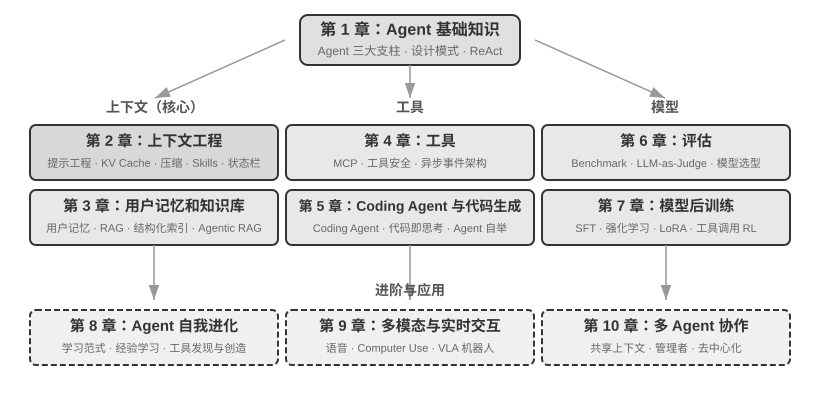

## 全书结构 {.unnumbered}

本书共十章，分为三个部分（图0-1、图0-2）：第一章是基础，建立对 Agent 的全局认知；第二至七章依次展开三大支柱：上下文（第二至三章）、工具（第四至五章）与模型（第六至七章，评估与后训练）；第八至十章是进阶与应用，展示 Agent 的自我进化、多模态与实时交互，以及多 Agent 协作。

- **第一章（Agent 基础知识）**以多个真实 Agent 产品为引，建立对 Agent 的直观理解。深入解析 Agent 的核心公式：从实现层的 LLM + 上下文 + 工具，到直觉层的大脑 + 眼睛 + 手脚，再到学术层的策略（Policy）、观察空间（Observation Space）与动作空间（Action Space）。同时通过实验剖析 ReAct 循环的运作机制，也就是“思考→行动→观察”的迭代过程，并介绍 Agent 的三种学习范式：后训练（Post-training）、上下文学习（In-Context Learning）与外部化学习（Externalized Learning）。最后讨论从工作流到自主 Agent 的编排设计模式，为后续章节建立统一的概念框架。
- **第二章（上下文工程）**是全书最关键的一章，系统讲解上下文，也就是 Agent 的“眼睛”。本章先从 API 消息结构与 Agent 核心循环讲起，建立“上下文就是消息列表”的地基，再深入 KV Cache（大模型推理过程中复用历史计算结果的机制）的底层原理，然后依次展开：提示工程（Prompt Engineering，包括流程化设计、工具描述、业务规则细化）与提示注入（Prompt Injection）攻防、Agent Skills 的按需加载机制、Agent 状态栏技术，以及上下文压缩（Context Compression）策略。各术语的完整定义在正文首次出现处给出。
- **第三章（用户记忆和知识库）**将上下文管理延伸到跨会话的持久化知识体系，让 Agent 不仅能记住当前对话的内容，还能在多次对话间积累和调用知识。涵盖用户记忆的四种渐进式策略、RAG（检索增强生成，即先检索相关文档再让模型生成回答）的完整技术栈（包括不同的文本搜索方法和搜索结果排序优化）、多模态信息提取、更高级的知识组织方法，以及智能体化 RAG（Agentic RAG，即让 Agent 自主决定何时检索、检索什么）。
- **第四章（工具）**探讨 Agent 与外部世界交互的桥梁：工具就像是 Agent 的“手脚”，让它能够搜索网页、调用 API、操作数据库等。介绍 MCP 工具互操作标准和五类工具的设计原则（感知、执行、协作、事件触发、用户沟通），重点阐述执行工具的安全机制以及事件驱动的异步 Agent 架构。
- **第五章（Coding Agent 与代码生成）**论证了 Coding Agent 加上文件系统，是所有通用 Agent 最核心的技术基础。以 OpenClaw 架构为主线，剖析 Coding Agent 的工作流程和实现技巧，并展示代码生成在编程之外的广泛价值：从辅助思考、构建知识库，到动态创造新工具和 Agent 自举。
- **第六章（Agent 的评估）**构建一套科学的评估方法论。覆盖评估环境（工具调用型和人机交互型两种核心范式，以及章末单独讨论的仿真环境）、数据集的设计原则、LLM-as-a-Judge 自动化评判方法、评估驱动的模型选型，以及将评估结果转化为系统改进的完整闭环。
- **第七章（模型后训练）**深入 SFT（监督微调，即用标注数据教模型“照样学样”）与 RL（强化学习，即让模型通过试错和奖励反馈自主提升）这两种后训练技术。以“SFT 记忆、RL 泛化”和“数据与环境比算法更重要”为核心论点，涵盖预训练/SFT/RL 三阶段全景、经典 RL 理论、奖励信号设计（从二元奖励到过程奖励、再到“奖励结果、约束过程”的验证路径惩罚）、单轮与多轮强化学习算法，以及样本效率优化等前沿探索。
- **第八章（Agent 的自我进化）**探讨在不修改模型权重的前提下，如何让 Agent 持续变强。两大进化路径分别是：从经验中学习（策略摘要、工作流录制、系统提示词自动优化、Skills 知识外部化），以及主动发现和创造工具（MCP-Zero、开源工具集成、用代码创造新工具）。
- **第九章（多模态与实时交互）**展望 Agent 从文本世界走向物理世界。覆盖语音 Agent（从串行流水线到端到端模型）、Computer Use（让 Agent 像人一样操作图形界面）和机器人操作（VLA（视觉-语言-动作模型）控制与 Sim2Real 迁移），揭示多模态和实时性带来的共同架构挑战。
- **第十章（多 Agent 协作）**讨论 AI Agent 系统的终极形态：多个 Agent 如何分工合作。系统阐述多 Agent 协作的分类框架（上下文共享/独立 × 对等/管理者/去中心化），通过翻译 Agent、电话+电脑 Agent 等案例展示协作架构的设计方法，并展望 Agent 社会和 Agent 经济的前沿方向。
