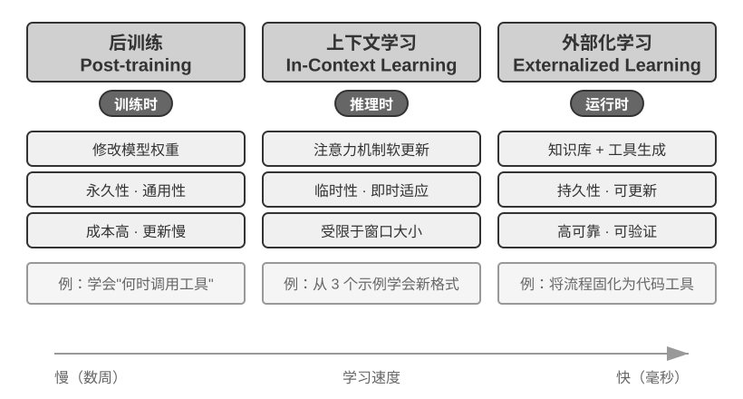
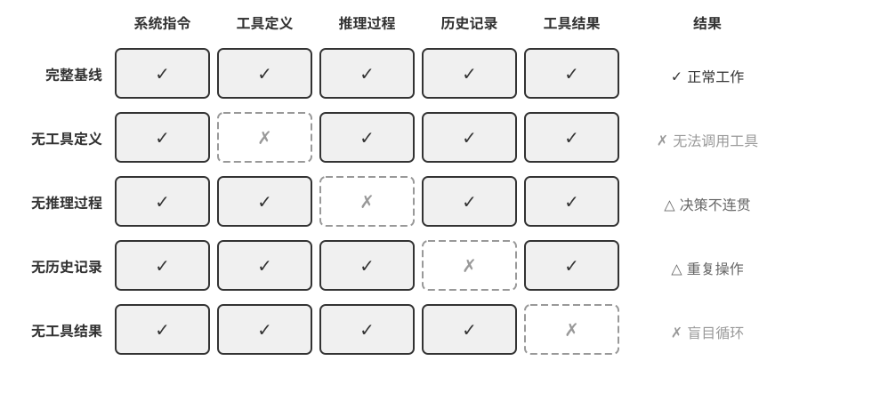
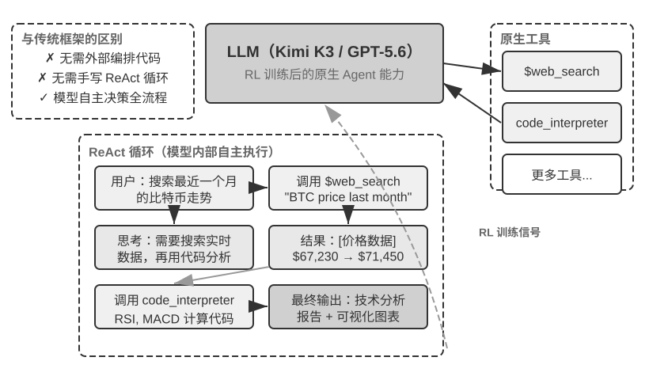

## 现代 Agent = LLM + 上下文 + 工具

现代 Agent 系统的本质可以用一个简洁的公式来表达：**Agent = LLM（大语言模型，Large Language Model）+ 上下文 + 工具**。这个公式简洁而实用，但其中每个词都需要做广义的理解：

- **LLM 是 Agent 的大脑**：它不只是一组模型参数，而是 Agent 的整个决策内核——理解意图、思考规划、做出判断。就像人类大脑不只是神经元的集合，还包括通过经验塑造的思维方式，LLM 的能力也来自两部分：**预训练**所积累的世界知识与语言能力，以及**后训练**所固化的决策策略——后者的具体技术（如监督微调与强化学习）将在第七章展开。
- **上下文是 Agent 的眼睛**：它不只是输入给模型的那段文本，而是 Agent 在每个决策点能看到的全部信息——环境信息、用户记忆、领域知识、自身状态和任务进展。就像人类做决定时需要看清当前的状况、回忆相关经验、翻阅参考资料，Agent 的上下文窗口就是它当下能看到的一切。
- **工具是 Agent 的手脚**：它不只是几个可调用的 API 函数，而是 Agent 能做的所有事情的集合——从预定义的工具调用到按需加载的专业技能（Skills），从动态生成代码创造新能力到委托子 Agent 协作，从主动与用户沟通到响应外部事件。

换一种更直观的说法：**Agent = 大脑 + 眼睛 + 手脚**。大脑负责思考和决策，眼睛提供思考所需的全部信息，手脚将决策转化为对现实世界的改变。

这三个组件恰好对应 RL（详见第七章）中的三个核心概念。下面这张表格是**可选阅读**——如果你没有 RL 背景，完全可以跳过，不影响后续理解；它只是帮助有 RL 背景的读者把已有知识和本书的术语对应起来：

| 直觉理解 | 实现组件 | 学术概念（可选） | 含义 |
|-----------|-----------|----------------------------|----------------------------------------------|
| **大脑** | LLM | **策略**（Policy） | Agent 决定“下一步做什么”的决策逻辑——面对当前看到的信息，从所有可选行动中挑出最合适的一个 |
| **眼睛** | 上下文 | **观察空间**（Observation Space） | Agent 能看到的所有信息——能看到什么、读到什么、记住什么、能访问哪些系统 |
| **手脚** | 工具 | **动作空间**（Action Space） | Agent 能做的所有事情的集合——有哪些“手段”可用，从发消息到执行代码再到操控界面 |

理解这三者的作用及其相互关系，是构建有效 Agent 系统的基础。我们从最具体的手脚（工具）开始介绍，逐步深入到大脑（LLM）和眼睛（上下文）。先来看看不同类型的 Agent 如何在这三个维度上展开：

| Agent 产品 | 眼睛（感知） | 手脚（行动） | 策略 |
|----------------|----------------------|----------------------------|------------------------------|
| **Cursor 等 Coding Agent** | 需求文档、代码库、终端环境 | 开放式（内部思考、代码搜索、文件读写、执行命令等） | 增量开发：理解需求→搜索相关代码→编辑代码→测试验证→调试修复 |
| **Deep Research 等搜索 Agent** | 网络资源、学术数据库、本地文件 | 开放式（内部思考、搜索查询、网页阅读、摘要生成） | 迭代深化：根据已有信息调整搜索方向，逐步综合出完整报告 |
| **Manus 等电脑操控 Agent** | 电脑屏幕、浏览器页面、文件系统 | 开放式（内部思考、点击、输入、滚动、截图、执行代码等） | 视觉感知+操作：观察屏幕→识别目标元素→执行操作→验证结果 |
| **豆包等手机助手 Agent** | 手机屏幕、已安装的 App | 开放式（内部思考、点击、滑动、输入、打开 App 等） | 意图理解+App 操控：理解用户需求→定位目标 App→执行操作→确认完成 |
| **Pine AI 等个人办事 Agent** | 用户账户信息、历史账单、服务商知识库 | 开放式（内部思考、打电话、发邮件、填表单、与用户确认） | 多步骤任务执行：收集信息→制定协商策略→联系服务商→谈判→汇报结果 |

这些 Agent 系统有几个共同特征：它们都使用**开放式的动作空间**——不是从有限的几个按钮中选择，而是能生成任意自然语言和代码；它们都能**内部思考**——在采取行动前先思考和规划；它们都能**持续交互**——根据环境反馈不断调整策略。这些能力正是来自大脑、眼睛和手脚——即 LLM、上下文和工具——的协同作用。

### 工具：Agent 的手脚

工具是 Agent 与外部世界交互的桥梁，就像人类的手脚一样，让 Agent 能够从被动的观察者变成主动的执行者。没有工具，Agent 只能 “纸上谈兵”；有了工具，它才能真正改变世界。

为了系统化地讨论工具，可以根据 Agent 与外界互动的方向把工具分为五类。下面先快速过一遍每一类的代表场景，建立整体印象，后续章节会逐一展开。

**感知工具**让 Agent 能访问信息：搜索引擎提供实时网络数据，文件系统读取本地文档，API 和数据库则对接外部服务和企业核心数据。

**执行工具**让 Agent 改变世界：代码执行、文件操作、系统命令、外部 API 调用——决策由此变成实际行动。

**协作工具**让 Agent 与其他 Agent 分工合作：委托子 Agent 完成专项任务，在关键决策点请求人类确认，或在多 Agent 系统中协调行动。

**事件触发工具**与前三类在调用方式上有本质的区别——它们不是 Agent 主动调用的，而是作为外部输入来驱动 Agent 开始执行任务。比如收到一封新邮件、到了某个预定时间点、或另一个系统发出了 Webhook 回调，这些事件会激活 Agent，让它开始后续的思考和行动。虽然事件触发不是 Agent 主动调用的，但它是 Agent 与外部世界交互的通道之一，因此归入广义的工具体系。

**用户沟通工具**是 Agent 主动与用户建立连接、传递信息的渠道。与执行工具改变外部世界不同，用户沟通工具专注于信息的传递和交互——通过文字消息、语音通话、邮件等方式，将 Agent 的执行进展或主动关怀传达给用户。

以上五类工具的完整分类体系和设计原则将在第四章展开讨论。工具设计的质量直接决定了 Agent 能走多远——接口定义不清晰，模型就会乱用工具；错误处理不到位，工具一旦失败就会变成 Agent 的死锁；权限控制太宽泛，Agent 一旦出错，后果就难以挽回。MCP（Model Context Protocol，模型上下文协议）标准的推广，正在让工具接入变得更像安装插件——生态在快速扩展，但设计原则不会过时。

**工具调用**（Tool Calling，也称 Function Calling）是现代 LLM Agent 的一项核心能力，它让模型能够通过结构化的方式调用外部工具。这种能力将 LLM 从一个纯粹的文本生成器转变为能够执行实际操作的智能系统。本书后续统一使用“工具调用”这一术语。

工具调用的流程分为四步：首先，在上下文里告诉模型有哪些工具可用（包括名称、用途和参数）；然后，模型自主判断要不要调用工具、调用哪个、传什么参数；接着，工具执行完毕后，结果被追加到上下文中；最后，模型据此决定下一步行动。这个循环就是后文要介绍的 ReAct 的基础。

以一个查天气的场景为例，四步流程在 API 层面的简化表示如下：

```
第一步：声明工具                    第二步：模型决定调用
tools: [{                          assistant: {
  name: "get_weather",               tool_calls: [{
  parameters: {                        function: "get_weather",
    city: "string"                     arguments: {city: "北京"}
  }                                  }]
}]                                 }

第三步：结果追加到上下文              第四步：模型基于结果回复
tool: {                            assistant: {
  tool_call_id: "call_1",            content: "北京今天 28°C，晴。"
  content: '{"temp":28,"sky":"晴"}'  }
}
```

开发者只需要定义工具和执行工具调用，模型自主完成“要不要调用、调哪个、传什么参数”的决策。第二章将详细展开这个 API 结构。

在为 Agent 设计工具时，应尽量保持工具的通用性，给 LLM 更大的发挥空间。例如，与其设计一个专用的计算器工具，不如提供一个 Python 代码解释器，并为 Agent 创建一个安全的沙盒执行环境。与其设计一个记录工作日志的工具，不如提供文件读写工具，并为 Agent 创建一个虚拟的文件系统。通用的工具让 Agent 能够通过组合基础能力来创造性地解决问题。

### LLM：Agent 的大脑

大语言模型（Large Language Model, LLM）是 Agent 的决策核心。收到用户的请求后，它需要先解析真实意图（用户说的往往不是他真正想要的），再将模糊或复杂的任务拆解成可执行的步骤。执行过程中它还要持续做出判断：下一步该做什么、要不要调用工具、调哪个工具、传什么参数。这种“理解-规划-执行”的能力来自预训练所积累的知识，是工作流和自主 Agent 都依赖的基础。

LLM Agent 的一个独特能力是**内部思考**——在采取实际行动之前，Agent 可以先进行规划与推演。这一过程不改变外部环境，却能显著提升后续行动的质量。LLM 之所以能够进行有效的内部推演，得益于预训练（Pre-training，即在海量互联网文本上进行初始训练，让模型学会语言规律和世界知识）阶段习得的能力——模型在推演时所遵循的是人类知识中已经沉淀下来的逻辑规则，包括数学定律、因果关系、问题分解策略等。因此 Agent 的推演不是盲目的随机探索，而是在结构化的知识体系上展开。

这种结构化推演的能力，让 LLM Agent 在面对全新任务时也能直接上手——下面通过零样本和少样本两个概念分别说明。这种能力的直接体现是**零样本泛化**（Zero-shot Generalization）：即使面对从未见过的任务，LLM Agent 也能通过组合已有知识来处理，无需任何示例。比如你从未教过它写一首关于量子物理的诗，但它能根据已有的语言和物理知识生成一首像样的作品。

更进一步，LLM Agent 还能通过极少的示例实现**少样本适应**（Few-shot Adaptation）——只需在提示中给出两三个示范例子，模型就能掌握一种新的任务模式。比如给它看几条“用户评论 -> 情感标签”的例子，它就能学会对新评论做情感分类。简单来说，零样本是“没有例子也能做”，少样本是“看几个例子就能学会”。

#### 模型即 Agent：当模型本身成为产品

“模型即 Agent”（Model as Agent）这一新范式代表了 AI Agent 发展的最新方向。先进模型通过后训练（特别是强化学习）将工具调用能力内化为原生能力：何时调用工具、调哪个、传什么参数，都由模型自己决定，无需人工编排。但这并不意味着框架层变得不重要了。恰恰相反，模型越强大，围绕模型构建的 Harness 就越关键。Harness 这个词原指马具，即套在马身上的缰绳与挽具，不是为了限制马的奔跑能力，而是把这种力量引导到正确的方向上。换到 Agent 语境里，模型是那匹强大但不可预测的马，Harness 则是把它的能力引导成可靠任务执行的工程外壳。你也可以把它想象成赛车手周围的整套保障系统：安全带、赛道护栏、进站维修团队。车手（模型）越快，这套系统越重要。在 Agent 中，Harness 包括上下文管理、工具接口、安全约束、验证与纠正等基础设施（详见本章末节）。

模型自主决策的空间越大，出错时的影响面也越大，因此需要更精细的约束、验证和纠正机制来确保可靠性。模型厂商的真正优势不是“让框架变薄”，而是能对模型与外围 Harness 进行协同优化，持续迭代。

但这里悬着一个更深的问题：如果模型持续变强，今天这些 Harness 会不会最终被模型“吃掉”？Rich Sutton 在《苦涩的教训》（The Bitter Lesson）中回顾了 AI 研究七十年间反复上演的一幕[^ch1-1]：研究者一次次把自己对领域的理解编码进系统，短期见效，长期却总是输给能随算力与数据规模持续扩展的通用方法——搜索与学习。以此衡量，Harness 里的约束、验证与纠正，有多少属于“人的先验”，注定会被模型内化？本书的立场是八个字：**方向认同，节奏务实**。方向上，本书不怀疑模型会持续吃掉 Harness——工具调用、长程规划都曾靠外部编排，如今已是模型的原生能力；但在节奏上，这个“吃”远比直觉慢：训练以月计，模型也无法一次内化真实业务中所有的约束与偏好，模型此刻的能力边界，就是 Harness 此刻的价值所在。因此 Harness 工程不是对苦涩的教训的抵抗，而是这一教训在工程时间尺度上的实践：模型还做不稳的，Harness 先补上；模型每内化一层，Harness 就卸下一层，转而兜底新的能力前沿。这条主线将贯穿全书——第二章从上下文工程的角度给出务实的回答，第八章讨论 Agent 如何自己去发现知识与能力的结构，后记再回到“模型会不会吃掉 Harness”的完整答案。

[^ch1-1]: Sutton, Rich. "The Bitter Lesson", 2019. http://www.incompleteideas.net/IncIdeas/BitterLesson.html

#### Agent 的学习机制：后训练、上下文学习与外部化学习

前面讨论了模型如何通过强化学习将工具调用的决策策略内化为原生能力。但 Agent 的学习不只发生在训练阶段——一些读者一想到 Agent 从经验中学习，就认为一定要训练模型。事实上，后训练并不是 Agent 从经验中学习的唯一方法。Agent 的学习机制可以总结为三个互补的范式（图 1-1）：



- **后训练（Post-training）**：通过强化学习将经验固化到模型的参数中，提供最强的跨任务通用性，但更新成本高（详见第七章）。
- **上下文学习（In-Context Learning）**：通过注意力机制（Attention Mechanism，即模型在处理输入时决定“关注哪些信息”的机制）在上下文中进行模式检索式的快速适配。比如在提示词中给模型看几条客服对话的处理示例（如“用户投诉→安抚+补偿方案”），它就能用类似的方式处理新的客服对话——这就是上下文学习。能快速适应但临时性强，会话结束就消失了。需要说明的是，虽然名字叫“学习”，但它的内部机制更接近**模式匹配而非真正的学习**。打个比方：如果给你看三道相同类型的数学题和答案，然后给你第四道，你大概率能照葫芦画瓢做出来——这就是上下文学习在做的事。但如果第四道题需要一种全新的解题思路，光看前三道题的答案是不够的。换句话说，上下文学习让模型能**套用已见过的模式**，但不能**发现全新的规律**——这一点与后训练有本质区别（第二章将从注意力机制的角度详细展开这个论断）。
- **外部化学习（Externalized Learning）**：将知识和流程外部化为知识库与可执行的工具代码，兼具持久性和可解释性。

这三种范式在不同的时间尺度上互补：后训练提供基础能力，上下文学习实现快速适应，外部化学习确保可靠性和效率。第八章将系统地比较三种范式的协同关系。

打个比方：后训练像是系统性学习教科书——学完后能力永久提升，但学习成本高；上下文学习像是临场查阅参考资料——有资料就能做好，合上就忘；外部化学习像是整理个人笔记本——信息持久保存且随时可查，但需要专门整理。

### 上下文：Agent 的眼睛

上下文是 Agent 在每个决策点能看到的全部信息。就像一个人在做决策时需要看到桌上摊开的所有资料——任务说明、参考手册、之前的沟通记录、最新的数据——Agent 的上下文窗口就是它的“视野”。从 API 的视角看（详见第二章），每次调用 LLM 时的上下文由以下五个部分构成：

- **系统提示词**（System Prompt）：与用户每次输入的提示词不同，系统提示词由开发者编写，在整个对话过程中保持不变，相当于 Agent 的“岗位说明书”——定义它的身份、权限和行为准则。通过提示工程（Prompt Engineering）精心设计系统提示词，我们可以塑造 Agent 的工作方式。系统提示词中还会包含跨会话保存的**用户记忆**（用户偏好、历史行为、背景设定等个性化信息，详见第三章）和动态注入的环境状态。
- **工具定义**（Tool Definitions）：声明 Agent 可用工具的名称、功能描述和参数格式。没有工具定义，Agent 就无法识别和调用任何工具——消融实验（实验 1-1）将验证这一点。工具定义与系统提示词一起构成对话中保持不变的**静态前缀**（这是基础模式；2026 年以来，生产框架中工具的完整 schema 也可以按需动态加载到上下文末尾而不破坏前缀，详见第二章工具定义一节和第四章）。
- **用户消息**（User Messages）：来自用户的输入。用户消息中还可能包含通过 RAG（检索增强生成，Retrieval-Augmented Generation，详见第三章）动态检索引入的**外部知识**——覆盖训练数据截止后的信息或私有领域知识。
- **模型回复**（Assistant Messages）：模型之前生成的回复，最多包含三个部分——思考过程（`reasoning`，即内部思考链，保持思维连贯性和决策可解释性）、文本内容（`content`，即对用户的回复）和工具调用请求（`tool_calls`，即 Agent 采取行动的方式）。在一次具体的回复中，三者不一定同时出现：例如 Agent 决定调用工具时通常只有 `reasoning` + `tool_calls`，给出最终回答时通常只有 `reasoning` + `content`。
- **工具执行结果**（Tool Results）：Agent 框架执行工具后返回的结果。这些结果是 Agent 下一步思考的直接依据，也让它能够从执行结果中学习、避免重复犯错。

前两项（系统提示词 + 工具定义）是静态前缀，后三项（用户消息 + 模型回复 + 工具执行结果）是随交互不断增长的动态消息历史。这五个部分共同构成了 LLM 每次推理时的上下文。

要验证每个组件是否都不可或缺，最直接的方法是**消融实验**（Ablation Study）：就像医生诊断时逐一排除病因——先去掉 A 组件看系统是否还正常，再去掉 B 组件，以此类推，从而判断每个组件的贡献。实验 1-1 正是按这个思路对上述五个组件做了系统性测试，结果表明：去掉工具定义，Agent 完全丧失行动能力；缺少工具执行结果时，由于看不到上一步的反馈，Agent 会反复调用同一个工具，陷入无限循环；模型回复中的思考过程一旦被剥离，前后决策就开始互相矛盾；至于历史消息，没有它 Agent 等于失忆，于是从头开始整个任务流程，重复执行已完成的步骤。每个组件的作用都有实验证据支撑，而不只是理论推断。

### 实验 1-1 ★★：上下文的关键作用

通过系统性的**消融实验**（Ablation Study），我们探索了不同上下文组件对 Agent 行为的影响。实验从上述五个部分中选取了四个组件进行测试——系统提示词作为 Agent 的基本身份定义不参与消融，因为没有系统提示词，Agent 连基本的角色认知都没有，测试没有意义。如图 1-2 所示，五组对照实验包括：一组保留全部组件的完整基线，再加上四组各缺失一个组件的对照，以此观察每个组件对 Agent 性能的影响。



实验结果揭示了每个上下文组件不可替代的作用。**工具定义**（Tool Definitions，静态前缀的一部分）是 Agent 行动能力的基础，没有它，Agent 就无法识别和调用任何工具。**工具执行结果**（Tool Results）是闭环控制的关键，缺失它会导致 Agent“盲目”执行，陷入无限循环。**思考过程**（模型回复中的 reasoning 部分）保留了 Agent 做出之前决策的原因，使思维流程更加连贯，避免做出前后矛盾的决策。**历史消息**（之前轮次的用户消息、模型回复和工具执行结果）则防止了冗余操作，保持任务执行的连贯性，避免重复犯同样的错误。

这个实验的核心洞察是：**上下文决定了 Agent 能看到什么，而 Agent 只能基于它看到的信息做决策**。就像一个人蒙住眼睛就无法做出合理判断一样，缺失任何一个上下文组件，Agent 的决策能力都会严重退化——看不到工具定义就不知道有哪些工具可用，看不到之前的执行结果就不知道已经做过什么。

### ReAct 循环

了解了 Agent 的三大组件后，一个自然的问题是：它们如何协同工作？ReAct 循环就是将 LLM、上下文和工具串联起来的核心机制——让我们看看一个 Agent 是如何一步步思考和行动的。

Agent 执行任务的核心模式叫做 **ReAct**（Reasoning + Acting）。虽然名字只体现了思考（Reasoning）和行动（Acting）两个词，但实际循环包含三个环节：模型先**思考**当前应该做什么，然后调用工具**行动**，再**观察**工具返回的结果并继续思考下一步。这个“想→做→看→想→做→看”的循环不断重复，直到任务完成。

让我们通过一个多币种收入汇总的具体例子来理解 Agent 的**轨迹**（trajectory）。轨迹是 Agent 在执行任务过程中不断积累的消息历史——用户消息、模型回复（包括思考过程和工具调用）、工具执行结果。每一次调用 LLM 时，它接收的完整上下文由**静态前缀**（系统提示词 + 工具定义）和**轨迹**（动态消息历史）两部分组成（图 1-3）。这揭示了一个关键事实：**Agent 的上下文 = 静态前缀 + 轨迹**。具体地说，静态前缀对应前文五个组件中的前两项（系统提示词 + 工具定义），轨迹对应后三项（用户消息 + 模型回复 + 工具执行结果，随交互不断增长）。基于这个完整上下文，LLM 生成下一步的响应，然后这个响应又追加到轨迹中，供下一次调用使用。


让我们通过伪代码来理解 Agent 轨迹的结构：

```
轨迹 = [
  {role: “user” , content: “根据公司季度收入：Q1 2.5M 美元，Q2 2.1M 欧元，Q3 1.8M 英镑，Q4 380M 日元，计算公司年度总收入和季度平均收入” },
  
  # 第一次迭代 - LLM 看到上述轨迹，生成响应
  {role: “assistant” , 
   reasoning: “需要将所有货币转换为 USD...” ,
   content: “” ,  # 没有直接回复用户
   tool_calls: [
     {name: “convert_currency” , args: {amount: 2100000, from: “EUR” , to: “USD” }},
     {name: “convert_currency” , args: {amount: 1800000, from: “GBP” , to: “USD” }},
     {name: “convert_currency” , args: {amount: 380000000, from: “JPY” , to: “USD” }}
   ]},
  
  # Agent 框架执行工具，添加结果到轨迹
  {role: “tool” , content: “EUR->USD: 2282608.7” },
  {role: “tool” , content: “GBP->USD: 2278481.01” },
  {role: “tool” , content: “JPY->USD: 2541806.02” },
  
  # 第二次迭代 - LLM 看到完整轨迹，包括工具结果
  {role: “assistant” ,
   reasoning: “已获得转换结果，现在需要汇总计算...” ,
   content: “” ,
   tool_calls: [
     {name: “code_interpreter” , args: {code: “total = 2500000 + 2282608.7 + ...” }}
   ]},
  
  {role: “tool” , content: “Total: $9,602,895.73, Average: $2,400,723.93...” },
  
  # 第三次迭代 - LLM 看到完整轨迹，生成最终答案
  {role: “assistant” ,
   reasoning: “所有计算完成，总结结果...” ,
   content: “FINAL ANSWER: 总收入$9,602,895.73...” }
]
```

注意，轨迹中没有显示系统提示词和工具定义——它们作为静态前缀，在每次 LLM 调用时都会被自动拼接在轨迹前面。

在我们的实验中，这个循环展现得淋漓尽致。第一轮，Agent 分析任务后并行调用三个货币转换工具；第二轮，基于转换结果调用代码解释器进行复杂计算；第三轮，确认所有计算完成后生成最终答案。整个过程仅用了 3 次迭代、4 次工具调用就完成了复杂的多步骤任务。

这种设计的精妙之处在于**上下文的累积性**。每次 LLM 调用都能看到完整的轨迹，这让它能够理解当前处于任务的哪个阶段、之前尝试了什么、得到了什么结果。就像人类解决问题时会不断回顾和总结，Agent 通过轨迹保持着对整个任务的全局认知。同时，轨迹的结构化特性也让系统具有高度的可解释性和可调试性：用户消息、模型回复（思考过程 + 工具调用）和工具执行结果都被清晰地区分开来。

轨迹不仅是执行的记录，更是 Agent 能力的体现。通过分析大量的轨迹，我们可以发现 Agent 的行为模式、优化决策路径、改进工具设计。轨迹数据甚至可以总结到知识库中，或者通过强化学习来训练更好的 Agent 模型，实现从经验中学习的闭环优化。


理解了 Agent 的运行循环后，让我们通过两个实验来感受不同模型如何驱动这个循环。

#### 实验 1-2 ★：Kimi K3 原生 Agent 能力

这个实验展示了 **Kimi K3** 的原生 Agent 能力，体现了“模型即 Agent”的新范式。Kimi K3 由 Moonshot AI 于 2026 年发布，是一个约 2.8 万亿参数的混合专家（MoE, Mixture of Experts）模型——可以把 MoE 想象成一个专家团队：面对不同类型的问题，系统会自动选择最合适的几位专家来作答，而不需要所有专家同时上阵，这样既保证了能力又提高了效率。它拥有 100 万 token 的上下文窗口、原生的视觉理解能力，以及始终开启的“思考模式”（thinking mode）；模型通过强化学习训练，将工具调用的**决策策略**内化为原生能力——何时调用工具、调用哪个、传什么参数都由模型自主决定，从而能够自主完成网络搜索等任务。需要说明的是，被内化的是“何时调用、如何调用”的决策，而 `web_search`、`code_runner` 等工具本身仍作为 API 层面的内置工具在服务端执行（Kimi 通过名为 Formula 的服务端脚本引擎运行这些官方工具）。

关键观察包括：模型通过 RL 训练自然地学会了何时以及如何使用工具，客户端无需再人工编写工具调用的编排逻辑；模型自己决定何时搜索、搜索什么，展现了真正的自主性；它能根据搜索结果动态调整策略，自主判断信息是否充足。这里需要厘清一个常见的误解，关键在于分清两件事的归属。**强化学习赋予模型的是决策能力**——何时该调用工具、调用哪个、传入什么参数、拿到结果后是否继续、如何把几十上百次调用串联成连贯的推理，这些"用不用、怎么用"的判断被写进了模型参数。**而工具本身及其执行则由 Agent 框架（或 API 内置工具）提供**——`web_search`、`code_runner` 的真实实现、代码沙盒环境、调用的发起与结果回传，都在模型之外的基础设施里完成。RL 优化的是决策策略，而不是把搜索引擎或代码沙盒"装进"模型的权重。因此编排循环并没有消失，而是从客户端移到了服务端，同时决策权交给了模型[^ch1-2]。

[^ch1-2]: 感谢读者 asdlem 通过 GitHub Issue #30 指出并厘清了“RL 内化的是工具调用决策策略、而非工具执行机制”这一区分。参见 https://github.com/bojieli/ai-agent-book/issues/30

Kimi K3 在 Agent 任务中的一个突出优势是**长链工具调用的稳定性**——它能够连续执行 200～300 次工具调用而保持思考的一致性，远超多数模型在数十次调用后就开始退化的表现。K3 面向长周期编程与 Agent 工作负载优化，发布时提供 K3 Max（面向对话与 Agent 任务）与 K3 Swarm Max（面向大规模并行处理）两个规格。作为开源模型，它在软件工程和 Agent 基准测试中展现了可与顶尖闭源系统比肩的性能，证明了通过强化学习赋予模型原生 Agent 能力这条路线的有效性。

#### 实验 1-3 ★：GPT-5.6 原生 Deep Research 能力

第二个实验使用 **OpenAI GPT-5.6**，展示先进模型如何借助 API 内置工具，在服务端把 Deep Research 的“搜索—阅读—分析”编排循环闭环起来。GPT-5.6 提供了三种规格——Sol（旗舰前沿模型）、Terra（面向日常工作的均衡模型）和 Luna（快速经济的轻量模型），均把工具调用的决策交由模型原生完成，客户端无需自行搭建编排框架。一个便利的特性是**自由格式工具调用**（Freeform Tool Calling）——传统方式中，模型调用工具时必须把所有参数打包成严格的 JSON 格式（一种结构化的数据格式），这就像填表格一样有很多格式限制。自由格式工具调用（在 API 中通过 `type: "custom"` 的工具类型声明）允许模型直接向工具发送原始文本（比如一段 Python 代码、一条 SQL 查询），省去了 JSON 转义的麻烦。要说明的是，这是 API 参数格式的演进，而非模型架构的革新——客户端的工具调用循环（检测 `tool_calls` → 执行 → 回传结果）逻辑保持不变，改变的只是参数从 JSON 字符串变成了原始文本。GPT-5.6 还引入了 Verbosity 参数（控制输出的详略程度）和 Reasoning Effort 参数（调整思考的深度，Sol 新增了 max 档位以获得最充分的推理时间），使开发者能根据任务的复杂度精细控制模型行为。

GPT-5.6 配合 Responses API 的**网络搜索和代码解释器**内置工具——这正是 Deep Research 的核心：模型能够自主搜索网络获取实时信息，并编写代码进行深度分析，实现“搜索 -> 阅读 -> 分析 -> 再搜索”的迭代研究过程。例如，面对 “东盟 10 国首都之间，最近的一对首都距离多少” 这样的问题，GPT-5.6 会自动搜索各国首都的地理坐标，然后编写 Python 代码计算所有首都对之间的大圆距离，最终找出最近的一对。又如 “搜索最近一个月的比特币走势，做技术分析” 任务中，它能从多个金融数据源获取实时价格数据，运用专业的技术分析库计算移动平均线、RSI、MACD 等技术指标，生成可视化图表并给出交易建议。

更重要的是，GPT-5.6 将 **OpenAI Deep Research** 产品的设计理念内化到了模型层面，引入了**意图澄清过程**。当用户提出研究需求后，GPT-5.6 不会立即动手执行，而是首先通过一系列问题来澄清用户的真实意图。以“搜索最近一个月的比特币走势，做技术分析”为例，它会先问：“您偏好使用哪个数据源？需要分析哪些技术指标？”通过这种交互式的意图澄清，GPT-5.6 能够生成更精准、更符合用户需求的研究报告。

GPT-5.6 是“模型即 Agent”概念的一个成熟实例——网络搜索、代码解释器等作为 Responses API 的内置工具在服务端闭环执行，编排循环从客户端移到了 API 服务端，从而简化了客户端实现；模型仍然输出标准的工具调用，只是客户端不必再自行搭建“搜索—阅读—分析”的编排框架。其中最值得关注的是意图澄清机制：模型不会一收到任务就立即执行，而是先通过提问来确认用户的真实需求，再制定研究策略。这让“用户说了什么”和“用户真正想要什么”之间的差距，在任务执行之前就得到了弥合。

图 1-4 展示了“模型即 Agent”范式下原生工具调用的完整架构，以及 Kimi K3 / GPT-5.6 在实际任务中的 ReAct 执行过程。


