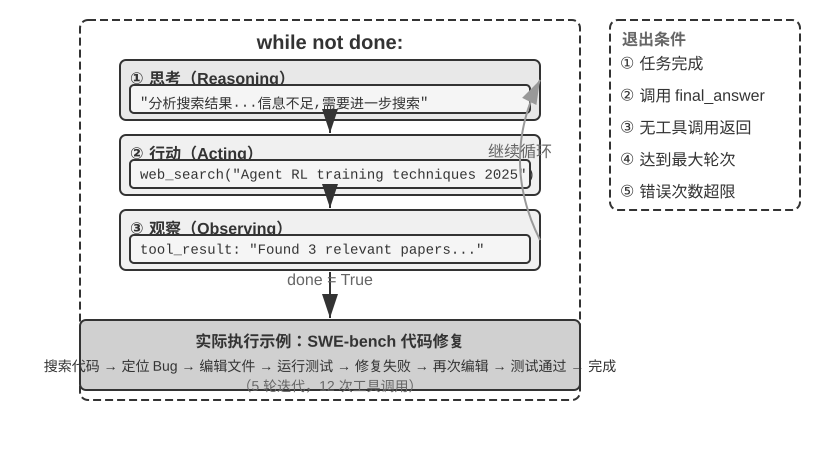

## Harness 工程：模型之外的竞争力

到这里你已经理解了 Agent 的核心工作原理——LLM 通过 ReAct 循环，在上下文的辅助下使用工具完成任务。前面的实验证明了这套基本机制是有效的，但同时也暴露了明显的脆弱点：模型可能产生幻觉（编造不存在的工具或参数）、选错工具、或在遇到错误时无法自我恢复。一个能跑的 Demo 和一个可靠的产品之间还有巨大的鸿沟，而这些脆弱点正是 Harness 工程要解决的问题。本章前半部分回答了 Agent 是什么，下半部分回答 Agent 如何在生产环境中可靠运行。

前面几节建立了 **Agent = LLM + 上下文 + 工具** 的核心公式。这个公式描述了 Agent 的**内部组成**，即大脑、眼睛、手脚分别由什么承担。从 Harness 工程的视角看，还需要一个**工程实现**层面的视角：把 LLM 当作一个核心组件（Model），围绕它构建的所有支撑代码统称为 Harness。两个视角并非替代关系，而是不同抽象层次上对同一系统的描述。之所以换用更通用的 “Model” 一词，是因为 Harness 工程的原则适用于任何具备推理和工具调用能力的模型，不限于某种特定模型类型。Harness 的核心就是原公式中的“上下文 + 工具”，再加上三层保障机制：**约束**（限定 Agent 能做什么、不能做什么）、**验证**（检查 Agent 做得对不对）和**纠正**（做错了怎么补救）。

用方程展开生产形态下的完整组成：

> **Agent = LLM + [上下文 + 工具 + 约束 + 验证 + 纠正] = Model + Harness**

最小可工作的 Agent 只需要 LLM、上下文与工具就能跑起来；而要让它在生产环境中长期可靠运转，还需要补全约束、验证、纠正这三层工程外壳——约束防止越界、验证发现错误、纠正恢复异常。这三层机制不是新增的“独立模块”，而是围绕“上下文 + 工具”构建的保障层。换句话说，最小公式是 Demo 视角，扩展公式是生产视角；后者完全包含前者，并在外围加了一圈安全网。

举个例子帮助理解：上下文中嵌入退款政策是“上下文”的范畴，而校验退款金额不超过订单金额则属于“约束”；工具执行 API 调用是“工具”的范畴，而 API 超时后自动重试则属于“纠正”。模型提供基础的理解和推理能力，而 Harness 将这些能力引导、约束和放大为可靠的任务执行。设计和优化这套模型之外的基础设施的工程实践，就是 **Harness 工程**（Harness Engineering）。

用一个具体的例子来理解 Harness 的价值。假设你让一个 Agent 帮用户退掉 3 天前的订单。**没有 Harness 时**：模型看不到退款政策（缺上下文），不知道该调哪个 API（缺工具），直接编造一个退款结果回复用户（缺验证），用户发现退款根本没发生（缺纠正）。**有了 Harness 后**：系统提示词写明了 7 天退款政策（上下文），Agent 调用 `query_order` 和 `process_refund` 工具完成操作（工具），框架校验退款金额不超过订单金额（约束），校验数据库状态确认退款成功（验证），如果 API 调用超时则自动重试（纠正）。同一个模型，有无 Harness，结果天壤之别。

回到本章前面给出的马具隐喻：没有 Harness 的模型就像脱缰的野马，能力惊人，但无法可靠地完成任务。

更精确地说，模型之外的全部基础设施都属于 Harness。Harness 的核心是上下文与工具，围绕它们构建了三类工程化保障机制：

| 功能 | 一句话职责 | 与上下文/工具的关系 |
|--------------------|----------------------------------------|-----------------------------------|
| **Context（上下文）** | 为模型提供感知信息 | 核心能力 |
| **Tools（工具）** | 为模型提供行动手段 | 核心能力 |
| **Constrain（约束）** | 设定行为边界——能做什么、不能做什么 | 围绕上下文和工具构建的安全边界 |
| **Verify（验证）** | 自动判断操作结果的对错 | 围绕工具执行结果构建的检查机制 |
| **Correct（纠正）** | 发现问题时自动修正或回退 | 围绕工具调用失败构建的恢复机制 |

上下文与工具让 Agent “能做事”——理解任务并采取行动；约束、验证与纠正让 Agent “不做错事”——它们不是独立于上下文和工具之外的东西，而是确保上下文和工具在生产环境中可靠运转的工程实践。在 Agent 产品的成熟度曲线上，两者的重要性是不对称的。

早期的 Agent 框架主要关注上下文与工具：给模型工具、给模型上下文，让它“能做事”。而生产级 Agent 系统的重心已经转向约束、验证与纠正：确保工具调用是安全的、上下文是经过管理的、错误是可恢复的。

以 Claude Code 为例，它的 Harness 中绝大部分代码都是约束、验证与纠正，而非上下文与工具——工具本身（文件读写、命令执行、搜索）只是一小部分，而围绕这些工具构建的保障机制才是真正的核心。这些机制包括：

- **流程状态管理**：追踪 Agent 当前执行到哪一步
- **多层上下文压缩**：当信息太多时自动精简
- **权限分类**：控制哪些操作需要用户确认
- **熔断器**（Circuit Breaker）：当错误连续发生时自动“断电”停止重试——就像家里电路短路时保险丝会自动跳闸，防止整个系统崩溃
- **错误恢复机制**：捕获异常、回滚到上一稳定状态、重试或交还给人类

**行业正在从“能做事”向“可靠地做事”转变，Harness 工程因此成为 Agent 系统的核心竞争力。**

### 从提示工程到 Loop 工程：工程范式的演进

回顾 AI 应用工程的发展，可以看到一条清晰的演进弧线：

**软件工程**（Software Engineering）是基础——传统的系统设计、架构、测试和部署实践。**提示工程**（Prompt Engineering）是第一波创新——通过优化输入给模型的自然语言指令来提升输出质量。**上下文工程**（Context Engineering）是第二波——人们认识到单纯优化提示词还不够，需要系统性地管理模型能看到的所有信息（系统指令、工具定义、对话历史、外部知识）。**Harness 工程**是第三波——它将视野从“模型能看到什么”进一步扩展到“模型在什么样的系统中运行”，涵盖了约束机制、验证手段、反馈循环和错误恢复等模型之外的全部基础设施。最新的一波是 **Loop 工程**（Loop Engineering）——它把视野从单次运行再扩展到跨轮次的持续自主运转：谁来发现下一件该做的事、何时验证、何时才算真正完成（第十章将结合多 Agent 协作系统展开）。

这五个阶段不是替代关系，而是层层包含的：提示工程是上下文工程的子集，上下文工程是 Harness 工程的子集，Harness 工程是 Loop 工程的子集。每一层都在前一层的基础上扩展了工程师的关注范围和影响力。**当各家模型的能力越来越接近、不再是决定性的差异因素时，竞争优势就转移到了模型之外的工程实践**。这一判断在最近的工程实践中得到验证——LangChain 在 Terminal Bench 2.0（一个评估 Agent 在终端环境中完成复杂任务能力的基准测试）上的实践就是一个有力的例证：他们的 Coding Agent 从 52.8% 提升到 66.5%（从排行榜 30 名开外跃升至前 5），改变的不是模型，而是 Harness：让 Agent 自动检查自己的执行结果、检测是否陷入了重复循环、优化思考策略等工程手段。OpenAI 的工程团队也公开分享了类似的经验——3 名工程师用 5 个月完成了约百万行代码和近 1500 个 PR，达到传统开发速度的约 10 倍。这一效率的背后不是模型有多强，而是 Harness 做对了。

### Harness 五个功能的核心原则

上面的表格列出了 Harness 的五个功能。下表进一步展开每个功能的核心设计原则和在本书中的对应章节，帮助读者建立从概念到实践的映射：

| 功能 | 核心原则 | 实际例子 | 详见 |
|------|-----------------------------------------------|-----------------------------------|-------|
| **上下文** | 信息充分性：让 Agent 在每个决策点都基于足够的信息判断 | 系统提示词、知识库、Agent 状态栏、Sidecar 旁路查询 | 第二、三章 |
| **工具** | 接口清晰：工具命名直观、参数有例子、边界有说明 | MCP 工具、代码解释器、搜索工具 | 第四章 |
| **约束** | 故障安全默认值：所有能力默认关闭，必须显式开放（类似手机 App 权限管理） | Claude Code 中每个工具默认需要用户授权才能执行 | 第四章 |
| **验证** | 输入隔离：安全检查只看结构化数据（如工具返回的 JSON 字段），而不是模型自由生成的文本（因为攻击者可能通过提示注入操纵模型输出） | Linter 检查、类型系统、工具调用结果校验 | 第五、六章 |
| **纠正** | 在确认无法恢复之前，不暴露中间态（例如工具调用失败时先静默重试，不将半成品结果展示给用户） | 静默重试、接续生成、连续失败时回退到人工判断（熔断机制） | 第二、五章 |

五个功能构成一个闭环：上下文与工具支撑决策，约束预防错误，验证发现偏差，纠正闭合循环。缺少任何一个环节，系统都会出现可靠性缺口。在深入具体的编排模式和护栏设计之前，我们先明确构建 Agent 的核心原则和模型选择策略——它们是后续所有设计决策的基础。

### 构建有效 Agent 的核心原则

根据 Anthropic 的经验，成功的 Agent 系统遵循三个核心原则。

**保持简单**。从最简单的方案开始，只在确实必要时才增加复杂度。直接的 API 调用优于复杂的框架，清晰的代码优于聪明的抽象。因为每多一层抽象都会成为以后调试时新的盲区。

**保持透明**。明确显示 Agent 的规划步骤、执行日志和决策轨迹——这不只是为了调试方便，也是让用户建立信任的前提。因为黑箱里的错误一旦发生，外部观察者既无法定位也无法纠正。

**设计好工具接口（ACI，Agent-Computer Interface）**。ACI 强调的是从 Agent 视角设计接口（让 Agent 容易理解和使用），而非传统 API 从程序员视角设计接口。工具的命名和参数要直观，容易误用的地方要主动防呆，从设计上让错误无法发生——比如 USB 接口只能从一个方向插入，就避免了用户插反的错误。这种“用设计消除错误”的思路在制造业里有一个专门的术语，叫**防呆**（Poka-yoke），源自丰田生产体系。设计不好的工具会让再强的模型也频繁出错——因为模型与工具之间唯一的沟通通道就是接口本身，模糊的接口会被模型放大成系统性的错误。

以下三节展开 Harness 工程中三个独立但重要的主题：模型选型、编排模式、护栏与安全性。它们都不属于 Harness 五要素本身，但是工程实践中绕不开的决策。

### 如何选择模型

在讨论编排模式之前，先回答一个实操问题：应该选什么样的模型来驱动 Agent？

模型是 Agent 的智能基座，选对模型往往比优化提示词更有效。由于模型迭代极快，本节不推荐具体的模型版本，而是提供一些选择的方向。

**认识 “御三家”。** 目前 Agent 开发中最常用的三大闭源模型厂商是 OpenAI（GPT/o 系列）、Anthropic（Claude 系列）和 Google（Gemini 系列）。它们各有侧重：Claude 在复杂推理、编程和工具调用方面表现突出，是目前 Agent 开发的热门选择；Gemini 拥有超长上下文窗口和强大的多模态能力，适合长文本与图片、视频等多媒体场景；GPT/o 系列各方面能力均衡，用户数量最多。选模型时不要只看排行榜，**要在你自己的任务上做评估**（见第六章）。

**国内模型。** 如果你的应用部署在国内或有较严格的成本预算，国内模型是务实的选择。字节跳动的豆包系列国内延迟极低，适合实时交互；月之暗面的 Kimi 是国内 Agent 能力较强的模型；Qwen 和 DeepSeek 等开源模型则在成本和可定制性方面有优势。需要注意的是，不同模型在工具调用方面的能力差异很大，选型前务必在具体场景中测试。国内模型通常通过火山引擎（豆包）、硅基流动（开源模型）等平台的 API 访问，海外模型则可以通过 OpenRouter 统一访问。

**开源与闭源。** 闭源模型通常在能力上领先，但成本较高且受限于厂商的 API 策略。开源模型成本低、可私有化部署、支持微调定制，适合对成本敏感或有数据合规要求的场景。

**绝大多数 Agent 需要支持思考（Reasoning）的模型。** Agent 需要进行多步思考、工具选择等复杂决策，不带思考能力的模型在这些任务上表现往往很差。只有极少数场景例外——比如只执行单步简单任务、或 Computer Use 中仅需点击固定位置的简单 GUI 操作——此时不带思考的模型也能胜任。但只要涉及多步思考或动态决策，就一定要选择支持思考的模型。

**关注输出速度和多模态能力。** 除了成本，还有两个容易被忽视的维度。一是**输出 token 的速度**：Agent 往往需要多轮推理，每轮都要等待模型输出完成才能执行下一步，所以输出速度直接决定了端到端的响应延迟——如果一个 Agent 任务需要 20 轮推理，每轮慢 2 秒就意味着总共多等 40 秒。二是**多模态支持**：如果你的 Agent 需要理解图片、音频或视频，多模态能力就是硬性要求，不同模型在这方面的差异很大。

### 编排模式：工作流与自主

编排模式是 Harness 中“上下文与工具”层面的组织方式——它决定了上下文如何在 LLM 调用之间流动、工具如何被调度、以及 Agent 的执行路径是预先设定还是动态生成。Agent 系统的编排方式经历了从简单到复杂的演进过程，每种模式都有其适用的场景和需要权衡的取舍。根据 Anthropic 与数十个团队合作构建 LLM Agent 的经验，最成功的实现往往不是使用复杂的框架，而是采用简单、可组合的模式。

在构建 LLM 应用时，应遵循“从简单到复杂”的原则：首先考虑单个 LLM 调用——如果通过优化提示词和上下文示例就能解决问题，就不要引入 Agent 系统；当需要多步骤处理时，对于可以清晰分解为固定子任务的场景，考虑使用工作流；只有当需要动态决策和灵活的执行路径时，才使用自主 Agent。需要记住的是：Agent 系统通常会用延迟和成本换取更好的任务性能，应该谨慎权衡这种交换是否值得。

#### 工作流模式：确定性的编排

**工作流**（Workflow）是通过预定义的代码路径来编排 LLM 和工具的系统。它的执行路径是确定性的，由开发者预先设计好——每一步做什么、下一步去哪里，都是代码写死的，LLM 只在每个节点内部负责理解和生成。

以一个订机票 Agent 为例，工作流可以设计为四个固定节点：

1. **核实用户身份**——调用身份验证 API，确认用户是谁
2. **搜索可用航班**——根据用户需求查询航班数据库
3. **完成付款**——调用支付接口扣款
4. **确认预订**——调用预订 API 锁定座位，向用户发送确认信息

每个节点内部可以使用 LLM（例如用自然语言理解用户的出行需求），但节点之间的流转顺序是代码固定的——系统不会在付款完成之前去预订座位，也不会在身份核实之前开始搜索航班。

工作流模式有两个核心优势。第一是**严格的流程控制**：开发者可以确保关键步骤不被跳过或乱序执行，例如“付款前不能预订”这类业务规则通过代码强制执行，不依赖 LLM 的判断。第二是**安全性**：由于执行路径是确定的，提示注入或模型犯错最多只能影响当前节点内部的处理，无法让 Agent 跳到不该执行的分支——攻击面被限制在单个节点内。

工作流的主要局限是**缺乏变通性**。当出现预设流程未覆盖的情况时（例如用户在付款环节临时想改签、或航班突然取消需要推荐替代方案），固定的节点路径无法灵活应对，只能走预设的异常处理分支或将控制权交还给人类。

#### 自主 Agent：动态自主决策

当工作流的固定路径无法满足需求时，我们就需要**自主 Agent**（Autonomous Agent）。自主 Agent 与工作流的核心区别在于：执行路径不是预先定义的，而是 Agent 根据**环境反馈**实时决定的。

仍以订机票为例：自主 Agent 不需要预定义四个固定节点。用户说“帮我订下周三去上海的机票”，Agent 会自行决定先搜索航班、发现需要登录、于是先核实身份、再回来搜索、发现最便宜的航班需要转机、主动询问用户是否接受、用户说不要转机、Agent 调整搜索条件……

这意味着自主 Agent 需要具备自主规划的能力——自主决定执行步骤，还需要能识别失败、调整策略，而不只是在出错时停下来。但自主性不等于无限制——必须设计明确的**停止条件**（任务完成、达到最大迭代次数或遭遇不可恢复的错误），否则 Agent 容易陷入死循环或过度执行。

从实现角度看，自主 Agent 本质上就是在一个循环中使用工具的 LLM，通过持续获取环境反馈来推进任务——这正是前面介绍的 ReAct 循环。常见的退出条件包括：调用最终输出工具、模型返回没有任何工具调用的响应，或者遇到错误、达到最大轮次数。

自主 Agent 特别适用于开放式的问题——这类问题难以或不可能预测所需的步骤数量。典型的应用场景包括：Coding Agent 解决 SWE-bench（Software Engineering Benchmark，一个评估 Agent 自动修复真实 GitHub Issue 能力的基准测试）任务，“计算机使用”（Computer Use）Agent 像人类一样操作计算机界面，以及需要迭代搜索和分析的研究任务。

不过，自主性也带来了更高的成本和潜在的复合错误风险。因此在部署自主 Agent 时，必须在沙盒环境中进行充分的测试，设置适当的护栏和监控机制，并在关键决策点考虑加入人机协作的检查点。

#### 两种模式的选择与混合

实践中，工作流和自主 Agent 并非非此即彼——很多系统会混合使用两种模式：关键的、有严格合规要求的流程用工作流来确保可靠性，需要灵活决策的部分切换到自主模式。例如，n8n 是一个成熟的工作流自动化开源框架，开发者通过可视化界面拖拽功能组件来构建 Agent，可以在同一个系统中同时使用工作流节点和自主 Agent 节点。

#### 主流 Agent 框架简要对比

下表梳理了当前主流的 Agent 框架/平台，帮助读者根据场景快速定位：

| 框架/平台 | 核心定位 | 编排模式 | 开发方式 | 适用场景 |
|---------------|---------------|-------------------|---------------|--------------------------------|
| **OpenAI Agents SDK** | 轻量级 Agent 开发库 | 自主（工具循环） | 代码优先 | 快速原型、单 Agent 应用 |
| **Claude Agent SDK** | 生产级 Agent 开发框架 | 自主（工具循环 + 子 Agent） | 代码优先 | 复杂自主任务、Coding Agent |
| **LangChain / LangGraph** | 通用 LLM 应用框架 | 工作流 + 自主 | 代码优先 | 复杂链式思考、多步骤工作流 |
| **n8n** | 可视化工作流自动化 | 工作流 + 自主 | 低代码（可视化拖拽） | 业务自动化、非技术团队 |
| **Dify** | LLM 应用开发平台 | 工作流 + 对话式 | 低代码（可视化 + API） | 企业级 RAG、知识库应用 |
| **CrewAI** | 角色化多 Agent 编排 | Multi-Agent 协作 | 代码优先 | 团队式任务分解与执行 |
| **OpenClaw** | 开源全能个人 Agent | 自主 + 事件驱动 | 配置 + 代码（自托管） | 个人助理、Deep Research、Computer Use、多平台消息集成 |

随着“模型即 Agent”趋势的深化，框架的核心价值已经不再局限于“编排 LLM 调用”——模型越来越能自主决策，但围绕模型构建的上下文管理、工具生态、安全约束和错误恢复等 Harness 工程反而变得更加重要。选择框架时，关键考量不在于框架本身的复杂度，而在于它能否以最小的抽象层让你专注于业务逻辑。

前面讨论的编排模式解决了 Harness 中上下文与工具的组织问题——如何把 LLM 调用、工具和数据流串联起来。但光能做事还不够，还需要确保做得对、做得安全。接下来讨论围绕上下文和工具构建的约束、验证与纠正机制在实践中最核心的落地手段：护栏。

### 护栏与安全性

本节对护栏做高层次的概览，帮助读者建立整体认知；具体的实现细节和实践方法将在第二章（提示注入防护）、第四章（工具权限控制）和第五章（代码执行安全）中分别展开，初次阅读时无需深究每个细节。

护栏是 Harness 中“约束、验证与纠正”层面的核心实现手段——它们构成了保障 Agent 行为安全可控的分层防线。精心设计的**护栏**（Guardrails）有助于管理数据隐私风险（例如防止系统提示泄露）或声誉风险（例如确保模型行为与品牌形象一致）。你可以先针对已识别的风险设置护栏，然后在发现新漏洞时逐步添加新的护栏。

可以将护栏理解为分层防御机制。单个护栏不太可能提供足够的保护，但将多个专门的护栏组合使用，就能构建出更有韧性的 Agent 系统。

#### 护栏类型

按防护位置可以分为三类：输入侧、执行侧和输出侧。

**输入侧**护栏在请求到达 Agent 之前拦截，通常包含四种机制。**相关性分类器**标记偏离主题的查询，比如编程助手收到“帝国大厦有多高？”这类无关问题。**安全分类器**检测越狱（Jailbreak，即诱导模型绕过安全限制）和提示注入（Prompt Injection，即在输入中嵌入恶意指令），两者的关键区别在于：越狱是用户自己试图绕过模型的安全限制，提示注入则是攻击者通过外部数据（如网页内容、文档）间接操纵模型行为。**内容审核**标记有害或不当的输入，如暴力、歧视性内容。**基于规则的保护**则采用确定性措施，包括黑名单、输入长度限制、正则表达式过滤器，用以防范 SQL 注入等已知威胁。

**执行侧**护栏在工具调用时验证。其核心是**工具风险评级**：根据操作是否可逆、权限等级、财务影响，为每个工具标注风险等级（低/中/高），高风险操作需额外审查或人工确认。

**输出侧**护栏在响应返回用户之前检查。**PII 过滤器**审查输出中的个人身份信息（如身份证号、手机号），防止不必要暴露；**输出验证**则通过内容检查确保回复与品牌价值一致。

需要注意的是，某些机制（如基于规则的正则过滤）既可以用在输入侧也可以用在输出侧，上文按最常见的部署位置归类。

分类器护栏的一个代表性工业实践是 Anthropic 的 Constitutional Classifiers[^ch1-3]。其核心机制有三点：一是**规则驱动**——用自然语言写成的"宪法"（明确规定哪些内容允许、哪些禁止）生成合成训练数据，训练输入输出分类器；二是**上下文联合判断**——新一代系统把用户提问和模型回答放在一起检查，因为有些回答单独看毫无问题（如"如何使用食品调味料"），只有对照提问才能发现"食品调味料"其实是化学试剂的暗语；三是**两级筛查**——先用一个极轻量的探针（直接读取模型内部激活，几乎零成本）检查所有对话，发现可疑之处再交给更强的分类器复审，而不是直接拒绝。这样第一级即使误报较多也不影响用户体验，成本也大大降低。

[^ch1-3]: Anthropic. "Next-generation Constitutional Classifiers: More efficient protection against universal jailbreaks", 2026. https://www.anthropic.com/research/next-generation-constitutional-classifiers；论文：Cunningham et al., "Constitutional Classifiers++: Efficient Production-Grade Defenses against Universal Jailbreaks", arXiv:2601.04603

#### 人工干预

**人工干预**（Human in the loop，又称人在回路）是一个关键的保护措施，它让 Agent 能够在不损害用户体验的情况下提升实际性能。这在部署早期尤为重要，有助于识别失败模式、发现边缘情况并建立健壮的评估周期。

实施人工干预机制，可以让 Agent 在无法完成任务时优雅地转移控制权。在客户服务中，这意味着将问题升级到人工客服；对于 Coding Agent，这意味着将控制权交还给开发者。

通常有两种主要情况会触发人工干预：

**超过失败阈值**
为 Agent 的重试次数或操作次数设置上限。如果 Agent 超过了这些限制（例如多次尝试后仍未能理解客户意图），就应该升级到人工干预。

**高风险操作**
涉及敏感、不可逆或高风险的操作时，应触发人工监督，至少在团队对 Agent 可靠性建立起足够信心之前是如此。典型的例子包括取消用户订单、授权大额退款或付款等。

回到 Harness 五要素的主线——下面我们看看本书各章节如何在这个框架下展开。

### 本书作为 Harness 工程的实践指南

从 Harness 工程的视角重新审视本书的结构，可以发现每一章都在系统性地构建 Harness 的某个组件。同时，安全不是某一章的独立话题，而是贯穿全书的横切关注点（Cross-cutting Concern，即一个影响系统多个部分的问题，类似于软件工程中日志记录需要渗透到每个模块中一样）。下表将 Harness 功能、安全层面和对应章节统一呈现：

| Harness 重点 | 对应章节 | 核心内容 | 安全关注点 |
|---------------|-----------------|------------------------------------|---------------------------|
| 上下文设计 | 第二章（上下文工程） | 提示工程、Agent 状态栏、上下文压缩、Agent Skills | 提示注入与信息泄露 |
| 上下文扩展（知识持久化） | 第三章（知识库） | 用户记忆、RAG、结构化索引、智能体化 RAG | 敏感信息暴露、隐私保护 |
| 工具设计与安全约束 | 第四章（工具设计） | 工具分类、权限控制、MCP 标准、异步架构 | 误操作、未授权访问、不可逆操作 |
| 工具的验证与纠正 | 第五章（代码生成） | Coding Agent 的 Harness、测试驱动、代码化规则 | 身份冒用、责任归属 |
| 系统级验证 | 第六章（评估） | 评估环境、数据集、自动化评估、可观测性 | — |
| 模型层面的纠正 | 第七章（后训练） | SFT（监督微调）、强化学习——将 Harness 中积累的反馈信号写入模型参数，可看作 Harness 工程的延伸 | 目标偏离、对齐与鲁棒性 |
| 系统层面的纠正 | 第八章（自我进化） | 外部化学习、工具创造、经验积累 | — |
| 多模态上下文与工具 | 第九章（多模态与实时交互） | 语音 Agent、Computer Use、机器人操作 | 多模态输入的安全过滤、实时交互中的权限控制 |
| 多 Agent 间的约束与纠正 | 第十章（多 Agent 协作） | 协作架构、失败模式、Agent 社会 | Agent 间信任越界、共享资源冲突 |

Anthropic 在构建长时运行 Agent 时的实践展示了 Harness 设计如何解决模型本身无法解决的问题。他们将复杂任务分解为“初始化 Agent”（设置环境、分解任务列表）和“执行 Agent”（在每个会话中增量推进并留下清晰的交接制品），通过结构化的 Harness 解决了 Agent 在长任务中“上下文耗尽”和“过早声明完成”的问题。后续章节将逐一深入 Harness 的各个组件——第二章从最核心的上下文工程开始，第五章将专门展开 Harness 工程在 Coding Agent 中的完整实践。
