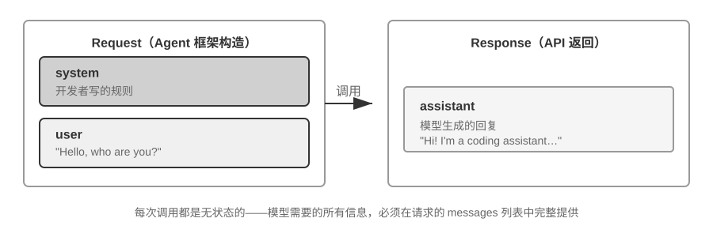
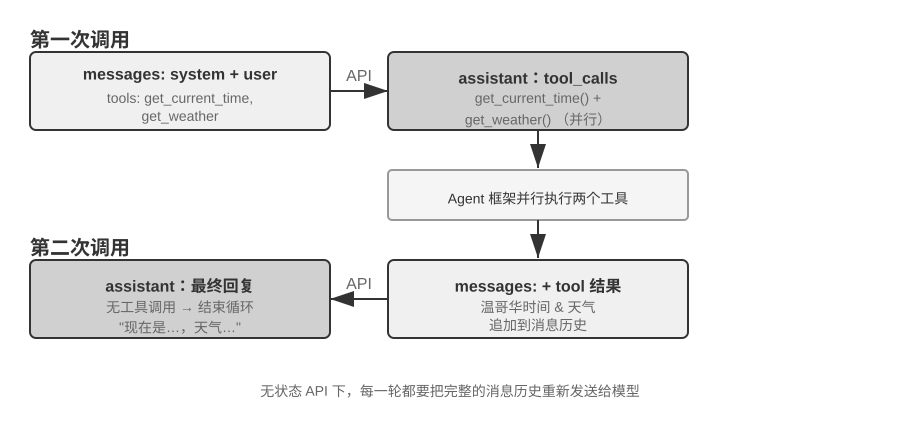

## Agent 如何调用大模型：理解 API 的上下文结构

本节以 OpenAI 的 Chat Completions API 为例（Anthropic、Google 等厂商的 API 结构大同小异），详细拆解 Agent 每次调用大模型时的完整请求构成。理解这个结构，是掌握后续所有上下文工程技术的基础。

### 消息的四种角色

大模型 API 的核心是一个**消息列表**（messages），列表中的每条消息都有一个**角色**（role）标识，模型根据角色来理解每条消息的含义和来源：

- **system**：系统提示词。由开发者编写，定义 Agent 的身份、行为规则、约束条件。模型将其视为最高优先级的指令。整个对话过程中通常只有一条，放在消息列表的最前面。
- **user**：用户消息。来自终端用户的输入，是 Agent 需要响应的请求。
- **assistant**：助手消息。模型之前的回复，包括文本回复和工具调用请求。在多轮对话中，之前的 assistant 消息会被放回消息列表，让模型“记住”自己说过什么。
- **tool**：工具结果。Agent 框架执行工具后，将结果以 tool 角色的消息送回给模型。每条 tool 消息通过 `tool_call_id` 与对应的工具调用请求关联。

此外，工具定义（tools）作为请求的独立字段（而非消息），告诉模型有哪些工具可以使用、每个工具接受什么参数。

### 单轮对话：最简单的 API 调用



我们先看一个不涉及工具调用的最简单场景——用户问 “Hello, who are you?”（这里用本地部署的 Qwen3-0.6B 小模型作为示例，正好呼应本节稍后的本地 LLM 部署实验；示例中的时间戳仅作演示，与全书的时间设定无关）：

```javascript
// ═══ Request constructed by the Agent framework ═══
{
  "model": "Qwen3-0.6B",
  "messages": [
    {
      "role": "system",                           // ← Written by developer
      "content": "You are a helpful coding assistant. Follow user instructions."
    },
    {
      "role": "user",                              // ← User input
      "content": "Hello, who are you?"
    }
  ]
}
```

```javascript
// ═══ Response returned by the API ═══
{
  "choices": [{
    "message": {
      "role": "assistant",                         // ← Generated by model
      "content": "Hi! I'm a coding assistant. I can help you write code, debug issues, and explain technical concepts. How can I help?"
    }
  }]
}
```

这个请求只包含两条消息：一条 system（开发者写的规则）和一条 user（用户的输入）。模型返回一条 assistant 消息作为回复。这就是大模型 API 最基本的交互模式——**每次调用都是无状态的，所有模型需要的信息必须在请求的消息列表中完整提供**。

### 带工具调用的多轮交互：Agent 的核心循环

真正的 Agent 场景远比单轮问答复杂。当用户问 “What's the current time and weather in Vancouver?” 时，模型无法凭自身知识回答（它不知道“现在”是什么时候），需要调用外部工具。下面完整展示这个过程中 Agent 框架与模型之间的每一步交互。



**第一次 API 调用——Agent 框架发送初始请求：**

```javascript
// ═══ Request constructed by the Agent framework (1st call) ═══
{
  "model": "Qwen3-0.6B",
  "messages": [
    {
      "role": "system",                           // ← Written by developer
      "content": "You are a helpful assistant. Use the provided tools to get real-time information when needed."
    },
    {
      "role": "user",                              // ← User input
      "content": "What's the current time and weather in Vancouver?"
    }
  ],
  "tools": [                                       // ← Tools defined by developer
    {
      "type": "function",
      "function": {
        "name": "get_current_time",
        "description": "Get the current date and time in a specific timezone",
        "parameters": {
          "type": "object",
          "properties": {
            "timezone": { "type": "string", "description": "Timezone name, e.g. America/Vancouver" }
          }
        }
      }
    },
    {
      "type": "function",
      "function": {
        "name": "get_weather",
        "description": "Get the current weather for a specific city",
        "parameters": {
          "type": "object",
          "properties": {
            "city": { "type": "string", "description": "City name" },
            "unit": { "type": "string", "enum": ["celsius", "fahrenheit"] }
          }
        }
      }
    }
  ]
}
```

**模型返回工具调用请求（不是最终回复）：**

```javascript
// ═══ Response returned by the API (model decides to call tools) ═══
{
  "choices": [{
    "message": {
      "role": "assistant",                         // ← Generated by model
      "content": null,                             // No text response
      "tool_calls": [                              // Model requests two tool calls
        {
          "id": "call_abc123",
          "type": "function",
          "function": {
            "name": "get_current_time",
            "arguments": "{\"timezone\": \"America/Vancouver\"}"
          }
        },
        {
          "id": "call_def456",
          "type": "function",
          "function": {
            "name": "get_weather",
            "arguments": "{\"city\": \"Vancouver\", \"unit\": \"celsius\"}"
          }
        }
      ]
    }
  }]
}
```

注意，模型并没有直接回答用户的问题，而是返回了两个**工具调用请求**——它判断“当前时间”和“天气”需要通过工具获取，而且两者之间没有依赖关系，可以并行调用。**模型只是发出了调用请求，真正执行工具的是 Agent 框架**。这是理解 Agent 架构的关键：模型负责决策（调用什么工具、传什么参数），Agent 框架负责执行（实际调用 API、运行代码）。

**Agent 框架执行工具，然后发起第二次 API 调用：**

Agent 框架拿到模型的工具调用请求后，实际执行这两个工具（比如调用时间 API 和天气 API），然后将**完整的对话历史加上工具执行结果**一起发送给模型：

```javascript
// ═══ Request constructed by the Agent framework (2nd call) ═══
{
  "model": "Qwen3-0.6B",
  "messages": [
    {
      "role": "system",                           // ← Same as 1st call
      "content": "You are a helpful assistant. Use the provided tools to get real-time information when needed."
    },
    {
      "role": "user",                              // ← Same as 1st call
      "content": "What's the current time and weather in Vancouver?"
    },
    {
      "role": "assistant",                         // ← Model output from 1st call, included verbatim
      "content": null,
      "tool_calls": [
        { "id": "call_abc123", "function": { "name": "get_current_time", "arguments": "{\"timezone\": \"America/Vancouver\"}" } },
        { "id": "call_def456", "function": { "name": "get_weather", "arguments": "{\"city\": \"Vancouver\", \"unit\": \"celsius\"}" } }
      ]
    },
    {
      "role": "tool",                              // ← Generated by Agent framework (tool execution result)
      "tool_call_id": "call_abc123",
      "content": "{\"timezone\": \"America/Vancouver\", \"datetime\": \"2025-09-13T05:18:47\", \"day_of_week\": \"Saturday\"}"
    },
    {
      "role": "tool",                              // ← Generated by Agent framework (tool execution result)
      "tool_call_id": "call_def456",
      "content": "{\"city\": \"Vancouver\", \"temperature\": 13.2, \"unit\": \"celsius\", \"conditions\": \"clear\", \"humidity\": 93}"
    }
  ],
  "tools": [ ... ]                                 // ← Same tool definitions as above, omitted
}
```

这里有三个关键细节：

1. **第二次请求包含了第一次的全部对话历史**——system 消息、user 消息、第一次的 assistant 回复（包含工具调用），以及新增的 tool 结果。这就是前面所说的“每次调用都是无状态的”：模型不会“记住”上一次的对话，Agent 框架必须每次都把完整历史送回去。
2. **第一次的 assistant 消息被原样放回消息列表**——这让模型能“看到”自己之前做了什么决策。
3. **tool 消息通过 `tool_call_id` 与对应的工具调用关联**——模型据此知道哪个结果对应哪个调用。

**模型根据工具结果生成最终回复：**

```javascript
// ═══ Response returned by the API (final reply) ═══
{
  "choices": [{
    "message": {
      "role": "assistant",                         // ← Generated by model
      "content": "It's currently 5:18 AM on Saturday, September 13, 2025 in Vancouver.\n\nWeather: 13.2°C with clear skies and 93% humidity. It's quite cool this morning - you might want to grab a jacket."
    }
  }]
}
```

这一次模型没有返回 tool_calls，而是直接给出了文本回复——它判断已经有了足够的信息来回答用户的问题。如果模型认为还需要更多信息（比如用户追问“那东京呢？”），它会再次返回 tool_calls，Agent 框架再执行、再送回结果，如此循环。**这个“请求→工具调用→执行→送回结果→再请求”的循环，就是第一章介绍的 ReAct 循环在 API 层面的具体实现。**

### 用代码实现 Agent 的核心循环

理解了 JSON 结构之后，让我们用 Python 代码把上面的交互过程串起来。以下是一个最简的 Agent 实现——核心就是一个 while 循环：

```python
from openai import OpenAI

client = OpenAI()

# ── Tool definitions ──
tools = [
    {
        "type": "function",
        "function": {
            "name": "get_current_time",
            "description": "Get the current date and time in a specific timezone",
            "parameters": {
                "type": "object",
                "properties": {
                    "timezone": {"type": "string", "description": "Timezone name, e.g. America/Vancouver"}
                },
            },
        },
    },
    {
        "type": "function",
        "function": {
            "name": "get_weather",
            "description": "Get the current weather for a specific city",
            "parameters": {
                "type": "object",
                "properties": {
                    "city": {"type": "string", "description": "City name"},
                    "unit": {"type": "string", "enum": ["celsius", "fahrenheit"]},
                },
            },
        },
    },
]

# ── Tool execution function (stub with canned results; a real implementation
#    must parse the JSON `arguments` and call actual APIs) ──
def execute_tool(name, arguments):
    if name == "get_current_time":
        return '{"datetime": "2025-09-13T05:18:47", "day_of_week": "Saturday"}'
    elif name == "get_weather":
        return '{"temperature": 13.2, "unit": "celsius", "conditions": "clear", "humidity": 93}'

# ── Initial message list ──
messages = [
    {"role": "system", "content": "You are a helpful assistant. Use tools to get real-time information when needed."},
    {"role": "user", "content": "What's the current time and weather in Vancouver?"},
]

# ── Agent core loop ──
# Production code needs a max_iterations cap here: as discussed later in
# this chapter, Agents can get stuck repeating the same tool calls forever
while True:
    response = client.chat.completions.create(
        model="Qwen3-0.6B", messages=messages, tools=tools
    )
    assistant_message = response.choices[0].message

    # Append model's response to message list (whether text or tool calls)
    messages.append(assistant_message)

    # If no tool calls requested, the model has produced its final response
    if not assistant_message.tool_calls:
        print(assistant_message.content)
        break

    # Execute each tool requested by the model, append results to message list
    for tool_call in assistant_message.tool_calls:
        result = execute_tool(tool_call.function.name, tool_call.function.arguments)
        messages.append({
            "role": "tool",
            "tool_call_id": tool_call.id,
            "content": result,
        })
    # Return to top of loop, call model again with updated message list
```

这段代码的核心逻辑只有一个 while 循环和一个判断：**模型返回了 tool_calls 就执行工具并继续循环，没有就输出结果并退出**。整个过程中，`messages` 列表不断增长——每一轮都会追加模型的回复和工具的执行结果。

让我们跟踪 `messages` 列表在每一轮的变化：

**初始状态（第 1 次调用前）：**
```
messages = [
  { role: "system",  content: "You are a helpful assistant..." },     # 开发者写的
  { role: "user",    content: "What's the current time and weather in Vancouver?" },  # 用户输入
]
```

**第 1 次调用后（模型返回工具调用）：**
```
messages = [
  { role: "system",    content: "..." },
  { role: "user",      content: "What's the current time..." },
  { role: "assistant", tool_calls: [get_current_time, get_weather] },  # + Generated by model
  { role: "tool",      tool_call_id: "call_abc", content: "{time...}" },  # + Executed by framework
  { role: "tool",      tool_call_id: "call_def", content: "{weather...}" },  # + Executed by framework
]
```

**第 2 次调用后（模型返回最终回复，循环结束）：**
```
messages = [
  { role: "system",    content: "..." },
  { role: "user",      content: "What's the current time..." },
  { role: "assistant", tool_calls: [get_current_time, get_weather] },
  { role: "tool",      tool_call_id: "call_abc", content: "{time...}" },
  { role: "tool",      tool_call_id: "call_def", content: "{weather...}" },
  { role: "assistant", content: "It's currently Saturday, Sep 13, 2025 in Vancouver..." },  # + Final reply
]
```

从这个过程可以清楚地看到：**Agent 框架的核心工作就是管理这个 messages 列表**——在合适的时机往里追加消息，然后把整个列表送给模型。本章后续所有的上下文工程技术，本质上都是在优化这个列表的内容和结构。

### 从 API 视角看上下文的构成

通过上面的例子，我们可以清晰地看到 Agent 每次调用模型时，上下文的完整构成：


上半部分（System Prompt + Tool Definitions）在整个对话过程中保持不变，下半部分（对话历史，即第一章所定义的**轨迹**）随着交互的进行不断增长。这正是第一章“上下文的五个组成部分”在 API 层面的具体样子：系统提示词和工具定义构成静态前缀，用户消息、模型回复和工具执行结果构成动态增长的消息历史。这个“静态前缀 + 轨迹”的结构，是后续讨论 KV Cache 优化、上下文压缩等技术的基础——理解了这个结构，就能理解为什么“前面不能动、后面可以压缩”。

本章后续将围绕这个结构的每一层展开：如何利用静态前缀的不变性加速推理（KV Cache）、如何设计好的 System Prompt（提示工程）、如何防范外部内容对上下文的劫持（提示注入防御）、如何按需加载专业知识（Agent Skills）、如何在对话末尾注入动态状态信息（Agent 状态栏）、以及如何在对话历史膨胀时进行智能压缩（压缩策略）。

> **实验 2-1 ★：本地 LLM 服务部署与工具调用**
>
>
> 
>
>
> 本实验的核心目的有两个：一是亲手体验小参数量模型的工具调用能力，二是直接观察 API 层面看不到的原始 token 流（思维链、特殊标记、工具调用格式）。此外，实验过程中还可以顺带留意 KV Cache 对首 token 延迟（Time To First Token，TTFT）的影响，为下一节的讨论建立直觉。
>
> 在深入理解 Agent 上下文之前，让我们先通过一个实际项目来体验小型模型的能力。`local_llm_serving` 项目展示了一个重要的观点：具备思维链（Chain of Thought, CoT）思考和工具调用能力的模型并不一定需要很大的参数量。即使是 0.6B（六亿）参数的超小模型，在合理的提示词（prompt）设计和系统架构下，也能展现出令人满意的工具调用能力。
>
> 通过这个实验，你应该能够观察到：
>
> 1. **小模型的能力**：即使是 0.6B 的模型，在适当的提示工程（prompt engineering，即通过精心设计输入提示词来引导模型行为的技术）下也能准确理解并执行工具调用。
> 2. **性能表现**：在苹果 M2 芯片上，模型能够以超过每秒 100 个 token 的速度生成响应，对于实时交互应用完全足够。Token 是模型处理文本的基本单位，一个中文字通常对应 1-2 个 token，一个英文单词通常对应 1-3 个 token。
> 3. **ReAct 循环**：观察模型如何通过多轮思考和工具调用来解决复杂问题。
> 4. **流式响应的优势**：流式输出让用户能够实时看到模型的思考过程，包括工具调用的决策和结果的处理。
> 5. **KV Cache 的影响（顺带留意）**：保持系统提示词不变，连续发起两次对话，记录第二次的首 token 延迟；然后修改系统提示词开头的任意几个字符，再发起一次对话并对比首 token 延迟。前者因为前缀缓存命中而明显更快，后者则需要重新计算整个前缀——这一现象正是下一节的主题。
>
> **ReAct 循环的实际案例。**
>
> 项目中的多轮工具调用遵循第一章介绍的 ReAct 思考-行动-观察循环，此处不再重复其原理。上一节已经用 OpenAI API 的 JSON 格式展示了这个过程的完整消息结构。在本地部署的实验中，这些 API 消息会被服务端（如 vLLM、Ollama）自动转换为模型内部的 token 格式。本实验的 `local_llm_serving` 项目允许你直接观察模型的原始输入输出 token 流，包括以下在 API 层面不可见的细节：
>
> **模型的内部思考过程**：支持思维链的模型（如 Qwen3）在生成工具调用之前，会先在 `<think>` 标签内进行思考——分析用户意图、评估哪些工具适用、规划调用顺序。这个思考过程对调试 Agent 行为非常有价值。
>
> **输出的顺序结构**：模型的输出 token 按固定顺序生成——先是内部思考（`<think>` 标签内），然后是给用户的文本回复，最后是工具调用请求。理解这个顺序对实现流式响应很关键：当 `<think>` 标签出现时可以切换到“思考中”状态；第一个工具调用的参数一经生成完整、通过校验，即可立即开始执行，无需等待模型生成后续的工具调用。
>
> **并行工具调用**：在本节的温哥华时间和天气的例子中，模型发现两个子问题之间没有依赖关系，因此在一次输出中同时生成了两个工具调用请求。Agent 框架检测到这一点后可以并行执行两个工具，实现流水线式的加速。
>
> **模型的终止判断**：当 Agent 框架将工具结果送回后，模型会判断是否已有足够信息回答用户。如果够了，直接输出最终回复（不含工具调用）；如果不够，继续输出新的工具调用请求，触发下一轮 ReAct 循环。
>
> **实验总结。**
>
> 这个实验最值得记住的一点是：0.6B 的小模型，在合理的提示词设计下，也能可靠地完成工具调用。模型大小固然重要，但不是唯一的决定因素。一些高端移动设备已经能运行 0.6B 级别的小模型，端侧模型的可用能力也在持续提升——端侧 Agent 的时代比大多数人预期的更近。
>
> 在实验中你可能已经注意到，修改系统提示词后模型的首次响应会变慢——这正是下一节要解释的 KV Cache 机制：改变前缀会导致缓存失效，模型需要重新计算。
>
