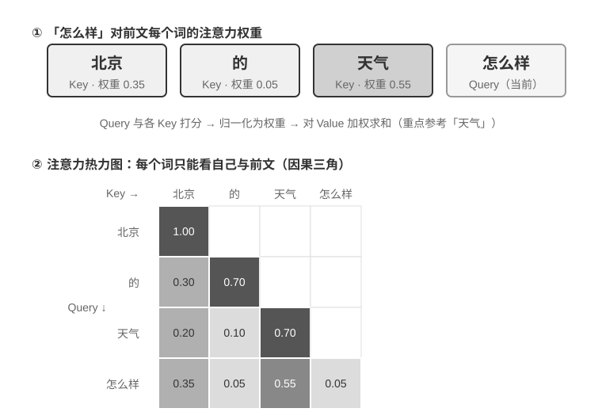
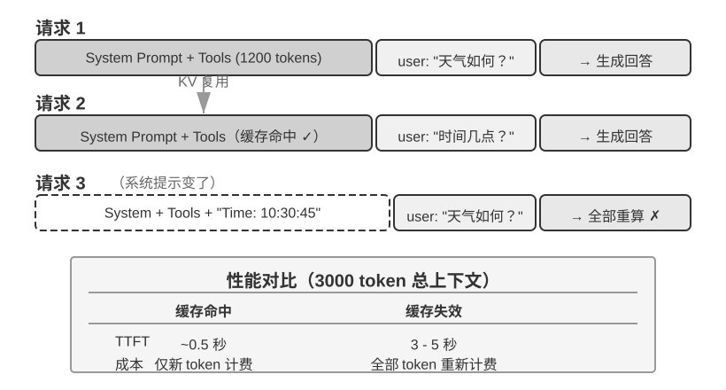

## KV Cache 友好的上下文设计

在进入故事之前，先把 **KV Cache** 的直觉建立起来。模型每生成一个 token，都要回头看一遍前文所有 token 的中间计算结果。如果每轮都从头算一次，开销会随上下文长度爆炸式增长。KV Cache 的做法是：把前文的中间计算结果缓存下来，下一轮只需要计算新增 token 的部分。**前提是前缀完全不变**——只要前缀里有一个字符被改写，缓存就全部作废，模型不得不从被修改的位置重算。顺带说明：本节讲到跨请求的“缓存命中”时，在 API 服务商的语境下叫 Prompt Cache——它是构建在推理引擎 KV Cache 之上的跨请求缓存，两个层级的完整辨析见本节末尾。

理解了这一点，下面这个故事就一目了然。某团队的客服 Agent 每天处理 10 万次对话，原本一切正常。某天工程师为了让 Agent “知道”当前时间，在系统提示词里加了一行 `Current time: {{now}}`，把时间戳实时注入进去。第二天监控告警：所有对话的首 token 延迟从 0.5 秒涨到 3-5 秒，月度推理账单几乎翻了一倍。代码看起来完全没问题，模型也没换——问题出在哪里？

答案是：那一行时间戳让 KV Cache 在每次请求都完全失效。系统提示词每次都不同，模型不得不从头重新计算前缀对应的所有键值对（这里的“键（Key）”与“值（Value）”是注意力机制的两类向量，下文的实验 2-2 会直观演示它们的作用）。这种“无形成本”在 Agent 系统里反复出现——开发者写下的一行看似无害的代码，可能让整条推理链路慢一个量级。本节要讲的，就是如何避开这些陷阱。

> **技术门槛提示**：本节涉及 Transformer 注意力机制和 KV Cache 的内部原理，是全书技术密度最高的部分之一。如果你不熟悉这些底层机制，**可以跳过原理细节，只需记住以下三条核心结论**：
>
> 1. **系统提示词和工具定义一旦确定就不要改。** 任何改动，哪怕多一个空格，都会导致缓存全部失效，延迟成倍增加、成本上升（具体幅度视模型与配置而定）。
> 2. **动态信息永远追加到末尾**——时间戳、用户状态等变化的内容，作为新消息追加到对话末尾，而不是修改已有的系统提示词。
> 3. **使用标准 API 格式，不要自行拼接消息**：结构化消息会被 Chat Template 翻译成模型训练时见过的固定 token 序列；自行用字符串拼成 `"USER: ... ASSISTANT: ..."` 的根本问题是偏离了这种训练格式，会削弱模型的多步思考能力。至于缓存——它只认 token 字节序列，只要拼出的前缀字节级稳定，照样能命中；但若拼接方式不稳定（如每次向前缀注入动态内容），缓存也会随之失效。
>
> 这三条结论背后的直觉其实很简单：大模型在处理上下文时，会把前面已经处理过的内容缓存起来，下次只需要处理新增的部分。**就像做菜——如果前几步完全一样（同样的食材、同样的刀工），你可以直接从上次切好的地方继续；但如果前面任何一步变了（换了一种食材），后面所有步骤都得重来。** 系统提示词和工具定义就是“前几步”，一旦改动，所有缓存的中间结果全部作废。
>
> 记住这三条原则，即使跳过下面的技术细节，也能正确设计 Agent 的上下文结构。以下内容是为想要深入理解“为什么是这样”的读者准备的。

> **实验 2-2 ★：注意力机制可视化**
>
> 在讲解 KV Cache 之前，我们先通过实验来直观理解模型内部的注意力机制——这是理解 KV Cache 为什么有效、以及为什么对上下文设计有严格要求的基础。
>
> **什么是注意力机制？** 用一个具体例子来说明。假设模型正在处理“北京 的 天气 怎么样”这句话，当读到“怎么样”时，模型需要决定：前面哪些词对理解“怎么样”最重要？
>
> 注意力机制通过三个向量来完成这个“找重点”的过程：
>
> 表2-1 汇总了 Query、Key、Value 三类向量在注意力机制中的分工，帮助读者把抽象计算对应到“北京的天气怎么样”这个例子中。
>
> 表2-1 注意力机制中的 Query、Key、Value 分工
>
> | 向量 | 含义 | 在这个例子中 |
> |--------------|----------------------------------|-----------------------------------------------|
> | **Query（查询）** | 当前词发出的“搜索请求” | “怎么样”问：哪个词和我最相关？ |
> | **Key（键）** | 每个词的“标签”，用于被搜索匹配 | “北京”的标签偏向“地名”，“天气”的标签偏向“气象” |
> | **Value（值）** | 每个词的“内容”，匹配成功后被提取 | 匹配到“天气”后，提取它的语义信息 |
>
> 简单来说，每个新词都在问“前面哪些词跟我最相关？”，通过打分找到最相关的词，然后重点参考它的信息来理解当前语境。
>
> 更具体地说，计算过程分三步：首先，“怎么样”生成自己的 Query 向量（一串数字，代表“我在找什么”）；然后，Query 与每个词的 Key 做点积（可以理解为“匹配度打分”——两组数字逐位相乘再加起来，结果越大说明越匹配），得到注意力权重；最后，用这些权重对所有词的 Value 加权求和——打分高的词贡献多，打分低的词贡献少，就像考试按权重算总分一样，最终合成出一个综合理解。
>
>
> 
>
>
> 图2-6 的上半部分展示了“怎么样”对前面每个词的匹配结果：与“天气”的匹配度最高（0.55），与“北京”有一定关联（0.35），与“的”几乎无关（0.05），余下的约 0.05 权重分配给“怎么样”自身（图中未单独画出）——所有权重加起来等于 1。最终输出主要来自“天气”的信息，这完全符合直觉。
>
> **注意力热力图**就是把每个词对前面所有词的注意力权重排成一个矩阵。图2-6 的下半部分展示了完整的热力图：每一行是一个 Query（当前正在处理的词），每一列是一个 Key（被关注的词），格子颜色越深表示注意力越集中。注意热力图呈三角形——因为模型是从左到右逐个生成的，每个词只能看到自己和前面的词，不能“偷看”还没生成的内容。
>
> **为什么 Key 和 Value 需要缓存？** 观察热力图可以发现：每生成一个新词，它的 Query 都要与前面**所有**词的 Key 做匹配，再用所有词的 Value 加权求和。如果每次都从头计算所有 K 和 V，计算量会随上下文长度不断增长。KV Cache 就是把已算过的 K 和 V 缓存起来，让新词直接复用——这就是下文要讲的核心优化。
>
> 理解了注意力机制的基本原理后，我们通过 `attention_visualization` 实验来观察真实模型的注意力分布。
>
>
> 
>
>
> 注意力热力图揭示了几个关键模式：
>
> 1. **注意力储存池**：序列的第一个 token 往往吸收了异常高的注意力权重，有时超过总注意力的 70%。模型将这个位置用作“注意力储存池”（Attention Sink），存放那些不需要分配到其他具体 token 上的多余注意力权重。换句话说，模型学会了把那些“无处安放”的剩余权重集中倾倒到第一个 token 上，就像一个公共的回收站——这是一种系统性的现象，并非模型缺陷。
>
>    背后的数学原因是：注意力机制有一个硬性约束——所有注意力权重加起来必须恰好等于 100%（这由一个叫 softmax 的数学函数保证），模型无法表达“不关注任何东西”。即使当前词与前面所有词都不太相关，这些权重也必须分配到某个地方。于是模型必须为这部分“剩余权重”找一个稳定的容器，序列开头的固定位置便成了最自然的选择。这是 softmax 在处理大量 token 时的数学特性导致的必然现象。
> 2. **思考的三角形模式**：模型思维链（`<think>` 标签内）展现出三角形状的自注意力模式——生成新的思考内容时频繁“回看”之前的思考内容和工具定义。
> 3. **输出的三角形模式**：思考结束后的输出过程展现出另一个三角形，模型用思考过程作为提示来输出回答。
> 4. **位置偏好**（Position Bias）[^lost-in-the-middle]：模型对上下文开头和结尾的信息分配了更高的注意力，中间部分则更容易被忽视。因此，在设计上下文时，把最关键的信息放在开头或结尾是一项重要的实践原则。
>
> 这个实验说明，**模型的长思维链能力和工具调用能力都对上下文学习（In-Context Learning）能力有很强的依赖**——所谓上下文学习，是指模型不需要重新训练，仅凭输入中给出的指令和示例就能适应新任务的能力。上下文学习的内部机制是什么、它对 Agent 架构设计意味着什么，详见本章上下文压缩一节。

[^lost-in-the-middle]: Liu et al. ["Lost in the Middle: How Language Models Use Long Contexts"](https://aclanthology.org/2024.tacl-1.9/), TACL, 2024.

### 从 API 消息到模型 Token：Chat Template

Chat Template 是一块**贯穿全书的地基**：它不只关系到 KV Cache，还决定了多轮工具调用、思维链保留、状态栏注入等诸多机制能否正确工作，因此值得单独讲清楚。注意力可视化实验中的 token 序列（如 `<|im_start|>`、`<|im_end|>` 等特殊标记）看起来与前面 API 的 JSON 格式很不一样。这是因为 API 层面的结构化消息需要被转换为模型能理解的线性 token 流——负责这个转换的就是 **Chat Template**（聊天模板）。

可以把 Chat Template 想象成**信封格式**：API 消息是信的内容，Chat Template 规定了如何在信封上写明寄件人、收件人——用特殊标记（如 `<|im_start|>system`、`<|im_end|>`）划分每条消息的边界和角色。不同的模型家族（Qwen、Llama、Gemma）使用不同的“信封格式”，就像不同国家有不同的邮政编码规则。API 服务端（vLLM、Ollama 等）会根据模型的 Chat Template 自动完成这个转换，开发者通常不需要手动处理。

以 Qwen 系列模型为例，同一段对话在 API 和模型内部看到的是完全不同的形式：

左侧是结构化的 JSON 消息，右侧是模型实际处理的线性 token 流。`<|im_start|>` 和 `<|im_end|>` 是特殊 token，告诉模型每条消息的角色和边界。

对于 Agent 开发者来说，**你不需要手动编写或修改 Chat Template**——API 服务端会自动处理。但理解它的存在对 Agent 开发有两个实用价值：

**第一，解释了为什么必须使用标准 API 格式**。如果开发者绕过 API、自行拼接消息（比如把工具结果作为普通 user 消息而非 tool 类型传递），Chat Template 会误将工具响应识别为新的用户查询，导致模型的思维链保留机制被破坏。以 Qwen3 的 Chat Template 为例：模型在多轮工具调用中，会把之前的内部思考过程（`<think>` 标签内的内容）保留下来，像草稿纸上的推导步骤，确保思路的连贯性。但当 Chat Template 检测到新的用户查询时，会默认“用户换了个话题”，于是清理之前的思考过程重新开始。问题在于，如果工具结果被错误地标记为用户消息，就会误触发这种清理——相当于模型正算到一半，草稿纸被人收走了，只能从头再来，严重影响多步思考的连贯性。需要注意的是，不同模型家族对历史思维链的处理策略差异很大，而且策略本身也在快速演变。DeepSeek R1 时代的官方做法是**剥离全部历史思考**：多轮对话时只回传 `content`，不回传 `reasoning_content`——因为 R1 训练时历史 CoT 从不出现在输入里，塞回去属于分布外输入，反而可能干扰输出，同时也能省下可观的 token。但这个策略对 Agent 场景是有缺陷的：中间思考承载着"为什么调用这个工具、排除了哪些假设"等关键状态，剥离后模型每轮从零推理，容易重复犯错、丢失长程计划。因此 DeepSeek 在 V4 上**彻底反转**，强制要求把每轮 assistant 消息（包括带 `tool_calls` 的）的 `reasoning_content` 原样回传，否则直接报错——Kimi K2、GLM-5 等也采用了同样的协议。Claude 则要求客户端在工具调用循环中把 thinking block（带签名校验）原样回传给 API，而在新的用户轮次之后，服务端会忽略历史 thinking。这一从"剥离"到"强制回传"的行业转向本身就是一个有力的证据：**对 Agent 场景而言，思考不是废料，而是状态**。使用前应查阅对应模型的最新模板文档。

**第二，解释了 KV Cache 为什么对前缀如此敏感**。Chat Template 将 system 消息和工具定义转换为固定的 token 序列放在最前面。这些 token 的键值对（Key-Value pairs）被缓存后可以跨请求复用。但如果前缀中任何一个 token 发生变化——哪怕只是系统提示词里多了一个空格——整个缓存就会失效。

### KV Cache 的原理与约束

要理解 KV Cache 的价值，先看看没有它时会发生什么。假设一个 Agent 在进行第 6 轮对话，上下文已经累积了 2000 个 token。在没有缓存的情况下，模型每生成一个新 token，都需要重新计算这 2000 个 token 的 K、V 向量——相当于重跑整个前缀的前向计算。尽管前 5 轮的内容完全没变，第 6 轮仍要像第 1 轮那样从头计算整个前缀，而且此时前缀更长，代价比第 1 轮大得多。无缓存时，prefill 阶段（即模型正式生成回复之前，一次性处理输入端全部 token 的阶段）的注意力计算量随上下文长度平方级增长，随着对话深入，延迟和成本都会急剧攀升。这对于需要几十轮工具调用的 Agent 任务来说是不可接受的。

**用一个简单例子理解 KV Cache**。假设上下文有 4 个 token [A, B, C, D]，模型正要生成第 5 个 token E。注意力的核心操作是：E 的查询向量（Query）与所有已有 token 的键向量（Key）做点积来计算匹配度（点积的直观含义见实验 2-2），再根据匹配度对所有 token 的值向量（Value）加权求和，得到 E 的输出表示。

不使用 KV Cache 时，每生成一个新 token 都要从头计算前面所有 token 的 K、V 向量：生成 E 时要计算 5 组 K、V，生成第 6 个 token 时要计算 6 组……到第 N 个 token 时要计算 N 组，总计算量与 N² 成正比。

使用 KV Cache 时，A、B、C、D 的 K、V 向量算过一次后就缓存起来。生成 E 时，只需要计算 E 自身的 K、V，然后与缓存中的 4 组一起完成注意力计算。需要注意的是，KV Cache 省去的是历史 token 的 K、V 投影重算，使每步解码不必重算整个前缀；但每个新 token 的注意力计算仍要遍历全部缓存的 K、V，计算量随上下文长度线性增长——这正是长上下文解码越来越慢、KV Cache 的显存与带宽成为推理瓶颈的原因。

**为什么修改前缀会导致缓存全部失效？** 大语言模型由多层 Transformer 堆叠而成（现代大模型通常有数十到上百层），每一层都独立生成自己的 K、V 缓存。这些层是串联的：第 1 层的输出喂给第 2 层作为输入，第 2 层的输出再喂给第 3 层，层层向下传递，就像流水线上的工序。第 1 层在处理每个词时，会综合考虑该词及其前面所有词的信息，然后输出一个中间结果；第 2 层拿到这个中间结果再做进一步加工。因此，如果修改了第 1 个 token（比如系统提示词改了一个字），第 1 层的输出就变了，第 2 层的输入随之改变，逐层向下传导——所有层的缓存都必须重算。代价很大：之前已处理的 token 需要重新计算和计费，延迟也会显著增加（本章实验中实测可达数倍）。这就是为什么后文反复强调“系统提示词一旦定下来就不要改”。

> **实验 2-3 ★★：常见的错误上下文管理模式**
>
> 在 `kv-cache` 实验中，我们系统性地测试了几种常见但有害的上下文管理模式。这些模式不仅会破坏 KV Cache 的有效性，有些甚至会影响 Agent 的核心能力。
>
> **动态系统提示词**是最常见的错误之一。一些开发者为了让 Agent“知道”当前时间，会在系统提示词中嵌入时间戳（如 “Current time: 2025-09-14 10:30:45.123456”）。这种做法看似提供了有用的上下文信息，但每次请求时时间戳都会变化，导致整个系统提示词不同，从而使 KV Cache 完全失效。正确的做法是将时间信息作为用户消息的一部分追加到对话末尾，或者只在真正需要时通过工具调用来获取。
>
> **动态用户配置**模式试图在每次请求中更新用户的状态信息（如剩余的 API 调用次数或账户余额），将这些信息嵌入上下文中会破坏缓存。更好的方案是在需要时通过专门的状态管理机制来处理。
>
> **工具定义的动态排序**是另一个隐蔽的陷阱。有些系统会根据使用频率动态调整工具的顺序，但工具定义通常占据上下文很大的一部分（每个工具可能包含数百个 token 的描述和参数说明），改变顺序就会导致整个缓存失效。实验表明，保持固定的顺序对模型选择工具的能力几乎没有影响，但对性能提升却是显著的。
>
> **滑动窗口（Sliding Window）对话历史**通过只保留最近几条消息来控制上下文长度。举个例子：如果窗口大小设为 10 条消息，那么第 11 条消息进来时，最早的一条就会被丢弃。这种做法存在两个严重的问题。第一，它会破坏上下文的前缀一致性，导致 KV Cache 失效。第二，它可能丢失关键的工具调用结果。举例：滑动窗口大小为 10 轮时，Agent 在第 2 轮调用了文件读取工具拿到关键内容，到第 15 轮还需要回引这段内容——但此时窗口已滑出原始结果，模型只能依赖被截断的对话尝试推断，错误率显著上升。在实验中，使用滑动窗口的 Agent 经常陷入循环，反复执行相同的工具调用，因为它“忘记”了之前已经获得的结果。
>
> **文本格式化方法**是最具破坏性的模式之一。它把结构化的 role-content 消息转换为 “USER: ... ASSISTANT: ...” 这样的纯文本流。需要说明的是，问题的关键并不在缓存——缓存作用于 token 字节序列，只要拼接出的前缀字节级稳定，照样能命中；只有当拼接方式不稳定（如每次向前缀注入动态内容）时才会破坏缓存。真正的破坏在于，文本格式化偏离了模型训练时使用的标准消息格式——模型在训练阶段接受了大量基于角色的对话数据，已经学会解析这种结构化格式。当消息被转为纯文本时，模型需要额外消耗注意力资源来推断角色的边界和对话的结构，从而产生各种问题：重复执行已完成的操作、忽略工具调用结果、在应该调用工具时却生成文本响应、格式解析错误等。
>
> **小结**：上面几种错误模式的解法，最终都收敛回本节开篇的三条核心结论。补充一点：模型提供商为标准接口做了大量的优化，偏离标准格式往往是在给自己挖坑——如前所述，这主要不是缓存问题，而是模型能力问题。

### KV Cache 与 Prompt Cache：两个层级的缓存

在继续之前，需要区分两个容易混淆的概念。**KV Cache** 是模型内部的优化——在一次推理过程中，缓存已计算的 token 的键值对，避免重复计算。**Prompt Cache** 则是 API 服务层的优化——跨多次 API 请求之间，缓存相同前缀的计算结果。两者的优化原理相似（都利用前缀不变性），但作用层级不同：KV Cache 加速单次请求内的 token 生成，Prompt Cache 减少跨请求的重复计算成本。Prompt Cache 的工作方式是：API 服务商对请求的前缀进行匹配，如果多次请求的前缀相同（比如系统提示词和工具定义不变），就直接复用之前计算好的 KV Cache，而不需要重新计算这部分 token 的键值对。缓存读取的成本远低于首次计算——以 Anthropic、DeepSeek 为例约为十分之一，OpenAI 的 GPT-5 系列同样约为十分之一（更早的 GPT-4o 一代为五折；GPT-5.6 起缓存写入另有 1.25 倍加价）。不过各家的启用方式和计费细节差异不小：Anthropic 需要在请求中显式设置 `cache_control` 断点才会缓存（并非自动命中），缓存写入有约 1.25 倍的加价，且有最小可缓存长度（如 1024 token）和 TTL 限制（默认约 5 分钟，过期即失效）；OpenAI 则是自动前缀缓存，无需显式声明。

在设计上下文时，两个层级的缓存都要求前缀稳定——但 Prompt Cache 的经济影响更大，因为它直接影响 API 计费。

### 缓存作为架构约束

以下内容涉及生产级 Agent 的架构细节，初次阅读可以跳过，在实际开发 Agent 时回来参考。

在生产级的 Agent 系统中，缓存不仅仅是性能优化手段——它是一个**架构约束**，决定了系统中许多看似无关的设计决策。

Claude Code 的实践揭示了一个深层的模式：当 Prompt Cache 的经济效益足够显著时，缓存一致性会反过来主导系统的架构选择。以下是几个体现这种约束的设计决策：

**提示词的结构由缓存边界决定**。系统提示词在物理上被一个缓存边界标记一分为二——标记之前的内容可以跨用户、跨会话进行全局缓存，标记之后的内容则包含用户和会话的特定信息。这意味着提示词的排列顺序首先由缓存的经济性决定，其次才是语义逻辑。每个运行时条件（操作系统类型、当前模式、用户偏好等）如果被放在缓存边界之前，就会把缓存键的变体数量翻一倍（若每个条件都是二值的，N 个条件就会产生 2^N 种组合），因此所有的动态元素都被严格归类到边界之后。例如，如果有 3 个条件（macOS/Linux、普通/调试模式、中文/英文），就会产生 2×2×2 = 8 种不同的缓存键。提示词片段在类型层面被区分为“可缓存”和“会破坏缓存”两类，后者的命名中包含显式的警告标记。

**子 Agent 必须与父 Agent 字节级对齐**。当主 Agent 派生子 Agent 或进行旁路查询时，子 Agent 的提示词、工具定义、模型配置、消息前缀和思考配置必须与父 Agent 的缓存键逐字节匹配。这样做的原因是：子 Agent 发起的 API 请求如果前缀与父 Agent 的请求一致，就能命中 API 服务商的 Prompt Cache，从而减少计费和延迟。这个约束从缓存层向上传导，影响了 Agent 的生成方式和参数传递机制。

**工具结果的替换字符串在首次出现时就被冻结**。当大型工具输出被替换为摘要预览时，替换后的字符串会被持久化保存。即使后续会话重启，系统也会使用完全相同的替换字符串——以保证恢复后的消息序列与缓存中的字节流一致，避免缓存失效。

这些设计选择的核心启示是：**在设计 Agent 架构时，缓存经济性不是事后优化，而是前置约束**。如果你的 Agent 系统使用了 Prompt Caching，那么缓存键的一致性要求会渗透到提示词设计、多 Agent 协调、会话恢复等各个层面。越早将这个约束纳入架构设计，后续的工程代价越小。

### KV Cache 未必是一次性的：可编辑、可组合的“笔记”

（以下是一段来自研究前沿的延伸阅读，属于“深水区选读”，初读可以跳过，不影响对本章后续内容的理解；前面的三条实践结论才是必须掌握的地基。）

本节到此为止都建立在一条铁律上：前缀里改一个字节，后面的缓存就全废。这条铁律在今天的推理引擎里确实成立，但笔者想指出，它未必是**必然**的。松动它的出发点，是一个反直觉的观察[^ch2-2]：在 prefill 阶段，模型其实在“做笔记”。当它读到上下文里的某个字段（比如“用户所在城市：北京”）时，并不是把这个字段原封不动地缓存下来，而是顺手把“这个字段意味着什么”的**结论**写进了后面每一层的 KV 状态里。测量发现，一个字段**自己**那几个 token 的 KV，对最终决策的贡献往往不到 1%——真正影响输出的，是它在下游留下的那些“读书笔记”。

这个发现打开了两种以前认为不可能的操作。其一是**编辑**（Editing）：既然结论已经写进了下游笔记，那么改掉一个字段后，只要模型有显式的思考链（CoT），就能让这处改动顺着已缓存的思考传播下去，用大约 1% 的算力得到与“整段重算”一致的结果（反过来，如果没有 CoT，孤立地改字段会被忽略——因为结论早已烘焙进下游状态、却没有一条思考路径去更新它，这是一条重要的边界）。其二是**组合**（Composition）：把一段预先算好的“技能”缓存，通过旋转位置编码（RoPE）挪到新的位置，直接拼接进另一段上下文，而不必重新计算注意力——于是“用模块化的缓存块拼出一个长上下文”从 O(L²) 的重算降到 O(L) 的拼接，质量却与完整重算无法区分。

打个比方：你读一份厚文档时，不会每改一个事实就从头重读，而是靠**页边笔记**——笔记里已经写着“所以这意味着 X”。KV Cache 即笔记的思路正是如此：模型的笔记已经记下了每个事实的**推论**，所以某个事实变了，只需修正那条笔记，它喂养的结论就跟着更新；又因为笔记是用一种可搬运的速记写成的，你还能把上次为别的问题记的一页笔记，重新编号后（这就是 RoPE 重定位）粘到新问题里复用。论文在 vLLM 上实现后，首 token 延迟（p90）最高有几十到几百倍的下降、前缀缓存命中率约 98.5%，而输出与逐字重算在决策上完全一致（跨 12 个模型，logit 余弦相似度 0.90–0.999）。

对 Agent 而言，这一点的意义在于：那个被反复重建的长上下文——换一批工具、更新一个记忆字段、注入一条新状态（正是下一节状态栏要做的事）——也许不必每轮都推倒重来。它指向一种“上下文可变、但缓存收益还在”的可能：把上下文的组装从 O(L²) 的重算，变成 O(L) 的“笔记拼接”。这仍属研究阶段，本节前面的三条实践结论在当前生产系统中依然是应当遵守的默认原则。

[^ch2-2]: Li, Bojie. *Models Take Notes at Prefill: KV Cache Can Be Editable and Composable.* arXiv:2606.17107, 2026.

理解了缓存机制后，接下来的问题自然变成：既然我们知道了上下文是怎么被处理和缓存的，那该如何设计送进去的内容本身？接下来几节围绕“上下文里到底放什么、怎么组织”展开，可以分为三条相对独立的线索：

- **提示工程、提示注入与动态提示词（Agent Skills）**：系统提示词该怎么写、写什么——这是上下文工程最直接的部分；工具定义（与系统提示词并列的另一个静态组成部分）的设计也直接影响 Agent 的工具使用准确性，本章给出核心原则，第四章将详细展开。紧随其后的是安全问题——提示注入：当外部内容试图劫持精心设计的上下文时，如何在上下文层面构筑防御。而当提示词越写越长、覆盖的场景越来越多时，把所有内容塞进一个系统提示词就不再可行了（既浪费 token，也会导致注意力被稀释），于是自然演化出 Agent Skills 的渐进式披露机制——按需加载，而非一次性塞满。
- **Agent 状态栏（Agent Status Bar）**：一种独立的机制，通过在上下文末尾注入动态的元信息（任务进度、环境状态、工具调用计数等），弥补模型无法主动归纳隐式状态的不足。就像手机屏幕顶部始终显示时间、电量、网络信号一样，Agent 状态栏让模型随时能“瞥一眼”就知道当前的运行状态。
- **上下文压缩策略**：解决上下文不断膨胀的问题——什么时候压缩、怎么压缩、压缩如何与 KV Cache 共存。
