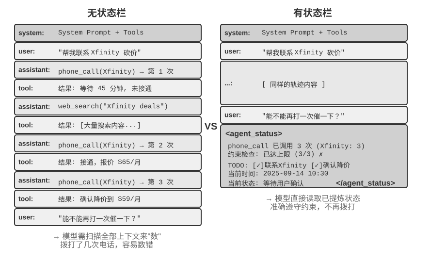

## Agent 状态栏：通过元信息增强 Agent 轨迹管理



上一节在介绍 Skills 的方式三时已经提到：“上下文末尾的 user-role meta 消息”是一条通用的元信息注入通道——Skill 元数据列表只是它的一个使用场景。本节将系统地展开这一通道：它是 Agent 框架向模型同步各种动态状态的统一机制，称为 **Agent 状态栏（Agent Status Bar）**。

前面讨论的提示工程解决了“给模型什么样的静态指令”的问题。但在实际执行过程中，Agent 还需要动态地感知自身的状态和任务的进展——这就是 Agent 状态栏的用武之地。

在构建生产级的 Agent 系统时，仅依赖大模型的原生能力往往是不够的。Agent 在执行复杂任务时容易陷入各种陷阱：无限循环、状态遗忘、任务目标偏离。这些问题的根源在于 Agent 缺乏对环境当前状态的感知和对任务进展的跟踪能力。Agent 状态栏通过在上下文中嵌入结构化的元信息，为 Agent 提供自我感知和自我调节的机制。

这个概念最好的类比是操作系统的**状态栏**。当你使用手机时，屏幕顶部始终显示着时间、电量、信号强度、通知数量——这些信息不是 App 的主界面内容，但你随时可以瞥一眼就掌握设备的当前状态。Agent 状态栏对模型起着完全相同的作用：它不是对话的主体内容（不属于用户消息、模型输出或工具结果），而是 Agent 框架在上下文末尾持续注入的**状态摘要**——“你已经打了 3 次电话”、“当前时间是 10:30”、“TODO 还剩 2 项未完成”。模型每次生成新回复时都能“瞥一眼”这些状态，据此做出更准确的决策。

与系统提示词（System Prompt）的区别很明确：系统提示词是入职时发的员工手册，一旦定下来就不变；Agent 状态栏则像是贴在屏幕边缘的实时仪表盘，随着任务的推进不断更新。

### Agent 状态栏的理论基础

Agent 状态栏之所以有效，源于注意力机制的一个本质特性：上下文学习更像检索而非推理——模型擅长从已有内容中查找信息，但不擅长主动归纳和总结（这里说的是模型在单次前向传播中如何消费已经在上下文里的信息，并不否定模型可以通过生成思维链来完成多步思考）。

一个更形象的说法是：**上下文窗口是一台只有一半的检索引擎**。它“检索”的这一半非常强——你问什么，注意力就能从成千上万个 token 里把相关的原始记录捞出来，相当于把检索增强生成（RAG）内置进了每一次前向传播。但它缺了另一半：**没有“提炼层”**。上下文里的东西从来不会被自动数一遍、建个索引、或就地总结成一条结论；任何“关于这些内容的结论”——一共多少条、有没有超标、进展到哪一步——模型每次要用，都得从原始记录里现算一遍。而“现算一遍”的代价，会随上下文里堆积的内容量（记作 N）一起往上涨。

考虑一个实际场景：Agent 需要打电话处理业务，系统提示词要求拨打每个商家不超过 3 次。但打了 3 次之后，Agent 经常数不清到底打了几次，又打了第 4 次，甚至陷入循环反复拨打同一个电话。

问题的根源在于：关于“已经打了几次”的知识没有被自动提炼出来，而是以原始通话记录的形式分散在 KV Cache 的向量表示中。模型每次做决策都必须花费额外的思考 token 去扫描上下文重新统计，这个过程效率极低且错误率很高。

而当我们在每个电话的工具调用结果中直接加入重复呼叫次数（如“本次是第 3 次呼叫该商家”），模型就能立即发现已达到限制，不再继续呼叫，错误率大幅降低。

这种机制的本质是**把分散在上下文各处的隐式状态提炼为可直接使用的显式知识**。原始轨迹中的信息是高度冗余的——大量的 token 中只包含少量关键的状态信息。Agent 状态栏主动提取这些关键状态，以极低的额外 token 成本，呈现出原本需要扫描数千个 token 才能获得的信息。

此外，在长上下文场景中，模型的注意力资源是有限的。随着上下文长度的增加，模型必须在更多的候选内容之间分配注意力，导致关键信息可能无法获得足够的注意力权重。特别是在复杂的 Agent 轨迹中，早期设定的任务目标和关键约束容易被后续大量的工具调用结果所淹没。模型会过度关注最近的上下文内容，而对位于上下文中部的信息产生“注意力衰减”现象。

Agent 状态栏正是通过显式地操纵注意力分配来解决这一问题。当我们将关键的元信息以结构化的形式放置在上下文末尾时，这些信息在空间上更接近模型即将生成的新 token，因而能获得更高的注意力权重——这是一种“强制性的注意力引导”。

> **实验 2-7 ★★：通过注意力可视化验证 Agent 状态栏的效果**
>
> 基于 `attention_visualization` 项目，我们设计了一个客服 Agent 处理退款请求的对照实验。Agent 已经拨打了 Xfinity 3 次电话，中间穿插了网络搜索。用户追问：“能不能再打电话催促一下？”
>
> **对照组 A（无状态栏）：** 上下文包含完整的轨迹但没有聚合状态信息。热力图显示注意力分布高度分散，在三次电话调用的区域形成明显的“聚焦点”，思考 token 体现出数数和统计的过程——模型在从原始信息中做归纳。
>
> **对照组 B（有状态栏）：** 在轨迹末尾添加：
>
> ```xml
> <agent_status>
> Current State:
> - Tool call summary: 'phone_call' has been invoked 3 times (Xfinity: 3 times)
> - Constraint check: Maximum calls to Xfinity reached (3/3)
> </agent_status>
> ```
>
> 注意力高度集中在状态栏信息上，思考过程直接使用已提炼好的信息，不再从原始数据中做统计。对于 Qwen3-0.6B 这样小的模型，对照组 A 经常违反约束继续拨打，而对照组 B 则能稳定地遵从约束。
>

实验 2-7 是个小规模的定性演示，给的是直觉。这套“提前算好、直接查一眼”的做法到底有多大用、边界又在哪，笔者和合作者用一个专门的基准量化了一遍[^ch2-7]（这套做法有个统一的名字，叫**上下文蒸馏，Context Distillation**——Agent 状态栏是它最日常的形态）：三类任务（计数、规则归纳、状态跟踪）、11 个模型（从最前沿的 API 一路到能在笔记本上跑的 2B 小模型）、近 2.4 万次评测。结论很干净：

- 给模型配上一条**提前算好的状态栏**，**弱模型补回来的是准确率**——最弱的几个模型准确率能涨 40 到 54 个百分点，一个 2B 的本地小模型在这类任务上甚至直接追平了不带状态栏的前沿大模型。
- **强模型本来就答得对，省下来的是效率**——同一条状态栏，让每次查询的思考量、延迟、花费各降大约一个数量级（思考 token 砍掉八九成以上）。
- 最本质的变化是：不带状态栏时，每次查询的思考量随上下文变长而**持续增长**；带上状态栏后，它变得**基本恒定**——不管上下文堆到多长，模型都只是“瞥一眼”那几格状态。这正是实验 2-7 那张热力图的量化版：原本注意力随 N 越摊越散，加了状态栏后它牢牢锁在那几个固定的格子上。

（顺便一提，状态栏一定要写成 `衣物: 9 件（合格 7、次品 2）` 这样能一眼定位的键值对，而不是一段大白话——论文里把同样的状态用散文写出来，效果明显更差，因为模型还得先把散文读一遍、解析出来，等于又回到了“扫描”。）

不过，“提前算好”这件事，**做对和做错是天壤之别**。这项工作最值得记住的，是三条能直接照着做的经验：

**一、状态栏要用代码维护，别拿大模型去维护。** 一个很自然的念头是“那我再叫一个 LLM 去读历史、帮我总结出状态栏不就行了”——结果恰恰相反。实验里，一个 20 行的正则函数就能达到“标准答案”级别的准确度；而让前沿大模型去**一次性**读完整段历史、吐出统计结果，反而在大多数格子上出错，把下游准确率拖得比“根本不用状态栏”还低。原因不难懂：让 LLM 批量统计长历史，等于把“扫描整段上下文”这个原始难题原封不动搬了个家，问题一点没解决。可行的替代是：**能用代码算就用代码算**；实在要用 LLM，也要**逐条抽取、再由代码汇总，绝不要让它一次性批量统计**。

**二、想删掉原始上下文之前，先确认状态栏覆盖了所有会被问到的问题。** 状态栏是对原始上下文的一次**有损投影**——它只提前算了“你预想会被问到”的那些维度。如果状态栏够用（计数、状态跟踪这类任务就是如此），你完全可以把原始记录整段删掉、只留状态栏，省下大把 token；可只要有一个问题落到了状态栏没算过的维度上，事情就会急转直下。论文做过一个极端测试：状态栏里只存了“两两组合”的计数，却去问“三者交叉”的问题——这时只留状态栏的准确率会**断崖式崩塌**，连 Claude 都从 100% 掉到 7.6%。因为一条看着很像样、实则答非所问的状态栏，会变成一个理直气壮把模型带偏的“假权威”。所以实践中要把“新增一种问法”当成一次**数据库改表结构**来对待：要么先给状态栏加上对应的字段，要么这一次就别删原文（状态栏和原始上下文一起留着）。还有一类任务——比如要在大段散文里做多跳推理——本就没有一个干净的结构化摘要能概括它，对这类任务别指望状态栏能提高准确率，它顶多帮你省点 token。

**三、把状态栏的准确率当成一线生产指标来盯。** 实验里有个略微吓人的发现：**模型几乎无条件地相信状态栏**——你写“打了 3 次”，它就当真是 3 次，既不会偷偷去核对，也不会自己重算。这既是状态栏有效的原因，也意味着状态栏一旦写错，错误会**原样**传进最终答案。好在容错空间不算小（大致上，状态栏里的数错个 10% 以内，收益还能保住大半），但越过这条线，带着错状态栏可能比不带还糟。这条也正好接上前面提过的**状态栏投毒**风险：状态栏里的信息越是来自对真实世界的可靠观测越好，绝不能来自可被外部污染的数据源——否则这台“仪器”读出的就是错的刻度，反而把模型带沟里去。

[^ch2-7]: Li, Bojie and Noah Shi. *Distill, Don't Retrieve: Inference-Time Context Distillation for LLM Agent Reasoning.* 2026. https://01.me/research/context-distillation

（以下同样是一段来自研究前沿的延伸阅读，属于“深水区选读”，初读可以跳过，不影响对状态栏用法的理解；前面的机制、证据和这三条经验已经足够指导实践。）

前面两条道理——提炼隐式状态、操纵注意力——解释了状态栏为什么好用，但还有更深、笔者也更看重的一层：状态栏之所以有效，根子上是因为它给模型**喂进了它自己想不出来的信息**[^ch2-5]。

我们通常以为，让模型变强有两条路：**想得更久**（更长的思维链）和**试得更多**（采样多个答案挑最好的）。但这两条路有一个共同的天花板——它们都只在模型“自己的脑子里”打转，用的都是同一套固定权重和同一段固定上下文，因此**变不出上下文里原本没有的新信息**，只能把已有的信息重新排列组合。真正能突破天花板的是第三条路：**交互**——模型先给出一个东西，让外部的“仪器”去观察它在真实世界里到底表现如何，再把这个观察写回上下文让模型修正。关键在于，这个观察是模型光靠想**想不出来**的：代码到底有没有通过测试、网页渲染出来那个按钮有没有跑出屏幕、这一步操作后系统状态变成了什么样——这些是“跑一下、量一下”才知道的事实，携带着权重和上下文里都不存在的新信息。（这项研究还发现，衡量改进的“尺子”本身也必须扎根于真实观测：若用一个只瞄一眼截图的视觉模型来打分，它连自己刚修好的缺陷都测不出来，整个循环就会悄无声息地空转。）

Agent 状态栏正是这条原理最日常的落地：Harness 就是那台“仪器”，它持续观察真实的运行状态（打了几次电话、当前时间、任务进展、某工具是否报错），把这些观察压缩成一小段写回上下文。所以状态栏里最有价值的，往往不是模型本可以自己扫一遍数出来的东西（那只是替它省点力气），而是它**根本无从推断**的外部事实——状态栏把“闭卷考试”变成了“随时能查一眼真实世界”。这也给出一条设计原则：状态栏注入的信息越是来自对外部世界的真实观测，价值越高；反过来，如果状态摘要是拍脑袋编的、或来自可被污染的数据源，这台“仪器”就会读出错误的刻度，反而误导模型（这正对应前面讨论过的状态栏投毒风险）。

[^ch2-5]: Li, Bojie and Noah Shi. *Interaction Scaling: Grounding the Third Axis of Test-Time Compute.* arXiv:2607.11598, 2026.

站在这个视角看第一章演进弧线末端的 Loop 工程（第十章将结合多 Agent 协作系统展开），会发现它本质上就是把“交互”这条第三轴工程化：循环每转一圈之所以有真实的进步，是因为验证环节把外部世界的观测写回了上下文，注入了模型自己想不出来的新信息；抽掉这一步，循环只是让模型把旧信息在原地翻来覆去地重新排列。业界“循环的瓶颈在验证器，而不在模型”的共识，与上面括号里那条发现——衡量改进的“尺子”必须扎根真实观测，否则循环会悄无声息地空转——说的是同一件事。

### Agent 状态栏的构成

基于上述的理论基础，Agent 状态栏包括以下几种类型的信息：

**任务规划**：当 Agent 处理复杂的多步骤任务时，轨迹会变得很长。Agent 容易过分关注当前的局部子任务，而忘记用户的原始诉求、核心约束以及后续工作。通过引入 TODO 列表将任务分解为清晰的步骤，放在轨迹末尾不断提醒模型当前的进展和未来的目标，确保行动与总体规划保持一致。

**事件的侧信道信息（Side-channel Information）**：为每个事件附加元数据——精确的时间、地理位置、距上次 Agent 回复的时间间隔等。侧信道信息是指不在主要数据通道中传递、但对理解事件很有帮助的辅助信息。这些信息帮助模型理解事件的时序关系和环境背景，从而做出更符合情境的决策。

**环境的当前状态**：包括动态的环境信息（系统时间、工作目录等）、异常操作提醒（“该工具已被重复调用 N 次”）、以及从隐式状态到显式状态的转换。这一设计原则同样适用于人类界面——命令行（CLI）和图形界面（GUI）都致力于让用户清晰地感知系统的当前状态。

**可用能力清单**：当 Agent 框架支持插件化的能力扩展（如上一节的 Skills 系统）时，所有已安装 Skill 的元数据列表也走这条同一的末尾注入通道，相当于告诉模型“你现在拥有哪些可调用的专业能力”。它变化频率最低（仅在用户安装/卸载 Skill 时才变），其增量发送机制已在上一节 Skills 中详述，此处不再重复。

侧信道信息和可用能力清单一经添加就不再改变，对 KV Cache 很友好（因为不会破坏已缓存的前缀）。而任务规划和环境状态是动态变化的，需要以特殊的用户消息追加到上下文末尾，并随任务推进不断更新——更新方式的选择直接关系到 KV Cache 的代价，下面结合具体的消息结构展开讨论。

### Agent 状态栏在上下文中的具体位置


一个重要的实现细节是：Agent 状态栏在 API 层面实际上是作为**一条 user 角色的消息**插入到上下文末尾的——而不是修改开头的 system 消息。原因正是前面讨论的 KV Cache 约束：修改 system 消息会破坏整个前缀的缓存。这里需要澄清一个容易混淆的地方：这里的 user 角色只是 API 协议层面的技术选择，并不等同于第一章定义的“来自终端用户的输入”。换句话说，Harness 是在借用 user 角色这个消息槽位，向模型注入由 Agent 框架自动生成的系统状态信息——内容并非来自真实用户，只是复用了 user 角色的消息格式来挂到上下文末尾。

以下是 Agent 框架在第 N 次 API 调用时实际构建的消息列表：

```
messages: [
  { role: "system",    content: "You are a customer service assistant..." }  ← Fixed (KV Cache cached)
  { role: "user",      content: "Help me cancel my Xfinity plan" }  ← Original user request
  { role: "assistant", content: null, tool_calls: [...] }   ← Round 1: model decides to call
  { role: "tool",      content: "Call log..." }             ← Round 1: call result
  { role: "assistant", content: null, tool_calls: [...] }   ← Round 2: model decides to call again
  { role: "tool",      content: "Call log..." }             ← Round 2: call result
  ...(more rounds)
  { role: "user",      content: "Can you call them again to follow up?" }  ← User follow-up
  { role: "user",      content: "<agent_status>             ← Status bar injected by Agent framework
      Current State:                                           (as a user message)
      - phone_call invoked 3 times (Xfinity: 3/3 max)
      - Current time: 2025-09-14 10:30:45
      - TODO: [1] Cancel plan (in_progress)
    </agent_status>" }
]
```

注意最后一条消息：它的 role 是 `user`，但内容是 Agent 框架自动生成的元信息，用 `<agent_status>` 标签包裹以便模型识别其特殊性质。这条消息在上下文的最末尾，紧邻模型即将生成的新 token，因此能获得最高的注意力权重。同时，因为它是追加而非修改，前面所有已缓存的内容都不受影响。

这个设计正是 KV Cache 一节核心结论中“动态信息追加末尾、静态信息保持不动”原则在状态栏场景的应用。

### 状态更新的两种实现与缓存代价

“追加不破坏缓存”只在单次注入时成立。状态是会变的——下一轮 TODO 完成了一项、工具计数加了一次，状态消息就过时了。如何更新它，存在两种实现，各有明确的缓存代价：

**实现一：每轮替换**。每次 API 调用前，从消息列表中移除上一轮的状态消息，在末尾追加最新状态。这保证了上下文中只有一份状态、永远是最新的。但代价是：移除旧状态会使其位置之后的所有缓存失效——这与本章批评的“动态时间戳”是同一个失效机制，区别只在于状态消息位于上下文末尾，失效范围仅限于最近几轮消息，而不是整个前缀。

**实现二：持久追加**。状态消息一旦注入就永久留在轨迹中，每轮只在末尾追加新的状态。Claude Code 的 `<system-reminder>` 采用的就是这种方式——历史状态消息保留在会话记录（transcript）中，从不删改。这种方式对缓存完全友好：所有消息只追加、不修改，前缀始终稳定。代价是陈旧的状态会在上下文中累积——既占用 token，也要求模型自己关注“最新一条”状态而忽略已过时的旧状态。

取舍的经验法则是：**状态更新频繁且轨迹很长时，选择实现二**——每轮替换带来的缓存失效会在长轨迹上反复累积，代价远超陈旧状态占用的 token；**轨迹较短或单条状态消息很大**（如完整的 TODO 列表加环境快照）**时，选择实现一**——末尾几轮的缓存失效本来就便宜，换来的是上下文的整洁和无歧义。

> **实验 2-8 ★★：几种好用的 Agent 状态栏技术**
>
> `agent-status-bar` 实验框架实现了五种状态栏技术，每种都可以独立启用或禁用：
>
> **时间戳跟踪**：以 `[2025-09-14 10:30:45]` 格式作为前缀添加到用户消息和工具响应中（注意：不是放在系统提示词中，否则会破坏 KV Cache）。这使 Agent 能够理解时序关系，也为调试和审计提供了信息。该技术还实现了时间模拟功能，Agent 可以理解“昨天的文件”和“今天的修改”之间的关系。
>
> **工具调用计数器**：维护一个全局的字典记录每个工具被调用的次数，在响应中标注 “Tool call #3 for 'read_file'”。这种显式的计数能触发模型的模式识别能力：第一次失败后检查路径，第二次失败后列出目录，第三次就主动放弃并寻找替代方案。其深层价值在于实现了隐式的成本感知——Agent 能“意识到”自己在某个操作上已经花费了太多次尝试。
>
> **TODO 列表管理**：借鉴 Manus（一款通用 AI Agent 产品）的“通过复述操纵注意力”理念，提供 `rewrite_todo_list` 和 `update_todo_status` 两个专门的工具。每个 TODO 项包含唯一标识符、内容、状态（pending/in_progress/completed/cancelled）和时间戳。从认知负荷理论来看，TODO 列表起到了外部记忆的作用——就像人在处理复杂项目时会写清单一样，Agent 也需要一个地方来记录“做了什么、还差什么”。实验数据显示：启用 TODO 的 Agent 平均 15 次迭代就能完成任务，而禁用时则需要 21 次且经常遗漏子任务。
>
> **详细错误信息**：包含四层内容——错误类型和描述、完整参数的 JSON、调用栈信息，以及针对性的修复建议（如遇到 FileNotFoundError 时建议验证路径、检查工作目录、使用绝对路径）。启用后，Agent 在错误场景中找到替代方案的成功率从 60% 提升到了 95%，从盲目重试转变为分析性的问题解决。
>
> **系统状态感知**：注入当前时间、工作目录、操作系统类型、Shell 环境和 Python 版本等信息。其中工作目录的跟踪尤其关键——Agent 执行 `cd` 命令后会自动更新，确保后续操作在正确的上下文中执行。操作系统信息使 Agent 能做出平台相关的决策（如 Linux 上用 `apt`、macOS 上用 `brew`）。
>
> 这些技术协同工作会产生涌现效应（即单独使用时效果有限，组合起来却能产生超出预期的效果）。时间戳和工具计数器的结合使 Agent 能够理解操作的频率和时间分布；TODO 列表和系统状态的结合使 Agent 能根据环境调整任务策略；详细错误信息和工具计数器的结合使 Agent 在多次失败后不仅能改变策略，还能理解失败的原因。
>
> 完全启用这些技术的 Agent 不再是机械执行指令的工具，而更像是一个有自我意识的助手——遇到文件不存在时先检查目录，再列出可用的文件，仍然找不到就在 TODO 中标记 cancelled 并添加替代任务。这种自适应的行为是单独的某一项技术无法实现的。
>

### 从读数到策略：Agent 的物理时间感知

实验 2-8 的五种技术里，时间戳跟踪和工具调用计数器看起来是两条互不相干的元信息，但把它们放在一起看，会发现二者指向同一种更本质的能力——让 Agent **感知物理时间**，并据此调节自己做事的节奏。一个人被要求“三分钟写一段话”和“三十分钟写一段话”，交出来的东西是不一样的；可当下的前沿 Agent，无论你说三分钟还是三十分钟，产出几乎没有区别。它既说不清一件事到底做完了没有，也分不清眼前这堵墙是真的走不通、还是稍等一下就好，更察觉不到一个已经跑了三分钟的工具调用是仍在推进、还是早就卡死了。笔者和合作者把这种缺失的能力称为**时间感（time sense）**，并把它拆成三个可以分别度量的轴[^ch2-8]：

- **紧迫度（urgency）**——预算轴：把投入的力气匹配到时钟上。时间紧就在不确定中果断交付，时间宽裕就再往深里挖、多验证、多打磨。它是双向的：低紧迫度不等于“少干点”，而是“别急着停，接着做”。
- **坚持度（persistence）**——终点轴：分清真墙和假墙，也知道活儿到底干完了没有。失败有两个方向——对着一堵真墙反复撞（把一个已经 410 Gone 的接口重试五次），或者在一堵假墙前过早收手（搜了两次没结果就断言“查无此信息”）。
- **警觉度（vigilance）**——监控轴：把工具响应上的时间异常升级成一个值得追查的假设。一个本该 500ms 返回、却跑了 5 秒的调用，和一个 1 毫秒就“成功”返回、body 却是空的调用，都是信号——前提是 Agent 盯着这个读数看。

这套三轴框架直接落在状态栏上：时间戳跟踪供的是紧迫度和警觉度的读数，工具调用计数器供的是坚持度的读数。但这里有一个容易踩空、也最值得记住的发现：**光把读数摆到模型面前，并不足以改变它的行为**。在一个专门测量时间感的基准上，同一批任务被放在四种条件下运行：什么都不给、只给原始时间戳、给时间戳外加一份“这些读数该怎么用”的操作手册、以及让 Agent 自己上报节奏状态。结果相当反直觉：**只给原始时间戳这一档，和什么都不给几乎没有区别**（前后相差不过两三个百分点）；真正把通过率从一成出头拉到四五成的（幅度 +19 到 +49 个百分点），是那份操作手册。换句话说，把 `elapsed_ms=5000 expected_ms=500` 这行读数放进上下文，模型确实“看见”了，却不会自动据此改变干活的节奏——它缺的不是读数，而是**拿这个读数该怎么办的策略**。

这正好补上了本节前面留下的一个缺口。工具调用计数器之所以只靠“本次是第 3 次呼叫（3/3）”这一行读数就能纠偏，是因为它对应的决策规则太显然了——“到顶了就停”，模型一看就懂；而像“力气该花多少”“这堵墙要不要绕”这类节奏判断，规则并不显然，光有读数，模型推导不出该怎么做。所以一条真正管用的“节奏状态栏”，必须把**读数**（当前用了多久、这个工具慢不慢、这堵墙撞了几次）和一小段**操作策略**（时间紧就交付、慢调用要诊断、真墙就绕开）成对地给出去，缺一不可。这把状态栏的作用又往前推了一步：显式的读数只是原料，模型还需要一份把读数翻译成动作的说明书。

这个缺口也不是某一家模型的毛病。在四个厂商家族的六个模型上——从 Claude、Gemini、GPT 到 Qwen——不加操作手册时，通过率无一例外地趴在一成出头的地板上，说明“缺时间感”是当前后训练普遍漏掉的一项控制，而不是某个模型不够聪明。好在它补得回来：推理时靠上面这套“状态栏 + 操作手册”就能装上；如果想让小模型脱离提示词也具备这种节奏感，还可以把它蒸馏进权重里——这条训练路线留到第七章后训练一章再讲，届时会看到一个耐人寻味的对照：同样是教模型这套节奏感，稀疏的结果奖励怎么都学不会，换成逐 token 的稠密信号才终于学会。

[^ch2-8]: Li, Bojie and Noah Shi. *Agents That Sense Physical Time: Urgency, Persistence, and Vigilance as Missing Controls for LLM Agents.* 2026. https://01.me/research/physical-time-agent

### 设计哲学

这套技术有一个实用的优点：所有元信息都以人类可读的形式出现在上下文里，开发者随时可以检查 Agent 拿到了哪些信息、做了什么决定。更重要的是，它对模型没有侵入性——不需要微调，直接在任何语言模型上都能起效，可以一个个技术叠加着尝试。
