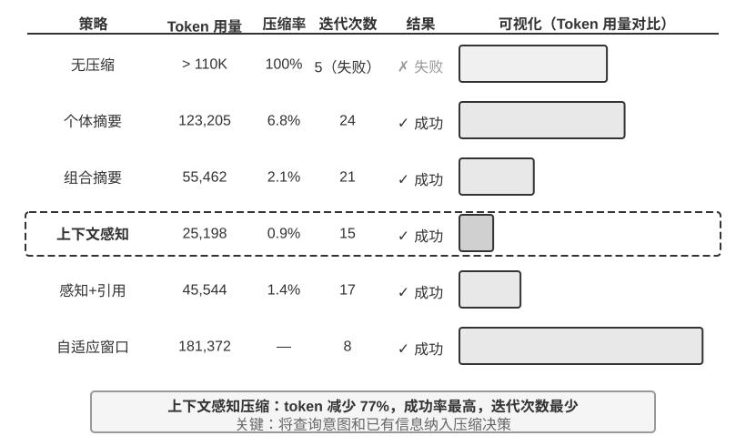
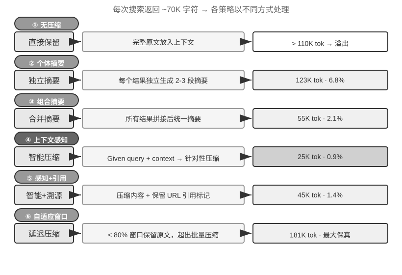

## 上下文压缩策略

前面几节讨论了如何往上下文里放内容——提示工程决定写什么，Skills 决定按需加载什么，Agent 状态栏决定注入什么元信息。但随着多轮交互的深入，上下文会不断膨胀。本节讨论的是相反的方向：**如何从上下文中减少内容**——什么时候压缩、怎么压缩、为什么即使上下文没满也应该压缩。

### 为什么需要压缩：不只是长度问题

压缩上下文有两个截然不同的动机，理解这一点对设计压缩策略至关重要。

**第一，解决长度约束和成本约束**。这是最直观的原因：上下文窗口有限（比如 128K token），工具调用结果动辄数万字符，几轮交互就可能撑满窗口，任务被迫中断。同时 token 越多，API 成本越高，推理延迟也会急剧上升。

**第二，提升思考质量——总结后的知识比原始形式更利于模型使用**。这个动机更深层，也更容易被忽视。即使上下文窗口足够大，把所有原始信息堆在上下文里也不是最优选择。

考虑一个具体的例子：Agent 在执行一个复杂任务的过程中，通过 10 次网页搜索积累了关于某个主题的信息。这些搜索结果以原始形式散落在上下文的各个位置——第 2 轮的搜索结果在上下文靠前的地方，第 9 轮的结果在靠后的地方。当 Agent 需要基于所有这些信息做最终决策时，它必须在数万 token 中反复“检索”相关片段，注意力被分散，关键信息容易被遗漏。

而如果在第 10 次搜索之后，先用一次 LLM 调用将已有信息做一次结构化总结——“目前已知：A 是..., B 是..., 还缺 C 的信息”——模型在后续思考时就可以直接使用这个精炼的知识表示，无需从原始数据中重新提取。

这个现象的根源在于注意力机制的本质：**上下文学习的内部机制更像检索而非推理**（第一章简要引入了这个概念，Agent 状态栏一节已经做了完整的展开——包括它的机制、大规模证据和工程做法）。接下来我们从压缩的角度，看这条机制意味着什么。

### 上下文学习的内部机制：检索而非推理

简单回顾一下这条机制（详细的界定、证据和做法都在状态栏一节）：所谓**检索而非推理**，是说注意力擅长在已有内容里“查找”，却不擅长在一次前向传播里主动“归纳统计”——这并不否定模型可以靠生成思维链一步步想，只是说“在单次前向传播里消费已有上下文”这件事更像检索。它对压缩的含义是：状态栏的做法是把算好的结论**加**进上下文，而压缩是把臃肿的原始记录**换**成算好的结论——两者是同一枚硬币的两面，都在给那台“只有一半”的检索引擎补上缺失的“提炼”。区别只在于：状态栏往往由**代码**每一步确定性地维护，压缩则更多是用一次 LLM 调用把大段原文蒸馏掉。

下面用一个简单的例子来直观感受“检索而非推理”这一点。假设上下文中包含一段宠物店的巡查记录：

> 笼子 1：黑猫。笼子 2：白猫。笼子 3：黑猫。笼子 4：黑猫。笼子 5：白猫。
> ……（共 100 个笼子，其中 90 只黑猫、10 只白猫）

当你问模型“黑猫和白猫各有多少只？”时，会发生什么？

如果不启用思维链（Thinking），模型很难直接给出正确答案——因为注意力机制擅长的是**查找**（“笼子 37 里是什么猫？”），而不是**统计归纳**（“总共有多少只黑猫？”）。后者需要遍历所有记录并维护计数状态，这本质上是思考而非检索。

如果启用思维链，模型可以通过逐个数数来得到正确答案——但代价是每一次被问到这个问题，都需要重新从头数一遍，产生大量的思考 token。在 Agent 场景中，如果这类统计信息需要被反复使用（比如每次决策都要参考），累积的思考成本会非常高。

而如果我们提前做一次总结，在上下文中直接写入“当前统计：黑猫 90 只，白猫 10 只”，模型就能立即检索到这个结论，无需重新思考。**这就是压缩的第二个价值：把需要思考才能得到的结论变成可以直接检索的知识。**

更深层的问题在于，长上下文会导致检索精度的下降。明明上下文窗口还远没有满，但 Agent 突然找不到关键信息了，或者反复纠结于一个早已解决的问题——这种现象被称为**上下文腐化（Context Rot）**。上下文腐化与上下文溢出（窗口用完）是不同的问题：溢出是“装不下了”，腐化是“装得下但找不到了”——后者更隐蔽，因为 Agent 表面上还在正常工作，只是决策质量悄然下降。随着上下文长度的增加，注意力权重被分散到更多的 token 上，每个 token 获得的权重变小；更关键的是，无关的内容一旦占到了上下文的大头，Agent 的决策质量就会明显下滑。实践中最常见的失效模式不是窗口不够长，而是信息密度不对——偶尔才用到的知识每次都加载、稳定的规则和动态的状态混在一起，模型能看到的内容越来越多，但真正有用的部分越来越难被注意到。这就好比在一个巨大的图书馆里找某本书，书架上摆的无关书籍越多，找到目标就越难。实验 2-2 的注意力可视化清楚地展示了这一现象：在长上下文中，模型的注意力呈现出明显的位置偏好。这就是著名的“大海捞针”实验（将一条关键信息藏在超长文本的中间，测试模型能否准确找到）所揭示的问题。

Andrej Karpathy 提出了一个深刻的洞察：模型的“记忆差”在某种程度上是特性（feature）而非缺陷——上下文窗口的有限性迫使模型学会从大量的细节中抽象出一般性的模式，就像人不会记住每次对话的逐字内容，而是提炼出总体印象和行为模式。

这揭示了上下文压缩的设计原则：与其期望模型从冗长的上下文中自动学习，不如主动地、显式地进行知识提炼。虽然需要额外的计算投入（用专门的 LLM 调用来做总结），但产生的是经过压缩的高密度知识表示——**不要让模型被动地在海量信息中检索，而要主动为模型提供经过提炼的结构化知识**。

从这个视角来看，上下文学习更像是一种快速适配机制，而非真正的学习。它允许模型在推理时快速调整行为以适应特定的任务，但这种调整是暂时的、浅层的，会话结束后就消失了。最近的理论研究[^ch2-6]支持这一判断：当模型看到上下文中的示例时，它的行为就像被“临时定制”过一样——不是真的改变了模型参数，但效果类似于做了一次小小的专项训练。这解释了为什么提示工程一节的 few-shot 示例能显著改善输出质量，也解释了为什么这种改善不会跨会话累积——与真正的参数训练有本质区别。

[^ch2-6]: Benoit Dherin et al., “Learning without training”, 2025.

### 压缩与 KV Cache：看似矛盾，实则互补

在讨论具体的压缩策略之前，需要解释一个看似矛盾的问题：前面反复强调 KV Cache 要求上下文前缀保持不变，但压缩不就是要修改上下文中间的内容吗？

关键在于理解压缩发生的**时机和位置**。压缩不是在单次 API 调用的过程中修改上下文，而是在**两次 API 调用之间**，由 Agent 框架对消息列表进行预处理：

1. **System Prompt 和 Tool Definitions 永远不动**——这是上下文最前面的“静态前缀”，KV Cache 持续缓存。
2. **压缩的对象是对话历史中的 tool results**——当 Agent 框架用压缩后的摘要替换原始的工具输出时，替换位置之后的缓存会失效，但之前的缓存仍然有效。
3. **这是一个有意识的权衡**：不压缩，上下文膨胀到超出窗口限制，任务直接失败；压缩后，虽然损失了部分缓存，但上下文长度可控且信息密度更高。因此压缩的频次需要权衡——频繁压缩会频繁破坏缓存，最好在上下文接近阈值时批量压缩，而不是每轮都压。

> **实验 2-9 ★★★：上下文压缩策略对比**
>
> 我们设计了一个研究任务：识别并追踪 OpenAI 联合创始人的职业状态。这个任务需要多步骤的信息聚合，搜索返回的内容长度差异很大（从数千到十几万个字符不等），且有明确的成功标准。使用 Kimi K3（思考模型，原生上下文约 100 万 token；本实验刻意将上下文预算限制在 128K 窗口以触发压缩），我们实现了六种策略：
>
> **策略一：无压缩** —— 将所有工具调用的原始结果完整保留。多次搜索累计返回了约 367,000 个字符（7 次工具调用，平均每次约 52,000 个字符）。到第五次迭代时，上下文累计已超过 128K 限制（约 165,000 token），触发了溢出保护，任务失败。仅需数次搜索就能耗尽 128K 的窗口。
>
> **策略二、三：非任务感知压缩** —— 个体摘要为每个搜索结果独立生成 2-3 段摘要，压缩率 10.9%（本书的压缩率指“压缩后体积 / 原文体积”，数值越小表示压得越狠），能完成任务但需要 12 次迭代、276,608 个 token。主要问题是信息碎片化——多个页面重复描述同一事件，白白浪费了上下文空间。组合摘要则将所有结果合并后生成一份综合摘要，压缩率 4.3%，10 次迭代、93,449 个 token，但当输入超长时必须截断，可能丢失末尾的信息。两者的共同缺陷是：缺乏语义理解，无法区分信息的相关性。
>
> **策略四：上下文感知压缩** —— 核心创新在于将当前的查询意图和已积累的信息纳入压缩的决策过程。通过在压缩提示中指定 “Given the search query: {query}” 和 “Current context: {context}”，引导模型生成有针对性的摘要。结果仅需 7 次迭代、40,157 个 token，整体压缩率约 3.0%。以其中一次压缩为例，将 147,877 个字符压缩到 1,963 个字符（约 1.3%）时，仍保留了创始人姓名与职位变动等关键信息；后续的搜索能智能地提取职位变动、新公司等关键信息，过滤掉无关的历史背景和重复内容。这一成功基于一个关键的洞察：多步骤任务中，不同阶段需要的信息密度和类型是不同的——初期需要广泛的信息收集，中期需要精确的事实核验，后期需要综合的信息整合。上下文感知压缩通过动态调整压缩的侧重点，实现了信息价值的最大化。
>
> **策略五：带引用的上下文感知** —— 在智能压缩的基础上增加了信息溯源，每条事实都附带来源的 URL 引用标记。Token 量增至 222,992，压缩率 4.1%，但提供了信息验证的途径。这实现了有损压缩和无损索引的结合——内容经过语义压缩（有损），但通过保留源链接（无损索引），理论上可以随时回溯到原始信息。
>
> **策略六：自适应窗口化** —— 基于一个关键的洞察：任务初期上下文空间充足，无需急于压缩，只有在接近容量限制时才启动压缩机制，从而最大限度地保留原始信息的完整性。具体实现包含三个核心机制：
>
> - **阈值触发**：持续监控上下文使用率，当 prompt token 数超过窗口的 80%（128K 窗口即 102,400 个 token）时才激活压缩
> - **批量压缩**：触发时一次性压缩所有未标记的工具结果。例如约第 4 次迭代检测到上下文超过 102,400 token 的阈值（实测在约 135,600 token 处触发）后，立即压缩全部 10 个未压缩的工具消息
> - **防重复保护**：添加 `[COMPRESSED]` 标记确保已压缩的内容永不被重复处理
>
> 虽然总的 Token 使用量较大（174,601），但前几次迭代保持了完整的原始信息，为初期广泛的信息收集提供了最大的灵活性。
>
>
> 
>
>

### 生产级的分层压缩机制

上面的实验展示了不同压缩策略的效果差异。在生产环境中，成熟的 Agent 系统通常不会只采用单一策略，而是将多种策略组合为分层的压缩机制——不同类型的信息有不同的保质期，压缩策略应当与信息的预期生命周期匹配。以 Claude Code 的做法为参照，一个成熟的上下文管理系统通常包含五个层次：

1. **工具结果预算控制**：大体积的工具输出存到磁盘，模型只看摘要预览。替换决策一旦做出就被冻结，以保证缓存的一致性。
2. **噪声直接删除**：低价值的内容（如大量搜索结果中只被使用了几行的内容）直接移除，不做摘要——对噪声做摘要只是在浪费 token。
3. **API 层微压缩**：通过 API 层的上下文编辑能力，指示服务端从前缀中移除指定的工具结果，本地消息保持不变。这一层的优势是零本地实现成本、由服务端一次性完成；但按本章的前缀不变性原理，移除点之后的缓存同样会失效，产生一次缓存重建。因此它适合在上下文即将溢出、反正要付出这次重建代价时使用，而不是频繁触发。
4. **归档式摘要**：逐轮做结构化摘要（像 git log 那样保留每轮的独立记录，而非像 git squash 那样合并成一条），保留对话的逻辑脉络。
5. **全量压缩**：由 LLM 驱动的完整压缩，作为最后手段。即便如此也是分两个阶段的：先尝试压缩会话记忆，不行再做全量压缩。全量压缩还配备了连续失败的熔断器（即连续失败达到一定次数后自动停止重试的机制）——生产数据表明，大量会话会被困在反复压缩失败的循环中，熔断器避免了在这些会话上持续烧钱。

注意这五层的排列顺序：前三层实现成本最低、对缓存的扰动可控，应当优先使用；后两层成本较高但压缩效果更强，作为兜底手段。

### 压缩策略的设计原则

前面已经分析了压缩的两个动机（控制长度与提升思考质量）和“上下文学习本质上是检索”的内部机制。在此基础上，我们可以提炼出指导具体压缩策略设计的四条原则（第八章将讨论 Claude Code 如何将记忆巩固的隐喻直接工程化为周期性的离线记忆整合系统）：

- **信息价值的非均匀分布**：关键的决策点（如人员名单）的价值高于支撑性的证据（如新闻细节），更高于冗余的噪声（如网页导航栏、页脚广告等元素）
- **语义完整性**：“Sutskever 于 2024 年 5 月离开 OpenAI”不能压缩成“Sutskever 离开”——时间和公司名是不可丢失的关键信息
- **任务相关性**：同样的内容在“查找创始人名单”和“了解个人背景”两个不同的任务下，应该产生不同的压缩结果
- **压缩即理解**：有效的压缩需要深层的语义理解能力——用更精炼的表达来捕捉上下文的精髓。而且显式压缩的结果是可审查的、可跨会话复用的

### 对 Agent 架构设计的启示

上下文压缩策略的研究触及了 Agent 系统设计的本质问题。**压缩即理解**——负责压缩的模块本身需要接近主模型的语言理解能力，形成“模型调用模型”的递归架构。**压缩策略与任务类型耦合**——信息检索类的任务需要保留广度，分析类的任务需要保留深度，创作类的任务需要保留灵感触发点，未来的 Agent 应当具备根据任务类型自适应选择压缩策略的能力。

虽然压缩需要额外的计算开销（每次压缩就是一次额外的 LLM 调用），但相比节省的 token 成本和提升的任务成功率，投资回报率是极高的——实验显示上下文感知压缩将 token 使用量减少了 75% 以上。

压缩最容易丢失的不是细节本身，而是**早期的架构决策、约束背后的理由和失败的路径**——LLM 通常会优先删除那些看起来还可以重新获取的信息。在生产级的 Agent 系统中，建议显式定义压缩时的保留优先级：

1. **架构决策和关键约束**：不得摘要
2. **已修改的文件列表和关键的变更记录**：完整保留
3. **验证状态**（pass/fail）：必须保留
4. **未解决的 TODO 和回滚笔记**：必须保留
5. **工具输出**：可以删除，仅保留 pass/fail 结论

此外，UUID（通用唯一识别码）、hash（哈希值）、IP 地址、端口号、URL、文件名等标识符必须**原样保留**——一旦把 PR 编号或 commit hash 改错一位，后续的工具调用就会直接失效。

### 隔离优于压缩：子 Agent 上下文隔离

压缩是在信息已经进入上下文之后做减法，而一个更釜底抽薪的思路是：让大体积的中间信息根本不进入主上下文。这就是**子 Agent 上下文隔离**——主 Agent 把“读取大量文件”“在代码库中大范围搜索”这类会产生海量中间内容的任务，委派给一个独立的子 Agent；子 Agent 在自己的上下文中完成探索，只把几百 token 的结论性摘要回传给主 Agent。

对比一下两种做法处理同一个任务——“在代码库中找到处理支付回调的函数”。主 Agent 亲自搜索，可能要让十几个文件、数万 token 的原始代码进入主上下文，其中绝大部分在找到目标后就沦为永久占据窗口的噪声，还得靠后续压缩来清理。而委派给一个搜索子 Agent，主上下文只增加两条消息：一条任务描述，一条结论（“函数位于 src/payment/callbacks.py 的 handle_callback，另有两处调用点”）——中间过程的数万 token 随子 Agent 的上下文一起被丢弃。

这本质上是**用隔离代替压缩**：压缩是有损的、需要额外 LLM 调用的事后补救；隔离则让噪声从一开始就与主上下文绝缘，主 Agent 的 KV Cache 前缀也完全不受影响。代价是子 Agent 看不到主 Agent 的完整上下文，任务描述必须自包含、目标明确——这又回到了本章的主题：上下文的质量决定能力上限，对子 Agent 同样成立。Claude Code 的 Task 工具、各类深度研究（Deep Research）系统的检索子 Agent，都是这一模式的生产实现。子 Agent 作为一种协作工具的完整设计将在第四章展开，多 Agent 系统的上下文架构则是第十章的主题。
