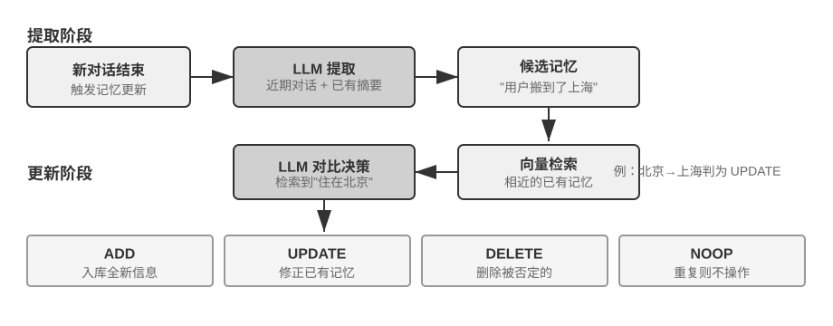

## 用户记忆系统

要构建真正具备个性化、连续性服务的 AI Agent，用户记忆（User Memory）系统是不可或缺的核心能力。记忆并非简单记录用户说过的每一句话。正如我们在与朋友相处时，不会记住每次对话的原始内容，而是通过持续交互，在脑海中逐渐形成一个关于对方的生动模型——他的爱好、习惯和价值观。这个模型让我们能够理解甚至预测他们的需求。

用户记忆系统的本质是一个主动的、持续的学习过程，其目标是构建一个关于用户的简洁而有效的预测模型。它投入额外的算力（通过专门的 LLM 调用来分析、总结和结构化信息），将分散在冗长对话历史中的关键信息进行显式提取和压缩。这与上下文学习形成对比——用户记忆是持久的、可审查的，上下文学习则是临时的、会话结束就消失。

用一个具体的例子来理解这个过程。假设用户和 Agent 有以下对话：

```
User: Help me book a flight to Tokyo next Friday. I prefer window seats
      and I'm vegetarian, so I'll need a special meal.
Agent: I'll search for flights to Tokyo for next Friday...
       [calls flight_search tool, returns 3 options]
Agent: Here are your options. Based on your preference, I've filtered for
       window seat availability. Shall I book the ANA direct flight?
User: Yes, and use my United MileagePlus number 12345678.
```

这段对话结束后，Agent 框架会调用一次专门的 LLM 来分析对话内容，提取出值得长期记住的信息：

```
Extracted memories:
- User prefers window seats (preference)
- User is vegetarian, needs special meals on flights (dietary restriction)
- User's United MileagePlus number: 12345678 (loyalty program)
- User has travel plans to Tokyo (recent activity)
```

注意这个提取过程的几个关键特征：**选择性**——Agent 不会记住“搜索返回了 3 个选项”这种临时信息，只保留对未来有用的事实；**抽象化**——“I prefer window seats”被提炼为一条通用偏好，而不是绑定到这次具体的航班；**结构化**——每条记忆被标记了类型（偏好、限制、账号），便于后续检索。下次用户订机票时，Agent 无需再问座位偏好和餐食需求——这些信息已经在记忆中了。

### 记忆能力的评估：三层次框架

在动手设计记忆系统之前，先要回答一个问题：什么样的记忆系统算“好”？先立起评估标准，后面讨论各种设计方案时才有统一的标尺。学术界已发布若干公开基准，其中 **LoCoMo**（Long-term Conversational Memory，长期对话记忆；Maharana 等人，2024，arXiv:2402.17753）是代表性的一项：它构造了平均约 300 轮、最多 35 个会话的超长多轮对话，通过问答（细分为单跳、多跳、时间推理、开放域和对抗性问题）、事件摘要和多模态对话生成三类任务，考察模型对长程对话的记忆与理解能力。

综合 LoCoMo 等各类记忆基准与商业记忆产品的实践，用户记忆能力可归纳为以下八项（这是笔者的归纳口径，而非某一基准的原始分类）：

- **个人信息保留**：记住用户身份等长期个人信息
- **偏好追踪**：跟踪并记住用户的长期偏好
- **上下文切换**：在多个话题之间切换时保持连贯
- **记忆更新**：当用户提供与旧信息矛盾的新信息时能正确处理
- **多会话连续性**：跨会话保持知识
- **复杂思考**：基于多个记忆片段联合思考，例如当用户对花生过敏时推荐泰国菜应主动提醒注意花生成分
- **时间感知**：记住日期、理解相对时间、进行时间计算
- **冲突解决**：识别并处理记忆之间的不一致

在此基础上，我们设计了更贴合 Agent 场景的三层次评估框架，将记忆能力分解为递进级别。这个框架将贯穿本章——后文的实验 3-10 和 3-12 都会用它来衡量检索技术对记忆能力的提升。

**第一层：基础回忆** —— 这是记忆系统最根本的能力，要求 Agent 能够准确存储和检索用户直接提供的、结构化的、无歧义的信息。如 “我的会员号是 12345”，在后续需要时精确返回。这一层级确保了记忆系统的基本可靠性，是后续更复杂能力的基础。

**第二层：多会话检索** —— 要求 Agent 在面对来自多个不同对象、不同时期的会话时，能检索出所有相关信息并推理判断。真实世界的交互往往不是一次性完成的，而是与不同客服渠道或在不同时间分别完成的。当用户有两辆车时询问 “为我的车预约保养”，系统需找出全部两辆车的信息并主动询问需要为哪辆服务，而不是随便猜一辆。询问贷款状态时需分辨正在履行的有效合同，忽略过去咨询但未生效的报价。取消 “洛杉矶之旅” 时需理解旅行是复合事件，主动关联所有相关预订（机票和酒店）。

**第三层：主动服务** —— 这是衡量 Agent 是否达到 “助理” 级别最高标准的试金石。要求系统综合跨越多个甚至很久以前的会话信息，提供具有预见性的主动帮助，从看似无关的记忆中发现深层联系。预订国际航班时主动关联数月前存储的护照信息，发现即将过期并发出预警。手机损坏时主动整合所有保障方案——手机自带保修、信用卡附加保修条款、运营商保险——为用户提供完整的解决方案选项列表。报税季主动从过去一年的记录中搜寻并整合所有税务文件（股票销售、自由职业收入、房产税），呈现完整待办清单。这种能力要求系统在没有明确指令的情况下，主动规避潜在问题和整合复杂信息。

> **实验 3-1 ★：用三层次框架评估记忆系统**
>
> 我们按照上述三层次框架构建了评估集：每层各 20 个测试用例，每个用例包含大量事实细节。第一层的用例通常由单个会话构成；第二、三层的用例则由多个跨时间、跨对象的会话构成（每个用例合计约 50 轮沟通）。评估过程中，要求被测 Agent 根据第一个会话生成记忆，然后根据记忆和下一个会话修改记忆（在仅能访问记忆、不可回看之前会话原始对话的前提下），直到该用例的所有会话处理完毕。记忆生成完毕后，要求 Agent 根据记忆回答一个新的用户问题。再使用 LLM-as-a-judge（即用另一个 LLM 来当评委，对回答质量进行评分）的方法对回答与参考答案进行对比，得到该测试用例的奖励得分。
>
> 该评估集与评估脚本收录在配套仓库的 `user-memory` 项目中（与后文实验 3-2 同一载体），读者可在其中查看每层测试用例的完整定义。

### 记忆的层次结构

有了评估标准，就可以进入具体设计。记忆系统的设计可以拆成三个独立的维度——**放哪里、怎么存、存什么**。本节先回答“放哪里”。

为了让 Agent 既能高效处理当前任务，又能跨会话提供个性化服务，记忆需要分成不同的层次——就像人有短期工作记忆和长期记忆的区分一样：

**轨迹（Trajectory）**是一次 Agent 运行过程中的完整历史记录——对应第一章定义的“动态轨迹”（用户消息 + 模型回复 + 工具执行结果，也称 trajectory）。轨迹记录从对话开始到当前时刻的所有事件，按时间顺序排列，只增不改——也就是说，新的事件不断追加到末尾，但已经写入的记录不会被修改或删除（这种模式在计算机领域称为 append-only）。轨迹为 Agent 决策提供即时上下文——“我刚才说了什么”“用户如何回应”“工具返回了什么结果”。

轨迹是单次会话的完整原始记录，按时间顺序追加且不修改；用户长期记忆则是**跨会话提炼出的稳定信息**，会被反复改写、合并、淘汰。前者是流水账，后者是档案。

**用户长期记忆**是跨会话、跨实例的持久化存储，通常以键值对形式与特定用户 ID 绑定。存储偏好设置、历史交互摘要、提取的知识点。Agent 通过特定工具调用显式读取和更新长期记忆，实现跨会话的个性化和连续性。

此外，一些 Agent 还支持**业务状态**——开发者定义的高层状态抽象，表示任务的逻辑阶段（如“需要澄清”、“处理请求中”、“等待付款”、“请求完成”）。这类状态抽象在事件驱动的 Agent 架构中尤为重要（第四章将讨论事件驱动架构的设计）。

本章聚焦于轨迹和用户长期记忆这两个核心层次。分层设计既保证 Agent 高效处理当前任务（依赖轨迹），又使其具备长期个性化能力（依赖长期记忆）。

### 用户记忆的四种存储格式

解决了“放哪里”和“怎么评估”，下一个问题是“怎么存”——同一条用户信息，可以用不同的粒度和结构来表示。下面四种渐进式的存储格式，代表了记忆粒度和结构复杂度的递进。


**Simple Notes** 体现极简主义设计，每条记忆是一个最小的、不可再分的事实（如 “用户邮箱：john@example.com”）。优势是极低开销，O(1) 操作（即耗时固定、不随数据量增长的操作）。但信息关联性完全丢失——“在 TechCorp 担任高级工程师，负责推荐系统开发”被分解为三个独立事实（“在 TechCorp 工作”、“职位是高级工程师”、“负责推荐系统”），同一份工作的内在联系被割裂。处理需要综合多条信息才能回答的查询时，系统需要用一些经验规则（如根据关键词重叠来猜测哪些事实可能相关）来重新拼凑碎片。

**Enhanced Notes** 采用整体论视角，将每条记忆保存为包含完整上下文的段落。例如同样的工作信息存储为：“用户在 TechCorp 担任高级软件工程师，专注于机器学习已有三年，目前领导一个推荐系统项目，团队 5 人。” 保留信息的叙事结构确保语义完整性和丰富性，特别适合需要细微理解的场景（如 “基于我的背景推荐新项目”，可推断技能水平、领导经验和技术偏好）。

但代价有三方面：存储冗余（相同信息在多个段落中重复）、更新复杂（属性变化需重写多个段落），以及较长段落不利于后续检索。最后一点的原理是：当系统需要把一段文字转化为计算机可搜索的形式时，段落越长，向量嵌入越难精确表达其核心含义，就像一本书的简介越长越难抓住重点（向量嵌入和检索的技术细节将在本章 RAG 部分详细介绍）。

**JSON Cards** 采用三层嵌套结构（类别→子类别→键值对，如 personal.contact.email、work.position.title），模拟人类分类认知模式。支持部分更新（修改 work.position.title 不影响 work.company.name），可预测且可扩展。但刚性结构假设信息可清晰分类——“周末用 Python 开发个人项目” 同时涉及时间偏好、技术偏好和活动类型，强制归入单一类别会丢失多维性。

**Advanced JSON Cards** 代表了记忆系统设计的范式转变——从信息存储到知识管理。每个卡片不仅记录事实，还加入信息来源的叙事背景（backstory）、主体身份（person）、与用户的关系（relationship）和时间戳。这背后的核心思想是：同一条信息在不同场景下可能有完全不同的含义——“张医生”可能是用户自己的牙科医生，也可能是用户父亲的心脏科医生，脱离了具体情境就无法正确理解。

这种设计解决了传统系统的消歧问题。在现实场景中，用户可能有多个医生（为自己、为父母、为子女），简单的键值存储无法准确区分。Advanced JSON Cards 通过 backstory 提供信息的获取上下文（“为什么” 存储这条信息），通过 person 和 relationship 建立清晰的实体模型（“为谁” 存储）。当用户说 “帮我安排家人的年度体检” 时，系统可通过 relationship 识别所有家庭成员，通过 backstory 了解健康历史。代价是生成和维护成本较高。

对比这四种模式，我们看到记忆系统设计中的根本张力：简单性与表达力之间的权衡。Simple Notes 选择了极致简单，牺牲语义完整性；Enhanced Notes 选择叙事完整性，牺牲结构化和可更新性；JSON Cards 选择了结构化，牺牲灵活性；Advanced JSON Cards 选择全面性，牺牲简单性。这种权衡没有绝对优劣，取决于具体应用场景。成熟的 AI Agent 系统可能需要混合使用多种模式——Simple Notes 快速记录临时信息，Advanced JSON Cards 处理需要精确消歧和长期维护的关键信息。

实践中的选择标准是：**关键且少量**的数据（如用户偏好、关键人物关系）用 Advanced JSON Cards 以保证可检索性；**大量且非关键**的对话事实用 Simple Notes 以降低成本；多数生产系统采用混合模式——同一 Agent 内不同类信息走不同路径。

> **实验 3-2 ★★：记忆策略的对比实验研究**
>
> `user-memory` 项目在统一接口下实现了上述四种记忆模式，每种模式各自提供记忆生成（分析会话、写入记忆）与记忆检索（根据当前问题取回相关记忆）的完整实现。运行时通过配置切换模式，即可在实验 3-1 的三层次评估集上逐一测试：观察同一组测试会话在不同存储格式下提取出的记忆形态，以及最终回答的得分差异。
>
> 实验观察与前文的分析一致：Simple Notes 以最低的生成成本通过第一层“基础回忆”的多数用例，但在需要综合多条信息、区分同名实体的第二、三层用例上频繁失分；Advanced JSON Cards 在涉及消歧和跨会话关联的用例上表现最好，代价是每次会话结束后的记忆维护调用明显更贵、更慢。建议读者在项目中亲手切换四种模式，对比同一个测试用例生成的记忆文件——四种格式的差异在具体例子面前一目了然。

### 进阶表示：从可执行代码到参数化记忆

前面四种格式无论简单还是复杂，本质上都是**文本**——于是记忆的“存”和“用”始终是分开的两步：先把相关文本捞回来，再交给容易出错的 LLM 去读、去算。文本记忆擅长召回单条事实，却难以在众多记录上做聚合统计、发现相互矛盾的事实、或强制执行逻辑规则，因为这些操作都要靠 LLM“心算”。User as Code[^uac] 提出的解法是把表示的介质从文本换成**可执行代码**：让 Agent 对用户的模型本身就是一个**活的软件工程**——用带类型的 Python 对象保存用户状态，用普通 Python 函数编码约束规则，使得“表示用户”和“推理用户”发生在同一个可被解释器运行的介质里。

它把记忆的更新拆成两阶段[^uac]：**记忆阶段**（每次会话后，LLM 把对话中的事实逐条抽成字符串，追加到一个只增不删的事实日志里）与**结构化阶段**（周期性地，LLM 从完整的事实日志重新生成整份带类型的 Python——把事实组织进 dataclass，日期用 `date()`、集合用带类型的列表、难以类型化的杂项进 `notes: list[str]`）。这正是数据库里“预写日志 + 周期性检查点”的经典设计第一次被用到 LLM 记忆上：只增日志保证不丢失任何事实，周期检查点则把它压缩成整洁、可查询的结构。（这个周期性重构过程与本章后文“记忆压缩与整理机制”一脉相承，只是产物是代码而非文本。）

下面是一个简化的例子。结构化阶段把用户的护照和行程存成带类型的状态：

```python
from datetime import date

passport = PassportInfo(
    number="AB1234567", country="US",
    expiry_date=date(2025, 2, 18),
)
trips = [
    Trip(destination="Tokyo", departure_date=date(2025, 1, 15),
         is_international=True),
    # ... 其余行程
]
```

有了带类型的状态，此前只能靠 LLM“读一遍文本再心算”的三件事，现在都变成了确定性的代码：

其一，**聚合统计**。“我去年出了几次国？”——在文本记忆里要把所有行程召回再逐条数，记录一多就出错（论文实测，检索式记忆在这类聚合问题上正确率只有 6%–43%）；而在 User as Code 里就是一行表达式，正确率接近 99%[^uac]：

```python
>>> sum(1 for t in trips if t.is_international and t.departure_date.year == 2025)
2
```

其二，**冲突发现**。把“当前用药”和“过敏史”两份状态放在一起，一个函数就能按药物类别交叉比对，揪出散落在不同对话里、文本形式下几乎不可能自动关联的矛盾：

```python
def check_drug_allergy(profile):
    for med in profile.current_medications:
        for allergy in profile.allergies:
            if med.drug_class == allergy.drug_class:
                yield (f"用药冲突：{med.name} 属于 {med.drug_class} 类，"
                       f"而患者对 {allergy.allergen} 严重过敏")
```

其三，**约束执行**。Agent 可以把这样的检查函数固化下来，在状态每次更新时自动触发——不需要用户开口、也不需要检索，就能主动提醒。比如一条护照有效期约束：出国行程的出发日距护照到期不足 180 天就报警。

```python
def check():
    for trip in trips:
        if trip.is_international:
            days = (passport.expiry_date - trip.departure_date).days
            if days < 180:
                yield (f"护照 {passport.expiry_date} 到期，距 {trip.destination} "
                       f"行程仅剩 {days} 天，请尽快续办")
```

同一份护照到期日，既被“存下”，也能被“算出距行程还剩几天”——由确定性的解释器而非 LLM 完成算术，Agent 于是能在你开口之前就提醒“护照快过期了”。聚合、查冲突、强约束这三点，正是纯文本记忆最吃力、而代码形态最擅长的地方；代价是需要一套代码生成与执行的工程支撑，且对结构化程度不高的杂项事实并无优势——所以 `notes` 字段依然为文本保留了一席之地。

User as Code 把记忆从文本推进到了可执行代码，但它和前面的文本格式一样，仍然是**模型之外**的外部存储——用的时候要先检索、再让模型在上下文里推理。沿着“表示介质”这条线继续向内，用户记忆还能直接写进**模型自身的参数**，这就引出后两种更前沿的形态。

**写进局部参数：User as Engram。** 一个自然的念头，是干脆把用户事实写进模型权重——比如为每个用户训练一个专属的 LoRA。但这条路会遇到一个耐人寻味的障碍：这样训练出的 fact-LoRA，直接提问时几乎能完美复述，可一旦需要在这些事实之上做**间接推理**便告失灵——因为冻结的骨干模型从未学过如何去“查阅”这样一个临时挂载上来的适配器。换句话说，**把事实存进去是一回事，让模型知道何时该取用它，则是另一回事**。User as Engram[^engram] 针对的正是这一点：它并不训练 LoRA，而是把一条用户事实精准地写入 Engram 模型中一个空闲的**哈希 N-gram 槽位**。这类模型在预训练阶段便已学会通过哈希查表来调取记忆，并由一个能感知上下文的门控机制决定何时调取；于是新写入的事实会自然而然地在该被想起的时候被想起，从而绕开了“存了却不会用”的困境。不同用户的事实落在互不相交的槽位上，彼此叠加而互不干扰（正如多个 Stable Diffusion 的 LoRA 可以即插即用地叠加使用），既不会相互串扰，也不触动骨干模型本身。

**多模态：存下无法言说的感知。** 到目前为止，存下的都还是可以写成离散符号的事实。但关于用户的记忆，还有**感知性**的另一半——一张脸的模样、一段嗓音今天比上周更显疲惫、一位画家不同时期的笔触——这些都经不起“转写成文字”：当你写下“一个棕发男人”时，恰恰丢掉了用以区分两个棕发男人的那点细微信号。Parametric Multimodal User Memory[^mmm] 的思路，是让感知**以感知的形态**被保存下来：为冻结的模型外挂一个小小的记忆库，每一个要记住的身份对应其中一行——键是由现成编码器（人脸用 ArcFace、画风用 CLIP）算出的感知向量，值则是模型自身某个标记词（如 `<id_11>`）的嵌入。生成时，当前感知作为查询，在这个记忆库上做注意力计算，将输出轻轻引向匹配的标记，整个过程不经由任何文字。注册一个新身份，只需往库里添上一行，无需训练。最耐人寻味的是，如此保存下来的感知，在效果上不仅追平、反而**超过**了直接的向量检索——因为它是在语言模型自身的表示空间里比对感知，这把“尺子”往往比编码器原生的相似度更为锐利，恰好补强了编码器最模糊、最容易认错的那一环。

至此我们看到，从纯文本、到可执行代码、再到局部参数乃至连续感知，是用户记忆的表示由“外”及“内”的一条连续谱：外侧易更新、可审查、可迁移，内侧则更紧凑、更擅长即时推理，也能承载文字无法转写的感知。后两条把记忆内化进模型的路径分别牵涉第七章的参数微调与第九章的多模态，此处只作预告。

[^uac]: 把用户记忆建成可执行代码工程的完整设计与评测见 Li, Bojie. *User as Code: Executable Memory for Personalized Agents.* arXiv:2606.16707, 2026.
[^engram]: 不训练每用户 LoRA，而是把用户事实外科手术式地插入 Engram 预训练模型的哈希 N-gram 槽位、无需梯度更新，设计与评测见 Li, Bojie. *User as Engram: Internalizing Per-User Memory as Local Parametric Edits.* arXiv:2606.19172, 2026.
[^mmm]: 给冻结模型挂连续注意力记忆以承载“说不清楚的感知”，见 Li, Bojie. *Parametric Multimodal User Memory: Storing What Captions Cannot Carry.* 2026（待发表）.

### 用户记忆的认知科学基础

我们已经看到了四种具体的记忆策略，现在用认知科学的框架来补充另一个维度的理解——记忆内容的类型。

从认知科学的视角看，人类记忆系统的复杂性为 AI 记忆设计提供了重要启示。认知科学把记忆划分为**工作记忆（Working Memory）**和长期记忆。工作记忆对应 Agent 的上下文窗口——用于处理当前任务的临时信息空间（轨迹就是工作记忆中最核心的内容，但工作记忆还可能包含从长期记忆中激活加载的信息）。长期记忆则细分为三种类型，每种都能在 Agent 记忆中找到直接对应：

- **情景记忆**（Episodic Memory）：关于具体事件和经历的记忆。人类例子：“上周三和同事在那家意大利餐厅吃了一顿很棒的晚餐”。Agent 对应：前面订机票例子中的“用户订了下周五去东京的 ANA 航班”——记录了一个具体事件的时间、对象和细节。
- **语义记忆**（Semantic Memory）：从具体事件中抽象出的一般性知识。人类例子：“意大利的首都是罗马”。Agent 对应：“用户是素食者”、“用户偏好靠窗座位”——这些不是某次对话的记录，而是从多次交互中提炼出的稳定特征。
- **程序记忆**（Procedural Memory）：关于行为模式和流程的记忆。人类例子：骑自行车的能力。Agent 对应：从用户反复订机票的模式中学到的通用流程——“先搜索直飞航班→确认座位偏好→使用常旅客号码→订餐”。

回顾本节之前的内容，我们实际上引入了三套分类体系。为了避免混淆，表3-1 将它们的关系一次性厘清：

表3-1 记忆设计的三套分类体系

| 分类体系 | 回答的问题 | 具体类别 |
|--------------------------------|-----------|----------------------------------------------------|
| 记忆层次（本章开头） | **存在哪里？** | 轨迹（当前会话）、用户长期记忆（跨会话）、业务状态（任务阶段） |
| 存储格式（“四种存储格式”一节） | **怎么存？** | Simple Notes、Enhanced Notes、JSON Cards、Advanced JSON Cards |
| 认知类型（本节） | **存什么？** | 情景记忆（具体事件）、语义记忆（一般知识）、程序记忆（行为流程） |

三套体系是正交的维度——可以自由组合。例如，一条“用户偏好靠窗座位”的语义记忆，可以用 Simple Notes 格式存储在用户长期记忆中；一段“先搜直飞→确认座位→用常旅客号”的程序记忆，可以用 Advanced JSON Cards 格式存储。选择哪种格式取决于工程需求（简单性 vs 表达力），选择存什么类型取决于业务场景（需要记住事实、事件还是流程）。

### 记忆框架案例

前面讨论的存储格式和记忆类型，最终都要落到工程实现。开源社区已经出现多个专门的记忆管理框架，这里以 Mem0 和 Memobase 为例，看看两种不同的设计理念如何取舍。

**Mem0：提取—对比—决策的两阶段流水线。** Mem0（Chhikara 等人，2025，arXiv:2504.19413）的核心是一条“提取—对比—决策”的记忆流水线，分两个阶段运转（图3-3）。





**提取阶段**：每当一段新对话结束，Mem0 调用 LLM，结合最近的对话内容与已有记忆的摘要，从中提取出一组候选记忆——简洁的事实陈述，如“用户搬到了上海”。**更新阶段**：对每条候选记忆，系统先通过向量检索找出语义相近的已有记忆，再由 LLM 对比两者的关系，做出四种决策之一——**ADD**（全新信息，直接入库）、**UPDATE**（补充或修正已有记忆）、**DELETE**（新信息否定了旧记忆，删除后者）、**NOOP**（信息重复，不做任何操作）。例如，当用户说“我搬到了上海”时，Mem0 会检索到已有记忆“用户住在北京”，判断这是一条 UPDATE：将旧记忆更新为“用户住在上海”，而不是同时保留两条矛盾的记录。这条流水线把本章开头描述的“选择性提取”和后文将讨论的“冲突解决”统一在同一个机制里——记忆库中的每一条记录都经过了与既有记忆的显式对账。

工程上，Mem0 通过高度模块化的架构适应不同应用需求：嵌入（文本转向量）和存储（向量的持久化与检索）相互分离，两者可以独立优化和替换；通过抽象接口支持多种后端，插件机制使系统能灵活集成新的语言模型、嵌入模型或存储后端。在基础版之上，Mem0 还提供了图记忆变体 **Mem0-g**：将记忆表示为实体—关系图，而非相互独立的事实条目，从而显式捕捉记忆之间的关联结构，改善多跳、时序类问题的表现（图结构的知识表示将在本章后文 GraphRAG 一节详细讨论）。

**Memobase：用户画像加事件记忆。** Memobase（开源项目 memodb-io/memobase）的设计理念与 Mem0 不同：与其做通用的记忆流水线，不如聚焦“用户画像”这一具体形态。它把用户记忆组织为两部分。**用户画像（Profile）**是一组可由开发者配置的槽位，按主题—子主题两级组织（如 basic_info→姓名、interest→游戏偏好、work→职位），存放从对话中提取的稳定用户属性，开发者可以精确控制画像的范围和粒度。**事件记忆（Event Memory）**则按时间线记录用户经历的事件，用于回答“我们上次讨论预算是什么时候”这类与时间有关的问题。工程上，Memobase 采用缓冲批处理策略：对话先在缓冲区累积，达到一定规模或时限后再统一触发一次记忆提取，以摊薄 LLM 调用成本，同时让查询侧只需读取已整理好的画像和事件，保证低延迟。

两个框架各自只覆盖了记忆设计空间的一部分：Mem0 的事实条目接近语义记忆，Memobase 的画像近似语义记忆、事件记忆近似情景记忆。把视野放宽，可以按前面认知科学的分类设想一种**多类型记忆协同的参考架构**（图3-4）——需要强调，这是对设计空间的概括，而非某个具体项目的实现：


- **情景 / 语义 / 程序记忆**沿用前文认知科学的三类定义，此处不再重复其人类与 Agent 的对应例子；参考架构在此之上真正新增的着眼点，是情景记忆的**多维元数据检索**——它存储带有丰富元数据（时间戳、情感标记、任务标识）的事件序列，可按时间、主题等多个维度组合检索（如“我们上次讨论预算是什么时候”）。
- **工作记忆**（Working Memory）：除三类长期记忆外，参考架构还显式保留了工作记忆一层（前文已引入其概念），管理当前任务状态，与长期记忆动态交互——重要信息选择性转移到长期记忆，相关长期记忆被激活加载到工作记忆。

需要特别说明工作记忆与前面“记忆的层次结构”中“轨迹”的关系：两者都为当前决策提供即时上下文，但轨迹是**不可变**的完整事件序列（按时间追加），而工作记忆是经过筛选和激活的**动态子集**（按相关性裁剪）。

这种参考架构展示了认知科学的记忆分类如何落地为工程组件。实际框架往往只实现其中一两种类型——按业务需要取舍，比追求“大而全”更符合工程现实。

### 记忆压缩与整理机制

随着交互的持续进行，记忆系统面临存储空间和检索效率的双重挑战。简单的累积式存储会导致记忆爆炸，不仅消耗存储空间，还降低检索准确性。

实践中可以采用多层次的记忆压缩策略。第一层通过重要性评分筛选。一种常见的重要性评分思路是综合四个因素：访问频率（经常被检索的记忆更重要）、时间衰减（越久远的记忆越容易被遗忘）、情感强度（带有强烈情感标记的记忆更易保留）和信息独特性（重复信息的重要性降低）。低于阈值的记忆标记为可压缩或可删除。例如，一条被访问 5 次、创建于 3 天前、带有强情感标记、且无重复记录的记忆会获得较高的重要性得分；而一条仅被访问 1 次、创建于 90 天前、无情感标记、且与其他 3 条记忆高度重复的记忆则可能低于压缩阈值。

第二层通过聚类实现。相似记忆被分组，每组生成代表性摘要（如多次天气对话压缩为 “用户经常询问天气，特别关心降雨”）。原始详细记忆可存档到二级存储。

第三层是抽象和泛化——从具体情景记忆中提取一般性规律，转化为语义或程序记忆。例如从多次购物对话中学习到 “偏好性价比高的产品，重视用户评价”。

冲突检测采用版本化方法——保留历史版本同时标记最新版本。对于某些信息（如当前地址）只保留最新版本，其他信息（如工作经历）保留完整历史。

最后需要划清一个边界，以免与全书其他章节混淆：本节讨论的是记忆**存储层**的整理算法——哪些记忆该筛选、聚类、抽象成什么形态；第二章的上下文压缩解决的是单次会话内的窗口问题，两者作用的层次不同；而这些整理算法在生产系统中如何被触发——周期性、异步的离线记忆整合的触发机制与工程实现——将在第八章展开。

### 隐私保护：日志脱敏

在构建用户记忆系统时，核心挑战是让 Agent 既能利用用户信息提供个性化服务，又不让敏感数据暴露在 LLM 上下文和系统日志中。

> **实验 3-3 ★★：基于本地模型的智能日志脱敏**
>
> `log-sanitization` 项目通过 Ollama 调用本地 Qwen3 0.6B 小模型（可在 CPU、消费级设备上运行，也可按需切换到 qwen3:1.7b、qwen3:4b 等更大规格）实现 PII 检测与脱敏。选择本地部署而非云端 API 的原因很明确：日志本身可能包含敏感信息，发送到云端脱敏就违背了隐私保护初衷。
>
> 系统能识别结构化信息（身份证号、银行卡号）、半结构化信息（地址）和自然语言表达的敏感内容（如“我的密码是 abc123”）。识别结果通过 JSON Schema 结构化输出，包含敏感信息类型、位置和置信度。相比传统正则表达式，基于 LLM 的脱敏召回率达 95% 以上，同时显著降低了假阳性。对于超高吞吐量场景可采用混合策略：正则快速过滤明显模式，LLM 深度分析剩余文本。

前面我们关注的是记忆的**表示和管理**——用什么格式存、如何更新和压缩。接下来要解决的是记忆的**检索**问题——当记忆量增长到成千上万条时，如何快速找到相关的那几条？这正是 RAG 技术要解决的核心问题，它既服务于共享知识库，也将在本章末增强用户记忆的检索能力。
