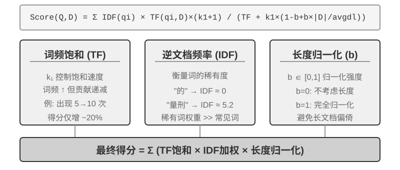

## RAG 基础：构建 Agent 的知识获取管道

构建共享知识库的核心技术是检索增强生成（Retrieval-Augmented Generation, RAG）。其核心思想是将大型语言模型的思考和生成能力，与外部知识库的广度和时效性相结合——模型本身的训练数据有截止日期，而知识库可以随时更新。

典型的 RAG 系统由两部分构成：检索器负责从知识库里找出相关片段，生成器（通常是 LLM）拿到这些片段作为上下文来生成答案。先通过两个例子直观感受 RAG 的工作方式，再深入检索器的技术细节。

**例 1：维基百科知识库**。用户问“量子纠缠是什么？”，基座模型的训练数据可能不包含最新的实验进展。RAG 的流程如下：

```python
# 1. 用户提问
query = "量子纠缠是什么？最新的实验进展有哪些？"

# 2. 检索：从维基百科知识库中找到最相关的片段
results = retriever.search(query, top_k=3)
# results = [
# "量子纠缠是一种量子力学现象，两个粒子的量子态相互关联...",
# "2022年诺贝尔物理学奖授予量子纠缠实验验证的三位科学家...",
# "贝尔不等式实验证明了量子纠缠的非局域性..."
# ]

# 3. 生成：将检索结果作为上下文，让 LLM 生成答案
answer = llm.generate(
    system="根据以下参考资料回答用户问题。如果资料不足，明确说明。",
    context=results,   # ← 检索到的知识片段注入上下文
    question=query
)
```

**例 2：公司知识库**。用户问“我买的东西想退款，流程是什么？”：

```python
query = "退款流程"
results = retriever.search(query, top_k=2)
# results = [
# "退款政策：订单签收后7天内可申请全额退款，需提供订单号。退款将在3-5个工作日内...",
# "退款操作步骤：1.进入'我的订单' 2.选择需退款的订单 3.点击'申请退款'..."
# ]
answer = llm.generate(system="你是客服助手。", context=results, question=query)
# → "您可以在签收后7天内申请全额退款。操作步骤：进入'我的订单'→选择订单→点击'申请退款'..."
```

两个例子的模式完全一致：**检索相关片段 → 注入上下文 → LLM 基于上下文生成答案**。RAG 的核心价值在于让 LLM 能利用它训练时没见过的知识（维基百科的最新内容、公司的内部文档），而不需要重新训练模型。

检索器的质量直接决定了 RAG 的效果——如果检索不到相关片段，LLM 再强也无米之炊。本节先看文档进入知识库的第一道工序——分块，再重点看检索器的两大技术路线：稠密嵌入（基于语义理解）和稀疏嵌入（基于关键词匹配），以及如何把二者结合起来。


### 文档分块（Chunking）

图3-5 展示的是 RAG 在查询时的核心流程：检索、增强、生成。但在能够检索之前，还有一步不可或缺的离线预处理——**分块（Chunking）**：把长文档切成适合独立检索的片段（chunk）。分块之所以必要，原因有二。其一，嵌入模型对输入长度有限制，且一整篇文档只压缩成一个向量时，多个主题混在一起，向量无法精确表达任何一个——这与前面 Enhanced Notes 遇到的问题同源：段落越长，嵌入越难抓住重点。其二，检索的目标是只把**相关的那部分**注入上下文，片段太大会连带大量无关内容，浪费窗口、稀释注意力。

常见的分块策略有三类：

**固定大小切分**：最简单的方法，按固定的 token 数（如 512）切分，通常在相邻块之间保留一定重叠（如 50-100 token），避免关键句子恰好在边界处被切断。实现简单、结果可预测，但完全无视文档结构——一个段落、一段代码、一张表格都可能被拦腰截断。

**递归/结构感知切分**：按文档的自然边界（章节标题、段落、句子）递归切分——先尝试按大边界切，块仍超长时再降级到更小的边界。Markdown、HTML 这类有显式结构的文档尤其适合。这是目前生产系统最常用的默认选择。

**语义切分**：计算相邻句子的嵌入相似度，在语义“断崖”处（相似度骤降的位置）下刀，使每个块内部主题尽量单一。切分质量更高，代价是需要额外的嵌入计算。

块大小与重叠量的选择是一对典型权衡：块太小，单块信息不完整，脱离上下文后语义模糊（“该公司收入增长了 3%”——哪家公司？哪个季度？）；块太大，一个块混杂多个主题，嵌入向量被稀释，检索精度下降，命中后还会带入更多无关内容。实践中常见的起点是每块 256-1024 token、相邻块重叠 10%-20%，再根据检索质量实测调优。

还要预告一个本章后文的伏笔：无论采用哪种策略，分块都会切断片段与其原始上下文的联系——“该公司”指代谁、这段话出自哪份报告，这些信息留在了块的外面。这是分块的固有缺陷，后文“上下文感知检索”一节将正面解决它。

### 稠密嵌入：从词汇关联到语义理解

**什么是嵌入（Embedding）？** 计算机只能处理数字，不能直接理解“苹果”和“橙子”的含义。嵌入的思路是：把每个词或句子转化成一串数字（称为“向量”，比如 [0.2, -0.5, 0.8, ...]），并且让语义相近的内容转化出来的数字串也“相近”。这些向量所在的数学空间称为“向量空间”，可以把它想象成一张高维地图，每个词或句子都是其中一个点，语义越接近的内容彼此就越靠近，如同北京和上海在地图上的位置反映它们的地理相关性。经典例子是：` “国王” - “男性” + “女性” ≈ “女王” `，说明向量运算可以捕捉到语义关系。“稠密”是相对于后面将介绍的“稀疏嵌入”而言：稠密向量的每个维度都有数值，稀疏向量大部分维度为零。

稠密嵌入用深度学习把文本映射到向量空间——语义相近的内容，向量距离也近。衡量两个向量有多“近”的常用方法是**余弦相似度**：它计算两个向量夹角的余弦值，值越接近 1 表示方向越一致、语义越相似。早期方案（Word2Vec）只能捕捉词汇共现关系；上下文感知模型（BERT、BGE-M3）能理解上下文，同一个词在不同语境下会有不同的向量表示（需说明：BGE-M3 实际同时输出稠密、稀疏、多向量三种表示，这里仅用它的稠密输出作为例子）。

为什么用夹角而不是距离？因为我们关心的是两个向量的**方向**是否一致（语义是否相近），而不是它们的**长度**（文本的长度或频率）。两篇内容相同但长度不同的文档，向量长度不同但方向一致，余弦相似度能正确判断它们语义相同。

直觉上可以这样理解：两段语义相近的文本，对应的向量“夹角越小越相似”——养猫相关的两个表达在向量空间中几乎重合（余弦值接近 1），而养猫和股票投资则方向迥异（余弦值接近 0）。实际的嵌入模型使用 768 维甚至更高维度的向量，但判断“是否相似”的原理完全相同。

> **补充说明（可选的手算示例，跳过不影响后续阅读）**：假设在一个简化的 3 维向量空间中，三个句子的嵌入向量为 “如何养猫” → A = (0.9, 0.5, 0.1)、“猫咪饲养指南” → B = (0.8, 0.6, 0.1)、“股票投资策略” → C = (0.1, 0.1, 0.9)。余弦相似度的计算公式为 cos(θ) = (A·B) / (|A| × |B|)，其中 A·B 是点积（对应维度相乘再求和），|A| 是向量的模（各维度平方和的平方根）。
>
> A 与 B 的相似度：点积 = 0.9×0.8 + 0.5×0.6 + 0.1×0.1 = 1.03，|A| ≈ 1.03，|B| ≈ 1.00，cos(θ) ≈ **0.99**（非常相似）。A 与 C 的相似度：点积 = 0.9×0.1 + 0.5×0.1 + 0.1×0.9 = 0.23，|C| ≈ 0.91，cos(θ) ≈ **0.25**（差异很大）。0.99 vs 0.25 清晰地反映了语义距离。


#### 从 Word2Vec 到上下文感知

在稠密嵌入的早期，以 `Word2Vec` 为代表的技术通过分析海量文本中词汇的共现关系，为每个词生成一个固定向量。这种向量能捕捉有趣的语言规律，比如向量运算 “king” - “man” + “woman” ≈ “queen”（前面嵌入概念介绍中提过的“国王-男性+女性≈女王”就来自这一发现），证明词向量空间能以线性可计算的方式编码复杂语义关系。

然而，静态词向量存在根本局限：无法处理一词多义。“bank” 在 “river bank”（河岸）和 “investment bank”（投资银行）中含义截然不同，但 `Word2Vec` 赋予完全相同的向量。现代嵌入模型（如 BERT、BGE-M3）能在生成一个词的向量时充分考虑其所在的整个句子甚至段落的上下文。这得益于自注意力（Self-Attention）机制——模型在计算每个词的向量时，会同时参考句子中所有其他词的信息。因此，同一个词“苹果”在“苹果公司发布新产品”和“买了两斤苹果”中会得到不同的向量表示。这意味着同一个词在不同语境下会拥有不同的、更精确的向量表示，实现了从“词汇级”到“语境级”语义的飞跃；此外，BGE-M3 等新一代模型还进一步支持多语言与长文本输入（BERT 这类较早的上下文模型的输入长度上限仅为 512 个 token，并不适合长文本）。

> **实验 3-4 ★★：构建向量检索服务：ANN 索引算法的比较研究**
>
> `dense-embedding` 项目的重点不在于实现本身，而在于对比：它提供了 ANNOY 和 HNSW 两种可切换的后端，让你直接观察两类主流 ANN（Approximate Nearest Neighbor，近似最近邻）算法在实践中的区别。所谓 ANN，是指在海量向量中快速找到与查询向量最接近的那些向量的算法——当知识库有上百万条文档时，逐一计算相似度太慢，ANN 通过巧妙的索引结构实现近似但极快的查找。
>
>
> 
>
>
> 两种算法各有优劣，表3-2 从构建速度、内存占用、增量更新、查询精度和适用场景五个维度进行对比：
>
> 表3-2 ANNOY 与 HNSW 索引算法对比
>
> | 特性 | ANNOY（基于树） | HNSW（基于图） |
> |------|---------------|---------------|
> | 构建速度 | 快 | 较慢 |
> | 内存占用 | 低 | 较高 |
> | 增量更新 | 不支持（需完全重建） | 支持（但长期增量插入后建议定期重建以保持查询精度） |
> | 查询精度 | 较高 | 极高 |
> | 适用场景 | 数据不常变的静态数据集 | 需要实时索引新信息的动态场景 |
>
> 选择合适的索引策略与选择嵌入模型同等重要，它直接决定了系统的性能、成本和可维护性。

### 稀疏嵌入：精确匹配的关键词检索

与捕捉语义相似性的稠密嵌入不同，稀疏嵌入（Sparse Embedding）根植于传统信息检索，核心是精确的关键词匹配。它将文档表示为极高维度的向量，绝大多数维度为零，只有与文档中出现的词汇对应的维度具有非零值。理论基石是经典的词袋模型（Bag of Words, BoW）——它把一段文本看作一个“装满词的袋子”，只关心哪些词出现了、出现了几次，完全忽略词序。例如“猫追狗”和“狗追猫”在词袋模型中是完全相同的。在此基础上，逐步演进出更复杂的概率排序算法。





#### 从 TF-IDF 到 BM25

先用一个具体例子建立直觉。假设知识库有 100 篇技术文章，用户搜索“模型蒸馏”。“模型”这个词在 60 篇文章中都出现了（太常见，区分度低），而“蒸馏”只在 3 篇文章中出现（很稀有，区分度高）。一个好的检索算法应该给“蒸馏”这个词更高的权重——包含“蒸馏”的文章更可能是用户真正想找的。这就是 TF-IDF 和 BM25 的核心思想。

TF-IDF 基于一个简单的直觉：一个词在文档中出现的频率（TF，词频，Term Frequency）越高、在整个文档集合中出现的频率（IDF，逆文档频率，Inverse Document Frequency）越低，这个词就越重要。在上面的例子中，“模型”出现在 60% 的文档中，IDF 值低；“蒸馏”只出现在 3% 的文档中，IDF 值高——所以“蒸馏”对排序的贡献远大于“模型”。然而 TF-IDF 没有考虑文档长度（长文档天然具有更高词频），且词频增长是线性的（一个词出现 10 次的重要性真的是 5 次的 2 倍吗？）。BM25 引入两个关键参数来修正这些问题。`k1` 控制词频“饱和度”：直觉上说，一篇文章提到“蒸馏” 20 次和 10 次，它与“蒸馏”的相关程度并不真的差一倍。`k1` 让词频的贡献随着增加而逐渐趋于平缓，避免长文档因词频堆砌而不公平地占优；`b` 则控制文档长度归一化，使算法能更公平地处理不同长度的文档。这使 BM25 成为更加鲁棒有效的排序函数，至今仍是各大搜索引擎中不可或缺的核心组件。

> **实验 3-5 ★★：探究稀疏检索：从零实现 BM25 搜索引擎**
>
> 为了揭示稀疏检索的内部工作机制，`sparse-embedding` 项目以教育性方式从零实现了基于 BM25 算法的稀疏向量搜索引擎。项目的核心价值不在于性能的极致优化，而在于过程的完全透明化。通过丰富的日志和可视化接口，我们可以清晰观察文档索引的全过程：文本预处理（分词，并去除“的”“了”这类几乎不携带检索价值的停用词）、构建倒排索引、计算 TF 和 IDF 值。所谓倒排索引（Inverted Index），就是一个从词到文档的反向映射表——普通索引是“给定文档，列出它包含的词”，倒排索引则反过来，“给定一个词，立刻找到所有包含它的文档”。好比一本书后面的术语索引页：你查“TCP”，它告诉你第 45、112、203 页提到了这个词。
>
> 查询时日志详细展示 BM25 的每步计算。仍以查询“模型蒸馏”为例——以下是在项目自带的一个小型示例语料（共 N=10 篇文档）上的运行日志，因此命中篇数比前文 100 篇文章的示意场景少得多。为便于读者手算复现，示例固定 BM25 参数 k1=1.5、b=0.75，平均文档长度 avgdl=250 词；IDF 采用标准形式 IDF=ln((N−df+0.5)/(df+0.5))，df 为包含该词的文档数：
>
> ```
> 查询分词: ["模型", "蒸馏"]
>
> 词 "模型" → 倒排索引命中 3 篇文档 (df=3, IDF=ln((10−3+0.5)/(3+0.5))=0.76):
>   doc_1: TF=5, 文档长度=200词, BM25贡献=1.52
>   doc_3: TF=2, 文档长度=500词, BM25贡献=0.82
>   doc_7: TF=8, 文档长度=150词, BM25贡献=1.68
>
> 词 "蒸馏" → 倒排索引命中 2 篇文档 (df=2, IDF=ln((10−2+0.5)/(2+0.5))=1.22, 比"模型"更稀有):
>   doc_1: TF=3, 文档长度=200词, BM25贡献=2.15    ← "蒸馏"更稀有,单次出现的贡献更大
>   doc_5: TF=1, 文档长度=250词, BM25贡献=1.22
>
> 最终排序: doc_1 (3.67) > doc_7 (1.68) > doc_5 (1.22) > doc_3 (0.82)
> ```
>
> 可以看到，在 doc_1 中“蒸馏”的词频（TF=3）低于“模型”（TF=5），但因为 IDF 值更高（在文档集合中更稀有），它对 doc_1 得分的贡献（2.15）反而超过“模型”（1.52）——这正是 BM25 的核心逻辑。doc_1 同时命中两个查询词、总分 3.67 遥遥领先，也印证了多词命中对排序的叠加效应。
>
> 实验深刻揭示了稀疏检索的优劣：它凭精确的关键词匹配在技术代码、人名等查询上表现极佳，却读不懂同义表达（查一个词，只能匹配到字面相同的文档）。这一长一短的对照，为下一节引入混合检索提供了坚实的实践基础——具体的对比例子留到那里展开。

**学习型稀疏检索。** 本章以经典的 BM25 作为稀疏检索的代表，因为它无需训练、透明可复算，最适合讲清稀疏检索的原理。但需要指出，稀疏检索本身已经进入“学习型”阶段：以 SPLADE 为代表的一类模型，以及 BGE-M3 的稀疏输出分支，用神经网络为每个词项打权重——不再是 BM25 那样只按词频和文档频率算分，而是让模型判断“这个词在这段文本里到底有多重要”，甚至为原文没出现、但语义相关的词项补上非零权重（术语扩展）。这样得到的仍是一个大部分维度为零的稀疏向量，既保留了词法层面的可解释性和精确匹配能力，又借神经网络获得了一定的语义泛化。可以把它看作稀疏与稠密两条路线的一次中间地带的融合。

### 混合检索：两全其美的艺术

两种方法各有盲区：稠密检索懂语义但可能漏掉关键词（搜“HTTP-403”可能返回“服务器错误”的泛泛讨论），稀疏检索精确匹配但读不懂同义词（搜“kitty”找不到只写了“cat”的文档）。混合检索的思路很简单——两个引擎都跑，结果合并——难点在于如何把分布迥异的两组得分整合成一个有意义的排序。


典型的混合检索流水线包含三个阶段，三者各司其职、层层递进。第一阶段是**并行检索**，系统同时向稠密和稀疏两个引擎发送查询，各自召回一部分候选文档。第二阶段是**结果融合**，负责把两路结果合成一个统一的候选池。难点在于两路得分不可直接比较：稠密检索的相似度得分（如余弦相似度，理论范围 −1 到 1，归一化文本嵌入实践中通常落在 0 到 1）和稀疏检索的 BM25 得分（可能是 0 到几十的任意值），尺度和分布完全不同。常用的融合方法有两种：一是把各路得分分别归一化后加权求和；二是倒数排名融合（Reciprocal Rank Fusion, RRF）——完全抛开原始得分、只看排名，每个文档的综合得分是它在各路结果中排名的平滑倒数之和，即得分 = Σ 1/(k + rank)，其中 k 是平滑常数（常取 60），用于压低排名最靠前几个位置之间的得分差距。RRF 简单鲁棒，但只利用了排名信息，丢失了原始得分中蕴含的丰富相关性信号（若改用加权归一化融合则保留了得分，代价是两路尺度对齐本身不好调）。不过要强调的是，流水线的第三个阶段——**神经重排序（Neural Reranking）**——并不是为了“补救 RRF 丢掉的得分”才存在的：无论前一步用哪种方式融合，重排序都值得加，因为它换用了一种更强的匹配范式。它让跨编码器对查询和文档做深度交互匹配，精度远高于检索阶段双编码器各自独立编码、再靠向量运算比相似度的做法。具体做法是对融合产生的候选池中排名靠前的 N 个候选（如前 50 个）逐一精细打分，产生最终排序。注意重排序并不**替代**融合：融合负责从两路结果中产生统一的候选池，重排序负责在这个候选池上精排——没有前者，后者甚至不知道该对哪些文档打分。

打个比方：求职者把简历交给猎头快速筛选，是双编码器；面试官与每位候选人深谈，是跨编码器。前者依靠预先抽取的特征做大规模初筛，后者则让查询和候选文档“面对面”逐字斟酌。重排序器采用的正是“跨编码器（Cross-Encoder）”架构，与检索阶段的“双编码器（Bi-Encoder）”形成鲜明对比。**双编码器**为查询和文档独立生成向量，通过向量运算计算相似度——速度极快，但无法捕捉深层的匹配关系，适合从海量数据中做初步筛选。**跨编码器**则把查询和候选文档**拼接成一段完整的文字**送入模型，让模型逐词比对、输出一个综合的相关性得分[^ch3-cross-encoder]——慢得多，但判断更准确。常用的重排序模型如 [BAAI/bge-reranker-v2-m3](https://huggingface.co/BAAI/bge-reranker-v2-m3) 就采用这种架构。

这种“共同关注”机制使跨编码器能捕捉到双编码器无法感知的细微语义关联，输出远比单一检索方法更准确的最终排序。

[^ch3-cross-encoder]: 在 BERT 类模型的实现中，拼接后的输入会用特殊标记分隔（如 `[CLS] 查询文本 [SEP] 文档文本 [SEP]`，[CLS] 标记序列开始、[SEP] 标记分隔边界）。这是底层实现细节，对理解检索流程并不必要。

**如何度量检索质量？** 调优这样一条多阶段流水线，需要客观的度量指标，最核心的有三个（均在带标注答案的测试查询集上计算）：

表3-3 检索质量的三个核心指标

| 指标 | 直觉解释 |
|-----------------------------------------|------------------------------------------------------|
| recall@k（召回率@k）[^ch3-recall] | 包含正确答案的文档出现在前 k 个检索结果中的查询比例——回答“该找的找到了吗”，是最贴近 RAG 需求的指标：只要相关文档进入上下文，LLM 就有机会利用它 |
| MRR（Mean Reciprocal Rank，平均倒数排名） | 每个查询取第一个相关文档排名的倒数，再对所有查询取平均——回答“找到得够不够靠前”：排第 1 得 1 分，排第 10 只得 0.1 分 |
| nDCG（normalized Discounted Cumulative Gain，归一化折损累积增益） | 综合考虑所有相关文档的排名与相关程度，排名越靠后的相关文档得分折扣越大——回答“整个排序列表的质量如何” |

[^ch3-recall]: 严格说，本书这里定义的“recall@k”实为**命中率**（hit rate，也叫 success@k）——只要前 k 个结果里有一篇相关文档就算命中。学术上标准的 recall@k 指的是**相关文档被召回的比例**（前 k 个结果中相关文档数 ÷ 该查询全部相关文档数）；当一个查询有多篇相关文档时，两者并不相等。本书沿用这一简化口径，是为了与后文引用的 Anthropic “Contextual Retrieval” 的报告口径保持一致，读者在跨来源比较时需留意各自的确切定义。

工业界的报告中还常见“检索失败率”的说法。例如本章后文将引用的 Anthropic 数据中，检索失败率指正确信息未出现在 top-20 检索结果中的查询比例——本质上就是 1 − recall@20。看到这类数字时，先弄清它对应哪个指标、k 取多少，才能做有意义的横向比较。

> **实验 3-6 ★★：混合检索流水线：结合稀疏、稠密与重排序**
>
> `retrieval-pipeline` 项目构建了完整的、包含稠密检索、稀疏检索和神经重排序的教育性检索流水线。`test_client.py` 中包含系列测试案例，每个都旨在突出一种特定的信息检索挑战。
>
> `test_client.py` 中的测试案例，正对应前面“混合检索”一节点出的几类挑战——语义相似（如“kitty”对“feline/cat”）、精确名称、多语言查询、技术代码——可直接观察稠密与稀疏两路在每类查询下各自的胜负，此处不再逐一复述例子。
>
> 最引人注目的是重排序器在提升最终结果质量上的显著作用。系统不仅返回重排序列表，还详细展示每个文档在原始稠密和稀疏检索中的排名以及重排序后的变化。通过分析这些 “排名变化” 统计，可清晰看到神经重排序器如何智能地将被单一方法低估但实际高度相关的文档提升到顶端。实验结果清楚地说明了一个问题：没有哪种单一检索策略在所有场景下都可靠。把稠密、稀疏和重排序组合起来，才是构建生产级 RAG 系统的正确做法。

到目前为止，我们的检索对象都是纯文本。但现实中的知识载体远不止于此。

### 多模态信息提取：超越文本的界限

在整条知识库流水线里，多模态信息提取属于最前端的**摄取与索引**阶段——它决定了非文本内容以什么形态进入知识库，进而决定后续分块、嵌入和检索能利用到多少信息。现实中知识不只存在于文字里。图表、PDF 版式、语音——这些非文本形式的信息同样需要处理。架构上有三条路，核心取舍在于保真度和成本之间的平衡，下面分别来看。

#### 原生多模态处理：统一的语义空间

**原生多模态处理**的核心技术突破在于，通过专门的编码器将不同类型的数据全部映射到统一的高维语义空间。以图像为例，架构公开的多模态模型（如 Qwen-VL、LLaVA）通常集成了基于 **Vision Transformer**（ViT）的视觉编码器——简单理解就是“把图像切成一个个小方块当作‘视觉单词’，再交给 Transformer 处理”（GPT-4o、Gemini 等闭源模型的具体架构并未公开，但一般认为采用了类似思路）。具体来说，ViT 将图像分割为固定大小的图像块（Patches），像处理句子中的单词一样将每个块序列化为向量，与文本词向量共存于共享的多模态嵌入空间。Transformer 的自注意力机制能同等对待文本和图像 Tokens，计算任意跨模态关联。这种端到端联合处理提供了无与伦比的上下文保真度——模型直接“看到”PDF 的页面布局、图表和文字时，能理解图文之间的空间和语义关系，尤其适合版式复杂、信息密度高的文档。

#### 提取为文本：低成本方案

**提取为文本（Extract to Text）**是两阶段过程：先通过专门工具（如 OCR 服务、音频转录服务）将非文本内容转为纯文本，再输入语言模型。这种方式代表了模块化和成本效益的设计哲学——可以将任何多模态任务转化为纯文本任务，兼容所有语言模型，提取出的文本可缓存和复用。但代价是上下文信息的损失——所有版式、图表、图像信息都在提取过程中被丢弃。

#### 工具化分析：按需深入方案

**将多模态分析作为工具**是一种混合方法。它以文本提取为起点，为 Agent 提供初步文本摘要，同时赋予 Agent 可对原始文件深入分析的工具（如 `analyze_image`、`analyze_pdf`）。这种“按需深入”的策略兼顾了低成本初步处理和高保真深度分析。

> **实验 3-7 ★★：多模态信息提取：三种技术范式的对比分析**
>
> `multimodal-agent` 项目在统一框架内对三种策略进行系统比较和评估。通过 `demo.py` 将同一多模态文件（如含图表的 PDF 报告）和同一问题分别交给三种模式处理，观察表现差异。
>
> 实验结果清晰展示了三者间的权衡：**原生多模态模式**凭借对视觉和空间信息的深刻理解，在分析图表、理解文档布局等任务上表现最佳。**提取为文本模式**在处理纯文本占主导的文档时成本效益最高，但完全无法处理需要视觉信息的查询。**带工具模式**在交互式场景中展现灵活性，能以较低成本处理大多数初步查询并在需要时通过调用工具进行高成本深度分析，但在需要一次性端到端深度理解的场景下表现不如原生模式。
>
> 三种策略各有胜场，没有万能答案。`multimodal-agent` 的价值在于让这个取舍过程可以直接测量，而不是靠猜。
