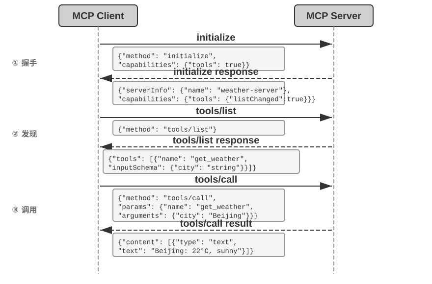

## 感知工具

感知工具是 Agent 获取外部信息的主要渠道。

要设计出优秀的感知工具系统，需要在粒度、组织方式、输出格式等多个维度上精心权衡。

感知工具常常面临返回信息量远超 Agent 处理能力的挑战：一次搜索可能返回数万个字符，一份 PDF 可能多达上百页，直接塞入上下文既会耗尽窗口空间，又会让关键内容淹没在噪声中。通用的应对是在工具层面集成第二章介绍的**上下文感知压缩**——当输出超过阈值（如 10000 个字符）时，基于 Agent 当前的查询意图自动压缩（其原理与压缩效果第二章已详述，此处不再展开）。除了这一通用机制，几类常见的感知工具还各有其特有的设计问题。

**搜索类工具的返回格式与分页**。搜索工具的返回值应该是结构化的候选列表（标题、位置、摘要片段），而非全文拼接——让 Agent 先浏览候选，再决定深入读取哪一条。当结果数量较多时，应提供分页或游标（cursor）参数：默认只返回前若干条，并在返回值中注明结果总数和获取下一页的方式，由 Agent 自主决定是否继续翻页，而不是一次性倾倒全部结果。

**读取类工具的 offset/limit 与截断策略**。read 类工具应支持 offset/limit 参数，按需读取大文件的指定片段。当内容超过阈值必须截断时，截断应显式可见：注明省略了多少内容、如何读取剩余部分（如“已显示第 1-200 行，共 5000 行，可用 offset 参数继续读取”）。静默截断是危险的——Agent 会误以为自己看到了全部内容，基于不完整的信息做出错误判断。

**只读性带来的工程红利**。感知工具不改变外部世界，这一只读特性带来两个天然优势：结果可以安全地缓存（相同查询直接复用，节省时间和费用），多个感知调用可以放心地并行执行（如同时读取五个文件、并发发起三个搜索），无需担心相互干扰。执行工具则没有这种自由——调用顺序和副作用都必须严格控制。

**多模态感知的输出形态**。对于截图、图表、扫描件等多模态输入，工具需要决定以什么形态交给模型：直接返回图像交给具备视觉能力的模型，还是先用 OCR、图表解析等手段转成文本？前者保留布局和视觉细节但消耗更多 token，后者精简高效但可能丢失关键的空间结构（如表格的行列对应关系）。实践中常按内容类型选择：纯文字内容用文本提取，布局敏感的内容（UI 界面、复杂表格、设计稿）保留图像。

> **实验 4-1 ★★：感知工具 MCP 服务器**
>
>
> 
>
>
> 本实验构建一套感知工具 MCP 服务器，覆盖以下五类感知场景：
>
> - **搜索**：网络搜索、本地知识库搜索、文件下载
> - **多模态理解**：网页阅读、PDF/Word/PPT 等文档提取、图片 OCR 与 AI 分析、音视频转录与分析
> - **文件系统**：文件读取与搜索、目录浏览、文件操作（移动/复制/删除等——严格来说属于执行工具，但通常与文件读取打包在同一个 MCP 服务器中）
> - **公开数据源**：天气、股价、汇率、Wikipedia、ArXiv 论文等免费 API
> - **私有数据源**：日历、Notion 等需要授权的个人数据
>
> 这些工具大多基于免费、开放的 API，无需注册即可使用。MCP 生态中已有大量现成的感知工具服务器可供选用。第五章将论证，其中大部分功能可以用七个核心工具配合 Skill 文档来覆盖。
