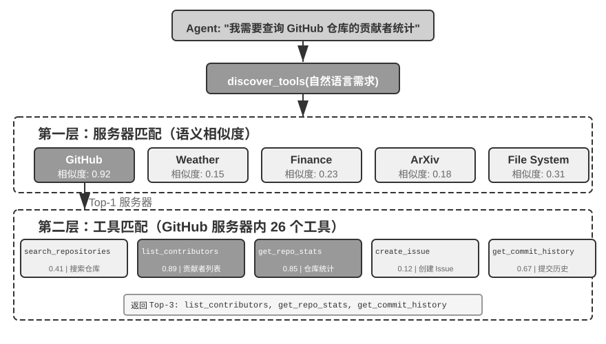

## 主动工具发现

前面讨论了单个工具的设计原则与工具生态。但当可用工具从十几个增长到成百上千，新问题随之而来——如何从庞大的工具库中高效找到当前需要的那一个？本节先精简回顾现有的工具发现方法（检索预筛选、主动声明、层次化匹配），再介绍近来更流行、也更轻量的 Skills 渐进式披露思路。

### 现有工具发现方法

传统做法是把所有工具的 schema 一次性注入系统提示词，但当工具数量上千时它迅速失效：上下文被“工具说明书”塞满，模型的选择精度随之下降。本章“工具生态”一节讨论过的检索式预筛选（按语义相似度先筛出一批候选工具）缓解了这个问题，但有一个内在局限——它按用户的初始查询做**一次性**匹配，而“Debug the file”这类看似简单的请求，实际可能牵出文件访问、代码分析、命令执行等多步骤、跨领域的工具链，任务开始时无法预见所有需求。

**从被动选择到主动发现。** 更进一步的思路，是让 Agent 从被动接受者变为主动发现者：在执行过程中意识到能力缺口时，主动用自然语言声明“我需要什么能力”，系统再动态匹配并注入。MCP-Zero[^mcp-zero-2025] 是代表工作——系统提示词中不预置任何工具 schema，Agent 在思考中生成结构化请求块（如“GitHub 服务器：搜索仓库并返回元数据”），系统通过服务器级→工具级的两层语义路由从数千候选中匹配注入，论文报告在约 2800 个工具上比全量注入节省约 98% 的 token。工程上更常见的等价方案，是在系统提示词里只保留少数基础工具（web search、code interpreter）外加一个“工具搜索工具”，Agent 用自然语言描述需求即可检索并加载——Anthropic 在 Claude API 中提供的 Tool Search Tool 即属此类。两者的共同点都是“Agent 声明缺口、系统按需注入”。

[^mcp-zero-2025]: Fei, X., et al. *MCP-Zero: Active Tool Discovery for Autonomous LLM Agents.* arXiv:2506.01056, 2025.

**层次化匹配与降级。** 高效匹配的关键在于工具组织本身具有层次结构：在 MCP 等协议中，工具按**服务器**分组（类似手机上的 App，每个 App 提供一组相关功能），于是匹配可分两层——先按能力描述定位相关服务器，再在服务器内匹配具体工具，把搜索空间从“数千个工具”缩小为“数十个服务器 × 每个服务器数十个工具”，既省算力也减少跨领域的语义混淆。工程上这依赖一个离线构建、支持增量更新的嵌入索引；若两层匹配的候选相似度都低于阈值，则应明确返回“未找到”，让 Agent 改写需求重试、用基础工具手工实现，或干脆创造一个新工具（创造工具是第八章的主题）。

**动态加载与 KV Cache。** 主动发现有一个微妙的工程代价：动态加载工具会**破坏 KV Cache**——若把全部工具定义放进静态前缀，每加载一个新工具就使整段缓存失效。破解思路与第二章讨论 Skill 注入位置时一致：把会变动的部分（新工具的完整 schema）追加到上下文末尾，让静态前缀保持稳定、KV Cache 完全复用，只在 Agent 状态栏维护一份简短的工具名列表。如今这套模式已获得各大 API 的原生支持，并成为主流框架的默认架构：OpenAI Responses API 提供 `tool_search` 工具与 `defer_loading: true` 标记，被加载的 schema 以 `tool_search_output` 形式追加在上下文末尾，前缀缓存持续命中；Claude Code 对 MCP 工具默认延迟加载（经 `tool_reference` blocks 按需注入，会话启动只保留工具名与服务器说明）；Codex CLI 的 `tool_search`（BM25 检索）更是默认开启的架构而非可选特性。此外，动态工具环境对模型能力要求也更高——能力较弱的模型既难以理解“工具定义出现在上下文中间”这种非标准位置，也容易生成非法的调用格式（如 JSON 括号不匹配、参数缺失），往往需要通过强化学习专门训练（详见第七章）。

需要澄清一个容易误解的点：“追加到末尾”只发生在工具被发现的那一轮。此后这个 schema 块就固定在轨迹中的原位置——后续轮次的新消息追加在它**之后**，它本身成为普通的历史消息，而不是每轮都被重新搬运到最新的末尾（倘若真是每轮重新注入，那确实每轮都要为它重新 prefill，缓存也就失去了意义）。两个 API 的实现都保证了这一点：OpenAI 要求后续请求保持 `tool_search_output` 项的原位置，且同一工具无需在后续轮次重复加载；Anthropic 在会话历史的原位置内联展开 `tool_reference` block，官方文档明确表示后续每一轮都能保持缓存命中。真正会导致重算的只有两种情况：Prompt Cache 的 TTL 过期（整段前缀一起重算，并非工具定义特有的代价），以及修改、移除或重排已加载的工具集（缓存从变动点起失效）。

图4-9 展示了多轮动态发现之后的上下文全貌：静态前缀中只保留系统提示词、核心工具与工具搜索元工具，历次发现的工具 schema 散落在轨迹各处、固定在首次注入的位置，后续轮次作为普通历史命中缓存。这也意味着“工具定义必须在上下文最前面”不再是铁律——前缀依然是静态的、只增不改的，只是工具定义获得了按需进入轨迹的能力；代价是模型必须在后训练中学会理解散落在上下文各处的工具定义。

不难看出，这一整套“主动声明—语义匹配—动态注入”的机制虽然有效，工程上却相当繁琐：要离线维护嵌入索引、要处理 KV Cache 失效、还要为弱模型做专门训练。它们共同的前提，是把每个工具都当成一份**面向模型的正式定义**，先注册、再检索、再注入。下一节的 Skills 机制换了一种更轻的思路。

> **实验 4-6 ★★★：主动工具发现**
>
> 本实验通过对比验证主动工具发现对小参数量模型的显著价值。使用 Qwen3-4B 模型访问前文感知工具实验中构建的 MCP 服务器中的 120+ 工具。
>
> **实验设置**：准备一组需要跨领域工具协作的任务，例如：
> - “查询苹果公司最新股价，搜索相关新闻分析原因”（需 Yahoo Finance + Web Search）
> - “在 arXiv 上搜索关于 transformer 的最新论文，下载排名前三的论文”（需 arXiv Search + File Download）
> - “分析 GitHub 上某个仓库的贡献者统计，生成可视化报告”（需 GitHub + Code Interpreter）
>
> **对照组**：将所有 120+ 工具的完整 schema 一次性注入 system prompt（超 50K tokens）。4B 模型在这么长的上下文下指令遵循能力严重退化，出现典型问题：面对“查询股价”可能错选 Web Search 而非专门的 Yahoo Finance 工具，或者“忘记”工具列表中某些工具导致任务失败。
>
> **实验组**：实现前文所述的混合方案（MCP-Zero 的主动发现思想 + 工具搜索工具式实现）：(1) system prompt 仅保留 `web_search`、`code_interpreter` 和 `discover_tools` 元工具；(2) `discover_tools` 接受自然语言需求（如“我需要查询股票价格的能力”），通过嵌入向量相似度匹配返回 3-5 个候选工具及完整 schema；(3) 新工具定义追加到对话历史（作为 user message），Agent 状态栏更新工具名称列表；(4) 引导模型在遇到能力缺口时主动调用 `discover_tools`。
>
> **预期观察**：准确率和任务完成率显著提升。主动工具发现不仅帮助能力较强的大模型应对成千上万工具的场景，更让小参数量模型在上百工具的场景下保持可用。

### Skills：把工具发现变成“按需查阅”

近来更流行的一种思路来自 Skills 机制。第二章从上下文工程的角度介绍过 Skills 的**渐进式披露**（Progressive Disclosure）；这里换个角度，把它看作一种工具发现范式——它与上一节最大的不同，是不再需要那套“嵌入索引 + 语义匹配”的基础设施。

**不是一次性全暴露，而是一层层查。** 像 MCP 这样的协议倾向于把工具的完整 schema 一次性摆在模型面前（要么全量注入、要么靠检索预筛先选出一批），Skills 则相反：Agent 启动时只看到一份薄薄的目录——每个 skill 的 `name` 与 `description`（合计数百 token）。当**当前上下文**真的需要某种能力时，模型才去读取对应的 sub-skill，并顺着其中的引用再往下一层，读取具体的脚本或子文档。“发现”由模型在上下文里的实际需要驱动，而不是在任务开始时对初始查询做一次性预匹配。

**就像查工具书或维基百科。** 这更接近人使用参考资料的方式：没有人会把一本工具书或整个维基百科从第一页读到最后一页，而是顺着索引和目录，按当下的需要一个词条、一个词条地精确查阅。工具的详细定义不必全部常驻上下文，用到哪条查哪条。相比上一节，Agent 靠通用的文件阅读能力（`grep`、读取文件）翻阅 skill 目录即可，既不必维护向量索引，也不必把“发现工具”单独建模成一次特殊的语义检索——这是一种更现代、也更省心的工具发现思路。

**加载 Skills 之后，KV Cache 怎么办？** 上一节的 KV Cache 优化是针对“传统工具定义”的——把 schema 追加到对话末尾以保住 system 前缀不变。Skills 场景下问题类似：加载一个 sub-skill，本质上就是往上下文里插入一段内容，同样可以用第二章的“注入位置”方法把它放到末尾、复用前缀。但 Skills 有个新特点：同一批 skill 会被反复、且在不同位置加载（跨会话、跨用户），若每次都随对话历史从头 prefill，成本不小。第二章末尾介绍的“可编辑、可组合的 KV Cache”正是为此而生：把每个 skill 的 KV 表示**预编译并缓存一次**，之后用 RoPE 重定位把它“粘贴”到任意上下文位置，以 O(L) 而非 O(L²) 的代价拼接进来；skill 内容若有小改动（如某个字段更新），也能以“勘误笔记”的方式增量修正，而不必整段重算[^prog-kv]。这样，skill 就从“一段每次都要重新 prefill 的文本”升级为“一个可复用、可组合的缓存对象”——渐进式披露带来的反复加载，才不至于把省下的 token 又从延迟上赔回去。

[^prog-kv]: 把 skill、工具定义等升级为可复用、可组合缓存对象的完整方法，见 Li, Bojie. *Models Take Notes at Prefill: KV Cache Can Be Editable and Composable.* arXiv:2606.17107, 2026（第二章已作介绍）。
