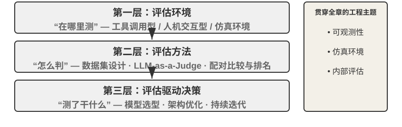

# Agent 的评估

构建 Agent 系统时，开发者面对大量设计选择，而它们往往没有显而易见的正确答案：

- 用什么模型？
- 让模型能调用哪些工具？
- 知识库该存什么数据、以什么结构来构建？
- 用户记忆该怎么做？
- 模型的提示词和 Skills 该如何组织？
- Harness 中需要加上哪些约束？
- 这个 Agent 的自我进化和自迭代该怎么做？

评估为我们提供了科学的决策依据：通过系统性的对比实验（改变一个变量，观察效果变化）和消融实验（逐一关闭某个组件，观察整体性能变化，从而判断该组件的真实贡献），区分真正的能力提升与表面的波动，避免“捡了芝麻，丢了西瓜”。正如软件工程中“没有度量就没有改进”的说法，不建立可重复的评估体系，Agent 的迭代方向就只能靠直觉。

从第一章引入的 Harness 工程视角看，评估在 Harness 中扮演着“验证”功能的核心角色。一个关键认识是：**评估的对象不应只是模型，而应是模型与 Harness 的组合体**。同一个模型在不同的 Harness 中可能表现差异悬殊——一些团队仅通过优化 Harness 就显著提升了同一模型在终端类任务上的表现（详见第五章）。这意味着，当 Agent 在评估中表现不佳时，改进方向可能不是换模型，而是优化 Harness 的某个组件（提示词、工具设计、反馈循环）。完善的评估体系应能区分“模型能力不足”和“Harness 设计缺陷”这两类本质不同的问题。**区分这两类问题的常见手段是模型替换实验（model swap）**——固定 Harness，只更换更强/更弱的模型，观察分数变化幅度；如果换强模型分数不涨，说明瓶颈在 Harness；如果换弱模型分数大跌、分数随模型能力大幅波动，最直接的解读就是瓶颈在模型能力本身、当前表现主要由模型决定（至于这是因为任务本身就难、还是 Harness 过度依赖模型先验，则需进一步分析）。注意这与前面提到的“消融实验”是两种不同的方法：消融是**关闭 Harness 的某个组件**看整体性能如何变化，模型替换则是**固定 Harness、只换模型**——前者定位 Harness 内部哪个部件重要，后者区分瓶颈在模型还是在 Harness。

评估体系的价值在模型快速演进的时代更加凸显。模型能力仍在快速演进，但新模型在公开基准上表现更好，并不意味着在你的特定任务上也更好——反而可能出现性能退化（regression，即新版本在某些方面不如旧版本）。只有在自己的评估数据集上完整测试，才能做出数据驱动的升级决策。更进一步，完善的评估体系使得“为未来的模型开发产品”成为可行策略——即使当前模型不足以支撑商用，也可以先完成产品开发并建立评估集，持续追踪新模型的表现，一旦达到门槛就立即上线。

> **本章导读**
>
> 本章从三个层次构建完整的评估体系。第一层是**评估环境**（“在哪里测”）：如何搭建自动化、可复现的测试环境，包括工具调用型和人机交互型两种范式。第二层是**评估方法**（“怎么判”）：从数据集设计原则、评估指标体系（该测什么），到 LLM-as-a-Judge（用大语言模型充当评委）自动化评判，再到配对比较与模型排名。第三层是**评估驱动的决策**（“测了干什么”）：将评估结果转化为模型选型、架构优化和持续迭代的行动指南，并借助统计显著性判断观察到的分数差异是否真实可信。此外，本章还会讨论可观测性与生产级 Agent 的内部评估基础设施，并在章末介绍连接第七章后训练的仿真环境。
>
> 贯穿全章的核心理念是：**评估体系的首要价值不是给当前系统打分，而是让你能快速、可靠地跟上模型的演进**。当一个更强或更便宜的模型发布时，拥有完善评估体系的团队能在数小时内得出切换决策，而缺乏评估体系的团队只能凭直觉或等待社区反馈——在竞争激烈的 Agent 市场中，这种速度差距可能决定成败。

## 子章节
- [一个具体的评估示例](06.01-一个具体的评估示例.md)
- [自动评估环境](06.02-自动评估环境.md)
- [评估任务数据集的设计](06.03-评估任务数据集的设计.md)
- [评估指标体系](06.04-评估指标体系.md)
- [自动化评估方法](06.05-自动化评估方法.md)
- [评估驱动的模型选型](06.06-评估驱动的模型选型.md)
- [评估结果的统计显著性](06.07-评估结果的统计显著性.md)
- [Agent 的可观测性](06.08-Agent-的可观测性.md)
- [从 Benchmark 报告到系统改进](06.09-从-Benchmark-报告到系统改进.md)
- [从外部评估到内部评估：生产级 Agent 的评估基础设施](06.10-从外部评估到内部评估-生产级-Agent-的评估基础设施.md)
- [仿真环境：从评估到后训练的桥梁](06.11-仿真环境-从评估到后训练的桥梁.md)
- [本章小结](06.12-本章小结.md)
- [思考题](06.13-思考题.md)
