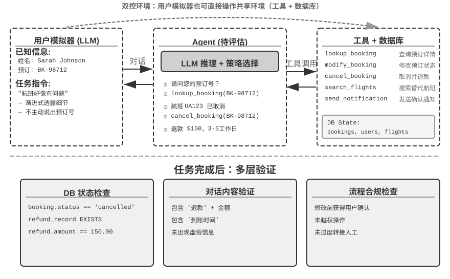

## 自动评估环境

Agent 评估需要一个可重复运行的自动化环境——能在开发阶段快速测试变更的效果。搭建这样的环境要回答三个问题：评什么（任务定义和验证标准）、对谁评（如何模拟 Agent 的交互对象）、用什么标准打分。

### 评估环境的基本组成

评估环境包含五个要素——后续章节将重点展开其中的数据集设计和评分标准设计：

**数据集（Dataset）**定义任务集合，包含初始状态、目标描述和可选的参考解决方案。

**环境状态（Environment State）**维护任务执行中的可变信息，需在真实性和可控性之间取得平衡。例如，在客服评估中，环境状态包括数据库中的订单记录和用户账户余额。Agent 调用 `process_refund` 后，订单状态从 'delivered' 变为 'refunded'、余额增加——这些就是“可变信息”。“真实性”要求状态变化符合业务逻辑（退款不超过订单金额），“可控性”要求每次测试可重置到相同初始状态。

**工具接口（Tools）**定义 Agent 可执行的操作集合——工具不应提供过高层的抽象（如“解决用户问题”），而应提供原子操作（如查询订单、修改预订、发送邮件），迫使 Agent 通过规划和思考来组合这些操作。

**评分标准（Rubric，评分准则）**量化 Agent 的表现，可以是二元的（通过/不通过）、连续的（0 到 100 分）或多维的（分别给准确性、效率、安全性打分）。

**执行协议（Interaction Protocol）**规定交互模式和终止条件。

### 工具调用型评估环境

对于代码生成、数据分析等主要依赖工具使用的任务，Verifiers 框架展示了典型的设计模式。Agent 通过调用预定义工具完成任务，验证基于可执行标准（测试是否通过、答案是否匹配），不依赖人类标注或模型评判。

Verifiers 引入了层次化的环境设计：`SingleTurnEnv` 适用于单轮任务（如简单问答），`ToolEnv` 支持多轮工具调用的自主循环，`StatefulToolEnv` 和 `SandboxEnv` 支持有状态工具和长期运行的沙盒环境（如代码执行）。例如，`SingleTurnEnv` 适用于问一道数学题后直接验证答案；`ToolEnv` 适用于搜索多个网页后综合回答再验证最终结果；`StatefulToolEnv` 适用于修改数据库记录后验证数据库状态变化；`SandboxEnv` 适用于在沙盒中运行代码后检查输出文件。表6-2 汇总了这些环境类型，便于读者按任务状态、工具调用和隔离需求选择合适的评估环境。

表6-2 Verifiers 环境类型对比

| 环境类型 | 状态保持 | 工具调用 | 典型用例 |
|---|---|---|---|
| SingleTurnEnv | 无 | 无 | 单轮问答、数学题 |
| ToolEnv | 无 | 多轮 | 搜索+信息综合 |
| StatefulToolEnv | 有 | 多轮 | 修改数据库记录 |
| SandboxEnv | 有+隔离 | 多轮 | 代码执行与测试 |

框架支持并行采样和轨迹缓存，每次评估的完整轨迹（观察、行动、奖励）都会被保存，方便后续分析和回放。

环境还需处理操作的状态依赖性——工具的执行效果取决于当前状态，失败时应提供清晰的错误信息而非简单的失败标志，让 Agent 能从错误中学习并调整策略。

### 人机交互型评估环境

许多真实任务不仅涉及工具调用，还需要与人类用户对话。客服 Agent 需要理解模糊表达、澄清需求、查询后台系统、向用户确认信息。这类任务的评估面临一个根本性挑战：如何在自动化环境中模拟真实用户？

关键设计原则是**渐进式信息透露（Progressive Information Disclosure）**，这是人机交互型评估与传统基准测试（benchmark）的根本区别。大多数 benchmark 一开始就把完整需求全盘托出，但现实中用户很少能一上来就清晰描述需求——他们往往只会说“我的航班好像有问题”、“网络连不上了”。Agent 需要通过主动提问来澄清需求，这个过程本身就是能力的重要体现。因此在评估中，**绝不能一开始就把模拟用户的所有信息暴露给 Agent**，信息应按需、渐进地在对话中透露。

τ-bench 的解决方案是**用户模拟（User Simulation）**：用另一个 LLM 扮演用户角色，根据预定义的指令与 Agent 对话。模拟用户接收任务指令（如“我需要取消明天的航班”），在对话中逐步向 Agent 透露必要信息、回应询问，任务完成后发出终止信号。提示词要求模拟用户“不要一次性透露所有信息，只提供当前步骤必要的内容”、“不要编造指令中未提供的信息”。用户模拟的设计需要在真实性和可控性之间权衡：行为应接近真实用户（表达模糊、信息不完整、偶尔情绪波动），同时遵循一定的剧本以确保可复现。

以下是一个渐进式信息透露的多轮对话示例（用户模拟器按固定脚本行动）：

> **用户**：“我的航班有个问题。”
> **Agent**：“请问是哪个航班？”
> **用户**（按脚本透露）：“Delta 123，明天早上从旧金山飞纽约。”
> **Agent**：“具体是什么问题？”
> **用户**（按脚本透露）：“飞行时间太长了，我想改签。”
> **Agent**：“对新航班有什么偏好吗？”
> **用户**（按脚本透露）：“下午的航班都行。”

用户模拟器遵循一个固定的脚本（已知信息 + 透露规则），确保评估可复现，同时模拟真实用户的渐进式表达方式。

τ-bench 是评测 Agent 在结构化业务流程（如航空客服、零售客服）中表现的基准测试。它的检查是组件级、多维度的：一方面检查数据库最终状态是否正确（如预订记录状态变为“已取消”），另一方面验证 Agent 在对话中是否输出了必要的关键信息（如退款金额和到账时间，通过搜索特定字符串或模式来验证）。这种双重验证同时考察操作准确性和沟通有效性。但在任务层面，这些检查最终汇总为**零或一的二元奖励**——所有检查全部通过才得 1 分，任何一项不通过就是 0 分。二元奖励便于统计 Pass^k 等可靠性指标（见后文“评估指标体系”），代价是“操作准确但漏掉某个非关键字段”与“完全失败”得到相同的分数。

改进版 **τ²-bench** 的核心增量不在评分粒度，而在两点：一是**双控环境（Dual-Control）**——不再只有 Agent 一方能调用工具，用户模拟器也能操作同一个共享环境（如 Agent 指导用户切换飞行模式，用户的操作真正改变环境状态），这更贴近技术支持等需要用户动手配合的真实场景；二是**更精确的任务规范与组合式任务生成**——成功条件的歧义更少、具体任务实例可以参数化批量生成（详细验证维度见后文“可验证性与客观性保障”一节）。

> **实验 6-1 ★：运行 τ²-bench 并对比 τ-bench 的演进**
>
> 本实验通过运行 τ²-bench 评估框架，理解人机交互型评估环境的设计要点，并通过对比 τ-bench 与 τ²-bench 的差异，体会评估数据集是如何迭代改进的。
>
> 深入阅读任务定义文件：每个任务包含已知信息（用户的背景知识）、任务指令（指导如何渐进式透露信息和响应策略）以及成功条件（数据库目标状态和对话中必须出现的确认信息）。运行完整评估流程，观察用户模拟器与 Agent 的多轮对话，分析典型的失败模式（政策违规、信息遗漏、过度转接人工等）。
>
>
> 
>
>
> 对比 τ-bench 与 τ²-bench 的设计差异：τ-bench 初始版本的用户指令过于简单（Agent 能猜对答案）、成功条件不够精确（导致误判）、用户模拟器过于机械。τ²-bench 针对这些问题做了系统性改进：
>
> - **引入更详细的任务指令**：包括“事实锚定要求”（Grounding），即必须基于环境真实状态回答
> - **更精确的评估标准**：如“速度测试返回 excellent 才算解决”
> - **更真实的用户模拟器行为规范**：渐进式信息透露、自然的情绪波动
>
> 特别关注 τ²-bench 新增的 telecom 领域任务，理解其双控环境设计（如前文所述，用户与 Agent 共同操作同一共享环境）。
>

与工具调用型评估侧重“是否完成了可观测的状态变更”不同，人机交互型评估关注“是否引导用户完成了认知或决策上的变化”——前者考察 Agent 的行动正确性，后者考察其沟通策略的合理性。

评估环境的构建还涉及仿真环境的设计——当评估环境需要支持大规模重复交互时就演化为仿真环境，本章末尾将简要讨论。
