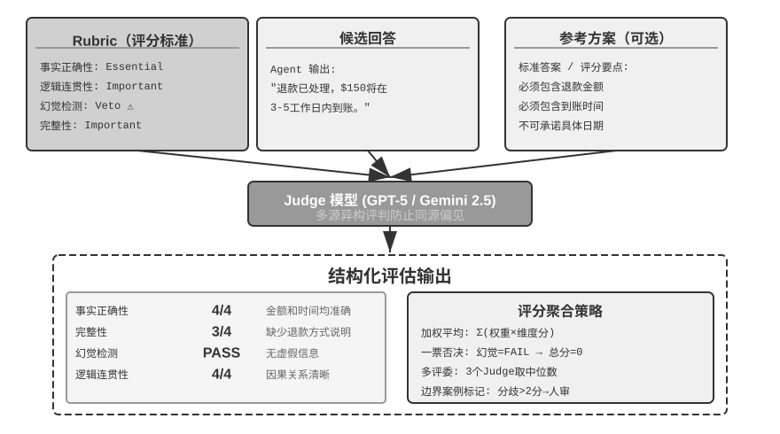

## 自动化评估方法

有了评估环境、数据集和明确的指标体系，接下来的核心问题是：怎么打分？对于有明确正确答案的任务（如数学题、SQL 查询），简单的二元判定（对/错）已经足够；但对于开放式任务（如客服对话、报告撰写），需要更精细的评估方法。

代码自动验证只覆盖有标准答案的场景，开放式任务的评分才是本节的主题。其中，奖励信号的密度设计（从二元奖励到过程奖励再到生成式奖励）以及奖励模型的训练方法留待第七章后训练部分系统讨论；本节则回答一个更基础的问题：如何用 LLM 自动化地评判开放式任务的输出质量。

### LLM-as-a-Judge：自动化评估的核心



为什么需要 LLM-as-a-Judge？对于开放式任务（如生成报告、处理客户投诉、创意内容），没有标准答案可以自动对比，人工评估成本高且难以规模化。LLM-as-a-Judge 通过让语言模型根据专家定义的评分标准（Rubric）进行评判，在自动化规模和人类专业判断之间取得了平衡。但这种方法也有已知的局限：评判模型可能有自己的偏见（最典型的是**长度偏差**——倾向于给更长、更详尽的回复打高分，哪怕内容并不更正确），相同输入多次评判也可能有波动。长度偏差尤其值得单独防范，常用手段有三：在 Rubric 里显式惩罚冗长、对同类任务规定回答的长度上限；做配对比较时先把两个候选的长度控制到相近再评；以及定期审计评分与回答长度的相关性——如果高分几乎总是伴随长回答，就说明评判已被长度带偏，需要回炉修订 Rubric。为了系统性地应对这些挑战，Rubric 设计必须遵循以下准则：

**Rubric（评分标准）：LLM 评判的依据。**

**Rubric 四准则**（Scale AI，“Rubrics as Rewards”）：

（1）**基于专家指导**——必须反映领域知识，捕捉核心事实和推理步骤。比如医疗问答的 Rubric 需包含诊断标准和必须避免的医学错误，缺乏专业基础的 Rubric 只能捕捉语言流畅度等表面特征。

（2）**全面覆盖**——涵盖事实准确性、逻辑连贯性、完整性、安全性，而且不仅定义正面标准，还要明确**陷阱（Pitfall）**——即高风险的常见错误，如医疗建议中推荐未经验证的疗法。

（3）**标准重要性权重**——分为必要项（Essential）、重要项、可选项、陷阱项。支持**一票否决机制（Veto）**：比如在客服场景中，幻觉（编造虚假信息）是典型的否决维度——无论其他维度表现多优秀，只要出现虚假信息就必须否决。这也有助于防范关键词堆砌式的奖励作弊。

（4）**自包含评估**——每个评价项独立可操作，不依赖评价者的领域知识。要避免“回应展示了深刻理解”这种抽象标准，改为“引用了至少两个权威理论并准确解释如何支持结论”这种可验证的标准。

关键实践：为每个维度定义客观可验证的评分档次，提供具体示例和**边界案例**帮助区分模糊情况。要主动防范**奖励作弊（Reward Hacking）**——即 Agent 找到了获取高分的“捷径”却没有真正完成任务——明确惩罚幻觉、讨好用户、关键词堆砌、回避棘手问题。Rubric 是迭代产物——通过试用收集评价者分歧、逐步完善，逐渐从抽象准则演化为详尽的判例集。

以用户记忆 Agent 为例，展示一个符合四准则的完整 Rubric。测试问题：“我女儿的儿科医生是谁？”（答案需要跨两次对话关联：第一次对话提到“女儿叫 Lily”，第二次提到“带 Lily 去看了 Dr. Chen”）。

```yaml
rubric:
  dimensions:
    - name: 事实正确性
      weight: essential        # 必要项
      scoring:
        4_优秀: "准确回答 Dr. Chen，且关联到女儿 Lily"
        3_良好: "准确回答 Dr. Chen，但未提及是 Lily 的医生"
        2_及格: "给出了正确医生但附带不确定的额外信息"
        1_不及格: "给出错误医生名，或回答不知道"

    - name: 信息完整性
      weight: important        # 重要项
      scoring:
        4_优秀: "主动补充相关信息（如上次就诊时间、诊断结果）"
        3_良好: "回答了核心问题，无遗漏"
        2_及格: "回答了核心问题，但遗漏了可用的关联信息"
        1_不及格: "关键信息缺失"

    - name: 思考正确性
      weight: important
      scoring:
        4_优秀: "正确关联'女儿=Lily'和'Lily的医生=Dr. Chen'两条跨会话信息"
        3_良好: "关联正确但思考路径不够清晰"
        2_及格: "部分关联正确"
        1_不及格: "错误关联（如把用户自己的医生当成女儿的医生）"

    - name: 幻觉检测
      weight: veto             # 否决项：一旦触发，总分归零
      scoring:
        pass: "所有信息均可溯源到历史对话记录"
        fail: "编造了对话中不存在的信息（如虚构就诊日期、诊断结果）"

  edge_cases:
    - "如果用户有多个女儿且分别看不同的医生，应追问是哪个女儿"
    - "如果记忆中同时存在'Dr. Chen'和'陈医生'，应识别为同一人"
```

**好的 Rubric vs 坏的 Rubric**：上面每个评分档都给出了可验证的具体行为（“准确回答 Dr. Chen”），而非“展示了对记忆的深刻理解”这类无法客观判定的描述。否决项明确了底线：即使其他维度全部满分，一旦出现幻觉就直接判零。

将这个 Rubric 和 Agent 的实际回答一起发给评判模型，评判模型会逐维度打分并给出理由。通过在几十个测试用例上运行，就能系统性地发现 Agent 的能力短板——比如“跨会话关联”维度的平均分只有 2.1，就明确指向记忆检索或信息关联的不足。

> **实验 6-3 ★★：构建基于 Rubric 的用户记忆评估系统**
>
> **前置要求**：需完成第三章用户记忆实验（`ch3/user-memory-evaluation`）。
>
> 本实验要求改造第三章的 `ch3/user-memory-evaluation` 框架，将当前基于简单 LLM-as-a-Judge 的评分机制升级为结构化的多维度 Rubric 评估系统。现有系统使用单一 LLM 调用返回通过/失败加评估理由，缺乏结构化的诊断能力。
>
> 设计统一的多维度 Rubric 框架，适用于所有三层任务。评价维度包括：事实正确性（Precision，精确率——在所有给出的信息中，有多少是正确的）验证数字/日期/名称是否与记忆信息一致；事实完整性（Recall，召回率——在所有应该给出的信息中，有多少被提及了）验证是否提供了所有相关信息而非遗漏关键内容；思考正确性检查是否正确理解了信息间的关系和隐含逻辑；思考主动性评估是否在适当时候提供超出直接回答的建议或风险提醒；幻觉检测确保未编造记忆中不存在的信息。
>
> 四档制评分（优秀/良好/及格/不及格），每档配具体判定标准而非抽象描述。幻觉维度设为一票否决项。为每个维度提供示例和边界案例。
>
> **实验 6-4 ★★：Advanced JSON Cards 与 RAG 的对比评估**
>
> **前置要求**：需完成第三章用户记忆与 RAG 实验（`ch3/user-memory`、`ch3/agentic-rag-for-user-memory`）。
>
> **目标**：在同一套评估集上公平对比结构化记忆与非结构化检索的优势边界。复用两个第三章项目，在 `ch3/user-memory-evaluation` 的 60 个测试用例上对比三种配置——纯 Advanced JSON Cards（结构化卡片常驻上下文、无需检索）、纯 RAG（对话分块入向量库、必须检索）、混合系统（核心事实常驻 + 原始对话按需检索）。
>
> **验收**：在三层复杂度（基础回忆 / 多会话消歧 / 跨会话隐藏关联）上记录成功率、平均步数、工具调用次数、延迟与成本，说清每种方案的失效边界——结构化丢了什么、检索漏了什么、混合是否真有协同。配置细节与测试用例见配套仓库。
>

**同源模型问题与多源评判。**

当 Agent 与评判模型来自同一家族时，Agent 可能学会利用评判模型的偏好和盲点。

**这正是古德哈特定律（Goodhart's Law）所说的：当一个度量指标变成优化目标时，它就不再是好的度量指标。** Agent 越是在某个评分系统上训练或调优，就越倾向于钻这个系统的漏洞，而非真正提升能力。

更隐蔽的是，Agent 还会逐渐学会避开评判模型不擅长检测的错误类型，让评分系统看起来一切正常。

缓解策略是**多源异构评判**——使用不同模型家族的多个 LLM 分别评判（比如 Agent 用 Claude，评判就用 GPT-5 和 Gemini），不同家族的偏见往往是正交的，Agent 很难同时“欺骗”所有评判者。使用相同的 Rubric 确保大家评判的是同一目标，通过加权平均或一致性检查聚合结果。部署阶段可以用单一模型快速评估，但应定期用完整的多源评判进行质量审计。

多源评判解决的是“用什么模型评判”的问题；接下来要解决“评判哪些模态”的问题——把 LLM-as-a-Judge 的能力从文本扩展到语音、图像、视频，是评估覆盖度的另一维度。

**多模态 LLM-as-a-Judge。**

多模态评判将 LLM-as-a-Judge 扩展到语音、图像、视频领域，常见的四个方向如下。

- **TTS 评估**（TTS 即 Text-to-Speech，文本转语音）：判断准确性、自然度、音色一致度、情感表达。这些维度能发现传统 WER（Word Error Rate，词错误率）难以捕捉的韵律问题。
- **ASR 评估**（ASR 即 Automatic Speech Recognition，语音识别）：做语义影响判断——“今天天气”识别错误无伤大雅，但“转账一千”变成“一万”就可能造成严重后果。
- **UI 评估**：采用**提议者-审核者**（Proposer-Reviewer）机制，检查文字溢出、颜色对比度、按钮位置等问题。这里的提议者-审核者作为**评估方法**使用，与第五章中作为**生成系统组件**的用法不同，但核心机制相同——一个模型生成，另一个模型独立审查。
- **视频剪辑评估**：通过关键帧验证剪辑起止点和特效应用是否正确。

> **实验 6-5 ★★：构建全自动 TTS 质量评估流水线**
>
> 本实验要求从零设计并实现完整的多模态 LLM-as-a-Judge TTS 质量评估系统。
>
> 设计 TTS 多维度 Rubric：准确性维度验证是否正确读出所有文字（无遗漏/错读/添加），自然度维度评估语音是否流畅（有无机器感、不自然停顿，韵律是否符合人类习惯），情感表达维度检查语气是否符合文本情感色彩（疑问句升调、感叹句强调、悲伤内容语速慢语调低），音色一致性维度在有参考语音时评估说话人相似程度（多模态模型同时接收参考语音与合成语音对比）。
>
> 构建多样化测试语料库：不同长度（单句→长段落）、文体（新闻/故事/对话）、情感（中性/兴奋/悲伤）、特殊挑战（数字/专有名词/多音字/方言词汇）。实现评估流水线：TTS 生成模块接入主流服务（OpenAI、ElevenLabs、Fish Audio、Minimax、豆包），多模态评判模块使用 Gemini 3.5 Flash 将合成语音、原始文本、参考语音和 Rubric 一起输入，逐维度评分并给出详细理由。分析评估结果的分布，识别不同 TTS 模型在各维度上的优劣势——某些模型可能准确性优秀但自然度不足，另一些自然度高但在特殊词汇上容易出错。
>

除了人工定义 Rubric，还可以训练专门的**生成式奖励模型**来自动化评判——这涉及奖励模型的训练方法，将在第七章详细讨论。

在实际的模型选型中，我们经常面对的问题是：“A 和 B 哪个更好？”配对比较提供了一种不依赖绝对分数的评估方式。

### 配对比较与模型排名


**Elo 评分**（一种最初用于国际象棋的排名系统）通过大量的两两对决来量化模型的相对能力：分差越大，强者的预期胜率越高。例如，模型 A 得分 1200、模型 B 得分 1000，Elo 系统会预测 A 的胜率约 76%。如果 B 意外获胜，B 加分较多、A 减分较多——爆冷的结果会带来更大的分数调整，这种机制让排名快速收敛到真实水平。其背后的统计基础是 **Bradley-Terry 模型**：将每个模型抽象为一个潜在的“实力分数”，两两对决胜负的概率由两者分数差决定，Elo 即是该模型在线更新形式的工程实现。

Chatbot Arena 采用匿名随机对决——用户在不知道模型身份的情况下盲选更优回应，通过数百万次投票得出排名。这种方法的优势在于不需要定义“绝对标准”，只需要人类判断“A 和 B 哪个更好”。但也有局限：排名结果取决于用户提了什么问题——如果大量用户恰好都问编程题，擅长编程的模型排名就会偏高，这未必反映它在其他任务上的真实水平。

当配对评判由 LLM 而非人类投票完成时，还要防范**位置偏差（Position Bias）**——评判模型会系统性地偏向出现在某个位置（通常是先出现）的候选，即使两个候选的内容完全对调，判决也可能不变。标准的缓解方法是**交换顺序各评一次**：A 在前评一次、B 在前再评一次，取两次结果的平均；更严格的做法是只有两次判决一致时才计入，不一致则记为平局或送人工复核。Chatbot Arena 的做法本质相同——随机化两个回答的展示位置，让位置偏差在大样本下相互抵消。

**从评估到训练：配对比较信号的迁移**。配对比较不仅是评估手段，也是后训练的重要信号来源。第七章将介绍的 **GRPO**（Group Relative Policy Optimization，分组相对策略优化）算法正是将“对比哪个更好”的评判方式引入了模型训练——其核心思路是对同一问题采样多个候选答案，用它们之间的相对优劣（而非绝对得分）来估计优势，从而省去了 PPO 中额外训练一个价值网络（critic，用于估计基线）的麻烦——注意 GRPO 省掉的是价值网络，而非奖励信号本身，它仍然依赖奖励模型或可验证的奖励规则来评判每个候选的好坏。这里只是埋下伏笔，完整的算法推导、与 PPO/DPO 的对比、以及在 Agent 后训练中的落地细节都留到第七章展开。

> **实验 6-6 ★★：从配对比较数据构建模型排行榜**
>
> 本实验通过从零实现 Elo rating 计算系统，深入理解 Bradley-Terry 模型如何从大量配对比较中提取出相对能力评分。使用 Chatbot Arena 开源的真实投票数据集（包含数百万次用户盲选投票）。
>
> 实现 Elo rating 迭代更新算法：初始所有模型评分 1000 分，按时间顺序处理投票记录。对每场对决，根据两个模型当前的评分差计算预期胜率，将实际结果与预期比较，按固定学习率调整——胜者加分、败者减分，调整幅度与预期偏差成正比（爆冷失败会导致更大的分数变化）。按最终评分降序排列并计算两两胜率矩阵，与官方榜单对比、验证排名大体一致即可。不必苛求逐分对齐：Chatbot Arena 官方用的是 Bradley-Terry 极大似然拟合（对全部对局一次性求解，与投票的先后顺序无关），而这里实现的是在线增量更新的 Elo（结果受学习率 K 因子和处理顺序影响），两种算法在总体排名上应当吻合，但具体分值不会精确一致。
>
> 实验第二部分创建历史排名演进动画：将投票数据按时间切片（每周或每月），对每个时间点计算 Elo 评分快照。使用 D3.js 实现条形图竞赛动画（水平条形长度=评分，纵向位置=排名，随时间平滑变化）。通过观察动画识别技术突破时刻（某模型评分骤升）、竞争格局演变、模型生命周期。
>
