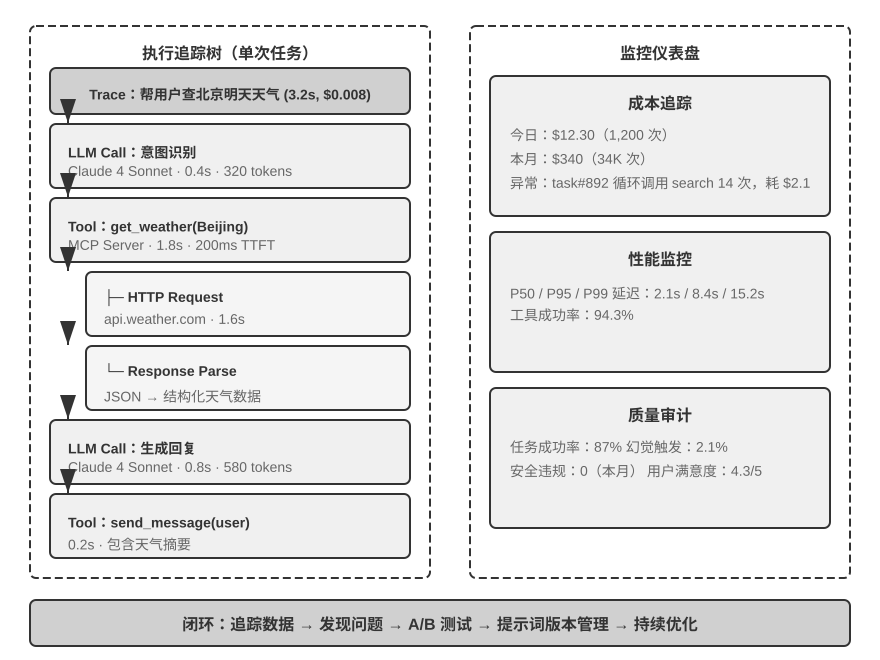

## Agent 的可观测性

评估驱动的决策（无论是模型选型还是持续迭代）都依赖于高质量的运行数据。下面先介绍如何系统性地采集这些数据（可观测性），然后讨论如何将评估结果转化为系统改进。

可观测性（Observability）这个概念借自分布式系统领域：你没法直接打开系统内部看它在做什么，只能通过它输出的日志、指标和追踪数据来推断发生了什么，就像医生不能直接看到患者体内的情况，只能通过体温、血压、影像等外部信号来诊断问题。Agent 系统把这件事变得更难：同样的输入可能产生不同的输出，多轮推理和工具调用使执行路径极其复杂，而模型的“思考”过程对外完全不透明。

可观测性的价值首先在于**问题诊断**：完整的轨迹让开发者能回放全过程，而非靠猜测。其次是**持续优化**的基础——你能看到哪些任务需要多轮迭代、哪些工具成功率最低、哪些检索查询总是返回空结果。在**成本管理**上，Agent 运行成本在不同任务上可能差一两个数量级，追踪可以识别出异常高成本的案例。最后，积累的轨迹数据也为后续的系统优化和模型改进提供了基础。

Agent 可观测性的数据基础是**追踪（Trace）**，其数据结构直接沿用了分布式系统的 span 树模型：一次任务执行对应一条 trace，其中每个 LLM 调用、每次工具调用、每次检索都是一个 **span**（记录输入输出、起止时间、token 消耗、错误信息的执行单元），span 之间的父子关系构成一棵执行树——比如“Agent 主循环”span 之下挂着若干“LLM 调用”和“工具调用”子 span。这一层已有标准化协议可用：**OpenTelemetry** 是通用的分布式追踪标准，**OpenInference** 等规范则在其上定义了 LLM 应用特有的语义约定（如何记录提示词、模型参数、token 用量等）。采用标准协议的好处是采集与分析解耦——同一份追踪数据可以对接不同的分析后端，避免被单一平台锁定。

LangSmith 是这一领域的代表性平台之一（类似定位的还有 Langfuse、Arize Phoenix 等），将可观测性、评估、优化整合为闭环。每次执行创建一个追踪会话，其中的模型调用、工具使用、知识检索被记录为独立的执行单元，通过因果关系链接形成一棵执行树。每个单元记录完整的输入输出、时间信息、成本数据和错误信息。平台采用异步批量数据采集，确保追踪本身不影响 Agent 的响应延迟。

平台还支持 A/B 测试（将一部分用户的流量路由到新版本，自动对比各项指标，支持快速回滚或渐进扩量）、提示词版本管理（每个版本都关联着运行时的性能数据）、以及协作式开发（团队成员可共享追踪数据和问题案例）。生产环境中的海量真实数据是持续改进的金矿——能发现未曾预料的场景，识别最需要优化的功能点。

可观测性数据最有价值的去向，是**回流成评估资产**。一条实用的闭环是：从生产轨迹中筛选出失败与可疑案例 → 脱敏处理（去除用户隐私、密钥等敏感字段）→ 沉淀为评估集的新用例和回归测试。这样评估集就不再是一次性构造的静态集合，而是随产品演化、持续贴近真实用户分布的活资产——今天线上暴露的失败模式，明天就成为守住这条底线的回归用例。这正是可观测性与本章评估主线的接口：可观测性负责“看见”真实世界发生了什么，评估负责把这些观察固化为可反复检验的标准。

可观测性面临几类挑战：

- **数据量与隐私的权衡**：高流量的系统每天会产生数 TB 的追踪数据，同时需要遵守数据保护法规。
- **因果归因的复杂性**：从轨迹中自动识别根本原因仍然需要更智能的分析算法，前沿研究在尝试因果推理和反事实分析，但尚未成熟。
- **多 Agent 系统的追踪难题**：跨多个 Agent 的执行流追踪比微服务间的 API 调用更复杂、更语义化。
- **实时防护与事后分析的平衡**：高风险场景需要主动防护，但会带来额外的延迟和误报。

随着 ML 技术深度整合到工具链中，未来的可观测性平台有望自动识别异常并定位根源。

有了完备的评估体系和数据集之后，关键在于将评估结果转化为切实的系统改进。
