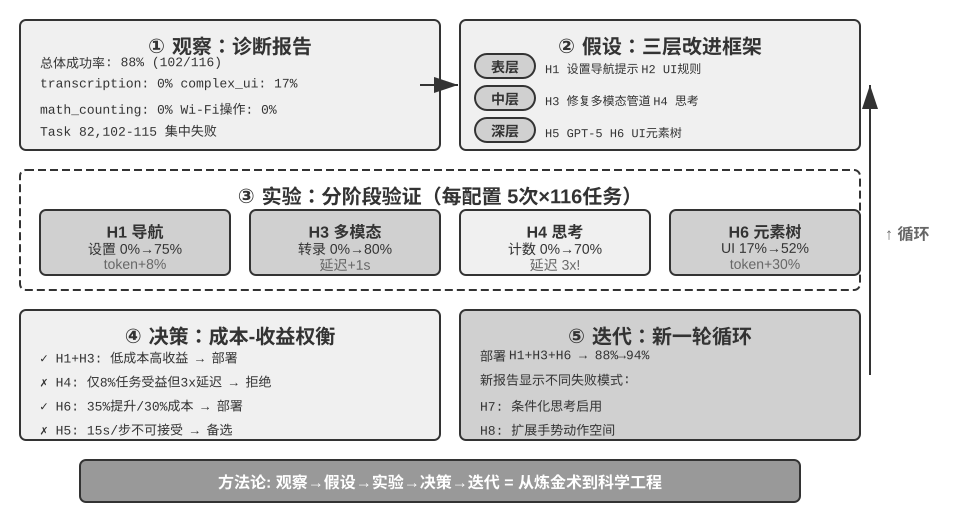

## 从 Benchmark 报告到系统改进

**以下是一个示教性的假设案例**，用具体数据说明从 Benchmark 报告到系统改进的完整决策流程。数据为假设值，旨在演示方法论而非报告真实实验结果。

从 Harness 工程的视角看，这一节本质上讲的是 Harness 迭代优化的方法论——通过评估数据定位 Harness 中的薄弱环节（上下文不足？约束缺失？验证不够？反馈不及时？），有针对性地改进，再重新评估，形成 Harness 持续进化的闭环。

在开始分析 Benchmark 报告之前，有一条容易被忽视的原则：**看到 Agent 表现下降时，应先检查评测系统本身，再动 Agent**。一个常见误区是看到分数下降就立刻修改 Agent 代码，而忽略了评测系统本身可能先出了问题——基于失真的信号调整方向，改的方向可能从一开始就是错的。评测系统常见的错误来源包括：运行环境的资源不足导致进程被杀（表现为随机性的失败）、评分器本身有 bug 把正确答案判为失败、测试用例与生产场景之间存在脱节。这些问题在结果数字上都跟模型退化一模一样，只有审查完整的轨迹才能区分。

### 读懂 Benchmark 报告：发现问题的艺术

以一个具体案例来说明如何读 Benchmark 报告。假设我们在 AndroidWorld 上评估某个 Agent，得到两张核心报告表：逐任务性能列表和按能力标签划分的性能矩阵。报告的价值不在于总体成功率这个单一数字，而在于它揭示的结构性短板。

逐任务表格显示了清晰的模式：大部分常规任务的成功率接近 100%。这些成功的任务涵盖录音、拍照、联系人管理、笔记创建、文件操作、系统设置等常见场景，平均需要十几步操作，最复杂的可达数十步。Agent 能维持如此长的操作序列并成功完成，证明了它在标准场景下的规划和执行能力。

失败则高度集中在少数几个区域：短信回复、Wi-Fi 开关及状态验证、待办事项查询、Wi-Fi+蓝牙组合操作、VLC 播放列表创建等。表面上看这些任务彼此无关，但能力标签矩阵揭示了它们的共同特征。

**能力标签矩阵**是诊断的关键——它将所有任务按所需能力和难度交叉分类。报告中往往会出现几个成功率极低的能力维度：transcription（从图像/视频中转录信息，暴露视觉理解的缺陷）、math_counting（问题不在数学能力本身——现代 LLM 数学能力很强——而在于 Agent 能否识别出需要计算、从界面中提取数字、再将结果映射到操作序列）、complex_ui_understanding（严重依赖标准化 UI 模式，一遇到非标准布局就崩溃）。

将两张表结合起来分析，失败原因就清晰了：待办事项查询失败，指向该应用的非标准 UI 使 Agent 无法读取任务列表并筛选；Wi-Fi 操作失败，指向系统设置界面的控件层级超出了 Agent 的理解范围；VLC 播放列表失败，指向专业应用的复杂界面中 Agent 找不到创建入口。

### 从数据到假设：构建改进路线图

**表层假设**（成本低、相互独立，可并行验证）：H1 为 Wi-Fi 操作增加系统设置导航提示（Agent 可能会操作开关，只是找不到入口页面），预期解决设置类任务的集中失败；H2 为待办应用提供 UI 元素识别规则，预期解决待办类任务的失败。

**中层假设**（同样独立、可并行）：H3 修复多模态输入管道——回放失败轨迹发现图片可能在管道中被丢弃或转成文本描述，再强的多模态模型也无从转录；H4 全局启用思考以解决计数类失败。

**深层假设**（验证成本高，仅在表层和中层改进后 complex_ui 成功率仍低于 40% 时才启动）：H5 更换视觉理解更强的模型（GPT-5），H6 在截图之外增加 UI 元素树信息（UI Automator 提取的结构化 DOM 与截图交叉验证）。两者可组成 2×2 对比实验（Claude/GPT-5 × 仅截图/截图+元素树），回答“模型能力和信息丰富度哪个更关键、两者是否有协同效应”。

每个配置在完整的 116 个任务集上运行 5 次（使用不同的随机种子），记录成功率、平均步数和执行时间。

### 从结果到决策：数据驱动的权衡

假设实验数据显示如下结果（**以下数据均为假设值**）：H1 将设置类任务从 0% 提升到 75%，输入 token 增加 8%；H3 将转录从 0% 提升到 80%，vision token 增加 15%，每步延迟增加 1 秒；H4 将计数从 0% 提升到 70%，但每步延迟从 4 秒升到 12 秒，成本增至 3 倍；H6 将 complex_ui 从 17% 提升到 52%，token 增加 30%，每步延迟增加 2 秒；H5（GPT-5）将 complex_ui 从 17% 提升到 35%，但每步延迟从 4 秒升到 15 秒。

决策不是简单采用所有有效改进：

**H1+H3 明确部署**：H1 成本低、收益高、无副作用；H3 虽增加 15% 的 vision token 成本和 1 秒延迟，但转录能力从无到有，且修复的是“输入管道丢失多模态信息”这一架构性缺陷，还可能顺带改善其他视觉理解任务。

**H4 全局思考不可接受**：总体成功率虽从 88% 升到 91%，但能力标签分布显示只有约 8% 的任务涉及计数——为少数任务让全部任务承担 3 倍的延迟和成本，是典型的“杀鸡用牛刀”。不过 H4 证明了思考对计数任务有效，可作为下一轮条件化启用的基础。

**H6 优于 H5**：H5（GPT-5）每步延迟从 4 秒飙升到 15 秒，complex_ui 却只提升到 35%，说明瓶颈不在模型的思考能力，而在输入的信息是否充分；H6（增加元素树信息）用 30% 的 token 增量和 2 秒延迟换来 35 个百分点的提升，性价比高得多。H5+H6 组合成绩最高（68%），但任务时长在大规模部署中不可接受，只适合在关键的异步任务（银行转账、医疗预约）中选择性启用，普通场景使用 H6 即可。

**H2 面临可扩展性问题**：为每个非标准应用编写专门规则不可持续，只能作为临时方案，长期应提升 Agent 的泛化能力。

### 持续迭代：从第一次改进到系统演化

实施 H1、H3、H6 三项改进后（H4 未部署），Agent 在 AndroidWorld 上的成功率从 88% 提升到了 94%。重新运行完整的 benchmark，新报告显示出不同的失败模式：转录、设置类和复杂 UI 任务均大幅改善，剩余约 6% 的失败集中在尚未解决的计数任务、仍有波动的 Wi-Fi 状态验证（从 0% 升到 60% 但不稳定），以及少量新出现的失败——可能是提示词变长或元素树信息过多导致模型注意力分散。

基于新报告和 H4 实验的洞察，可以形成新的假设。H7：条件化启用思考——任务开始前用一次快速的 LLM 调用（约 1-2 秒）分析任务描述，只对涉及计数或复杂推理的任务开启思考模式，把延迟增加控制在真正需要的任务上。H8：扩展动作空间，支持复杂手势（双指缩放、长按拖动、多点触控）——回放剩余失败轨迹可以发现，部分任务需要地图缩放、图片裁剪、列表长按菜单等操作。

这种基于 benchmark 反馈的持续迭代，推动着 Agent 能力的螺旋上升。Benchmark 不是一次性的考试，而是持续的能力体检。建立定期的评估机制（如每周跑一次完整测试），可以监测能力的演进曲线，及时发现退化（新功能引入了 bug）、验证改进（优化确实有效）、积累知识（哪些类型的改进通常有效、哪些容易适得其反）。这种数据驱动、假设检验、持续迭代的方法论，是将 Agent 工程从经验驱动转向科学工程的关键路径。

> **实验 6-10 ★★★：AndroidWorld 的评估和改进**
>
> 本实验是一次完整的从评估报告到系统改进的闭环实践。以 `ch6/android-world` 中的 AndroidWorld 评估报告为起点。
>
> 第一步：诊断。交叉分析逐任务表格和能力标签矩阵，将表面的任务失败映射到深层的能力缺陷。识别成功率低于预期的能力标签和集中失败的任务区域。
>
> 第二步：构建假设。按照三层框架（表层→中层→深层）形成改进假设，每个假设明确预期的成功率提升目标和验证方法。
>
> 第三步：分阶段实验。设计对照实验验证假设。第一阶段测试低成本的表层假设（提示词优化、工具描述补充），第二阶段测试中层能力假设（输入管道修改、思考模式切换），重点观察特定能力标签下任务的改进幅度，同时测量副作用。
>
> 第四步：数据驱动决策。根据成本收益比做部署决策——不是简单地采用所有有效的改进，而是需要权衡每项改进的适用范围、延迟影响和成本开销。低成本高收益的改进优先部署，高成本的改进限定在关键场景中使用。
>
> 第五步：迭代。完成改进后重新运行评估数据集，使用 LLM 分析评估结果生成新报告。新报告将显示不同的失败模式，成为下一轮迭代的起点。
>
