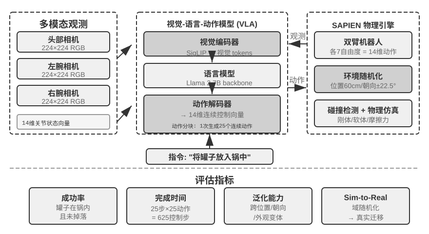

## 仿真环境：从评估到后训练的桥梁

评估的终点不是打分，而是改进。本章已经展示了改进的两条路径：调整 Harness（从 Benchmark 报告到系统改进）和把评估嵌入产品工程（内部评估基础设施）。而改进的最强形态是训练——当目标从“评估现有能力”扩展到“培养新能力”时，特别是通过第七章讨论的后训练技术，评估环境就需要演化为**仿真环境**：一个能让 Agent 反复练习、自动打分的虚拟操场。仿真环境与评估环境的核心区别在于：交互频率远高（数百万次 vs 数千次）、需要随机化（防止死记硬背特定配置）、以及必须提供即时反馈。从应用领域看，仿真环境分为数字环境（信息处理任务）与具身环境（物理世界感知与操作）两大类。

这座桥梁的两端是这样接起来的。评估侧已经积累的资产可以近乎无缝地转成训练信号：一套定义清晰的 Rubric 或验证器，本质上就是一个**可验证奖励（RLVR，Reinforcement Learning with Verifiable Rewards）**的奖励函数——判分脚本直接就是奖励脚本，测试是否通过、状态是否达标，既是评估的判据，也是强化学习的回报。但训练会提出评估阶段不必操心的新要求。其一是**可靠的 reset 语义**：训练要跑数百万个 episode（一个 episode 即一次从初始状态到任务结束的完整交互回合），每个 episode 都必须能把环境重置到一个确定、干净的初始状态，否则梯度信号会被上一轮的残留状态污染。其二是**远高于评估的吞吐**：评估几千次就够出结论，训练则要在可接受的墙钟时间内喂给模型上百万次交互，环境的并行度和单实例开销直接决定训练是否可行。这两点——奖励函数化的验证器、面向训练的 reset 与吞吐——都将在第七章展开。

**数字环境**方面，AWorld 框架为 GAIA 任务构建了可控的 MCP 服务器沙盒，提供 26 个 MCP 服务器、涵盖 126 个工具函数，避免直接访问真实 API 带来的封禁和不可控副作用。所有工具调用可重放、可审计。AWorld 的分布式架构将传统串行执行的 7695 秒缩短到 525 秒（14.6 倍加速），环境的无状态设计使每个实例完全独立，支持高效并行。

**具身环境**方面，RoboTwin2 基于物理引擎构建双臂操作任务，环境随机化物体位置、朝向和外观以提升泛化能力。观测空间包括多相机视觉和关节状态，通过**动作分块（Action Chunking）**——模型一次规划多个连续动作——实现实时控制（详见第九章）。OSWorld 通过虚拟机快照实现可重置性，AndroidWorld 聚焦移动应用自动化。无论数字环境还是具身环境，仿真环境同样需要第四章讨论的隔离执行环境与虚拟身份机制（VM/容器隔离、住宅代理、Human-in-the-Loop 认证、共享文件系统），此处不再重复。

> **实验 6-11 ★★：配置 OpenVLA 与 RoboTwin2 的具身智能环境**
>
> 搭建机器人操作的仿真环境。阅读 `ch7/SimpleVLA-RL` 和 OpenVLA 文档，理解视觉-语言-动作模型的架构（视觉编码器 + 语言模型 + 动作解码器端到端整合，图像和文本投影到共享语义空间）。配置 RoboTwin2 环境，理解观测空间（三视角 RGB + 14 维关节状态）和动作空间（14 维控制向量）。研究 move_can_pot 中的环境随机化机制和空间约束逻辑。运行预训练模型评估，记录成功率、完成时间和失败模式，重点关注动作分块机制的影响。
>
>
> 
>
>

### 保真度权衡与领域随机化

高保真环境能更好地迁移到真实世界，但计算开销大。保真度的另一维度是随机化程度：适度随机化能提升泛化能力，过度随机化则会让任务变得过于困难。**领域随机化（Domain Randomization）**是缩小仿真与现实差距（sim-to-real gap）的关键技术：在物理参数、视觉外观、传感器噪声等方面引入大范围随机变化——好比在各种光照和角度下都练习过抓取，到了真实环境也不会因为光线变化就失手。在数字环境中，sim-to-real 表现为界面渲染、响应时间等方面的差异，可通过引入延迟和失败的随机化来缓解。

至此，评估环境完成了它的最后一次演化：从度量能力的考场，变成培养能力的训练场。第七章将介绍 AWorld-train 如何把这类仿真环境改造为可训练的场地，以及其中的工程挑战——本章建立的评估体系与仿真环境，正是后训练的两块基石。
