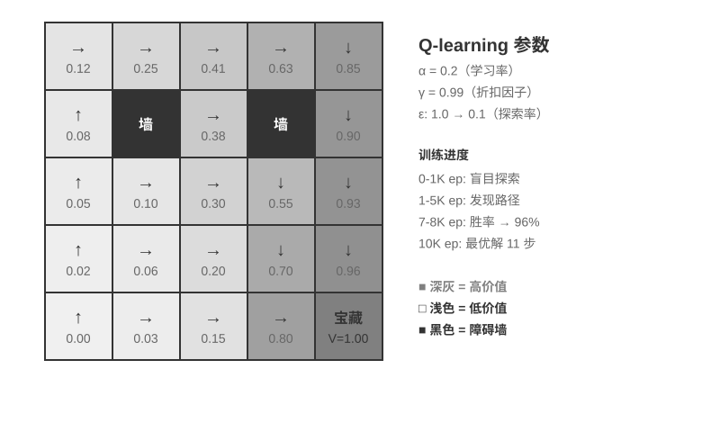
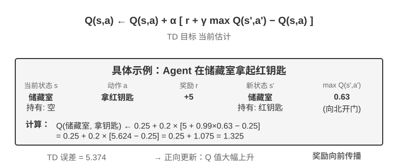
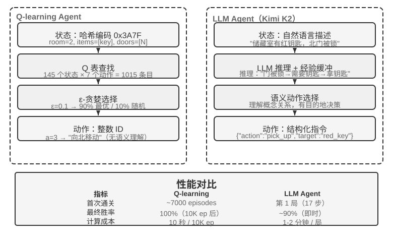

## 从经典 RL Agent 到现代 Agent `[可选阅读]`

### Agent 与环境的交互

**强化学习（Reinforcement Learning, RL）**的核心在于学习如何根据当前情境选择动作，以获得最大的**累积奖励（Cumulative Reward）**。想象一个学下棋的 AI：每走一步就是一个动作，赢棋得到正奖励、输棋得到负奖励，累积奖励就是整盘棋的总收益。Agent 和环境持续交互：每一步，Agent 观察当前状态，选择一个动作，环境产生新状态并给出奖励。

为了更直观地理解这种交互，下图展示了标准 RL 循环——Agent 在每个时间步观察环境状态，输出动作，环境据此给出奖励并转移到新状态。

交互产生**轨迹**——即“状态→动作→奖励→新状态→动作→奖励...”的完整记录，策略的优劣最终体现在轨迹质量上。**价值函数（Value Function）**回答的是这样一个问题：“如果我现在处于这个状态，按照当前策略一直行动下去，最终总共能获得多少奖励？”这就像一位经验丰富的棋手看到一个局面时，不需要算到最后一步，凭直觉就能估计出这盘棋的胜率。（当这里的“当前策略”换成“最优策略”时，得到的就是最优价值函数，本章后面讲 Bellman 最优方程时会用到。）Agent 与环境的边界遵循一个简洁的原则：**凡是 Agent 无法任意改变的，都属于环境**。

强化学习区别于监督学习（需要标注正确答案）和无监督学习（发现数据中的隐藏模式）的两个独特特征是**试错搜索**（Agent 必须自己摸索哪些动作好，没有老师直接告诉正确答案）和**延迟奖励**（动作的影响可能在多步之后才显现，比如一步好棋的价值到终局才看得出来）。由此还带来独特的**探索与利用权衡（Exploration-Exploitation Tradeoff）**：一直走熟悉的路，学不到新东西；一直乱试，永远到不了终点。

强化学习系统包含五个核心要素：

- **动作空间**：定义 Agent 可以采取的所有行动集合。动作可以是离散的（如棋类中“走哪一步”，选项有限）或连续的（如机器人“关节转多少度”，是一个连续数值）。
- **策略**：Agent 的行为准则，规定在给定状态下应该怎么做。策略可以很简单（一张查找表：看到状态 A 就执行动作 X），也可以很复杂（一个深度神经网络）。
- **奖励信号**：环境给出的即时反馈。但 Agent 的目标是最大化长期而非即时奖励——这个区别至关重要，就像投资不能只看今天涨跌，要看长期回报。
- **价值函数**：估计从某个状态出发，未来总共能获得多少累积奖励，帮助 Agent 在没有即时反馈时做出明智决策。过去六十年 RL 研究最重要的认识之一就是价值估计的核心地位。
- **环境模型**（可选）：预测环境对动作的响应。有了环境模型的方法称为**基于模型的方法**（先学会预测环境怎么变化，再据此规划），没有环境模型的称为**无模型方法**（不去预测环境，直接从经验中学习）。

表7-3 对比了各种 Agent 系统的关键组成要素，揭示了 Agent 概念的普遍性，并帮助读者看到传统 RL Agent 与现代 LLM Agent 在动作空间上的差异。

表7-3 不同 Agent 系统的关键要素对比

| Agent 类型 | 环境 | 动作空间 | 奖励信号 |
|---------------|---------------------|----------------------------------|-------------------------|
| **新生小羚羊** | 地形、重力、身体姿态 | 连续高维（各肌肉群收缩） | 平衡(+)、跌倒(-) |
| **扫地机器人** | 房间布局、电量 | 离散（方向、吸尘、充电） | 清洁面积(+)、电量耗尽(-) |
| **国际象棋大师** | 棋盘状态、时间限制 | 离散有限（合法走法） | 赢棋(+1)、输棋(-1) |
| **客户服务 Agent** | 对话历史、知识库 | 开放式（思考、说话、API 调用） | 问题解决(+)、处理时间(-) |
| **代码助手 Agent** | 需求文档、代码库 | 开放式（思考、搜索、编辑、执行） | 测试通过(+)、引入 bug(-) |

表格揭示了一个重要洞察：传统 RL Agent（棋类、机器人）的动作空间是封闭的，而基于 LLM 的现代 Agent（客户服务、代码助手）的动作空间是开放的、几乎无限的，并且可以利用“内部思考”这种特殊动作来提升能力。

### 两种 Agent 范式：从 MDP 到 LLM+RL

两者最根本的差异在于动作空间——MDP 假设动作空间是有限且封闭的（向上/向下/拿/放），而 LLM 的动作空间是开放的、组合爆炸的自然语言序列。这一差异决定了两类范式在算法设计、样本效率、泛化能力上的根本分野。下面分别展开。

**传统范式：MDP 与 Q-learning。**

MDP（Markov Decision Process，马尔可夫决策过程）是强化学习的数学框架，定义了状态、动作、奖励等核心要素。它的核心假设是**马尔可夫性质**：未来只取决于当前状态，与更早的历史无关。打个比方，下棋时只看当前棋盘局面就足以决定最优走法，不需要回顾之前每一步是怎么下的。这个假设简化了问题，但也限制了对历史依赖的建模能力。

传统 RL Agent 的关键特征是**封闭动作空间**——Agent 可采取的所有行动形成预定义的有限集合。**经典棋类 Agent** 是最典型的例子：围棋 361 个落子位置虽庞大但完全确定有限，国际象棋考虑不同棋子移动规则但动作仍可枚举，Atari 游戏只有几到十几个离散动作。**机器人 Agent** 代表连续但有界的动作空间：关节角度、速度、抓取力度是连续值，但都有明确物理边界（最大旋转角度、最大扭矩、速度限制），维度由机器人自由度决定。

这种封闭性带来计算上的优势：可以枚举所有动作逐一评估，便于动态规划和蒙特卡洛树搜索，动作价值函数可以用表格或简单函数来近似。但它也限制了表达与泛化能力。传统 RL Agent 从零开始，纯粹靠试错学习——从随机策略出发，收集经验，更新价值函数或策略，如此反复直到收敛。

在这个框架下，最基础也最重要的算法之一是 **Q-learning**。它为每个“状态-动作”组合维护一个价值估计：在状态 s 下采取动作 a，之后一直按最优策略行动，总共能拿到多少奖励？直觉上，一个动作好不好，取决于它带来的即时回报，再加上“它把你带到的下一个状态有多好”。

把这个直觉写成等式，就是 RL 教科书里大名鼎鼎的**贝尔曼方程**（Bellman equation）的核心递归关系：**一个动作的真实价值 = 这一步拿到的即时奖励 + 到达下一个状态后能拿到的最大未来价值**：

$$Q^*(s, a) = r + \gamma \max_{a'} Q^*(s', a')$$

其中 $r$ 是即时奖励，$s'$ 是执行动作后到达的下一个状态（这里为直觉起见写成确定性形式，随机环境下需对下一个状态 $s'$ 取期望），$\gamma \in [0, 1)$ 是**折扣因子**——它决定 Agent 有多看重未来：$\gamma$ 越接近 1 越重视长期回报，越接近 0 越只顾眼前。前文反复出现的“累积奖励”，正是各步奖励按 $\gamma$ 逐步折扣后的总和 $\sum_{t} \gamma^{t} r_t$。算法每次行动后，把旧的估计值往“实际发生的结果”方向微调一点——这种“用一步实际结果修正旧估计”的范式叫**时序差分学习**（Temporal-Difference Learning, TD learning），经过成千上万次试错，估计值逐渐逼近真实值。

以下两张图分别展示 Q-learning 在网格世界中的探索过程与 Q 值的逐步收敛。

Q-learning 属于一种特殊的**离轨策略**（Off-Policy）方法——它可以用任意策略（包括随机探索）产生的数据来学习最优策略。在轨/离轨策略的严格定义与在 LLM 后训练中的对应关系，见后文“强化学习算法比较”一节。

> **实验 7-1 ★：Q-learning 在寻宝游戏中的表现**
>
> 为了验证 Q-learning 的特性与局限，我们设计了一个**寻宝游戏环境**。这个环境包含几个关键挑战：**隐藏机制**要求 Agent 自行发现钥匙和门的对应关系、武器效果和物品合成规则；**多步依赖**意味着完成任务需要正确的动作序列（最优解 11 步）；**稀疏奖励**意味着只有关键动作和最终胜利才有显著奖励，中间大部分步骤得不到任何反馈。
>
> Q-learning Agent 使用标准参数配置，采用 ε-贪婪探索策略（大部分时间选当前最优动作，偶尔随机尝试，随着训练推进逐渐减少随机探索的比例）。
>
> 学习曲线展现典型特征（episode 指一局完整的游戏，从开局到通关或失败算作一次）：
> - **前 1000 episodes**：0% 胜率，Q 表仅 124 个状态，Agent 在盲目探索
> - **前 5000 episodes**：依然没有稳定胜利，Q 表 133 个状态
> - **7000-8000 episodes**：胜率从 34% 逐步升至 96%
> - **10000 episodes**：100% 胜率，Q 表 145 个状态，找到 11 步最优解
>
> 整个训练仅需不到 10 秒（仿真效率极高），但需要将近 10000 次完整尝试。这展示了 Q-learning 的核心特征：需要大量随机探索才能偶然走通完整路径，价值信号的传播很慢，必须反复强化。纯符号化学习在没有先验知识时只能暴力搜索状态空间。
>
> 在游戏模拟器中，10000 轮试错只需 10 秒，代价微乎其微。但在真实世界的 Agent 场景中——每次打电话有成本、每次操作浏览器有延迟、每次错误决策可能造成不可逆后果——10000 次试错是完全不可接受的。这正是为什么现代 Agent 转向了基于 LLM 的方法：利用预训练积累的知识，在极少的交互中做出有效决策。
>
> MDP 的根本局限有三点：样本效率低（需要海量交互才能学会简单任务）、泛化能力差（在一个环境学到的知识很难迁移到另一个环境）、无法利用先验知识（每个新任务都要从头学起）。一旦面对自然语言或高维视觉这类复杂状态空间，这些局限就尤为突出。
>

**现代范式：基于 LLM+RL 的 Agent。**

大语言模型带来了全新的 Agent 范式，根本性地改变了 Agent 的构建方式——特别是动作空间设计。

传统 RL 的 Agent 只能通过改变环境来获得反馈：下一步棋、走一步迷宫。但 LLM 带来了一种全新的动作类型：内部思考。思考不会改变外部世界，但它能显著改善最终的行动质量。这个转变改变了一切：Agent 的动作空间不再只是“做什么”，还包括了“想多久、想什么”。

最重要的创新是**将思考（Thinking）作为一种特殊动作**纳入动作空间。在传统 RL 中，Agent 只能执行改变环境状态的外部动作（移动、攻击、拾取）；而在 LLM Agent 中，**内部思考成为动作空间的核心组成部分**——它不直接改变外部环境，没有即时奖励，几乎不限次数，成本也较低。

传统 RL 难以处理这类动作，根源在于探索空间太大且缺乏结构：从零学习的 Agent 就像蒙着眼在沙漠里找宝藏，只能随机乱撞。LLM 则不同。通过海量文本预训练，它已经内化了人类沉淀的思考规则：解数学题时遵循“识别条件→回忆公式→逐步计算”，写代码时遵循“理解需求→设计结构→实现细节”。这使 LLM 的思考沿着有结构的路径前进，极大地压缩了搜索空间。因此即使没有额外的 RL 训练，预训练后的 LLM 也能生成具备基本逻辑的思维链（Chain of Thought, CoT）。这种基本逻辑来自预训练语料中海量的人类思考过程（数学解题、代码注释、辩论回应等），模型通过 next-token prediction 隐式学会了“下一步应该是什么样的推理形态”。

RL 后训练则通过外部奖励教会 LLM 在特定任务中更高效地运用这些规则。语言结构本身也提供一种隐性的内部奖励——逻辑连贯的思维链（如“因为需要将外币换算成美元，所以第一步查询汇率”）生成概率高，逻辑混乱的（如“因为需要换算货币，所以先了解天气”）概率极低，天然引导模型偏好合理路径。

这种基于语言内在规则的思考能力，使 LLM Agent 能够理解从未见过的指令（零样本泛化），也能通过极少示例掌握新任务（少样本适应）——这与传统 MDP Agent 必须大量试错的范式截然不同。此外，新范式还具备组合泛化（把已知概念重新组合来应对新情况）、上下文学习（通过提示和示例快速适应）以及多模态理解（自然整合视觉、语言、动作等模态）等能力。需要注意的是，上下文学习的**效果**（零样本泛化、少样本适应）和它的**内部机制**是两回事——第二章分析过，注意力机制的工作方式更像检索而非推理，但这不妨碍它在任务适应方面产生强大的实际效果。

从封闭到开放的动作空间演进，反映了 AI Agent 范式的根本转变。除内部思考外，工具参数的多样性（自然语言查询、程序代码、复杂 JSON、多模态内容）使实际动作空间接近无限——一个代码解释器理论上可执行任何可计算的任务，一个搜索工具可探索整个互联网的信息空间。这既带来新机遇（Agent 可处理前所未见的任务、通过组合基础工具解决复杂问题），也带来新挑战（如何在开放环境中定义和优化奖励函数、如何在无限动作空间中高效搜索）。

以 Kimi K3 这类面向工具调用和长链思考优化的模型为例，可以看到 LLM+RL 范式的典型方向：在大规模语言预训练基础上，通过后训练强化问题分解、工具调用和自我纠错能力。**OpenVLA**（详见第九章）则展示了 LLM 时代的 VLA（视觉-语言-动作）架构范式：视觉编码器处理环境观察、语言模型理解指令并推理、动作解码器生成控制信号，实现语言条件控制与跨任务泛化。需要澄清的是，OpenVLA 本身是在近百万条机器人**演示轨迹**上通过模仿学习（行为克隆）训练的，属于 SFT 性质而非 RL；真正把 RL 引入机器人、在这类 VLA 架构之上用奖励进一步优化的代表，是本章后面实验 7-13 的 SimpleVLA-RL。

**OpenAI 的探索之路**（姚顺雨（普林斯顿大学助理教授、ReAct 论文作者）在《The Second Half》中详细记录）揭示了认知上的演变。**第一阶段（2015-2016）算法中心主义**：相信更好的算法才是关键，在 Atari 等标准环境取得进展，但换一个新环境就得从头训练。**第二阶段（2016-2018）环境的重要性**：Gym 标准化了各类任务，Universe 和 World of Bits 试图把整个互联网变成 RL 的训练环境，Dota 2 在特定复杂环境中追求超人表现。思路很清晰，但通用计算机使用和网页导航始终无法突破。

**第三阶段（2018 至今）先验的觉醒**：GPT-2/GPT-3 展示了语言预训练的强大力量，WebGPT、ChatGPT 证明这些先验知识可以转化为实用 Agent。最重要的发现是：**先验知识可以通过与 RL 完全无关的方式获得**。这是一个反直觉的真相：几十年来 RL 研究者的优先级可能完全颠倒了——不是算法 > 环境 > 先验，而是先验 > 环境 > 算法。

> **实验 7-2 ★★：传统 RL 与 LLM Agent 的对比研究**
>
>
> 
>
>
> 在同一个寻宝游戏中对比 Q-learning 与 LLM Agent（Kimi K3，维护最多 50 条经验的缓冲区）。结果令人震撼：**LLM Agent 第一局就在 18 步内通关**。
>
> **前期（有目的的探索）**：拿起生锈的剑（“武器总比空手好”），系统探索地图，发现北门被锁后推理 “需要找钥匙”，转而探索储藏室，先后取得红钥匙与魔法水晶。**中期（机制理解与主动合成）**：理解 “钥匙自动使用” 规则，并预判生锈的剑不足以对付守卫，于是在第 8 步主动合成银剑。**后期（执行与纠错）**：持银剑向北，第 13 步击败强守卫，其间夹杂一两步无效尝试（重复挥剑/回退），最终在第 18 步取得巨龙宝藏。
>
> 这展现了语义理解与符号映射之间的根本差异。LLM Agent 理解了游戏的概念结构，每一步都有目的和逻辑支撑。而对 Q-learning 来说，“门”“钥匙”“剑”只是无意义的符号组合，只能通过大量统计学习慢慢发现它们之间的关系。
>
> 计算成本形成了一个有趣的悖论：Q-learning 跑 10000 局只需 10 秒，LLM Agent 一局却要 1-2 分钟。但在现实任务中，每次交互的时间、金钱和风险成本远超纯计算成本，所以单看 GPU 时间并不公平。更关键的洞察是：LLM Agent 的成功不是因为拥有更好的“学习算法”，而是因为携带了海量先验知识。当游戏规则变化时，Q-learning 需要完全重新训练，LLM Agent 却能通过推理直接适应。由此可以得出实用的设计原则：在仿真成本低、可大量重复的场景中，传统 RL 仍然有价值；在交互成本高、需快速适应的现实场景中，LLM Agent 的样本效率更为实际。
>

至于上下文学习、外部化学习与参数化学习（后训练）这三种学习范式各自的定位与协同，第一章已有系统对照，本章末尾的“完整图景”也会回到这个话题。本章的主线是其中的后训练——把交互策略写进模型参数。
