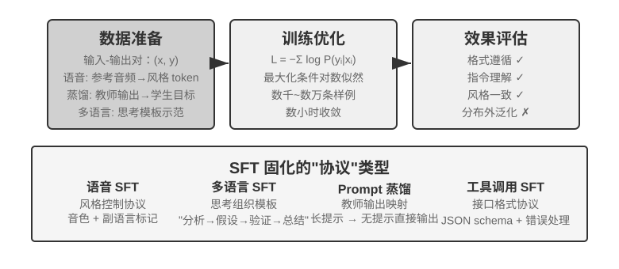

## SFT（监督微调）

7.1 节已经讲透了 SFT 的本质（换了数据、只在回答上算损失的“预测下一个词”）。这一节用四个实验，看看这套“把稳定映射与协议写进参数”的机制在不同任务上具体固化了什么。SFT 的核心价值不在于注入新知识，而在于**固化协议**：把映射关系、交互格式、风格规范写入参数，使推理时无需冗长提示即可产出符合预期的输出。通常只需数千到数万条高质量样例，即可建立基本的对话能力与指令遵循。

高效性的代价是对训练分布的强依赖：SFT 倾向于记忆而非泛化，一旦测试时遇到训练中没见过的情况，性能往往明显下降。接下来的实验将从不同角度展示这一“固化协议”的过程。

在动手做 SFT 之前，有一个绕不开的实操问题：**SFT 数据从哪来？** 工业界的答案基本就三条路：**人工专家示范**——质量天花板最高，但贵且慢，适合用来定义格式与风格的“种子数据”；**教师模型生成**——即合成数据，让强模型批量产出“输入—输出”对，过滤后再蒸馏给学生（实验 7-8、7-9 都是这条路）；**模型自举**——模型自己对同一问题采样多条候选，用验证器筛出正确样本再反过来训练自己，这就是拒绝采样微调，详见实验 7-9。三条路经常组合使用：先用少量人工种子立住格式，再用教师模型放大规模，最后用拒绝采样把质量拉齐。无论走哪条路，构造流程都大同小异：先定义任务分布与输出 schema，再批量生成候选，然后用规则校验、格式检查加人工抽检做质量过滤，最后去重、平衡配比、保证多样性。量级上不必贪多——数千到数万条高质量样本通常就足以固化协议，与其堆十万条脏数据，不如精修一万条干净数据：数据里的每一处噪声，SFT 都会忠实地写进参数。

> **实验 7-6 ★★★：语音 SFT——从 “声音复制” 到 “副语言建模” `[扩展实验]`**
>
> 以 Orpheus（语境提示 voice cloning）与 Sesame（副语言标记建模）为对象，展示如何将“声音风格与表达习惯”写入参数。两者思路不同：
>
> - **Orpheus**：把声音波形压缩为 token 序列，通过拼接同一说话者的参考音频，让模型学会“用这个人的声音说话”，实现跨句音色一致。
> - **Sesame**：将笑声、叹气等副语言现象抽象为 `<laugh>`、`<sigh>` 等特殊标记，训练模型学会“看到标记就发出对应的声音”。
>
> SFT 在表达型任务中固化的是风格控制协议与结构化表达习惯，而非事实知识或复杂思考。关键在于训练数据的多样性和标注质量。常见失败模式：训练数据中说话者过少导致所有人听起来一个腔调；标记过拟合（Overfitting，即模型死记硬背了训练样本的细节，遇到新情况反而表现更差）产生“机械笑”。
>
> **实验 7-7 ★★★：多语言思考——让模型用任意语言思考 `[扩展实验]`**
>
> 大多数思考模型只会用英语“思考”：不管你用什么语言提问，模型内部的思维链几乎都是英文的，因为训练数据中高质量的思考示范基本都是英语写的。本实验的目标很简单——让模型能够用指定的语言进行思考。
>
> 做法是对 gpt-oss-20b 进行 SFT：在系统指令中加一句 `reasoning language: German`（或其他语言），然后用英语、西班牙语、法语等几种语言的思考样例进行训练。训练数据中**完全没有中文**，但训练完成后，只要把 reasoning language 设为 Chinese，模型就能用中文进行完整的思维链思考——这种零样本的跨语言泛化是本实验最有意思的发现。需要注意，这并非 SFT 本身的泛化能力。多语言预训练已经在模型中建立了跨语言的共享表征空间，SFT 只是激活了这种预训练时已有的跨语言能力。
>
> **实验 7-8 ★★：Prompt 蒸馏——以更小开销复现可用能力**
>
> 在实际应用中，为了让模型完成复杂任务，常常需要设计冗长的系统提示（数千甚至上万 token），每次调用都会增加延迟与费用。使用思考型大模型时，内部思考 token 进一步放大成本。Prompt 蒸馏的思路是把“长提示 + 思考型教师”的行为压缩到“短提示/无提示 + 非思考学生”中。教师在完整提示与思考模式下生成高质量答案，训练数据只保留用户输入与最终结论，丢弃冗长提示与中间思考过程。学生学会“直接给出结论”，蒸馏后在相同输入上接近教师的输出质量，同时因为不需要处理冗长提示和思考 token，延迟与费用显著降低。
>
> 蒸馏可以在两个维度进行：“大到小”（用中小模型替代大模型，在成本和质量之间取得折中）和“思考到非思考”（同等规模下把显式 CoT 折叠为隐式参数化知识，获得 20-30 倍的响应速度提升）。两者并不冲突，在生产环境中经常同时使用。需要注意的是，蒸馏会继承教师的边界——若教师在长尾分布上有系统性错误，学生会进一步硬编码这些错误；若教师依赖工具来确保正确性，单纯的输出蒸馏会失去工具带来的鲁棒性。工程启示：当产品形态稳定、输入分布可预期、成本约束明显时，Prompt 蒸馏是很好的优化手段；而在探索期或任务尚未定型的阶段，保留显式思考与可编辑的提示工程仍是快速试错的核心。
>
> **实验 7-9 ★★★：思维链（Chain of Thought, CoT）蒸馏 `[扩展实验]`**
>
> Prompt 蒸馏丢弃思考过程，CoT 蒸馏则相反：把强教师模型的**完整思考轨迹**转移给学生模型。对能力较强的教师模型进行 CoT 蒸馏，在同等参数量下可恢复教师 70%-80% 能力。对于不追求刷新前沿能力边界、但寻求自主可控模型的团队，这是最务实的跟随者策略。DeepSeek-R1 发布时同步开源的一系列蒸馏小模型（用 R1 的思考轨迹对 Qwen、Llama 系列做 SFT），正是这条路线的代表。
>
> **背景：“思维围墙”现象**。一些闭源思考模型（如 OpenAI o 系列、Gemini 系列）在思考时会生成内部思维链，但用户看到的并非原始思考过程——厂商出于防蒸馏、安全和产品体验等考虑，通常会在输出前对 CoT 进行改写或摘要，最有价值的原始思考过程被隐藏在 API 之后。这正是本实验选择开源思考模型作为教师的原因：DeepSeek V4、Kimi K3、GLM 5.2 等模型直接公开完整思维链，蒸馏在技术与许可上都可行（使用前仍应确认模型许可证对蒸馏产物的授权条款）。
>
> 这里有一个更实际、也更重要的判断：**对绝大多数做后训练的人来说，根本不需要去蒸馏闭源模型的思维链。** 当前最先进的开源模型与 SOTA 闭源模型的差距并没有想象中大；教师模型只需要“明显高于学生”，不需要“全球第一”。如果你要后训练的是 200B 及以下规模的模型，用开源 SOTA 模型当教师已经完全够用。
>
> **实验设计**：三步流程。第一步，**采集轨迹**：从目标任务分布（如数学、代码）采样问题，用开源教师模型生成完整的“思考 + 答案”轨迹，并用规则验证器过滤掉最终答案错误的轨迹——否则错误的思考过程会被学生一并模仿。这一步“生成候选—验证过滤—只留正确轨迹”的做法有个专门的名字：**拒绝采样（Rejection Sampling）**。用它构造的数据做 SFT，就是**拒绝采样微调（Rejection Sampling Fine-Tuning, RFT）**。它介于纯 SFT 与 RL 之间：不训奖励模型、不做策略梯度，只靠“从多条采样中拒绝错的、留下对的”来提升数据质量，是可验证任务上性价比极高的数据构造手段。第二步，**SFT 训练**：以“问题 → `<think>` 思考轨迹 `</think>` + 最终答案”为训练对，对小模型（如 7B 量级）做标准 SFT。第三步，**对比评估**：在同一基准上对比蒸馏前后的学生模型与教师模型，衡量能力恢复比例。
>
> **验收标准**：蒸馏后的学生模型在数学/代码基准上相对蒸馏前显著提升，且思考轨迹中出现教师式的反思、回溯与验算行为。同时注意蒸馏的代价：学生会继承教师的系统性错误和冗长思考习惯（后者可结合实验 7-10 的 AdaptThink 思路做二次优化）。
>

这四个实验有一个共同特征——“把稳定的映射与协议写进参数”：语音 SFT 固化风格控制协议，多语言 SFT 固化思考组织模板，蒸馏 SFT 固化输入到输出的直接映射。它们的共性是目标明确、格式清晰、评估标准稳定，因此 SFT 能以极高的样本效率达成收益；而一旦分布变化，记忆倾向就会暴露为性能下降。这正是 7.1 节“SFT 与 RL 的本质区别”所讲的记忆—泛化分野在实验层面的体现。
