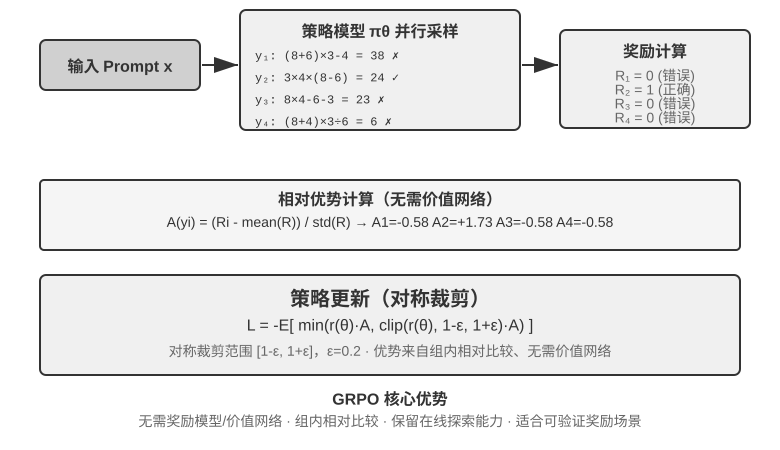

## 强化学习算法比较

前面的单轮实验证明了 RL 的泛化优势，上一节又引入了 RLHF 的偏好优化路线，但这些工作使用的具体算法各不相同、也只是众多选择中的一部分。在进入更复杂的多轮任务之前，有必要系统梳理主流算法的特点和适用场景。

> **先说一句最重要的话，免得读者陷进公式里。** 本节列了不少算法名字和公式，但请记住本章主线二：**在工业界，现成的 RL 算法（PPO、GRPO 等）你知道怎么用、能选对就够了，真正决定成败的是数据和环境，而不是算法本身。** 这些算法早已封装进 veRL、TRL 等成熟框架，调用它们通常只是改几行配置。所以本节的目标不是让你会推导，而是让你建立一张“什么场景用什么算法”的选择地图；公式部分（面向训练工程师）看不懂可以跳过，不影响后面的阅读。下一节会正面讲清“为什么数据和环境比算法更重要”。

现代 LLM Agent 的 RL 场景与传统 RL 存在本质差异——Agent 需要在多轮对话中理解用户意图、调用工具、生成结构化输出并进行长链思考，这种多目标、多阶段的决策，让“选对算法”有一定影响，但影响远不如数据与环境。

从实现路径看，RL 算法分为**在线探索方法**（通过与环境交互探索新策略）和**离线优化方法**（基于已有数据优化，更稳定直接）。这里顺便给出一对前文承诺过的严格术语：**在轨策略（On-Policy）**方法只用当前策略自己新采样的数据来更新自己，**离轨策略（Off-Policy）**方法则可以用其他策略（或旧版本策略）产生的数据来学习（如前文的 Q-learning）。按这个口径对齐本章讨论过的方法：SFT 是离轨的模仿学习——数据来自教师或人类示范而非模型自身；PPO、GRPO 用于 LLM 训练的标准形式是在轨的——每一轮都用当前模型新采样的 rollout（即让模型完整跑一遍任务、生成一整条从头到尾的轨迹）更新；DPO 则是离线的偏好优化，既不在线采样、也不做严格意义上的策略迭代。

这些算法大多建立在**策略梯度**（Policy Gradient）的同一思想上：朝着“能提高期望回报的方向”调整策略参数 $\theta$。其最基本的形式（REINFORCE）为：

$$\nabla_\theta J(\theta) = \mathbb{E}\big[\nabla_\theta \log \pi_\theta(a \mid s)\, G\big]$$

其中 $\pi_\theta(a\mid s)$ 是策略（在状态 $s$ 下选择动作 $a$ 的概率），$G$ 是这条轨迹（或从该步往后）的累计回报——回报越高，就越强化产生该动作的概率。直接用整条轨迹的回报 $G$ 作为权重虽然无偏，但方差很大；于是引入一个基线 $b$，改用**优势**（Advantage）$\hat{A}=G-b$（这个动作比平均水平好多少）作为权重来降低方差。接下来的 PPO 与 GRPO，本质上就是在“如何稳定地估计并使用优势 $\hat{A}$”上给出的两类改进。

**PPO** 用“裁剪”限制每次更新的幅度，避免策略一步跑偏：

$$L^{\text{CLIP}}(\theta) = \mathbb{E}\Big[\min\big(\rho\,\hat{A},\ \operatorname{clip}(\rho,\, 1-\epsilon,\, 1+\epsilon)\,\hat{A}\big)\Big],\quad \rho = \frac{\pi_\theta(a\mid s)}{\pi_{\theta_{\text{old}}}(a\mid s)}$$

其中 $\rho$ 是新旧策略的概率比，$\epsilon$（如 0.2）限定单步可调整的幅度；后文“Clip-Higher”正是放宽了 $1+\epsilon$ 这个上界。

**GRPO** 则省去价值网络（value network，PPO 里额外训练的一个辅助神经网络，用来给轨迹中的每一步单独估计价值函数、从而算出更细的优势），改用“组内相对比较”来估计优势：对同一问题采样 $N$ 条轨迹得到回报 $r_1,\dots,r_N$，把每条的优势定义为它在组内的相对表现：

$$\hat{A}_i = \frac{r_i - \operatorname{mean}(r_1,\dots,r_N)}{\operatorname{std}(r_1,\dots,r_N)}$$

即“比同组平均好则为正、差则为负”，无需价值网络——这正是它成本更低的原因。需要注明：上式省略了 KL 正则项，实际训练中通常还要加上前一节介绍的 per-token KL 惩罚，把策略约束在参考模型附近。

表7-4 总结了主流方法的核心特点。阅读时注意区分两件常被混为一谈的事：**奖励从哪来**（规则验证器、学习到的奖励模型，还是人类偏好数据）与**用什么算法优化**。PPO 和 GRPO 对奖励来源并不挑剔——既可以接规则验证器（RLVR），也可以接奖励模型（RLHF）；它们的真正差异在于优势估计方式（价值网络 vs 组内相对基线）。

表7-4 后训练与推理时优化方法对比

| 方法 | 类型 | 核心思路 | 优势 | 劣势 | 适用场景 |
|--------------|-----|-------------------|---------------|--------------------|----------------------|
| **REINFORCE** | 在线 RL 算法 | 用整条轨迹的最终奖励来更新策略 | 实现简单 | 方差大、训练不稳定 | 理论基准；原始形式很少直接使用，但其带基线变体（RLOO、REINFORCE++ 等）是当前主流之一，GRPO 本质上就是带组内基线的 REINFORCE |
| **PPO** | 在线 RL 算法 | 限制每次更新幅度，防止策略“跑偏” | 稳定，价值网络提供更细粒度的信用分配 | 需要额外训练和存储价值网络，超参数敏感 | 多轮 Agent、长轨迹信用分配 |
| **GRPO** | 在线 RL 算法 | 对同一问题采样多条轨迹，组内相对比较“哪条更好” | 无需价值网络，成本低 | 优势按整条回复均摊，信用分配粗糙；依赖组内奖励有区分度 | 单轮/短轨迹任务，奖励区分度好的场景 |
| **DPO** | 离线偏好优化 | 把偏好对直接变成带隐式奖励的分类损失 | 极简高效，不需在线采样 | 无法探索新策略，受限于离线偏好数据的质量与覆盖面 | 已有高质量偏好数据的场景 |
| **KTO** | 离线偏好优化 | 仅需给单个样本打“好/坏”标签 | 标注成本极低 | 信号粗糙 | 标注资源极有限的场景 |
| **Best-of-N** | 推理时方法 | 推理时生成 N 个输出，选最优 | 不改模型，实施简单 | 推理成本成倍增加，能力不沉淀进参数 | 早期快速提升质量，为 RL 提供收益上界估计 |

回到本章的实验，如实交代各自所用的算法：GeneralPoints 与 V-IRL（实验 7-11、7-12）来自同一项研究，用的是带价值网络的 PPO；AdaptThink（实验 7-10）用的是自定义的约束优化目标加重要性采样；后文的 ReTool（实验 7-15）用的是基于 veRL 改造的 PPO（训练数据取自 DAPO-Math-17k，但优化算法仍是 PPO），SimpleVLA（实验 7-13）与 RLVP（实验 7-14）则基于 GRPO。多轮场景下信用分配问题更复杂，不同算法各有优劣。

实践中的选择路径：有可靠奖励信号且有计算资源 → GRPO（简洁）或 PPO（灵活，长轨迹信用分配更细）；有高质量偏好数据 → DPO/KTO（低成本）；早期探索阶段 → Best-of-N 快速起步。

看完这张表，你可能会想“那我到底该精调哪个算法”。答案可能出乎意料：**大多数情况下，哪个都行——先别在算法上纠结。** 下一节专门讲这件事。
