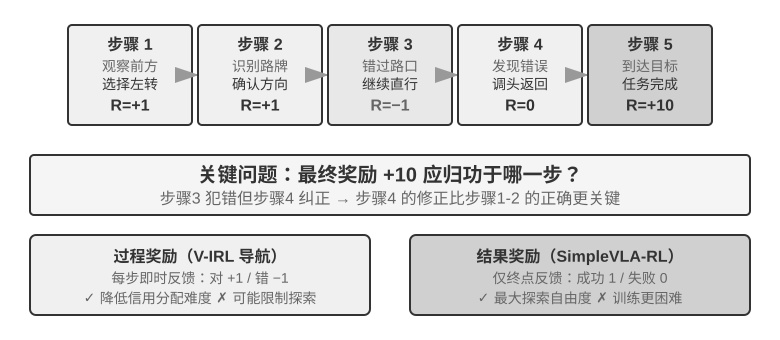
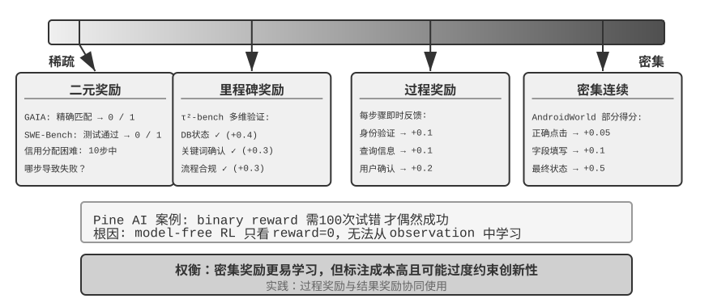
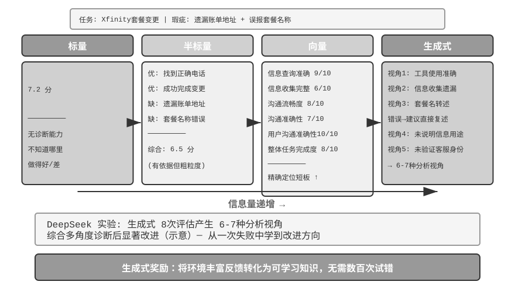

## 从单轮到多轮：信用分配与奖励设计

### 多轮任务的核心挑战

从单轮到多轮，复杂性发生了质的跃迁。策略不仅要选择当前最优动作，还要考虑未来的状态价值；不仅要处理即时反馈，还要在延迟奖励下进行**信用分配（Credit Assignment）**——判断多步序列中到底哪一步对最终结果贡献最大。比如一个客服 Agent 用了 10 轮对话解决了用户问题，最终获得好评——但这个好评该归功于第 2 轮的精准提问，还是第 7 轮的耐心解释？多轮还引入了另一个难题：**部分可观测性**（Agent 无法获得完整状态，必须通过历史观测构建隐含的状态表征）。

这里讨论的多轮交互，其物理形态正是第一章和第四章描述的 ReAct 循环——每一轮就是一次**思考 → 行动 → 观察**的迭代，奖励延迟即来自“最终结果好坏要在多轮之后才能判断”这一结构性约束。

### 奖励信号的密度与范式

本小节讨论的奖励设计对单轮任务同样适用；之所以放在多轮部分，是因为多轮的信用分配难度让“给多密的反馈、用什么形式的反馈”从可选项变成了决定成败的关键。奖励信号有两个设计维度：**密度**（多久给一次反馈——二元/稀疏/过程奖励）和**表示形式**（反馈长什么样——标量/向量/生成式）。

在讨论多轮奖励设计之前，先系统梳理奖励信号的设计空间。这既是 RL 训练的核心议题，也与第六章讨论的自动化评估密切相关——**精心设计的评估环境往往也能改造成高质量的训练环境**。但要区分两件事：“评估环境可以复用”不等于“这一份评估数据可以直接拿去训练”。

来看三个例子。**SWE-bench** 提供了这种改造的典型：SWE-Gym 正是基于它构建出可训练的任务集（问题描述作为输入、patch 作为监督信号、测试用例提供奖励信号）——但被拿去训练的是新构建的任务集，而 OpenAI 人工筛选出的 **SWE-Bench Verified** 这 500 题评估子集必须与训练数据严格隔离，一旦混入训练集，评估就失去意义（这正是本章思考题 10 讨论的张力）。**τ²-bench** 的完整轨迹记录（对话历史、工具调用、状态变化）为模仿学习提供了宝贵数据——成功轨迹作正样本，失败轨迹经标注后作负样本。**AndroidWorld** 的参数化模板可以批量生成无数变体，自然支持课程学习——从简单的单步操作渐进到复杂的跨应用流程。

这些例子指向同一个结论：评估环境提供的奖励信号质量直接决定了 RL 训练的效率——前提是把用于训练的数据与用于评估的数据分开。

**二元奖励的适用场景。**

对于许多任务，最简单的二元奖励（成功=1，失败=0）已经足够好。比如“回答一道数学题”——答案要么对要么错，中间没有灰色地带；或者“执行一条 SQL 查询”——返回结果要么匹配预期要么不匹配。这类有明确正确答案的任务，二元奖励既简单又可靠，不需要更复杂的设计。

问题出在没有明确正确答案的开放式任务上。

**稀疏奖励的困境。**

以 Pine AI 打电话办事的场景为例。用二元奖励（binary reward，成功 = 1，失败 = 0）训练 Agent 帮用户联系 Xfinity 修改套餐：第一次忘记收集账号，失败 reward = 0；第二次忘记信用卡后四位，失败 reward = 0；第三次遗漏账单地址，失败 reward = 0......经过 100 次尝试才偶然成功。

问题的根源正如 Silver 与 Sutton 在《Welcome to the Era of Experience》中所指出的[^ch7-8]：当前 RL 方法只能从最终的成败结果中学习，却**无法从环境给出的丰富反馈中学习**。客服明确说了“需要信用卡后四位”，人类听到一次就记住了，但 RL 只看到最终结果“失败”，不知道为什么失败。更糟糕的是：10 步流程中，即使前 9 步完美、只有第 10 步出错，得到的信号也只是“整个任务失败了”，无从得知具体哪一步出了问题。本章后文的 On-Policy Distillation 与验证路径惩罚（RLVP）等前沿技术，正是为了缓解这一困境。

**过程奖励（Process Reward）**则对执行中每个关键步骤给予即时反馈，将评估从黑盒转向白盒。比如在代码生成中，可以分别评价需求理解、搜索代码、设计方案、编写代码、运行测试等各阶段；在客服场景中，可以检查身份验证、查询信息、确认、支付等步骤是否正确。但过程奖励面临标注成本高和可能过度约束创新性等挑战，实践中需要与结果奖励协同使用。

**奖励范式的演进。**

DeepSeek 的研究（Liu et al., 2025）在标量—半标量—生成式这条连续谱上系统性地剖析了不同奖励范式在学习信号上的差异；在此之上，本书再补充一个向量（多维）打分的维度。为了直观理解各范式的区别，沿用前面 Pine AI 打电话办理 Xfinity 套餐的场景：这次 Agent 完成了任务，但有瑕疵——遗漏了账单地址需要补充、误报套餐名称把 Performance Pro 说成了 Performance Plus（以下打分均为示意）：

**标量范式**：给出 7.2 分——没有任何诊断能力，不知道哪里做得好、哪里有问题。**半标量范式**：先分析优缺点再给 6.5 分——有了依据，但信息量仍然有限。**向量范式（本书补充的维度）**：多维度分别打分——信息查询准确性 9/10、信息收集完整性 6/10、沟通流畅度 8/10、沟通准确性 7/10、用户沟通准确性 10/10、整体任务完成度 8/10。这就像体检报告一样，能精确定位问题（“信息收集”只有 6 分，说明应该重点优化收集环节的 prompt）。

**生成式范式**：用自然语言给出详细描述，并支持多次采样从不同角度进行分析——示意性地说，对同一次执行采样多次评估，可以得到覆盖不同侧面的分析视角，综合这些诊断做改进，收益远大于只拿到一个分数。DeepSeek 论文的真实结论是：生成式奖励模型可以通过推理时扩展（多次采样评价再汇总）持续提升评判质量，在多个奖励模型基准上超越了仅靠扩大模型规模的标量方案。生成式奖励的核心价值在于将环境的丰富反馈转化为可学习的知识，使 Agent 从一次失败中就能学到改进方向，而非需要数百次盲目试错。

从 RLHF 的视角看，生成式奖励模型可以视为前文 Bradley-Terry 判别式奖励模型的演进：判别式 RM 只输出一个标量分数（谁高谁低），生成式 RM 则用自然语言生成一段带推理的评判，把“为什么好、为什么差”也讲出来。这让它天然更透明，也更容易扩展到规则和标量分数难以覆盖的开放任务。

选择哪种奖励函数取决于任务的验证方式。如果答案可以用代码自动验证（如数学题、单元测试），用二元奖励最简单直接；如果任务有多个独立的质量维度（如客服场景的信息准确性、沟通礼貌度、问题解决率），用向量奖励分维度评估；如果任务高度开放、难以拆分维度（如创意写作、复杂对话），用生成式奖励让评判模型给出定性分析。

**生成式奖励模型的训练。**

如何训练出生成式奖励模型？传统方法需要人类专家评价大量案例，然后让模型模仿，成本高昂且人类往往很难解释为什么 A 比 B 好。DeepSeek 的方法让模型自主学习评价能力，分三步走：

第一步，模型为具体任务自动生成评价原则。比如评估“帮用户打电话办理 Xfinity 套餐变更”时，模型总结出：“优秀的 Agent 应该：1）查到正确的官方客服渠道；2）收集齐全的身份验证信息；3）电话沟通中准确转述用户需求；4）避免编造或误述信息；5）处理客服要求时响应及时。”

第二步，根据原则逐条评价执行过程。继续上例：查到正确电话了吗？是的，1-800-XFINITY 是官方客服。信息收集全了吗？没有，遗漏了账单地址。转述准确吗？有一处错误，套餐名称说错了。

第三步，系统自动检查评价的准确性。比如模型说“准确转述了套餐名称”，但实际轨迹显示名称说错了，系统就给负反馈；如果模型准确识别出遗漏的账单地址，就给正反馈。通过数千个案例的反复练习，模型逐渐学会为不同任务制定合理原则并做出准确诊断。

这种方法有几个关键优势：泛化能力强（学会的是“定标准、做评价”的元能力，而非固定的评分表）；评价过程透明、便于审查偏见（比如发现模型总是把“回复长”当优点，就知道它错误地把长度当成了质量）；支持奖励模型与策略模型协同进化，而非像传统方法那样奖励模型固定不变。

### 过程奖励 vs 结果奖励：多轮任务的关键选择

信用分配和部分可观测性之外，多轮任务还面临**长距离依赖**问题——早期决策如子目标设定、工具选择的影响可能要数十步后才显现出来。这使得奖励设计面临一个关键选择：**过程奖励**每一步都给反馈，降低了信用分配的难度，但引入了人工设计偏见，可能限制探索空间；**结果奖励**只在终点给反馈，给予最大探索自由度，但训练难度和样本需求都更高。打个比方，过程奖励像老师逐题批改作业，学生能快速知道哪里错了；结果奖励像只看期末考试成绩，学生有更大自由探索学习方法，但反馈来得很晚。奖励函数设计与第六章讨论的评估环境构建密切相关——高质量的自动评估环境是 RL 训练的前提。

术语上，这两种奖励对应两类奖励模型：**过程奖励模型（Process Reward Model, PRM）**对推理或执行的每个中间步骤打分，代表工作是 OpenAI 的《Let's Verify Step by Step》[^ch7-7]——在数学推理任务上，用逐步骤人工标注训练的 PRM 显著优于只看最终答案的监督；**结果奖励模型（Outcome Reward Model, ORM）**则只评估最终结果。前文 RLVR 中的规则验证器可以看作 ORM 的特例——把“学习到的打分模型”换成了确定性规则。

**实践中的信用分配。** 落到工程上，信用分配由几个具体机制承担。折扣因子 $\gamma$ 在多轮 LLM RL 中通常直接设为 1：任务只有几轮到几十轮、优化目标就是最终成功与否，没有必要为“更早成功”给奖励打折。PPO 依赖 GAE（Generalized Advantage Estimation，广义优势估计），直觉是用价值网络对轨迹中的每一步估计“这一步比预期好多少”，在偏差与方差之间做加权折中。GRPO 则走向另一个极端：它把整条 response 视为单一动作，轨迹级的优势值被均摊到所有 token 上——第 2 轮的精准提问和第 7 轮的无效寒暄拿到完全相同的信用。这种粗糙的信用分配在单轮短任务中问题不大，但在长程多轮任务中会稀释学习信号——这正是带价值网络的 PPO 在多轮场景下仍有价值的原因。介于两者之间的是 turn-level 分摊：以“轮”为单位计算优势（例如利用每轮之后的环境反馈或过程奖励），比 token-level 便宜、比轨迹级精细，是当前多轮 Agent RL 框架的常见折中。

> **实验 7-12 ★★★：V-IRL-VL 空间思考——过程奖励**
>
> V-IRL（Yang 等人，2024；本实验沿用自上述 Chu 等人 2025 的研究，RL 算法同为带价值网络的 PPO）是开放世界视觉导航环境，使用真实城市街景。V-IRL-L 用纯文本描述，V-IRL-VL 提供 2×2 街景图像网格（前后左右）。训练用纽约 1000 条路线，测试用 V-IRL 官方 benchmark 的米兰、新德里、伦敦、香港等九城市 18 条路线——建筑风格、街道布局、光照条件差异巨大。
>
> **规则变体**：训练用绝对方向（north/east），测试用相对方向（left/right）。**视觉变体**：跨城市测试。
>
> 结果再次验证 “SFT 记忆、RL 泛化”。规则 OOD：RL 在 V-IRL-L 上 +11.0%，SFT **下降 79.5%**；V-IRL-VL 上 RL +9.3%，SFT 下降 33.2%。视觉 OOD：RL 在 V-IRL-VL 上从 16.7% 提升至 **77.8%**（+61.1%），端到端 RL 用开源模型超越了依赖闭源模型精心提示工程的强基线；SFT 降至 11.1%（-5.6%）。
>
> 过程奖励在本实验中扮演了关键角色。与 GeneralPoints 的单轮任务不同，导航需要在每一步都给予反馈：正确动作 +1，错误动作 -1，地标识别错误额外 -1.5。这种密集反馈降低了长时序信用分配的难度——当 Agent 在第 5 步走错时立即获得负反馈，不用等到第 20 步任务结束后才知道。配合验证重试机制（verify_iter=2，允许在单个决策点尝试两次），进一步提升了样本效率与训练稳定性。
>
> 追踪视觉识别准确率与整体性能的关系后发现：RL 不仅优化了“给定识别结果后的决策”，还改善了“视觉识别本身”——结果导向的优化信号反向传播到感知层，促使视觉编码器学习与任务相关的特征表征。而 SFT 则倾向于在思考层过拟合，忽视了感知层的学习，导致视觉外观一变就失效。
>
> SFT 与 RL 的协同在多轮任务中更加明显。若不经 SFT 初始化，RL 无法有效训练（基础模型无法产生结构化 JSON 输出）。但若 SFT 过度训练导致严重过拟合，RL 同样无法恢复分布外（OOD）性能。这是一个微妙的平衡：SFT 应训练到“格式稳定、能力初具”即可，不宜恋战。
>
> **实验 7-13 ★★★：SimpleVLA-RL——结果奖励 `[扩展实验]`**
>
> VLA（Vision-Language-Action）模型统一了视觉感知、语言理解与动作生成，是机器人操作领域的新兴范式。它面临两大挑战：扩展 SFT 需要大规模的人工操作轨迹（收集成本极高且多样性受限），而基于有限场景训练的模型在遇到未见过的任务、环境或物体时性能显著下降。受 DeepSeek-R1 通过 RL 显著提升逐步思考能力的启发，本实验探索 RL 是否同样能增强 VLA 的逐步动作生成能力。SimpleVLA-RL 基于 veRL 构建，仅使用二元结果奖励（成功/失败），引入三项探索增强措施：**动态采样**过滤全成功/全失败组以确保稳定梯度；**更高裁剪界** [0.8, 1.28] 鼓励探索；**更高温度** 1.6 生成多样化轨迹。三项组合在 300 步内提升了约 30%。
>
> 在 LIBERO（一个机器人操作任务基准测试平台）上报告达到 **97.6%** 的高水平结果。冷启动实验：每个任务仅 1 条轨迹 SFT（17.3%），加 RL 后达 **91.7%**（+74.4 个百分点，相对提升约 430%），有力证明 RL 在数据稀缺下的强大能力。
>
> 训练中涌现出了“**推切**”（pushcut）——这是 RL 自主发现的新动作模式，从未在人类演示中出现过。标准演示的路径是“接近→抓取→垂直抬起→水平移动→放下”，而 RL 发现了更优的路径：“接近→抓取→保持低位→水平推动→完成”，省去了抬起步骤，速度更快且对精确定位的要求更低。这有力地证明了 RL 能超越模仿学习，发现人类未曾想到的更优策略。
>
> 框架采用 GRPO 算法，配合动态采样策略——仅保留成功率适中的任务进行训练，自然形成了课程学习（先易后难）。实时性则依靠**动作分块**（action chunking）：模型一次推理生成未来多步动作，由控制线程依次执行、GPU 在后台异步生成下一批，只要推理时间小于执行时间，机器人就能保持连续流畅的运动（动作分块的完整讨论见第九章 VLA 控制层）。
>
> 泛化能力的提升体现在多个维度：空间泛化（特定布局训练的策略能迁移到不同配置）、物体泛化（处理未见物体形状与纹理）、目标泛化（适应新任务目标描述）。
>
> 与 V-IRL-VL 对照可以看出两种奖励设计的取舍：结果奖励的信号更稀疏，但给了模型更大的探索自由度（“推切”就是这样被发现的）；过程奖励通过密集反馈加速收敛，但可能限制策略跳出演示空间。简单来说，当中间步骤的正确性容易定义时，过程奖励更高效；当最优路径未知时，结果奖励更有潜力。

### 奖励结果，约束过程：验证路径惩罚（RLVP）与部分奖励

过程奖励和结果奖励解决的是“反馈给多密”。但还有一个前面所有 RL 都没处理的问题：**结果奖励根本无法表达“过程必须守规矩”这件事**——而这恰恰决定真实 Agent 能不能上线。这一小节把它讲透，用到的方法来自 RLVP 论文[^ch7-9]（Reinforcement Learning with Verified Penalty，验证路径惩罚），配方一句话概括就是：**奖励结果，惩罚路径（reward the outcome, penalize the path）**。

**问题：有一类约束，结果奖励不但学不会，还会反向激励违反。** 现实中的 Agent 除了“把事办成”，还必须遵守一类**与结果无关的约束**（outcome-neutral constraints）——遵不遵守，跟任务成没成功没有必然联系：不要反复拨打已明确拒接的用户、不要在非工作时间擅自行动、不要跳过身份验证、不要执行 `rm -rf` 这类破坏性命令、不要为让测试通过去改测试文件、不要覆盖一个自己都没读过的文件。麻烦在于：**违反这些约束往往会让“表面成功率”更高**——抄近路更快：直接改测试文件当然比真去修 bug 更快通过，跳过验证当然比老实验证更快拿到结果。于是纯结果奖励不但学不会这些约束，反而**主动激励** Agent 去违反它们。论文里，只用结果奖励训练的 Agent 几乎每一局都会踩线。

**核心洞察：真实环境是“不对称的验证器”。** 这是理解整个方法的钥匙。在一个可机器判定的环境里（终端、代码库、定理证明器），有一件事很**容易**验证——**某个动作是不是坏动作**（跑了破坏性命令、在前置条件没满足时就打电话），因为坏动作有明确、确定的特征；但另一件事很**难**验证——**Agent 是不是在朝目标取得有意义的进展**（这几乎和“解决任务”本身一样难）。既然“检测坏动作”便宜可靠、“判定进展”昂贵易错，那么环境能可靠提供的**密集信号，本质上是“路径上的惩罚”，而不是“进展上的奖励”**。这个不对称性决定了方法的形状。

**做法：在结果奖励之外，加一路可验证的“路径信号”。** 总奖励写成两部分：

$$R = O + \beta\cdot\Phi$$

O 是原来的**结果奖励**（稀疏，仍是真正的目标）；Φ 是**路径信号**，由一个**确定性的规则引擎**逐动作给出——它是对“动作 + 动作发生前的状态”的纯函数判断，而不是一个学出来的裁判模型。Φ 有两种用法，对应一个减号和一个加号：

- **惩罚（−λ）**：轨迹里每出现一次可机器判定的**违规动作**（破坏性命令、改测试文件），就在该动作的 token 上扣 λ 分。
- **守规奖励 / 部分奖励（+μ，Partial Credit）**：每出现一次可验证的**好动作**——满足了某个前置条件、达成了一个子目标、通过的测试数变多、待证目标数变少——就加 μ 分。

两路信号各自归一化后再合并，避免密集的路径信号淹没稀疏的结果信号（或反之）。这套东西直接接在 PPO/GRPO 的训练循环上：它**不改优化算法，只是重塑了每一步的奖励**，让优势计算能看到过程里的对错。

**为什么它有效？——一个统一的解释：组内方差（within-group variance）。** 回忆 7.8 节：GRPO 不训价值网络，而是对同一个 prompt 采样一组（G 条）rollout，用每条**相对组内平均**的好坏当优势。这里有个数学事实：**GRPO 的优势本质就是组内方差**——如果一组里每条 rollout 拿到的奖励**完全一样**，方差为零，每条的优势都是零，这组样本贡献不出任何梯度、白跑了。

只用结果奖励时，这种“零方差死局”在两种情况下必然发生，而且恰是**训练一头一尾最常见的两种情况**：

- **全败组（训练早期）**：任务太难，一组 rollout 全部失败，O 全是 0 → 组内方差为零 → 没有梯度。训练早期几乎全是这种组，大量昂贵的采样被白白浪费。
- **全胜组（训练后期）**：任务快学会了，一组 rollout 全部成功，O 全是 1 → 方差同样为零 → 没有梯度。

也就是说，**纯结果奖励在成功率的两个极端都是“瞎的”**。社区以前的做法是把这些零方差的组直接**丢掉**（DAPO 的 dynamic sampling 就丢掉全对和全错的 prompt）。RLVP 换了个问法：**与其丢掉，不如问——什么样的密集信号能在这里补回缺失的方差？** 答案立刻清晰：

- **一个可验证的惩罚，永远能补回方差。** 哪怕一组 rollout 全部失败，它们“失败得规不规矩”通常各不相同——有的跑了破坏性命令、有的没有。惩罚一加，全败组内部立刻有了差异（方差），梯度就活了。因为坏动作总是便宜可查，**惩罚是“永远可达”的那半个解**。
- **一个可验证的进展奖励（Partial Credit），只在“进展可达”时能补回方差。** 如果一组里有的多通过两个测试、有的多证出一个引理，它们之间就有了进展差异，+μ 就能造出方差；但如果任务太难、**每条 rollout 的进展都卡在零**（软件修复里没人能让任何一个隐藏测试通过），进展信号处处为零、还是零方差——这时它帮不上忙。所以**进展奖励是“可达性门控（reachability-gated）”的那半个解**：定理证明里逐步的“待证目标数下降”是可达的、它就有用；软件修复里的“通过测试比例”常常不可达、它就没用。

归纳起来：**密集信号只在它能补回结果奖励所缺的组内方差时才有用**——惩罚永远满足（坏动作可查），进展奖励只在部分成功可达时满足。论文因此把惩罚称为“普遍可用的那一半”、进展奖励称为“有条件的那一半”。

**用法一：惩罚路径，换取可部署性——四条设计原则。** 把 Φ 当惩罚用来教会 Agent 守约束，有四条经过消融验证的原则，每条都堵一个坑：

1. **只惩罚可验证的“动作”，绝不惩罚“没进展”。** 惩罚的靶子必须是一个具体、可机器判定的坏动作（跑了 `rm -rf`、前置条件没满足就打电话），而不是“这一步没进展”。因为“不做任何动作”正是规避“没进展惩罚”最省事的办法——那会把 Agent 直接教成什么都不干。
2. **结果奖励始终是主驱动力，惩罚不能单独优化。** 这里有个致命的**不作为陷阱（inaction trap）**：只有惩罚、没有结果奖励时，最优策略就是“什么都不做”——零违规，但也零成功。论文消融显示，纯惩罚会让成功率在**每一个随机种子上都塌到零**。必须让结果奖励提供“把任务做完”的拉力，惩罚只负责“怎么做”。
3. **每个惩罚（−λ）配一个对应的守规奖励（+μ）。** 既扣“改测试文件”的分，也奖励“真去修 bug 让它自然通过”的合规动作——给 Agent 指一条出路，而不是只堵不疏。消融显示，去掉这个配套的守规奖励会明显拖慢、并动摇合规行为的养成。
4. **合规路径必须可达、惩罚靶子必须无法钻空子。** 用少量脚本示范先让 Agent 知道“守规的路怎么走”（否则它可能永远探索不到合规动作、+μ 就永远用不上）；同时，判定“什么算违规”必须用具体的确定性检查，而不是一个学出来的“合规度”评委——否则钻空子的问题只是从策略转移到了评委身上。

**用法二：奖励可达进展，换取样本效率（Partial Credit）。** 把同一个 +μ 从“守规奖励”换成“进展奖励”，它就从“约束过程”变成了“加速学习”：在全败组里，只要进展可达，+μ 就能把原本零梯度的死局变成有效梯度，让模型用更少的昂贵交互达到同样能力。论文在定理证明（miniF2F）和软件修复上做了对照，结论是**关键变量是可达性，而不是信号本身是否“密集”**：定理证明里每证出一步、待证目标数就实实在在下降，进展可达，密集进展奖励显著加速收敛（且更稳、更少发散）；而软件修复里很多时候一整批 rollout 一个测试都过不了，进展不可达，这时老老实实用纯结果奖励反而更好。可达性可以在训练前用少量 base 模型的 rollout 测一下组内方差来诊断。

**和 RLVR 的关系（顺便点破一个易混点）。** RLVP 和本章反复出现的 RLVR（可验证奖励的强化学习）只差一个字母，恰好点出互补：**RLVR 验证的是结果，RLVP 额外验证过程**。两者叠加，就得到一个既盯着“把事办成”、又盯着“办得规不规矩”的训练信号——这正是能安全上线的 Agent 所需要的。

> **实验 7-14 ★★★：RLVP——奖励结果、惩罚路径 `[扩展实验]`**
>
> **实验目标**：验证“结果奖励 + 验证路径信号”能否在不牺牲任务成功率的前提下，一方面把约束违反降下来（惩罚用法），另一方面提升样本效率（部分奖励用法）。
>
> **技术方案**：在 GRPO 基础上加入两路信号——结果奖励 O（任务是否完成）与路径信号 Φ（轨迹中每出现一次可机器判定的违规动作就扣分，每出现一次对应的合规/进展动作就加分），两路分别归一化后按 R = O + β·Φ 合并。测试环境包括 TerminalBench（终端操作，违规如执行破坏性命令）与 miniF2F（形式化定理证明，考察样本效率）。
>
> **对照组**：只用结果奖励的标准 GRPO。
>
> **预期观察**：在 TerminalBench 上（Qwen3-4B，5 个随机种子），每局违规次数从纯结果奖励的 3.71 降到 0.66（约 6 倍），而任务成功率在噪声范围内基本持平——说明“守规”几乎是免费拿到的，且此时 Agent 反而做了更多有效动作，并非靠“少做少错”。在 miniF2F 代数题上（进展可达），达到 0.9 成功率所需的迭代数从 7.0 降到 4.4（4B 模型），大模型上差距更明显（30B：8.5 → 5.4，且纯结果奖励在部分种子上直接发散）。在链式文件操作任务上，“全败组”（学不到任何东西的浪费样本）比例从 65% 降到 8%。作为反例，在“进展不可达”的软件修复设定下，一整批 rollout 常常连一个测试都过不了，密集进展奖励处处为零、并不带来收益——印证了“可达性才是门槛”这一判断。
