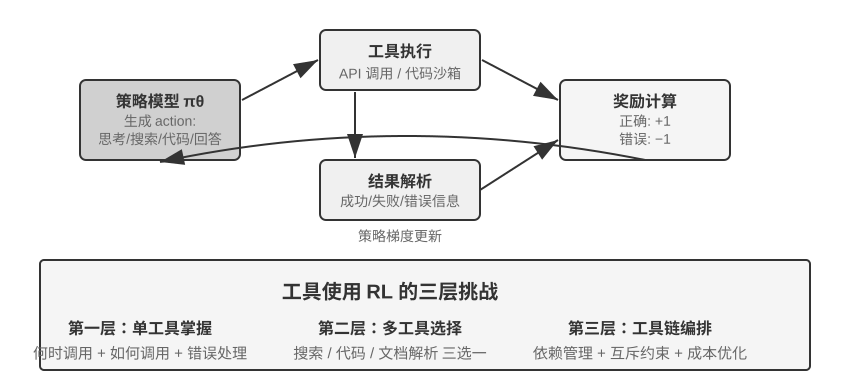
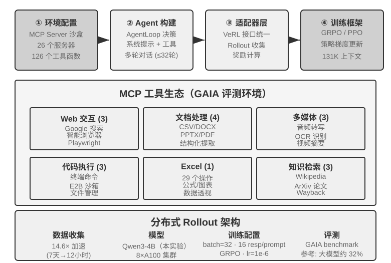

## RL 学习工具调用

前面的多轮实验中，Agent 的动作空间仅限于移动、观察等内置操作。现实中的 Agent 还需要调用各种外部工具——搜索引擎、代码解释器、文档解析器等——这为 RL 训练带来了新的挑战。

工具使用将 Agent 的能力边界从“模型自身推理”扩展到“调用外部系统协作”，是 Agent 走向实用的关键。从难度梯度看，工具使用的 RL 训练面临三个层次的挑战。第一层是学会使用单一工具——理解输入输出规范、掌握调用时机、处理错误反馈。第二层是在多工具生态中做选择——面对数十种工具，何时该搜索、何时该执行代码、何时该解析文档。第三层是工具链编排——发现工具间的依赖关系、识别互斥约束、优化成本效率。

围绕工具调用的 Agent RL 目前有两条活跃路线。一条是**检索增强**：以 Search-R1（Jin 等人，2025）为代表，用 RL 训练模型在思考过程中自主决定何时发起搜索、并利用返回结果继续推理，而不是套用固定的 RAG 流程。另一条是**软件工程**：以 SWE-Gym 等训练环境为代表，针对 coding Agent 在真实代码库上做多轮 RL，让模型迭代地编辑、运行、修复代码。两条路线共同的挑战是长时序信用分配（一次最终成功要归因到几十步之前的某个决策）与环境工程（构建稳定、可复现、可大规模并行的训练环境）。

工具 RL 还有一个绕不开的工程细节：**对环境反馈的 token 做损失屏蔽（loss masking）**。一条工具调用轨迹里既有模型自己生成的 token（思考、工具调用参数），也有环境返回的 token（代码解释器的输出、搜索结果、客服的回话）。后者不是策略生成的、而是环境给定的——如果把它们也计入策略梯度，模型就会被训练去“预测沙盒会输出什么”，这既偏离了优化目标，又会让训练变得不稳定。标准做法是在计算损失时把环境反馈 token 屏蔽掉，只对模型自己生成的 token 回传梯度。这正是 ReTool 的核心技术点之一（对 `<interpreter>` 标签内的反馈 token 屏蔽梯度），也是 Search-R1 所说的“对检索到的 token 做屏蔽以稳定训练”，veRL、AWorld 等主流训练框架都内置了这一机制。

> **实验 7-15 ★★★：ReTool——代码解释器增强数学解题**
>
>
> 
>
>
> 纯文本思考在精确数值计算、符号操作或复杂方程求解中容易产生累积误差（比如连续做十步乘法，每步都可能算错），而代码解释器通过提供可执行的接口实现精确验证。ReTool 将代码解释器的实时执行整合到 RL 思考循环中，使模型在结果反馈的指导下自主学习何时以及如何使用工具。
>
> 训练分两个阶段。SFT 预热（约 1 小时）将纯文本推理数据转换为代码增强轨迹，建立基本工具调用模式。RL 训练（基于 veRL 改造的 PPO，训练数据取自 DAPO-Math-17k，约 9 天 400 步）通过交织实时代码执行的 rollout 优化策略：模型生成包含 `<code>` 标签的代码，沙盒执行后将结果包装在 `<interpreter>` 标签中反馈，模型继续生成，形成 “文本 1 + 代码 1 + 反馈 1 + ... + 答案” 的混合推理序列。每个训练步需生成 512 个响应（32 问题 × 16 候选），平均每个响应 7-9 轮交互，总 token 处理量从初始 25M 增长到 40M。
>
> ReTool 本身用的是标准 PPO，并未改动优化算法。不过它的训练数据来自 DAPO 团队的 DAPO-Math-17k，这里顺带介绍近期流行的 **DAPO** 算法（Yu 等人，2025）——它在标准 PPO 基础上做了四项改进，核心目标是防止模型过早收敛到单一策略（只会用一种方式解题）：
>
> - **Clip-Higher（放宽探索上限）**：标准 PPO 算法会限制每次训练时策略变化的幅度——变化太大容易导致训练不稳定。但限制太严格又会让模型“不敢尝试新路子”。Clip-Higher 适度放宽了这个限制：当模型偶然发现一条明显更好的路径时，允许它更大胆地向这条路径调整，从而鼓励探索。
> - **Token-Level Policy Gradient Loss（让每个 token 权重相等）**：原始 GRPO 对损失做样本级归一化——先在每条回答内部按 token 数平均、再在样本之间平均——这会让长回答里的每个 token 被 `1/|o_i|` 稀释：高质量的长链思考得不到足够奖励，冗长重复也得不到足够惩罚。DAPO 的 Token-Level Policy Gradient Loss 正是去掉这层按样本平均，改为在整个 batch 的全部 token 上统一归一，让每个 token 权重相等；其直接后果是长回答按它的长度获得相称的梯度贡献。
> - **Dynamic Sampling（智能分配算力）**：训练时动态调整每道题的采样次数——对于模型已经能稳定解决的简单题减少采样（继续练也没什么收益），对于成功率在 20%-80% 之间的“可学习区间”的题增加采样（这些是最能学到东西的），集中算力于最有学习价值的数据。
> - **Overlong Reward Shaping（惩罚冗长回答）**：对超长响应施加软惩罚。当模型生成了很长的思考过程但并没有因此答得更好时，系统会降低其奖励分数，引导它学会更简洁高效地思考。
>
> 回到 ReTool。在 AIME 2024 上，基于 Qwen2.5-32B-Instruct 的训练在第 110 步的中间检查点时，准确率已从初始约 25% 提升至 52%（Best-of-30 达 85%）；论文的最终结果是 400 步后达到 67.0%，而纯文本 RL 基线训练 1080 步也只有 40.0%。本实验框内的训练动态数字均以这一 32B 模型设定为口径。
>
> 涌现能力：代码自我修正（识别执行错误并自主生成修正版本）、工具调用从后期验证转为早期探索、思考效率提升（长度减少 40% 但准确率不降反升）。
>
> 前 110 步的训练动态呈三阶段模式：初期（0-20 步）快速学习基本工具使用，准确率每步提升 0.5%；中期（20-70 步）波动式探索，响应长度从 2500 增至峰值 4700 tokens，策略多样性激增；后期（70-110 步）稳定收敛，长度回落到 4400 tokens，性能持续提升但波动减小。
>
> SFT 与 RL 的时间差异根源在于信息密度不同：SFT 每个 token 都有监督信号，而 RL 每个 episode 只得到一个成败信号。在实际训练中，单步耗时会随着响应长度增长而增加，少数超长响应会显著拖长整个训练周期。
>
> **实验 7-16 ★★★：AWorld-train——在沙盒中学习使用工具**
>
>
> 
>
>
> GAIA 是最具挑战性的 Agent 评测基准之一。即使大参数模型经过大规模训练也可能只达到约 32%，距高分系统仍有明显差距。本实验采用较小的模型（Qwen3-4B），主要目标是演示完整的“从实践中学习”训练流程。
>
> AWorld 训练环境是 MCP 服务器沙盒，提供 26 个服务器、126 个工具函数，涵盖 Web 交互（Google 搜索、智能浏览器、Playwright）、文档处理（CSV/DOCX/PPTX/PDF）、多媒体处理（音频转写、OCR、视频摘要）、代码执行（终端命令、E2B 沙盒）、Excel 处理（29 个企业级操作）、知识检索（Wikipedia、ArXiv、Wayback Machine）。真实 API 的速率限制、服务波动、账号封禁使直接在生产环境训练不可行——构建稳定可控可重放的仿真环境是多工具 RL 训练的工程前提。
>
> 从单工具到多工具的质变在于：单工具只需决定“何时”与“如何”调用；多工具还要解决“调用哪个”与“如何组合”，引入了组合爆炸与依赖管理的复杂性——工具间有前置依赖（先搜索才能浏览具体页面）、互斥约束（某些工具不能同时调用）、成本差异（不同 API 的配额与延迟不同）。策略需要在这些约束下做整体规划，而非贪心地选择当下最优。
>
> 需要说明，本实验是一个**开放式训练实验，不提供基线结果**——Qwen3-4B 这个量级在 GAIA 上难以取得亮眼分数，本实验的价值在于跑通“从实践中学习”的完整链路，而非刷新指标。可参考的验收标准与预期观察是：能稳定跑通环境的 reset 与 episode 循环（工具调用、反馈、状态更新不崩溃）；训练过程中平均奖励曲线呈上升趋势；工具调用成功率随训练提升，且模型逐渐学会在多工具间做出更合理的选择与组合。
