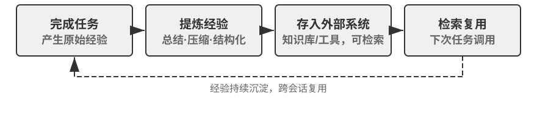

## 三种学习范式与自我进化的定位

第一章引入的三种范式（图1-1）在此只作定位性对照。**后训练**修改模型权重，通过 RL 将“经验”固化为“肌肉记忆”，成功率高、延迟低，但更新成本高、周期长（第七章已详述）；**上下文学习**（In-Context Learning, ICL）在提示词中给出示范样例做临时适应，成本低、见效快但会随会话结束而消失（详见第一、二章）；**外部化学习**则是开发者最容易忽略的一条路径——把知识沉淀到模型之外的文件、知识库和工具中，持久、可解释、可随时修正。三者协同而非竞争：事实性知识交给 RAG（详见第三章）与外部化存储，稳定的行为与格式交给后训练固化，当下的临时信息交给上下文学习。

本章聚焦其中**不改模型权重**的路径——外部化学习，它正对应章首所说的两个维度：把经验外部化为知识和 Skill，把能力外部化为工具。（这里要与第五章“代码创造代码：Agent 自举”区分：那里讲的是 Agent 创建与自身同类的系统，本章讲的是不改权重的能力增长。第三章解决的是知识库“怎么存、怎么查”，本章解决的是“谁来填充和更新”——Agent 如何主动积累经验。）

为什么需要它？先看一个反面场景。假设一个客服 Agent 第一次处理某银行的退款流程：经过 15 分钟的探索——打了 3 次电话、尝试了 2 种话术——终于成功完成退款。如果它缺乏外部化学习能力，下次遇到完全相同的请求，只能从头再花 15 分钟走一遍同样的探索，这次积累的经验会随会话结束而消失。关键在于“自主”二字：不是人类工程师为 Agent 准备文档，而是 Agent 在完成任务的过程中自己总结经验、构建工具、更新知识库——就像一位客服老手把散落的退款规则整理成一本随时翻阅、并根据新情况自主更新的手册。核心哲学是：与其期待模型记住一切，不如在任务完成后用额外算力把经验总结、压缩、结构化，再存入可持久化、可检索的外部系统。相比参数学习，这种方式无需昂贵训练即可快速沉淀可解释、可验证、可修正的知识；相比上下文学习，它通过主动提炼和结构化组织，避免了在海量原始信息中低效检索，实现了跨会话持久化。

更重要的是，外部化学习将 Agent 的学习能力从“记忆信息”提升到了“构建能力”：它不仅能把经验总结为概要性知识存入知识库供后续检索（第三章 RAG 部分介绍的 RAPTOR 树形归纳同样适用于经验的逐层提炼——从具体操作记录归纳为规则、再概括为原则），还能将重复性操作流程封装为可精确执行的工具，形成不断增长的技能库。举个例子：一位客服 Agent 在帮某位客户处理退款时，可能学到三类不同性质的东西。第一类是一条特定规则——“A 公司退款必须验证信用卡后四位”，这是事实性知识，存入知识库即可；第二类是一段通用工具——“用 X API 自动查询订单状态”，这是稳定可复用的操作序列，沉淀为代码工具最划算；第三类是一份岗位手册——“退款流程的完整 Skill”，涉及策略判断和经常变动的业务规则，更适合写成 Skill 文档。表8-1 总结了外部化学习沉淀的这三种产物。

表8-1 外部化学习的三种产物

| 产物形态 | 承载内容 | 示例 | 使用方式 |
|-------------|----------------------|--------------------------------|---------------------------|
| 知识库条目 | 事实和规则 | “该银行要求提供开户行地址” | 语义搜索或 `grep` 精确检索 |
| 专用代码工具 | 可重复的操作流程 | “查询账户余额的 API 调用序列” | 固化为代码、通过参数调用 |
| Skill 文档 | 复杂但常变的工作策略 | “处理保险理赔的最佳实践” | 自然语言文档、按需加载 |

判断该用哪种形态有一条简单的经验法则：**纯粹是事实性信息的存入知识库，经常用且参数复杂的写成代码（工具），经常变且涉及策略判断的写成文档（Skill）**。其中后两种都属于“工具生成”——外部化学习的更高阶形式，不仅将“知识”外部化，更将“流程”外部化、代码化，从“每次重新思考”转为“一次生成、多次复用”，就好比第一次手动部署服务器后把步骤写成自动化脚本。第四章已详细讨论了专用工具与 Skill 的选择框架。

第一章为苦涩的教训给出的立场——**方向认同，节奏务实**——在外部化学习上体现得最为充分。不把所有知识压缩到参数中，也不把流程写死成 if-else 规则，而是让 Agent 主动构建外部的知识与工具生态，把能力扩展的逻辑从模型内部（参数规模）延伸到外部世界（工具与知识库的规模）。知识载体的选择也遵循同一逻辑：本章讨论的记忆与技能大多以 Markdown 加文件系统的形式沉淀，而非依赖人工设计的知识图谱——后者在专业领域更精确，但自然语言是模型最擅长处理的格式，再叠加 LLM 做压缩与整理，才是一条不依赖人的先验结构、能随模型能力持续扩展的通用路径。当然，外部化学习本身——用什么格式存储、如何组织索引、何时提炼——仍然需要工程设计，这正是“节奏务实”的体现。
