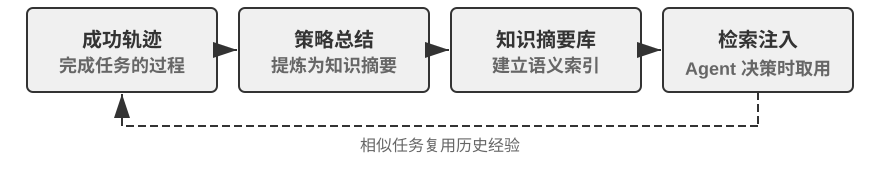

## 从经验中学习

理解了“为什么要学”之后，接下来的问题是“怎么学”。外部化学习的工程实践从“记录和复用成功经验”开始。以下两个实验展示了两种互补的经验积累方式：一种将高层策略提炼为可检索的知识摘要（相当于“解题思路笔记”），另一种将具体操作序列固化为可回放的自动化工具（相当于“操作录像”）。

表8-2 将经验学习机制按层面分类，用于帮助读者理解知识提炼、知识组织、知识应用和工程支撑之间的关系。

表8-2 Agent 经验学习机制分层

| 层面 | 机制 | 解决什么问题 |
|------|------|-------------|
| 知识提炼 | 策略摘要、工作流录制、失败反思 | 从成功与失败经验中提取可复用知识 |
| 知识组织 | Skills、睡眠整合 | 将知识结构化存储和索引 |
| 知识应用 | 系统提示词优化 | 将知识注入 Agent 的行为模式 |
| 工程支撑 | 跨会话续跑 | 让长任务能持续执行 |

以上四个层面在后续内容中交织展开——策略摘要、工作流录制和从失败中学习（知识提炼）自然过渡到 Skills 与睡眠整合（知识组织），然后是系统提示词优化（知识应用），最后以长任务的跨会话续跑收尾（工程支撑）。

> **实验 8-1 ★★：从成功经验中学习：策略摘要**
>
> `gaia-experience` 项目是“策略摘要”（Strategy Summary）思想的典型实现。所谓策略摘要，就是把一次成功的解题过程浓缩为一段结构化的经验笔记——记录“用了什么方法、踩了什么坑、关键步骤是什么”，以便下次遇到类似问题时直接参考。
>
> 并非所有运行轨迹都值得提炼成经验——判断标准是**可迁移性**：当前任务中学到的教训，是否能在未来类似任务里复用？只对某次特定输入有效的修正，不应进入长期记忆。
>
> 该实验使用两个关键基础设施。**AWorld 框架**是专为 AI Agent 设计的开源执行与评估环境，提供标准化的工具集（浏览器、文件系统、代码解释器等）和自动评估管道，可以理解为 Agent 的“考试教室”。**GAIA** 是一套极具挑战性的评测基准，通过需要人类智慧才能解决的多步骤复杂问题来评估通用 AI Agent 能力——比如“在某个网站上找到特定信息，用代码处理后计算出答案”，往往需要综合使用浏览器、文件管理器、代码解释器并进行复杂逻辑推理。
>
> 核心创新在于为 AWorld 框架中的 Agent 增加了完整的“学习-应用”闭环。在**学习模式（Learning Mode）**下，每当 Agent 成功完成一个 GAIA 任务，系统自动捕获其完整行动轨迹，并利用 LLM 对其进行“反思”和“总结”，生成结构化的经验摘要。这个摘要不仅包含最终答案，还提炼了解决问题的核心方法、关键洞察以及有效使用的工具序列。这些经验被向量化后存入知识库。在**应用模式（Apply Experience Mode）**下，当 Agent 接到新任务时，它会先在经验知识库中进行语义搜索，找出历史上最相似的成功案例，并将这些经验作为“成功范例”注入系统提示词，为决策提供指引。实验证明这显著提升了解决新问题的效率和成功率——Agent 解决的任务越多、积累的经验越丰富、能力也就越强，形成了一个正向循环的自进化系统。
>
> **实验 8-2 ★★：从重复任务中学习：工作流录制与回放**
>
> `browser-use-rpa` 项目是“工作流录制”（Workflow Recording）思想的绝佳范例。工作流录制的思路类似于 Excel 的“宏录制”功能：第一次手动操作时把步骤录下来，以后只需点一下“回放”就能自动重复。这个项目要解决的问题很实际：许多在浏览器中进行的重复性操作（如发送报告邮件、查询特定网站信息），虽然每次的具体参数不同（如收件人、查询关键词），但核心操作流程是固定的。让 Agent 每次都从头开始、用昂贵的多模态大模型来“重新发现”这个流程，是极大的资源浪费——本质上是只依赖上下文学习，而没有将成功经验外部化为可复用的工具。项目核心是一场关于效率和成本的极致对比实验。
>
> 在**学习阶段（Learning Phase）**，Agent 首次执行任务时像人类一样通过多模态 LLM 的观察-思考-行动循环完成操作。每次 LLM 决定执行操作时，系统从 browser-use 框架的历史记录中提取被操作元素的精确定位信息：网页在浏览器中呈现为一棵 DOM 树（Document Object Model，文档对象模型），每个按钮、输入框、链接都是树上的一个节点；XPath（XML Path Language）则用类似文件路径 `/html/body/div[2]/button[1]` 的写法指向特定节点。操作被录制为结构化步骤：操作类型（点击、输入等）、目标元素的 XPath、操作参数、以及执行后的验证信息（如页面 URL 是否发生变化、预期元素是否出现）。任务成功后，LLM 生成语义标签（如“发送电子邮件”）和描述（“收件人字段、主题字段、内容字段、发送按钮”），与步骤序列一起存入知识库，形成参数化的“工作流”条目。
>
> 在**回放阶段（Replay Phase）**，新任务到达时，系统结合语义相似度（嵌入向量）和关键要素检查匹配已有工作流。匹配成功则按步骤高速执行：通过 Playwright（开源的浏览器自动化库）的等待机制（`page.locator(xpath).wait_for(state='visible', timeout=15000)`）确保元素加载；参数化模板（如“在收件人字段输入 `{{email}}`”）通过轻量 LLM 调用从当前任务指令中提取实际参数值，无需完整的视觉思考。若某步失败（找不到元素、等待超时），说明网页结构可能已变化，此时标记该工作流“可能过时”，回退到学习模式重新通过 LLM 思考完成任务，并生成新工作流替换旧的。
>
> **验收场景**：在 Gmail 网页版中发送邮件。
>
> - 首次执行（学习阶段）：“给 test@example.com 发送邮件，主题‘测试邮件’，内容‘这是一封测试邮件’”。观察 Agent 如何通过多模态 LLM 识别“撰写”按钮、收件人输入框、主题和内容输入框、“发送”按钮。记录操作步骤、耗时、LLM 调用次数。
> - 重复执行（回放阶段）：“给 another@example.com 发送邮件，主题‘后续测试’，内容‘第二封测试邮件’”。系统识别到匹配的工作流，提取新参数值，直接回放操作，无需 LLM 视觉思考。对比耗时和调用次数应显著降低。
> - 知识更新：模拟网页改版（修改 HTML 结构使某按钮的 XPath 变化），验证 Agent 能检测到工作流失效并回退到学习模式，重新生成工作流更新知识库。
>
> 预期可观察到：回放阶段任务执行速度显著提升（数倍量级），LLM 调用成本大幅降低，成功率也更稳定。

工作流录制并非孤立的工程技巧，它背后是一套更通用的方法论。Voyager 是 NVIDIA 团队提出的开放世界 Agent 架构（详见后文），在 Minecraft 虚拟世界中将“探索-沉淀”循环系统化：**执行任务 → 验证成功 → 将成功的操作序列存入技能库 → 遇到类似任务时检索复用**。实验 8-2 正是这套思路在浏览器自动化场景的落地——学习阶段对应“探索”，工作流知识库对应“技能库”，回放与失效回退对应“检索复用”和持续改进。

实验 8-2 也暴露了“录制-回放”最脆弱的两个环节，把它们处理干净，这套机制才真正可靠[^preact]。第一个环节是**什么时候敢信回放**。更稳妥的做法是把一次成功的操作序列编译成一个小小的**状态机程序**：每个状态都带一个“验证谓词”（一段必须在当前真实屏幕上成立的界面模式），回放时**每一步动作之前先拿谓词去核对实时屏幕**——“先看清、再动手”。一旦谓词不成立或动作报错，就交还给完整的 Agent 重新来过，并把这次的新轨迹重新编译成程序。正因为回放时一次模型调用都不需要，命中缓存的重复任务能快上 8.5–13 倍。第二个环节是**别把坏程序存进去**：编译完成后立刻重置环境、从头回放一遍，用基准自带的评判器确认“这次是真的做成了”才准入库——这道“存前验证”能挡住那种“回放 100% 覆盖、却其实没把事办成”的程序（比如流程全走完、Save 也点了，但某个字段其实是空的）。去掉这道关，程序库会随着有毛病的程序越攒越多而逐渐退化。归结成一条干净的原则就是：**流程记忆也要有验证闸门，自我改进的循环才不会腐坏**——这正是实验 8-2 里“检测工作流失效、回退重学”的严格版。

[^preact]: 把成功轨迹编译成带验证谓词的状态机程序、并设“存前验证”闸门，完整机制见 Li, Bojie. *PreAct: Computer-Using Agents that Get Faster on Repeated Tasks.* arXiv:2606.17929, 2026.

### 从失败中学习

策略摘要和工作流录制都是从**成功轨迹**中提炼经验——实验 8-1 只在任务成功后才触发反思和总结。但失败经验同样值得沉淀，甚至信息量更大：一次失败明确排除了一条路径，而成功往往只是众多可行路径中的一条。失败经验的典型沉淀形态有两种：**错误模式库**（记录“什么情况下用什么方法会失败、失败的信号是什么”）和**负面规则**（“不要再用 X 方法做 Y”——例如“不要用打电话的方式办理该运营商的退订，电话渠道无权限处理”）。

这个方向的代表工作是 Reflexion（Shinn et al., 2023）[^reflexion-2023]：任务失败后，Agent 用自然语言对失败原因进行反思（如“我在第三步就应该先验证身份，而不是直接提交表单”），并将反思文本存入情景记忆（episodic memory）；下次尝试同类任务时，把这些反思作为额外上下文读取，从而避免重蹈覆辙。整个过程不更新任何模型参数——Reflexion 正是“不改权重的进化”的经典范例；这种用语言承载的反思，信息量远比一个标量奖励丰富，后文讨论系统提示学习时会展开这一点。失败经验的另一个重要出口是系统提示词：本章稍后讨论的系统提示词自动优化，正是把从失败案例中提炼的负面规则（如“绝不因政策争议而转接人工”）写入系统提示词，使其成为对所有后续任务生效的行为约束。

[^reflexion-2023]: Shinn, N., et al. *Reflexion: Language Agents with Verbal Reinforcement Learning.* arXiv:2303.11366, 2023.

### Skills：将领域知识外部化为结构化能力

前面两种机制分别沉淀了“怎么想”和“怎么做”的经验。Skills 机制走的是第三条路——把领域操作知识系统性地提炼为结构化的、可按需加载的能力模块。可以把 Skill 理解为一份“岗位操作手册”：新员工入职时不需要从头摸索，读完手册就能上手干活。第二章详细讨论了 Skills 的渐进式披露（Progressive Disclosure）机制（元数据→核心流程→细则）和与 KV Cache 的兼容性设计，本节关注 Skills 背后的知识外部化哲学及其自动化生成。

Skills 的核心价值在于用人类可读的文本承载知识：更新快（不需重新训练模型）、可审查（人类专家能直接修改完善）、可迁移（换模型或换系统都能用）。本质上，Skills 是把困在非结构化文档里的领域知识转化为 Agent 容易利用的结构化形式——让 Agent 通过通用的搜索和思考能力来利用知识，而不是把知识硬编码到代码逻辑中。

更进一步，Anthropic 的 Skill Creator[^ch8-1] 是一个能创造其他 Skills 的元能力，它指导 Agent 通过观察、学习和总结，将领域操作知识提炼为结构化 Skill。当被要求为某领域创建 Skill 时，Agent 首先通过与用户对话理解具体使用场景，然后分析每个场景并识别可复用资源，最后创建包含标准目录结构、scripts、references、assets 和 `SKILL.md` 主文档的完整 Skill 包。Skill Creator 使知识转化过程本身也由 Agent 完成，实现了知识积累的自举循环：Agent 不仅能用 Skill，还能造 Skill。

[^ch8-1]: Anthropic, “Skill Creator”, 2025. https://github.com/anthropics/skills/blob/main/skill-creator/SKILL.md

Claude Code 的 `CLAUDE.md` 机制展示了类似能力：首次接触代码仓库时主动通读代码库，生成包含架构设计、编码规范、测试方式等核心信息的项目指南，在后续开发中持续引用和更新。这种自动化的 Skill 生成机制使 Agent 的能力扩展不再受限于人类专家的可用时间和知识覆盖范围——当 Agent 进入新领域时，可通过自主探索学习构建操作指南并固化为 Skill，实现从“依赖预编程知识”到“在实践中学习积累知识”的转变。

从“经验沉淀”的视角看，工具生成这条路径的具体形态又可分为专用代码工具和 Skill + 通用执行器两种。如何在两者间取舍，前文已给出判别原则、第四章有完整框架，此处不再重复；落到本节的场景上：参数复杂、调用频繁的操作沉淀为代码工具（如 Voyager 在 Minecraft 中沉淀的技能库、浏览器工作流录制生成的参数化脚本），策略性、易变动的业务规则写成 Skill 文档（如 Claude Code 的 `CLAUDE.md`）。实际系统往往混合使用两种形态。

### 睡眠学习：用户记忆的自主进化

前面讨论的经验学习机制——策略摘要、工作流录制、Skills 生成——都发生在任务执行过程中或结束后的即时提炼。但人类学习还有一个重要环节：**睡眠期间的记忆整合**。第二章在讨论上下文压缩时曾用这个类比——大脑将白天的感官输入加工为紧凑的长期记忆；这个类比不仅适用于单次会话内的上下文压缩，更可以延伸到跨会话的经验管理：白天获取的零散经验在睡眠中被重新组织、去冗余、与已有知识网络融合，转化为更紧凑、更易调取的长期记忆。

这种离线整合最典型的对象，是 Agent 关于**用户本人**的记忆——你是谁、有什么偏好、说过哪些事实。这里要先厘清一个常见误解：像 Claude Code 这样的 Agent 在“睡眠”里整理的，主要是**用户记忆**而非共享知识库。知识库（第三章的 RAG）承载的是与具体用户无关的领域文档，通常由离线管道批量灌入、少有变动；而用户记忆是 Agent 在一次次对话中零散攒下、越来越懂你的模型——它才是需要反复“睡眠整合”的那部分。本节接下来介绍的 Claude Code 与 Hermes，存的都是这类用户记忆，重点看它们**如何自主进化**。

再明确本节与第三章的分工：第三章讲过用户记忆“怎么存、怎么查”，也介绍了记忆存储层的整理**算法**（聚类摘要、冲突版本化等），此处不再重复；本节关注的是**工程与进化问题**——何时整理、谁来整理、以什么形式沉淀，才能让记忆越用越准。

**Claude Code：用 Markdown 存储用户记忆。** Claude Code 把用户记忆直接存成人类可读的 Markdown 文件：每条记忆是一个带元数据（frontmatter）的小文件，只记录一条事实，再由一个索引文件（`MEMORY.md`）汇总导航。这种形式的好处一目了然——更新快（改文件即可，无需重训模型）、可审查（用户能直接打开修改）、可迁移（换模型或换系统都能用）。

但“记录”之外还需要“整理”。Claude Code 将睡眠整合的认知隐喻工程化为一个在后台周期性运行的记忆整合机制。（以下描述基于公开版本行为与社区分析整理，并非官方正式定义。）核心设计思想是：**经验积累和记忆整合是两个独立的过程，不应在同一时间窗口内完成**——Agent 也需要专门的“复习时间”。具体而言，当满足两个门控条件（距上次整合超过一定时间间隔、且期间积累了足够多的新会话）时，系统在后台启动一个独立的子 Agent，执行四阶段整合：**定向**（Orient，读取现有记忆索引，了解知识全貌）、**采集新信号**（Gather，从近期会话中搜索值得持久化的新信息，并检测与现有记忆矛盾的事实）、**整合**（Consolidate，将新信号合并进已有主题文件而非新建近似重复条目，把相对日期转成绝对日期，删除已被证伪的旧事实）、**修剪与索引**（Prune & Index，控制索引大小、移除过时指针）。

这套机制最重要的设计决定是：记忆整合不在用户交互时执行，而是异步后台完成，用户完全感知不到。双重门控和分布式锁确保并发实例不会重复触发整合，失败时自动回退、下次重试；整合子 Agent 的权限也被严格限定在记忆目录内，不会越界。从更宏观的视角看，它代表了用户记忆管理从“有记录无整理”到“记录—整合—修剪”完整生命周期的演进——没有定期整合，记忆库会退化为低信噪比的信息堆积，反而拖累检索质量；定期的“睡眠整合”让记忆库保持紧凑、一致、易于导航，正如人类专家的知识不是事实的无限堆叠，而是经过反复整理的结构化理解。

**Hermes：把自主学习做成常驻服务。** Nous Research 于 2026 年开源的 Hermes 把这套思路推得更彻底：它是一个常驻在用户自己机器上的进程（daemon），跨会话持续积累记忆并自主进化。其记忆分为四层[^hermes]：**提示词记忆**（`MEMORY.md` 与 `USER.md`，会话启动时注入，刻意限制在几千字符内，以“逼迫”Agent 主动取舍）、**会话检索**（用 SQLite 全文索引 FTS5 存放历史会话，检索到的片段先经 LLM 摘要再注入，只带进与当前任务相关的部分）、**技能库**（过程性记忆，采用渐进式披露，默认只加载技能名与摘要）、以及可选的 **Honcho 用户建模层**（在后台被动追踪偏好、沟通风格与领域知识，跨会话刻画“用户与 Agent 如何共同演化”）。当一次任务满足特定条件（如工具调用超过五次、从错误中恢复、收到用户纠正、或跑通了一个非显然的工作流）时，Hermes 会自动把其中的经验固化为一个可复用技能，并优先以打补丁（patch）的方式增量更新而非整篇重写。Claude Code 与 Hermes 代表了当下用户记忆自主进化的主流形态——都以人类可读的 Markdown/文本为载体。

[^hermes]: Nous Research, *Hermes: A Self-Improving Personal Agent*, 2026. https://hermes-agent.nousresearch.com/docs/

### 系统提示词的自动优化

回到系统提示词这条主线：前面几节的机制都把经验和记忆沉淀在模型之外——知识库、工作流、Skill 文件、用户记忆。但还有一种更直接的经验载体——系统提示词本身。

Andrej Karpathy 认为，当前 LLM 学习范式中遗漏了一种重要的学习方式——“系统提示学习”（System Prompt Learning）。预训练是为了获取知识，微调是为了培养习惯性行为，这两种方式都涉及模型参数改变。但人类的很多学习过程更像是“系统提示”的更新——遇到问题想通了某件事，会用明确的语言给自己记下来，比如“下次遇到这种类型的问题，应该先试这种方法”。

Karpathy 指出，LLM 就像电影《记忆碎片》的主角——每次醒来都不记得之前发生了什么，而我们还没给它们提供记录本。他在阅读 Claude 的系统提示词（约 1.7 万个单词，具体随版本变化）后发现其中包含大量通用问题解决策略，例如：“如果要求 Claude 计算单词、字母和字符，它会在回答之前一步步思考，通过给每个字母分配数字来显式计数。”这是为了解决“strawberry 中有几个 r”之类的问题。

Karpathy 认为这类知识不应由人类手工编写，而应来自系统提示学习。它与强化学习有相通之处——都靠失败案例改进未来行为。但两者的学习算法不同：系统提示学习直接修改系统提示词文本，强化学习则通过梯度下降调整模型参数。前者的数据效率显著更高，原因是反馈通道的“维度”差异。这是 Karpathy 针对**结果奖励型强化学习**的批评：一次只有一个标量的结果奖励（如“对/错”），信息带宽远低于一整段自然语言描述的复盘（“这里应该先验证身份证再走退款流程”）。正因如此，同样一次失败，系统提示学习能吸收的信息远多于“对/错”一个比特。

笔者认为，系统提示学习的本质是通过边界情况（edge cases）让规则边界更清晰。大多数规则在典型场景下运作良好，真正的挑战在于灰色地带——“在用户请求超出能力范围时转接人工”听起来很清晰，但“用户不满意政策”算不算超出范围？用户要求例外处理呢？这些边界情况才定义了规则的真正含义。

相比强化学习需在海量数据上反复试错才能调整权重，系统提示学习可以从单个或少量边界案例中快速学习。遇到一个失败案例，就可以立即在系统提示中添加明确规则，不需要收集数千个类似样本进行微调。这种学习不仅数据效率高，而且完全可解释——每条规则都是明文写出的，可以审查、修改、删除。随着边界情况不断积累，系统提示逐渐演化为一本详尽的“问题处理手册”，就像一位专家在工作中不断完善自己的笔记。

如何自动实现？关键在于引入 Coding Agent。系统提示词和工具描述本身就是文档和代码，分散在多个文件中。发现边界情况时，Coding Agent 可以：(1) 阅读和理解现有系统提示，分析规则结构和失败上下文；(2) 生成精确的代码级 diff，指明在哪个文件的哪个位置做什么修改；(3) 保持一致性，确保新规则不引入矛盾或冗余。最终审核权仍在人类专家手中，由他们审查这些 diff 判断是否合理。

提示词自动优化并非只有 Karpathy 的构想，学术界已有成体系的研究。DSPy[^dspy-2023] 把提示词当作程序的可优化参数：开发者只声明每个模块“输入什么、输出什么”，由框架在评估集上自动搜索示例组合和指令措辞，将提示词工程从手工调试变成系统性优化。OPRO[^opro-2023] 则让 LLM 自己充当优化器：把历史提示词及其得分作为上下文，让模型迭代提出更好的改写，在数学推理等任务上超过人工设计的提示词。2025 年提出的 GEPA[^gepa-2025] 走得更远：它对失败轨迹做自然语言反思，据此进化提示词，并在多个候选之间维护帕累托前沿（即一组各有所长、无法被彼此全面超越的候选解，而非只留单一“最优”解）以保留互补的优化方向——在多项任务上超过了 GRPO 微调（第七章介绍过该算法），而所用的采样次数少一到两个数量级。GEPA 做的正是本节所说的“系统提示学习”，其实证结果也支撑了前文关于反馈信息量的判断。

[^dspy-2023]: Khattab, O., et al. *DSPy: Compiling Declarative Language Model Calls into Self-Improving Pipelines.* arXiv:2310.03714, 2023.

[^opro-2023]: Yang, C., et al. *Large Language Models as Optimizers.* arXiv:2309.03409, 2023.

[^gepa-2025]: Agrawal, L. A., et al. *GEPA: Reflective Prompt Evolution Can Outperform Reinforcement Learning.* arXiv:2507.19457, 2025.

这些自动化框架与上述“Coding Agent 生成 diff + 人工审核”方案的差异体现在三点。其一是离线与在线：自动化框架通常在离线评估集上批量优化，而 diff 方案随生产环境中的边界案例逐条演进。其二是有无人工把关：自动化框架端到端自动改写，效率高，但可能产出过拟合评估集的“怪异”措辞；diff 方案保留人类审核，每条规则可解释、可追责，更适合客服等高风险场景。其三是是否需要评估集：DSPy、OPRO、GEPA 都依赖带评分的任务集来驱动搜索，而 diff 方案只需要单个失败案例加一段人类反馈。实践中两者可以互补：用自动化框架完成初始提示词的批量优化，再用 diff 方案做上线后的持续演进。

> **实验 8-3 ★★：系统提示词的自动优化**
>
> **实验目标**：实现基于人类反馈的自动化系统提示学习机制。
>
> **技术方案**：基于 tau-bench 航空客服场景设计系统提示学习流程。初始 Agent 的人工转接规则为“仅当请求无法在你的行动范围内处理时才转接”。通过评估发现 Agent 过度转接——一遇到政策争议就转给人工，而不是尝试向用户解释政策。人类专家反馈指出，应通过耐心解释政策来处理争议，而非一转了之。Coding Agent 读取系统提示词文件，定位相关规则，生成精确修改：将转接边界明确为“用户明确要求人工客服 + 紧急安全情况”，添加“绝不因政策争议而转接”的负面规则，并实施代码级修改。
>
> **对照组**：人工调优的系统提示词（不经自动优化流程）。
>
> **预期观察/验收标准**：优化后的系统提示词在原有保留任务集上表现不退化（不因新增规则而破坏既有正确行为），同时在触发过度转接的边界案例集上正确率提升——即针对政策争议不再一转了之，而是先尝试解释政策。

### 长任务的跨会话续跑（工程支撑附论）

严格来说，本节讨论的不是经验提炼机制，而是自我进化的**工程支撑**（对应表8-2的“工程支撑”层）：把“外部化”的理念应用于**任务状态管理**，让“学到的”经验和“干到一半的活”都能跨会话存续。它与第五章的 Coding Agent 工作流一脉相承，放在本章是因为它依赖同一个核心手法——把状态写到模型之外。许多任务（如从零搭建一个完整应用）的规模远超单个会话的上下文窗口，即使启用上下文压缩，也挡不住两类问题：在单个会话里试图做完整个应用，上下文先耗尽；只做完一部分，下一轮又无法准确恢复进度而过早判断完成。

更稳定的做法是把长任务拆成 **Initializer Agent** 和 **Coding Agent** 两个角色协作——类似于项目经理先拆分任务、写好清单，然后工程师按清单逐项完成。Initializer Agent 只在第一轮运行一次，生成结构化的功能清单（如 `feature-list.json`）、初始化脚本、初始 git commit 和进度文件（如 `progress.json`），把任务变成可持久化的文件系统状态。后续会话由 Coding Agent 循环执行：每次从进度文件和 git log 恢复现场，定位当前待实现的功能，实现并跑测试，更新进度文件的 `passes` 字段，提交代码后退出。关键约束是：进度放在文件里而非上下文里；功能清单用 JSON 而非 Markdown（结构化格式更适合模型稳定读写）；所有功能都变成 `passes: true` 时任务才算完成。这样即使中途崩溃，也能直接从文件系统中的状态继续——任务一旦超过半小时，崩溃恢复就不是可选项而是必选项。
