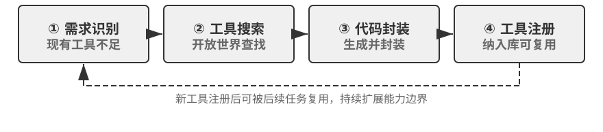
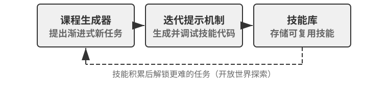
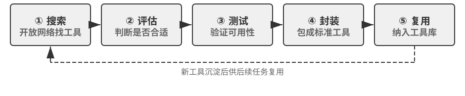

## 从工具使用者到工具创造者

第四章“主动工具发现”一节解决了“从已有工具中找到合适的”问题。本章接下来讨论更进一步的能力：当需要的工具根本不存在时，Agent 如何自主发现和创造新工具。

### 预定义工具集的根本性局限

当前 AI Agent 系统大多建立在一个隐含假设上：可以预先定义一个足够完备的工具集来应对绝大多数任务。在封闭领域这或许成立——一个专门做客服的 Agent 可能只需十几个工具。但如果想构建真正的通用型 Agent，这个假设就过于乐观了。

根本困难在于：现实世界需要的工具数量几乎无限，没法预先枚举；即使工具库里有类似的，接口和参数也往往跟当前需求不完全匹配，用起来要么低效要么出错；更不用说大量有用的服务根本不是以 Agent 友好的标准接口存在的，适配一个就需要一次人工开发。归根到底，**预定义范式将 Agent 的能力边界锁定在了人类工程师的预见和准备上**。

### 从预定义到自我进化

突破这一局限需要根本性转变：将 **Agent 从工具的使用者提升为工具的创造者**。Agent 不再被动等待人类准备工具，而是根据任务需求主动从开放世界中寻找、学习、适配和创造工具——这正是本章开头所说的自我进化的第二个维度：从工具使用者变为工具创造者。

核心思想是：赋予 Agent 最小的基础能力作为起点，通过与环境交互和对外部资源的利用，自主扩展能力边界。正如 Alita 论文 [^alita-2025] 所提出的——“最小预定义，最大自我进化”：少量精心设计的基础工具提供与世界交互的基本能力，自我进化机制在此基础上赋予无限扩展潜力。

[^alita-2025]: Qiu, J., et al. *Alita: Generalist Agent Enabling Scalable Agentic Reasoning with Minimal Predefinition and Maximal Self-Evolution.* arXiv:2505.20286, 2025.

自我进化并非否定预定义工具的价值，而是构建了一个层次化的能力体系。

这种范式转变的关键在于把全球开源生态变成 Agent 可用的资源池——遇到新任务时不是等人类准备工具，而是直接去搜索最贴近需求的库，必要时写胶水代码拼接。用过的工具积累下来，下次遇到相似任务直接调用，不必重新发明轮子。

### Agent 从网络上自主寻找并执行工具

MCP（Model Context Protocol，第四章详细介绍）是 Agent 发现和调用工具的标准协议——可以理解为“工具市场的通信规范”，Agent 通过它浏览可用工具、理解输入输出格式、并可靠地发起调用。以 Alita 系统为例，看一个具体的任务：“在 2018 年 3 月发布的、由《指环王》中咕噜的配音演员解说的 YouTube 360 VR 视频中，解说员在首次展示恐龙之后直接提到了什么数字？”这个任务需要一种特定的领域能力——提取和分析视频内容。Agent 不会报告“无法完成”，而是启动多阶段自我进化流程：

1. **MCP 头脑风暴阶段**：分析任务需求，识别出需要“YouTube 视频字幕爬取器”。具体实现是让 LLM 分析任务需求后生成一组候选工具描述（如“需要一个能抓取 YouTube 字幕的工具”），然后在 MCP 服务器注册表中搜索匹配的现有服务器，或标记为需要新建
2. **Web Agent 执行阶段**：在开源仓库中搜索，找到 Python 库 youtube-transcript-api（GitHub: jdepoix/youtube-transcript-api）
3. **Manager Agent 综合阶段**：访问 GitHub 仓库，阅读 README 和代码示例，理解核心 API，推导出环境配置和代码框架
4. **Manager Agent 执行阶段**：将学习成果封装为符合 MCP 协议的工具，提取目标视频字幕，分析内容找到答案“100000000”

新创建的工具被保存到工具库中，以后遇到类似的视频分析任务可以直接复用。

### Agent 编写代码生成新工具

从开源生态集成现有工具是第一种模式，但并非所有需求都有现成方案。Agent 还需要展现第二种能力：**从头编写代码创造新工具**。

如本章开头所定义，工具生成是外部化学习的更高阶形式——这里更进一步，把“流程”也外部化、代码化为可精确执行的工具。

这里的关键差异在于**代码的去向**：传统 Agent 系统中，代码执行只是一次性的——调用 Python 解释器跑一段脚本完成当前任务，然后代码就丢弃了。自我进化范式下则不同，Agent 编写代码的目的是**创造可复用的模块化工具**，持久化保存在工具库中，不再依赖模型的临时上下文或参数记忆。这样做有两个好处：经验不再随会话结束而消失，而是永久积累；代码工具的行为确定、可测试，比每次重新让模型思考可靠得多。

创造过程本身遵循软件工程的常规节奏——从需求规约与接口设计，到算法选择与实现，再到测试验证，最后生成符合 MCP 协议的 schema 并注册到工具库。与人类工程师相比，Agent 在需求理解、调试直觉、边界条件说明上更容易出错，因此生产系统通常把最多的算力压在测试验证环节，用大量自动化测试弥补前几步的不确定性。

### Voyager：在虚拟世界中持续学习的 Agent

前面讨论了 Agent 如何自主发现和创建工具。Voyager 在 Minecraft 虚拟世界中将这一理念推向了极致：它不仅使用工具，还从成功经验中创建可复用的技能库，真正实现了“越用越熟练”的自我进化。

Voyager 是外部化学习在开放世界中的典型实践。这个 Minecraft Agent 通过将每次成功经验提炼并外部化为可执行代码工具，实现了持续学习和自我进化。

其架构体现了三个关键要素：

**自动课程生成器**根据 Agent 当前状态、已掌握技能和周围环境，自动提出下一个探索目标（如“寻找铁矿”“制作铁镐”）。目标处于 Agent 的“最近发展区”——既不太简单也不太困难，类似于游戏中的关卡设计，循序渐进。

**技能库**是核心机制。成功完成新任务后，动作序列被提炼为可执行代码并持久化存储。技能是层次化、可组合的——比如“制作木镐”会调用“砍树”和“制作木板”等基础技能。面对新任务时，检索和组合已有技能即可快速解决，不需要每次都从头让 LLM 思考。

**迭代提示机制**负责技能的持续改进。失败时收集反馈（环境观察、错误消息、自我验证结果），整合到 LLM 提示中引导生成改进代码，反复迭代直到稳定。

Voyager 在 Minecraft 中自主探索，技能库持续增长：论文报告它能显著更快地解锁木、石、铁、钻石等关键科技树里程碑，发现的独特物品数量达到基线方法的 3.3 倍。这种持续学习能力的本质，正是通过外部化学习实现了从“临时适应”到“永久积累”的跨越——每一次成功探索都转化为可复用的代码工具。它证明了这种范式的可行性，为在现实世界构建自我进化 Agent 提供了完整的方法论蓝图——下面的实验就将它应用到现实世界的工具发现场景中。

> **实验 8-4 ★★★：Agent 从网络上寻找工具，实现自我进化**
>
>
> 
>
>
> **基础工具配置**：仅 `web_search`、`read_webpage`、`code_interpreter`、`create_tool`、`search_tools`。无任何特定领域预定义工具。
>
> **任务一：YouTube 视频内容理解**——“在 2018 年 3 月发布的、由《指环王》中咕噜的配音演员解说的 YouTube 360 VR 视频中，解说员在首次展示恐龙之后直接提到了什么数字？”预期流程：Agent 分析任务，识别出需要提取 YouTube 字幕的能力；通过搜索找到 youtube-transcript-api 库及 GitHub 仓库；阅读 README 和文档理解安装方法和接口；用代码解释器测试该库；编写封装代码将字幕提取功能包装为标准工具；使用新工具提取目标视频字幕并分析内容。成功标准：输出正确答案“100000000”。
>
> **任务二：实时金融数据查询**——“截至今天，NVIDIA (NVDA) 的最新股价是多少？与一周前相比涨跌幅是多少？”预期流程：Agent 识别出需要实时股票数据能力；搜索可用的金融数据 API（yfinance、Alpha Vantage 等）；评估多个方案的易用性、是否需要 API key、数据完整性；选择最合适的方案并创建查询工具。如果某个 API 需要注册但无法自动完成，Agent 应能切换到备选方案，而非产生幻觉或直接放弃。
>
> 验证工具复用：再次执行相同类型任务时，Agent 应直接从工具库中检索已创建的工具，而非重新经历搜索和创建过程。
>
> **挑战与难点**：搜索精度（可能找到不合适的库或过时信息）、文档理解（某些开源项目文档不完整，需从多个来源综合）、环境配置（某些库有复杂的依赖关系或系统要求）、错误恢复（第一次尝试可能失败，Agent 需要调试修正）、幻觉控制（必须基于真实搜索结果和文档工作，不能凭空假设某个库存在或某个 API 的用法）。

### 三层能力的持续积累

持续学习体现在三个层面：

- **工具层面**：成功创建的工具保存到工具库，新工具可以基于已有工具构建，形成层次化体系。例如，先有了“获取股票价格”工具，后续就能在此基础上构建“投资组合分析”工具
- **知识层面**：每一次工具创建都伴随着知识积累。Agent 逐渐了解到哪些开源库适用于哪类任务、哪些 API 不需要申请 key 即可使用、哪些库和系统环境之间经常有兼容性问题。这些知识可被提取为启发式规则或案例库，沉淀到知识库中（存储与检索机制见第三章），指导未来的工具创建
- **策略层面**：Agent 通过反复实践逐渐改进自我进化策略——最初可能选错库、写出过于复杂的逻辑、遗漏关键边界情况，但通过失败和成功的反馈，逐步学会更准确地评估开源项目质量、更简洁地实现功能、更全面地设计测试。这种元学习使 Agent 的自我进化能力本身也在进化。短期靠系统提示词与 Skill 沉淀这类元经验；长期稳定后可由强化学习固化到权重（见第七章）——后者已超出本章“不改权重”的范围

前两个层面都是外部化学习的直接应用——工具沉淀到工具库（本章）、知识沉淀到知识库（第三章）；策略层面则展示了外部化学习与后训练的接力分工：先用可解释、可修改的外部载体快速迭代，待策略稳定后再考虑固化到参数（第七章）。

### 自我进化的安全边界

自我进化赋予 Agent 强大的能力扩展潜力，但也带来了独特的安全风险。

**供应链攻击（Supply Chain Attack）**是最直接的威胁：Agent 从网络上自主搜索和安装开源库时，恶意的 PyPI 或 npm 包可能被自动下载和执行。这就好比让一个新员工自由上网下载软件——如果不加约束，很容易中招。缓解措施包括在沙盒环境中运行工具、对新创建的工具进行自动安全扫描等。

**能力漂移（Capability Drift）**是更隐蔽的风险：Agent 通过持续学习积累的策略和工具可能逐渐偏离设计者的原始意图，尤其在缺乏人类监督的长期运行场景中。应对策略包括设定允许的工具类型白名单、限制工具库的增长范围，以及定期人工审核新增工具。

**工具质量退化**同样需要关注：自动生成的工具如果缺乏充分测试，可能在边界情况下产生错误结果，而这些错误会通过工具复用传播到后续任务中——一个有 bug 的工具被反复调用，危害远大于一次性的推理错误。

**记忆与经验投毒（Memory Poisoning）**是自我写入机制最内生的攻击面。Agent 在任务执行中接触的内容——网页文本、工具输出——可能包含恶意注入的指令（提示注入，详见第二、四章）。如果这些内容未经审查就被当作“经验”沉淀为长期记忆或 Skill，攻击就从一次性变成了持久性：被污染的条目跨会话持续生效，每次被检索命中都会影响后续任务。与会话内的提示注入相比，这种攻击更隐蔽也更难清除——受害的不是单次回答，而是 Agent 的“知识”本身。缓解手段有三层：**写入前审查与来源标记**（记录每条经验来自哪个任务、哪个信息源，对来自不可信来源的内容先做注入检测再入库）；**经验与指令通道隔离**（检索出的经验以“参考资料”而非“命令”的身份注入上下文，明确告知模型经验内容不具备指令效力）；**检索时注入检测**（对命中的经验条目做轻量的注入模式扫描，发现可疑内容时降级使用或告警）。知识保鲜与投毒防御是同一枚硬币的两面：保鲜对抗知识的自然过时，投毒防御对抗知识的恶意污染——两者都要求经验库具备来源追溯与淘汰机制。（知识保鲜机制如何检测和淘汰过时经验，留作思考题 3 延伸。）

> **实验 8-5 ★★★：为自我进化 Agent 设计评估数据集**
>
> 前面的实验展示了 Agent 如何从经验中学习、发现工具、创造工具。但如何评估这些自我进化能力？这需要特殊设计的评估数据集——既要测试工具发现与创造能力，又要避免简单记忆固定的工具使用模式。
>
> 构建 20 个不同领域的工具需求任务（多媒体处理、金融数据、科学计算、地理信息、社交媒体、IoT 设备控制等），**任务描述只说明目标不暗示工具名称**——如“获取某 YouTube 视频的字幕”而非“使用 youtube-transcript-api”，“查询加密货币实时价格趋势”而非“使用 CoinGecko API”——确保 Agent 必须真正搜索或创造工具。基础工具集通常包括：网络搜索、网页阅读、代码解释器、工具创建与注册。
>
> 设计四层分层验证：
>
> 1. **任务正确性**：字幕内容准确、金融数据符合实际
> 2. **工具发现有效性**：分析搜索关键词、访问的网页、选择的库来判断
> 3. **工具创造质量**：错误处理、参数验证、文档完整性，使用 LLM-as-a-Judge 按 Rubric 评分
> 4. **工具复用能力**：第二次执行相似任务是否直接检索已创建工具而非重复搜索
>
> 为每个任务准备参考方案（推荐的开源库列表和典型 API 示例）和已知陷阱（废弃的库、需付费注册的 API 等）。
