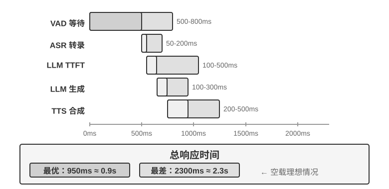
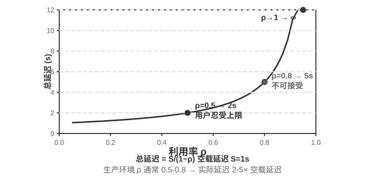

## 范式一 · 级联流水线（Cascading）

绝大多数商业语音助手——从智能音箱到客服机器人——都基于串行流水线（图9-1）：语音活动检测（VAD）判断用户何时说完 → 自动语音识别（ASR）把音频转成文字 → 大语言模型（LLM）理解意图并生成回复 → 文本到语音（TTS）把回复念出来。就像接力赛一样，每个环节必须等上一棒跑完才能起跑。


早期的语音助手采用这种四阶段串行流水线，原因很简单：没有单一模型能同时处理语音识别、语言理解、思考和语音合成四个任务。模块化架构让每个组件可以独立开发和优化。但模块化的代价是延迟累积——每个阶段都要等上一个阶段完成才能开始。

**VAD** 是流水线的起点，持续监听音频流。最关键的设计是结束点检测（End-of-Speech Detection）：通常设置 500-800ms 的连续静音阈值——如果用户停了半秒以上没说话，VAD 就认为用户说完了。这引入了第一层延迟，而且很难两全：阈值设得太短，用户只是思考时停顿一下就被误判为说完，句子被截断；设得太长，用户说完后要干等大半秒才有反应。

**ASR** 把音频波形转成文字。Whisper、SenseVoice 等模型转录 5 秒音频，在 GPU 上部署中小规格模型时通常需要 50-200ms；更大规格的模型或资源受限的部署环境则会达到 200-500ms（实验 9-3 中的对照组即属后者）。更关键的问题在于：在整个 VAD 等待与 ASR 转录过程中，后面的 LLM 完全闲着，没收到任何信息，无法提前开始思考。

**LLM** 推理（inference）阶段，即使优化得当，根据上下文长度不同，首 token 延迟（TTFT，即模型吐出第一个字的等待时间）往往需要 100-500ms，而输出完第一句话又额外需要 100ms 左右。如果启用 reasoning（思考），时间可能延长到 5-10 秒。在传统架构中，TTS 必须等 LLM 输出完整回复文本才能开始工作。

**TTS** 把回复文字转成语音，合成通常需要 200-500ms。把每一环的延迟加起来（图9-2）：VAD（500-800ms）+ ASR（50-200ms）+ LLM（100-500ms）+ TTS（200-500ms），总计约 0.9-2 秒——这还是所有服务都空闲、没人排队的理想情况。





一旦投入生产，排队延迟会让情况雪上加霜。这和餐厅排队的道理一样：厨房越忙，等餐时间越长，而且不是线性增长而是急剧飙升（图9-3）。当服务器没有任何等待队列时（即“空载”），处理一个请求的时间称为空载延迟。但当多个请求同时到达时，后到的请求必须排队等待。

直觉上，利用率越高，等待时间会非线性地飙升。具体的数学关系可由排队论给出（此处仅作直觉理解，不需要严格推导）：总延迟 ≈ 空载延迟 × 1/(1-利用率)。利用率是指服务器忙碌时间的比例，比如利用率 50% 意味着服务器一半时间在处理请求、一半时间空闲。利用率 50% 时延迟变成空载的 2 倍，利用率 80% 时变成 5 倍——这就是为什么服务器不能长期在高负载下运行。





> **实验 9-1 ★：构建传统语音 Agent**
>
> 本实验构建完整的实时语音对话系统，支持用户通过麦克风与 AI 语音交互。系统采用前后端分离架构，通过 WebSocket 实时通信。
>
> 核心流程遵循严格的串行模式：前端捕获麦克风输入，通过 WebSocket 实时发送到后端。后端运行 Silero VAD 模型进行语音活动检测，相比传统的音量检测方法准确率更高、抗噪能力更强，检测到约 500ms 连续静音后将音频片段提取出来进行后续处理。
>
> ASR、LLM、TTS 各阶段均支持多家提供商灵活切换，开发者可根据延迟、准确率和地区网络条件选择最优组合。
>
> **实验 9-2 ★：使用 PineClaw Voice API 构建电话 Agent**
>
> 实验 9-1 构建了浏览器内的语音对话系统，但真实世界中许多 Agent 任务需要拨打真实电话——联系客服协商账单、预约餐厅、确认订单。第四章通过 PineClaw 的 Channel 机制展示了事件驱动架构如何将电话通知的响应延迟从分钟级降到秒级；本实验则聚焦于语音通话本身的构建。以 [PineClaw Voice API](https://pineclaw.com/)（作者团队所开发）为例，这类生产级电话语音 API 通常封装了拨号、IVR 导航（即“查询请按 1，转人工请按 0”这类电话菜单）、对话和转录的全流程：Agent 提供电话号码、目标和上下文信息后，由语音 Agent 完成整段通话，返回结构化的通话记录。
>
> **实验目标**：构建一个能通过真实电话完成任务的 Agent，将 PineClaw Voice 作为工具集成到 ReAct 循环中。
>
> **技术方案**：使用 PineClaw Voice Python SDK（`pine-voice`），为 Agent 配备 `make_phone_call` 工具。Agent 接收用户的任务描述（如 “帮我预约明天下午 3 点的牙科检查”），通过 ReAct 思考决定：(1) 需要拨打哪个电话号码；(2) 通话的目标和关键信息；(3) 通话结束后如何向用户汇报结果。
>
> Agent 的工作流程：用户说 “帮我打电话给诊所预约明天的检查” → Agent 思考需要哪些信息（诊所电话、预约时间、患者姓名）→ 如信息不足则向用户澄清 → 调用 `make_phone_call` 工具 → PineClaw 拨打电话、与对方对话、完成预约 → Agent 收到通话摘要和转录 → 向用户汇报结果。
>
> **验收标准**：成功拨打测试电话（可先拨打自己的手机验证连通性）。Agent 能根据任务描述自主决定通话参数，通话结束后正确提取关键信息（预约时间、确认号等）并向用户汇报。对比直接使用 API 与通过 Agent ReAct 循环调用的差异——后者能处理信息不完整的情况（如用户未提供电话号码时先搜索）。
>
> 这个实验展示了语音 Agent 的一个重要应用方向：**Agent 不仅能与用户语音对话，还能代替用户与外部世界进行电话交互**。PineClaw 的语音 Agent 经过专门训练，能应付小时级的等待、电话菜单导航和复杂协商——想象一下让 AI 替你打运营商客服电话等候转人工，这些正是传统串行语音管线难以胜任的场景。

### 级联流水线的全链路流式化

需要澄清一个常见误解：上面 0.9-2 秒的延迟账，算的是“每一环都跑完再交棒”的**完全串行**情形。但 2025 年的生产系统早已不这么做了。主流做法不是抛弃模块化，而是保留 VAD-ASR-LLM-TTS 的分工，同时让每一级都变成**流式**，让相邻环节在时间上重叠起来：

- **ASR 边听边转**：采用流式识别，用户还在说，文字就在持续产出，不必等 VAD 判定整句结束再开始转录；
- **LLM 按句切分输出**：模型一边生成，一边按标点或语义把回复切成小句，第一句刚成形就往下游送，而不是等整段回复写完；
- **TTS 句级流式合成**：拿到第一小句就开始合成播放，后面的句子边生成边补上，用户听到第一个音节的时间大大提前。

这样一来，ASR、LLM、TTS 三级不再是接力棒式的先后关系，而是像流水线上三个同时开工的工位。LiveKit Agents、Pipecat 这类开源框架，以及主流商用外呼系统，走的都是这条路线。全链路流式化之后，端到端延迟通常能压到 600-800ms，明显好于完全串行的 0.9-2 秒。

但流式化能压缩的只是“转录、思考、合成”这三段可以重叠的计算，有一段延迟它压不掉：**VAD 的静默等待与轮次判断本身**。系统仍然要靠 500-800ms 的静音阈值来猜测“用户到底说完没有”，这段等待是流水线开工的前提，无法靠重叠来消除。要连这段延迟也一并压缩，就不能再在“让各级重叠”上着力，而须转向最前端的感知环节本身。

### 流式语音感知：替代 VAD + ASR

这一感知前端由两级构成——VAD 判断用户是否说完、ASR 将音频转写为文字——二者共同决定了整条流水线何时启动、又接收到怎样的输入。传统的 VAD + ASR 级联存在三个根本问题：

1. **延迟累积**：VAD 必须等 500-800ms 静音才能确认用户说完，因为它无法预知未来，只能靠“等一等”来区分“真的说完了”和“只是停顿想一想”
2. **信息丢失**：VAD 只输出“有声/无声”这样的二值信号，情绪变化、语气起伏、犹豫停顿、背景环境等声学细节全部丢失。误判问题在复杂环境中尤为突出——用户停顿稍长就被误判为说完导致句子截断，背景噪音误触发导致没人说话时系统开始处理，用户附和的一声“嗯”也无法判断到底是想打断还是在表示认可
3. **准确率下降**：VAD 把连续音频切成一段段独立片段，各自送入 ASR 识别，破坏了上下文的连续性。需要前后文才能正确识别的内容（邮箱地址、品牌名、人名、专有名词）错误率明显上升——比如用户报邮箱“john dot smith at gmail dot com”，如果“john”和“smith”被切到不同片段，“smith”可能因为缺少上下文被误识别为“miss”

**流式语音感知模型**提供了根本性的解决方案。先澄清“流式”的技术含义：一个语音模型能否流式处理，关键在于**编码器是否因果或分块**（只依赖已经到达的音频，而不需要看到整段录音）以及**解码是否增量**（每收到一小段音频就输出一部分结果）。Whisper 不能流式，并不是因为它的解码方式——它的解码本身就是自回归的——而是因为它的编码器需要一个完整的音频段（固定 30 秒、不足则填充）才能开始工作。还要说明的是，流式识别本身并不是新技术：以 RNN-T 和流式 Conformer 为代表的传统流式 ASR 早已在工业界大规模部署——手机的实时字幕、输入法的语音输入用的都是这类模型——它们与 LLM 并无关系。

本节关注的是一条新路线：**基于 LLM 的流式听觉感知**——以开源 LLM 为骨干做后训练，让模型直接从连续音频流中输出语义级的响应，把“识别”和“理解”合并进同一个模型。它是对传统流式 ASR 的升级，而非流式技术的发明：增量识别的延迟同样保持在单步推理时间（几十到一二百毫秒）的量级，但模型看到的不再是被 VAD 切碎的孤立片段，而是从对话开始到当前时刻的连续音频流，可以基于完整上下文做上下文学习（In-Context Learning），对用户的个人信息、专业名词、发音习惯的识别准确率显著提升。

这条路线的另一个关键优势是继承了 LLM 的世界知识和常识推理能力——毕竟骨干模型见过海量文本。比如模型知道“苹果”后面跟“发布会”大概率指 Apple 而非水果，这种知识增强使得对金额、地名、品牌名等高价值信息的识别准确率远超传统 ASR。这条路线已有可落地的模型，如 Fixie 的 Ultravox——把音频直接送入 LLM 骨干、输出文本与语义 token；本节实验所用的 Qwen2-Audio、阿里的 Qwen2.5-Omni 也属于同一类音频原生模型。

不过，替代 VAD 不一定非得动用一个完整的音频大模型。如果只想解决第一个问题——**判断用户到底说完没有**，还有一条更轻的路子：把这个“轮次判断”直接塞进识别器本身[^ch9-11]。做法是在一个很小的开源流式识别模型上加个 LoRA，让它一边转写、一边**综合语义和静音**判断“这句话是不是已经表达完一个完整的意思”——因为轮内停顿（报电话号码时顿一下）常常比轮间间隔还长，光靠静音阈值必然两头不讨好。更有意思的结论是：模型总在“该不该收话”上摇摆，根源往往不在模型结构，而在**训练标签是用“上帝视角”标的**——标注时用到了决策点之后才出现的音频，而线上的模型根本看不到未来；把每条标签都改成“只用决策当下能拿到的信息”来标，这种虚假的摇摆就消失了。这也呼应了第七章后训练的一条判断：很多时候，数据比架构更关键。这条更轻的路线也已有生产级实现：Deepgram 的 Flux、AssemblyAI 的 Universal-Streaming 把端点与轮次判断直接嵌入流式识别模型、专为语音 Agent 设计；开源侧则有 LiveKit、Pipecat 提供的语义轮次检测模型。

[^ch9-11]: 把轮次判断做进识别器、以及“标签的上帝视角”这一诊断见 Li, Bojie and Noah Shi. *The Trade-off Was in the Labels: Causal Supervision for Turn-Aware Streaming ASR.* 2026（待发表）.

模型输出的不仅是文字，还包括一系列**声学事件的特殊标记**——它们是模型训练时引入的专用 token，模型学会了在检测到对应声学事件时自动输出。常见的几类如下：

- `<speak_start/end>`：基于语义和声学的综合判断来确定说话起止，而非简单的静音检测
- `<interrupt>`：区分用户是真的想打断，还是只是在附和或受到背景噪音干扰
- `<emotion:happy/frustrated>`：情感标记
- `<laugh>` / `<sigh>`：笑声、叹气等副语言信号
- `<music>` / `<noise>`：环境声

这些标记和文字 token 形成统一的事件流，一起送入思考层。

```
Input audio: "Um, actually I think... no wait, let me reconsider."
Model output stream:
  <speak_start> Um, <emotion:hesitant> actually I think...
  <silence:500ms> no wait, <emotion:confident> let me reconsider <speak_end>
```

注意模型输出的不只是文字转录，还包括语音事件标记（开始/结束说话、情绪变化、沉默间隔）。Agent 框架可以利用这些标记实现更自然的交互——比如检测到用户犹豫时主动提供选项。

> **实验 9-3 ★：使用 Qwen2-Audio 模拟流式语音感知**
>
> 需要先说明实验设计：Qwen2-Audio 本身是整段输入的非流式模型。本实验采用**分块输入模拟流式处理**——把连续音频流切成固定长度的小块，每块连同此前累积的音频上下文一起送入模型，模型逐步生成文本和声学事件 token（如笑声、停顿等非语言信号），并测量每个分块从送入到产出文本的延迟。这里有个关键代价：Qwen2-Audio 的编码器不是增量式的，每处理一个新块都要把此前累积的全部音频从头重新编码一遍，因此对话越长、累积音频越多，单块的编码延迟就越高——这正是“模拟流式”与“真流式”（采用增量或因果编码器，只对新到达的一小段音频做增量编码）之间的本质差别。这一设计能演示“保留完整上下文的连续感知”带来的准确率收益，但延迟数字只反映分块粒度与推理速度，并不等于真正按流式设计的模型（如采用分块编码的 Qwen3-Omni）的首包延迟；感兴趣的读者可以换用后者重做本实验。对比方案是传统的 VAD + Whisper ASR 流水线。测试三类场景：正常对话、带停顿的长句、含背景噪音的对话。
>
> 结果：分块模拟方案的增量识别延迟可以控制在一二百毫秒的量级（具体取决于分块长度与硬件），而传统方案需要等 VAD 确认说完（600ms）再加上 Whisper 推理（本实验配置下约 200-500ms），合计 800-1100ms。在带停顿的场景中，VAD 在第一次长停顿处就误判为说完，把句子截成了两段分别识别，“大概两点左右”因为缺少上下文被误识别为“大概零点左右”；而分块方案保持完整上下文，正确识别了整句。在背景噪音场景中，Qwen2-Audio 输出 `<|noise|>` token 标记噪音存在但不中断识别，传统 VAD 则被噪音误触发，导致识别流程提前启动。
