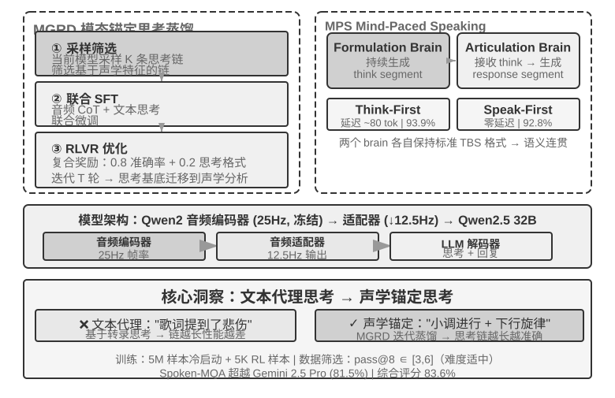

## 思考架构的取舍：从分离到统一

真正要解决的是**实时响应与深度思考之间的矛盾**：用户期待毫秒级的回应，而复杂问题需要秒级的思考时间，如何在保持低延迟的同时让模型想得足够深？这个矛盾并不专属于端到端架构，级联流水线同样绕不开。

下面的三种方案并非线性的技术迭代——它们是针对不同约束条件的设计取舍，在实践中并存，选择哪种取决于应用场景对延迟和思考深度的要求。需要先点明三者的分野：方案一、方案二本质上是“两个独立模型并发”的快慢分工，并不依赖端到端，甚至可以套在级联流水线之上；只有方案三才把思考真正内化进端到端模型。

值得注意的是，到 2026 年，“快慢解耦”这条路已经成了前沿语音产品的主流选择，并有了专门的名字。Thinking Machines Lab 把它称作“交互模型（Interaction Models）”——一个实时交互模型耦合一个异步的后台推理模型；xAI 的 Grok Voice “Think Fast”、Pine AI 的语音 Agent、以及上一节 GPT-Live 的“委派”，走的都是同一条“快在前台维持对话、慢在后台深度推理”的路线。选择解耦而非“训练一个全能模型”，背后有一个务实的理由：前沿推理模型每隔几个月就迭代一次，而实时交互能力需要专门的数据和训练目标，把两者塞进同一个模型，等于让它去追一个不断移动的靶子，还可能稀释掉最宝贵的推理能力[^ch9-8]。反过来，只要把最强的推理模型原封不动放在后台、只训练一个轻量的交互模型在前台，就能始终用上当下最强的“大脑”——这正是 GPT-Live 强调“可持续换用最新前沿模型”的原因。下面按“协调机制由弱到强”的顺序看三种方案。

### 方案一：快思考应付，慢思考回答

快慢思考并行执行（图9-5）：快思考在 500ms 内给出简短的应付性回答（类似于人先说一句“让我想想”），慢思考在后台花 5-10 秒进行深度思考后给出完整回答。慢思考使用的技术叫“推理时计算扩展”（test-time scaling）——通俗地说，就是让模型在回答问题时“多想一会儿”：不是一步给出答案，而是像人类解数学题一样，先列出思路、逐步推导、检查结果，用更多的计算步骤换取更高质量的回答。


**问题一：简单问题过度思考**。用户问“今天星期几”，快思考已在 500ms 内正确回答“星期三”，慢思考仍然跑完整整 10 秒思考后又重复一遍“星期三”。这不仅浪费计算资源，更严重的是破坏对话节奏——用户已经得到答案准备聊下一个话题了，却被一个重复回答打断。**问题二：快慢不一致**。两者独立并行，虽然看到的上下文相同，但思考路径可能完全不同——快思考基于某个假设给出初步答案，慢思考却发现这个假设不成立，得出了相反的结论。用户在几秒之内先后听到自相矛盾的回答，信任感瞬间崩塌。根本原因在于：方案一把对话拆成两个独立的思考过程，而非一个连贯的认知活动，快慢之间缺乏协调机制。

```
<user>这个套餐适合我吗?</user>
<!-- 快思考 0.5 秒后 -->
<assistant（快思考）>这个套餐价格很优惠，我建议您购买。</assistant>
<user>好的，那我...</user>
<!-- 慢思考 8 秒后完成 -->
<assistant（慢思考）>等一下，我发现这个套餐缺少您需要的国际漫游功能，可能不太适合。</assistant>
<user>（愤怒） 你到底是建议我买还是不买?!</user>
```

### 方案二：快思考交互，慢思考提醒

方案二让慢思考能看到快思考的输出，通过 Agent 状态栏（第二章介绍的动态元信息注入机制）向快思考提供建议，而不是直接对用户说话。相比方案一改进了两点：慢思考在后台异步运行，利用说话间隙持续思考；由于能看到快思考的输出，不会直接冲突，而是退到幕后当“军师”。前面提到的 GPT-Live 委派、Pine AI 语音 Agent 都是方案二在生产中的实例——后台的推理模型把结论通过一条精简的文本通道回传给前台的交互模型，由前台决定何时、以何种措辞说给用户听。

但这个方案仍有本质局限。**快思考可能不听指挥**——两个独立的思考实例之间的沟通是间接且模糊的。快思考收到 Agent 状态栏 后可能理解偏了，比如把“价格需要重新确认”理解成“问用户能否接受这个价格”而非“价格算错了要重新计算”。**无法获知中间思考结果**——慢思考 10 秒思考中已经产生了大量有价值的中间结论，快思考完全看不到，只能干等最终 Agent 状态栏。如果用户在慢思考完成前再次提问或打断，快思考只能靠自己有限的理解回答。这就像两个人合作解题却只能通过递纸条交流，看不到对方的草稿纸。

方案二还面临一个根本性的理论问题：**无法实现“边想边说”**。人类面对复杂问题时，不是先在脑子里想好完整答案再一口气说出来，而是想一段说一段——“这个问题很有意思……（停顿思考）首先我们需要考虑……（继续思考）其次……”。方案二中的快思考只能说些填充词干等慢思考出结果，无法将思考过程自然地穿插在对话中。

### 方案三：端到端思考与表达统一（以 Step-Audio R1 为例）

方案二虽然解决了慢思考的等待问题，但在架构上依然是“先想再说”——思考和表达仍是两个分离的过程，不可能实现像人一样边想边说。要突破这个根本限制，需要将思考能力直接内化到模型中。

Step-Audio R1 正是沿着这个方向提出了一个根本不同的方案：将思考能力直接内化到端到端音频语言模型中，通过双脑架构实现真正的“边想边说”。它其实由两个互补的机制组成，分别解决两个不同的问题：**模态锚定思考蒸馏（MGRD）**先解决“想得对不对”——让模型真正基于声学特征而非文本转录来思考；**MPS 双脑架构**再解决“说得及不及时”——让思考与表达并行，实现低延迟的边想边说。前者是后者的前提：只有思考本身扎根于声音，边想边说才真正有价值。下面依次展开。

**文本代理思考问题**。理想情况下，语音模型应该直接分析声音特征（如音高、节奏、语调）来理解说话人的情绪或意图。但实际上很多模型走了捷径：现有音频语言模型存在一种反直觉现象，思考链越长，性能反而越差。Step-Audio R1 团队发现根因是“文本代理思考”（Textual Surrogate Reasoning，即用文本信息“代替”声学信息来分析）：模型在“思考”时，实际上是基于文本转录在做语义层面的思考，而不是真正在分析声学特征。举个例子：让模型判断一首歌的情绪，它分析的是“歌词里提到了悲伤”，而不是“小调旋律加上下行音高轮廓传递出忧伤感”。这种模态错位源于训练数据：大多数音频模型的 CoT（Chain-of-Thought，思维链）数据由文本模型生成，自然继承了纯文本的思考模式。

**模态锚定思考蒸馏**（MGRD, Modality-Grounded Reasoning Distillation）通过迭代自我改进来解决这一问题（图9-6）。名字虽然拗口，核心思路其实很直观：筛选出“真正在听声音”的思考过程，用它们来训练模型，让模型学会像音乐老师一样用耳朵分析，而不是像文字编辑一样只看歌词。具体分三步：

1. 让当前模型对同一段音频生成多条不同的思考过程，然后筛选出真正基于声学特征的那些。怎么筛选？看思考内容里有没有提到具体的声音参数。例如，对于一段愤怒的语音输入，基于文本的思考是“用户说了‘太差了’这种负面词汇，所以判断是愤怒”——这只是在分析文字内容；而基于声学特征的思考是“语速比正常快了 40%、音量明显升高、声调变尖”——这才是在真正“听”声音。MGRD 筛选后者
2. 用这些高质量的思考数据重新训练模型，强化其“用耳朵思考”的能力
3. 通过强化学习进一步优化，防止模型偷懒跳过思考直接猜答案

经过多轮迭代，思考的根基从文本抽象逐步迁移到声学分析——模型开始关注“音高轮廓在 1.2 秒处急剧下降”而非笼统地说“说话者似乎不开心”。

**MPS 双脑架构**（Mind-Paced Speaking，直译为“跟随思维节奏说话”）解决的是思考与语音输出之间的延迟矛盾（图9-6）。它的灵感来自人脑的分工：人脑中负责思考的区域和负责组织语言的区域是分开的，可以并行工作——你在想下一句话的同时，嘴巴还在说上一句。MPS 用两个模型模拟这种分工：**构思脑**（Formulation Brain）负责持续思考，产出一段段的思考结果；**表达脑**（Articulation Brain）每收到一段新的思考结果，就结合之前的思考和已有回复，把它转化为语音回复。

两者并行运行——构思脑不必想完全部内容，表达脑就已经开始说话了。例如，在 t=0ms 时构思脑开始分析用户问题，在 t=200ms 时输出第一段思考结果（文本 token 序列）；表达脑在 t=200ms 收到这段结果后，结合已生成的回复上下文，在 t=350ms 开始输出对应的语音 token——两个模块以流水线方式并行运作，用户在 t=350ms 就能听到第一个音节。





> **实验 9-4 ★★★：使用 Step-Audio R1 实现端到端语音思考**
>
> 本实验使用 Step-Audio R1 模型，对比不同配置在语音思考与对话任务上的表现。Step-Audio R1 由音频编码器、音频适配器和 Qwen2.5 32B 解码器组成，需要多卡 GPU 部署。
>
> 本实验在两个任务上评估：**Spoken-MQA**（语音数学题）考察模型在听到口述题目后能否进行多步数学推理；**URO-Bench**（中文口语对话基准）考察开放对话质量。
>
> 测试配置分为两个维度。第一是**思考时机**：完整的 **TBS**（Think-Before-Speak，先想完再说，作为无延迟约束的对照基线）会先生成全部思考再开口；为了降低延迟，MPS 提供两种“边想边说”的变体——**Speak-First**（也称 spkfirst，零延迟，开口和思考同时启动）与 **Think-First**（也称 thkfirst，等思考脑产出第一段后才开口，延迟约 80 token）。第二是**架构**：MPS 双脑并行 vs. 传统单模型 TBS。
>
> 结果如表9-1所示，用于对比不同思考时机和架构配置在数学准确率与对话评分上的表现。
>
> 表9-1 Step-Audio R1 不同语音思考配置对比
>
> | 配置 | Spoken-MQA | URO-Bench |
> |------|-----------|-----------|
> | 不思考直接回答（基线） | 70.6% | 77.4 |
> | MPS Speak-First（零延迟） | 92.8% | 82.5 |
> | MPS Think-First（~80 tok 延迟） | 93.9% | 84.8 |
> | 完整 TBS（无延迟约束） | 93.0% | — |
>
> 一个有趣的发现是：Speak-First 对思考任务影响极小（92.8% 接近完整 TBS 的 93.0%）。原因在于 **CoT**（Chain-of-Thought，思维链）的开头通常只是在复述问题内容，还没进入真正的推理，因此即便让模型一开口就同时启动思考，最终准确率也几乎不受损失。另一个值得注意的细节是：Think-First（93.9%）甚至略高于无延迟约束的完整 TBS（93.0%）——一种可能的解释是分段产出思考、逐段转化为表达，起到了类似分步监督的正向作用；当然，两者差距也在评测误差范围之内，不宜过度解读。
>

方案三把思考“内化”进单一模型，最优雅地实现了“边想边说”，但代价正是本节开头说的“移动靶子”：这一个模型既要当最强的推理者、又要当实时的说话者，而两种能力都在快速演进，统一路线就得反复重训才跟得上。这也解释了写作时的产业分野——追求“可随时换用最新大脑”的前沿产品（GPT-Live、Grok Voice、Pine AI）大多押注方案二的解耦路线，方案三则更适合追求极致自然度、且愿意承担专门训练成本的场景。两者不是谁取代谁，而是“可换的大脑”与“更紧的边想边说”之间的取舍。

### 快慢之间的接口：文本之外还能传什么

（提示：这是一段跨场景的接口讨论，暂时离开语音主线。）回头看方案二会发现一个被忽略的设计维度：慢思考给快思考“递话”，用的是**文本**通道（通过状态栏传一句建议）。文本好懂、好调试，却是慢思考脑子里那点东西的一根细吸管——真正丰富的中间状态，被压成了几句话。那么，这条快慢之间的接口，能不能不用文字？

在实时游戏这种对节拍最苛刻的场景里，这条路是走得通的（可称之为潜空间桥，Latent Bridge）[^ch9-8]：让一个负责快速反应的小模型（每秒出十几个动作）和一个负责推理的慢模型（每秒出一次思考）都**冻结不动**，只训练它们之间一个几千万参数的小“桥”，把慢模型的隐层结论直接投影成几个“潜 token”，像多模态模型塞视觉 token 那样拼进快模型的输入里——绕开了“想法→文字→再理解”的往返。结果在多个 Atari 游戏上，这条潜空间通道比传统文本通道又高出一截（部分游戏 +26% 到 +82%），而每步只多花约 5 毫秒，仍然跟得上实时的节拍。

它也给出一条诚实的边界：**快慢协作到底有没有用，取决于任务的瓶颈在“想不想得到”还是“来不来得及反应”**——当慢思考本来就比快反应强时，这座桥才帮得上忙（这条相关性跨游戏高达 r≈0.9）；反过来，如果任务纯拼反应速度，再好的桥也无济于事。这个判断不止对游戏成立，它也预告了本章后面 Computer Use 会遇到的同一个问题：什么时候值得请一个“慢军师”，什么时候那只是徒增延迟。

[^ch9-8]: 只训练一座冻结双模型之间的潜空间桥、以及“何时值得请慢军师”的完整分析见 Li, Bojie and Noah Shi. *The Latent Bridge: A Continuous Slow-Fast Channel for Real-Time Game Agents.* arXiv:2606.24470, 2026.

无论端到端还是模块化，感知层和执行层各自的质量仍然至关重要。端到端模型解决了架构层面的延迟问题，但“听得准”和“说得像”这两个基本功并不会因为架构的变化而自动解决——“听得准”对应的流式语音感知已在范式一中讨论过，这里再看“说得像”的执行层：更像人的语音合成。
