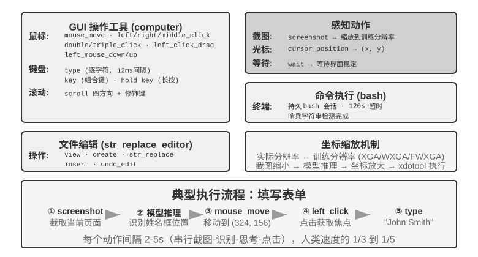
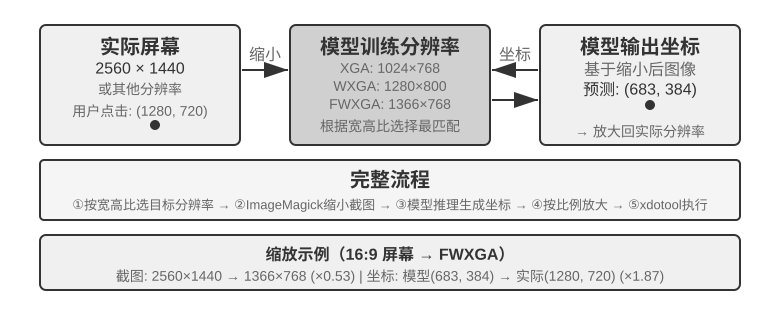

## Computer Use：GUI 自动化 Agent

读到这里也许会注意到，本章给语音的篇幅明显多于后两个场景——这是有意为之。在实时多模态这条演进线上，语音是走得最完整、最值得当作参考系的一个：从“串行流水线延迟太高”这个问题出发，经过端到端、全双工、边想边说等一系列方案，一直走到今天相对成型的终局，问题→方案→终局的全程都已经跑通。因此我们把它讲透，接下来的 Computer Use 和机器人两个场景，都可以对照语音这条脉络来看——它们各自走到了这条演进线的哪一段、卡在了哪里。

这三个场景看似不同，却面临相同的核心挑战：实时感知、低延迟决策、持续交互。接下来看这些技术主题如何在视觉交互（Computer Use）和物理交互（机器人）中重现——首先把视角从听觉模态扩展到视觉模态：如果 Agent 不仅能理解语音，还能“看懂”屏幕并操作图形界面呢？

Computer Use（也称 GUI 自动化 Agent）让 AI 像人类一样通过观察屏幕、操作鼠标键盘来使用软件——比如打开浏览器搜索信息、在表格软件中填写数据、或在系统设置中调整配置。其核心是一个**感知-思考-行动**的循环（图9-7）：

1. Agent 对当前屏幕截图
2. 多模态模型接收截图和任务指令，输出一段思考和一个具体动作
3. 执行层在真实环境中执行该动作（移动鼠标、点击、输入文字等）
4. 等待界面响应后再次截图，进入下一轮循环


这个循环中有三个关键设计维度：**动作空间**（Agent 能执行哪些操作）、**视觉定位**（如何在截图中找到目标元素）、以及**模型架构**（如何从截图生成正确动作）。

### 动作空间设计

Anthropic 定义三类工具构成完整的交互能力（图9-8）：





**GUI 操作工具**（computer tool）：鼠标操作包括移动（mouse_move）、左/右/中键点击、双击/三击、拖拽（left_click_drag），以及更精细的按下/松开（left_mouse_down/up）。滚动（scroll）支持四个方向并可配合修饰键。键盘操作包括逐字输入（type，每个字符间隔 12ms 模拟真实打字）、组合键（key，如 Ctrl+C）、长按（hold_key）。感知动作：截图（screenshot）、获取光标位置（cursor_position）、等待（wait）。

**命令执行工具**（bash tool）：提供持久的 bash 终端会话，120 秒超时，通过哨兵字符串检测命令是否执行完毕，多次调用之间保持环境状态（比如 cd 到某个目录后下次调用还在那个目录）。

**文件编辑工具**（str_replace_editor）：通过字符串匹配实现安全编辑，支持查看、创建、替换、插入和撤销操作，比直接覆盖整个文件更精确，不容易误改其他内容。

> **实验 9-6 ★：运行 Anthropic Computer Use Demo**
>
> 容器打包了一个完整的 Ubuntu 桌面环境（含浏览器、终端等常用工具）。前端接收任务指令，后端将指令与截图发送给 Claude，模型返回操作指令（移动鼠标、点击、输入文字等），执行层在虚拟桌面中执行。
>
> 关键观察：每个动作间隔 2-5 秒（显著慢于人类），但对常见任务展现良好规划能力，能自主拆解为合理操作序列。
>

### 视觉定位（Grounding）

在循环的每一轮中，模型需要在截图中准确定位目标元素——“搜索框在哪里？”“提交按钮的坐标是什么？”这就是视觉定位（Grounding）问题。当前主要有**两大思路**：一是把定位变成**选择题**——先把界面元素标注好编号，模型只需从中选一个；二是**纯坐标预测**——让模型像人一样直接“看”着截图报出坐标。其中选择题思路又有两种实现方式：**纯视觉标注**（原始的 Set-of-Mark，用分割模型在像素上切出候选区域）和**结构化元素索引**（DOM/Accessibility Tree，直接读取界面自带的结构）。选择题思路的共同优势，是把开放式的“在截图中找到按钮并预测坐标”转化为封闭式的“从已标注好的元素中选一个”——就像考试中选择题比填空题更容易答对一样，模型只需说“点击 [123]”而不是“点击屏幕左上角偏右大约 200 像素处的蓝色按钮”。

**Set-of-Mark：视觉标注法。**

原始的 Set-of-Mark（SoM）由微软研究院于 2023 年提出，最初是为了释放 GPT-4V 的视觉定位能力。它是一个**纯视觉**方法：用图像分割模型（SAM、SEEM 等）在截图上自动切出候选区域，为每个区域叠加编号标记，模型看到的是一张带编号的图，只需报出编号，由系统换算成对应区域的中心坐标。整个过程不需要 DOM，也不需要任何界面内部结构，因此原生桌面软件、游戏界面同样适用——只要分割模型能把候选区域切出来。

**结构化元素索引：SoM 思想在 Web 上的结构化实现。**

当界面本身能提供结构化信息时，标注可以做得更精确。现代网页在渲染之前就已经定义了完整的元素结构（DOM 树）和语义角色（哪个是按钮、哪个是输入框），无障碍接口（Accessibility Tree）为许多桌面应用提供了类似的信息。与其让分割模型在像素里猜“哪个区域是按钮”，不如直接问界面本身“你有哪些可以点击的元素？”。以 browser-use 项目为代表的 Web Agent 方案正是这样做的：从 DOM 中枚举可交互元素并编号，可以看作 SoM 思想在 Web 上的结构化实现（图9-9）。流程分四步：

1. 通过浏览器调试接口（CDP，Chrome DevTools Protocol）获取网页的结构化表示（DOM 树）和无障碍信息
2. 自动检测哪些元素可以交互（按钮、输入框、链接等）
3. 为每个可交互元素标注唯一 ID 并在截图上绘制边界框
4. 同时生成文本列表描述每个 ID 对应的元素

```
Screenshot: [图片中关键元素标注了 [1]、[2]、[3]、[4] 等 ID]

Elements:
[1] <input type="text" placeholder="Search" aria-label="Search" />
[2] <button id="submit-btn" aria-label="Submit form" />
[3] <input type="text" placeholder="Enter your name" value="" />
[4] <a href="/docs" aria-label="Documentation" />
```

模型只需要输出一个 ID 号就行，系统自动用该元素的中心坐标执行点击。这类方案不省 token（因为要把所有标注信息都发给模型），但定位准确稳定，还免去了分割模型可能引入的漏检和误检。


**纯坐标预测。**

第三条路线不做任何标注，直接让模型输出坐标。以 **SeeClick** 和 Claude 的 computer use 为代表：在海量 GUI 截图和元素位置的配对数据上训练视觉模型，让它学会将自然语言描述（如“点击提交按钮”）直接映射到截图中的精确坐标——就像人类用户一样，纯粹靠“看”来找到要点击的位置。

在坐标预测方案中，模型对坐标的理解高度依赖训练时使用的分辨率（图9-10）。Claude 训练使用 XGA（1024x768）、WXGA（1280x800）、FWXGA（1366x768），如果输入的截图分辨率不匹配，模型预测的坐标就会系统性地偏移——就像在小地图上量距离然后直接用到大地图上一样。因此，需要在工具层实现双向坐标缩放机制，而且要**按宽高比选目标分辨率**，避免非等比拉伸把画面压变形、连带把坐标判断也带偏。例如，真实屏幕分辨率为 2560×1440（16:9），就该在 Claude 支持的三档里挑一个宽高比同样接近 16:9 的目标——FWXGA（1366×768）最匹配。截图时把屏幕等比缩放到 1366×768 送入模型；模型输出点击坐标 (683, 384) 后，反向映射为真实坐标 (683×2560/1366, 384×1440/768) ≈ (1280, 720)。反过来，若硬把 16:9 拉伸进 4:3 的 1024×768，画面会被横向压扁，模型预测的坐标就会系统性偏移。





三条路线的选择逻辑可以概括为：**结构化信息可得时，优先用 DOM/Accessibility Tree 索引**，定位最精确稳定；**不可得时**（原生桌面软件如 Photoshop、Canvas/WebGL 渲染的界面、游戏），**既可以用视觉标注（原始 SoM 路线），也可以用坐标预测**。视觉标注把定位变成选择题，对未经专门训练的通用模型更友好；坐标预测省去标注步骤，对做过 GUI 定位训练的模型更直接。两者在小元素和密集界面上的精度都仍有差距。

> **实验 9-7 ★：使用 browser-use 实现自动浏览器操作**
>
> 基于 Playwright 浏览器自动化框架（一个用代码控制浏览器的工具库），结合多模态大模型实现自然语言驱动的浏览器操作。启用 SoM 可视化模式，每次决策前保存带标注框的截图。
>
> 测试任务“打开 Google 查询旧金山天气”：系统启动后截图显示 Google 搜索页面，所有可交互元素被标注上红色边界框和 ID 号（地址栏 `[1]`、搜索框 `[2]`、搜索按钮 `[3]`、“手气不错”按钮 `[4]` 等）→ 模型分析后点击 `[2]`（搜索框）→ 搜索框获得焦点后输入“San Francisco weather today”→ 点击 `[3]`（搜索按钮）→ 页面跳转到搜索结果，新截图标注天气卡片内元素，模型识别并提取温度、天气状况等信息。全程 5 步操作，约 20 秒完成。

### 能看动画、能听声音的 Computer Use Agent

到目前为止，Computer Use 的感知都建立在一个隐含假设上：**屏幕是静止的**——截一张图、想一步、点一下，再截下一张图。可现实里的屏幕会放视频、会弹出转瞬即逝的通知、会播放会议里的人声。一个每 3–5 秒才睁一次眼、而且完全没有耳朵的 Agent，对这些“两帧之间发生的事”既看不见也听不到。看录屏、跟会议、听语音提示、应付一闪而过的对话框——这一整类日常电脑操作，对今天的 Computer Use Agent 几乎是禁区。

这里真正该被重新设计的，不是“动作接口”，而是“**观察接口**”[^ch9-9]。核心思想是把**观察**（连续、自适应、多模态）从**动作**（离散）里解耦出来，做成一层插在环境和任意现成 Computer Use 模型之间、无需重训的感知中间件（可称之为 Agent–电脑观察接口，AOI）。它有三个“按需开闸”的部件：其一，**帧间关键帧捕获**——先用一个极廉价的像素门跳过几乎没变的画面，再用一个小模型判断画面是否发生了有意义的变化，只在变化时才截一帧，静止画面下几乎零成本；其二，**音量门控的语音转写**——有声音时才调用语音识别，让 Agent 第一次“长出耳朵”；其三，也是最关键的，**把画面叙述成持久的文字**——让模型把捕获到的帧描述成一句话（“刚弹出的提示说发布日期改到了 4 月 28 号”），并且**即使原图之后被清理出上下文，这句文字仍留在记忆里**，把动态信息以文本形式带着往下走。

一个反直觉的发现是：真正起作用的不是“选哪几帧”，而是“**把帧叙述成能长期留存的文字**”——文字才是 LLM Agent 最擅长处理的模态。在从 7B 到前沿规模的八个模型上，这层中间件无需任何重训就带来 +17 到 +48 个百分点的提升，其中语音类任务的差距最悬殊：加了这层感知，Agent 能把原本“听得见却动不了”的语音任务都做出来。但它也不是一套包打天下的固定配置——在某些更新的模型上，塞太多图像 token 反而会挤占推理、拖累表现，所以这些部件要**按模型逐个挑选**，而非一股脑全开。这与前面 Set-of-Mark 和坐标预测的取舍是同一个道理：感知方案没有银弹，要顺着模型的脾气来配。

[^ch9-9]: 门控关键帧、按需转写、把帧叙述成持久文字这三个部件，完整机制与逐模型消融见 Li, Bojie and Noah Shi. *Agent-Computer Observation Interfaces Enable Dynamic Computer Use.* arXiv:2606.29472, 2026.

### 移动端：生态壁垒比技术更难

Computer Use 也在向移动端扩展。移动端与桌面在技术上确有差异：动作空间通常不再是“鼠标坐标 + 键盘”，而是接入系统的无障碍服务 API（如 Android 的 AccessibilityService）来读取界面元素、下发点击与文本输入；交互方式也从鼠标指针变成触摸手势，坐标的语义随之改变——同一个 (x, y) 到底是手指的单击、长按，还是滑动手势的起点，需要额外的手势类型来界定。第六章介绍的 AndroidWorld 等移动端基准，正是在这样的动作空间上评测 Agent 完成真实 App 任务的能力。

但真正卡住移动端的，往往不是这些技术差异，而是生态壁垒。曾有手机厂商尝试在消费级手机中集成 AI 助手，让它自动操作微信、淘宝、支付宝等日常应用，但很快遭遇平台限制。

这揭示了 Computer Use 面临的一个独特挑战：**生态壁垒**。封杀背后的根本原因是商业模式冲突。传统互联网应用的核心变现逻辑是**流量与注意力**：用户刷信息流时看到广告，搜索商品时跟随推荐算法的引导，浏览页面时产生冲动消费。而当 Agent 代替用户操作时，这条变现链路被彻底绕过：AI 不会关注广告，也不会冲动消费，直奔目标完成任务就走。对于靠广告和流量变现的平台来说，Agent 的每一次操作都在侵蚀其商业模式的根基。

这意味着 Computer Use 面对的不仅是 CAPTCHA（验证码）等技术层面的对抗，更是一个**结构性的利益冲突**。这一矛盾在短期内难以调和，也让 Computer Use 在消费级场景中的落地面临比纯技术问题更棘手的挑战。

### 实时性：尚未解决的核心挑战

**OSWorld**（第六章详细介绍了其评估方法论）是广泛使用的 Computer Use 评估基准，在真实 Ubuntu/Windows/macOS 环境中测试 Agent 完成跨应用任务的能力。早期通用模型在该基准上的成功率只有两成左右，后续专用模型和更强通用模型持续把准确率推高，截至写作时已逐步接近人类水平。但准确率远非终点——真正的瓶颈已经从“能不能做对”转向了“能不能做快”。

**OSWorld-Human** 效率研究揭示了一个扎心的事实：即使任务最终成功，Agent 完成同样任务需要的操作步骤仍明显多于人类，而且每一步的推理延迟会随着任务推进持续增长——上下文越长，模型决策越慢，后期步骤的耗时往往远超前期。一个人类几十秒就能完成的文档格式调整，Agent 可能要磨蹭数分钟才能搞定。**准确率达到人类水平不等于实用——效率才是真正的瓶颈。**

效率问题的根源与语音场景类似：串行的“截图-思考-点击”循环中，即使每个环节都优化到极致，一步步累积的延迟仍然难以接受。更深层的问题是：目前的 Computer Use 完全不会“提前想”。如果 Agent 能在执行当前动作的同时预测下一步该做什么——比如在等页面加载时就想好接下来要点哪里——就可以把思考和执行的时间重叠起来，大幅降低总延迟（这正是本章前面语音场景里“边想边说”、以及第四章“持续思考”式异步 Agent 的同一诉求，只是这里换成了“边想边操作”）。

与语音领域不同的是，Computer Use 自身的实时性——把“截图-思考-点击”这个循环本身变快——目前还没有系统性的解决方案，它仍停留在逐帧截图的离散循环中。但有一条绕过它的思路已经跑通，用的正是本章反复出现的快慢解耦：既然让慢的电脑操作 Agent 变快很难，那就**别让用户去干等它**。把“说话”和“操作电脑”拆成快慢两套模型并发运行[^ch9-10]——一个小模型（快）负责实时语音对话，一个前沿 VLM（慢）在浏览器里一步步操作，两者之间只靠一份极简的“纯文本契约”沟通：慢 Agent 每次操作都附带一句滚动更新的状态摘要（“正在填表单，还需要你的出生日期”），快 Agent 据此实时回答用户、并把用户口头给出的新信息转达给慢 Agent，而且**在状态摘要确认完成之前，快 Agent 绝不许说“办好了”**。这正是“一边打电话说话、一边让电脑自己操作”的场景。实验里，这套解耦让语音回应比“单模型边操作边说话”快了约 15 倍（中位延迟 0.58 秒 vs 8.64 秒），而任务成功率不降；一旦抽掉那条快慢之间的文本通道，成功率立刻塌到 0——因为用户口头给的关键信息再也传不到浏览器里了。这和前面 Latent Bridge、以及语音场景里“边想边说”是同一套思路：当一个环节天生慢，就让另一个快的环节把用户的等待填满——只不过那份“纯文本契约”，本质上就是本书从第二章讲到现在的 Agent 状态栏。Computer Use 循环本身的提速或许仍是下一个重要的研究方向，但“用快慢解耦把‘慢’藏起来”已经是一个可用的答案。

[^ch9-10]: 语音-操作快慢解耦与“纯文本契约”的完整设计见 Li, Bojie and Noah Shi. *Talking While Acting: Real-Time Voice for Slow Computer-Use Agents.* 2026（待发表）.
