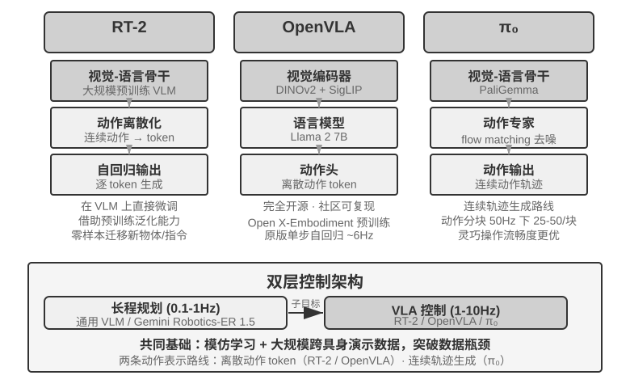
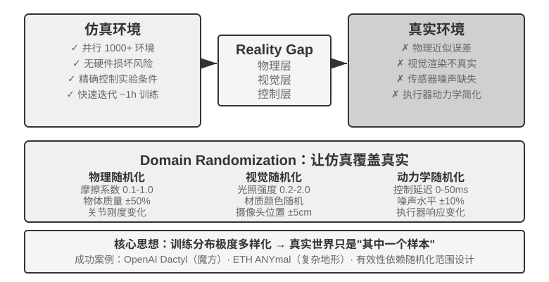
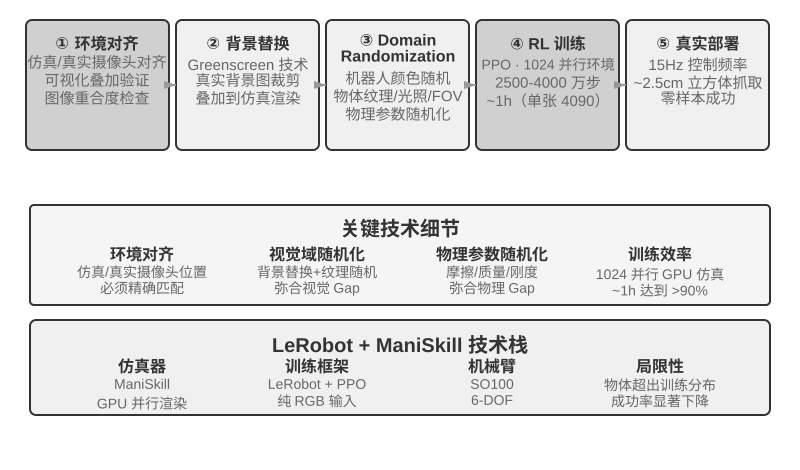

## 机器人操作：从实时控制到训练与泛化

> **阅读提示**：本节讨论机器人控制。实验 9-10 展示从模拟到真实的迁移方法——其中的**仿真训练部分（第 3-4 步）可以在纯 GPU 服务器上完成**，无需硬件；但要端到端复现整条流水线（含真实部署那几步），则需要 SO100 机械臂等真实硬件。如果你对机器人领域暂时不感兴趣，可以跳过本节，不影响其他章节的阅读。

语音 Agent 在听觉模态中面对延迟，Computer Use 在视觉模态中面对延迟，而当 Agent 需要控制物理世界的机器人时，延迟和多模态的挑战被进一步放大——动作的后果是不可逆的，一次碰撞就可能损坏物体或机器人本身。本节先看机器人如何用双层架构和动作分块把实时控制问题压下去，再顺势转到它当下更硬的骨头——训练与泛化：数据怎么来、模型怎样跨任务跨平台迁移。

### 硬件不是瓶颈，算法才是

机器人在通用开放场景中还没有得到广泛应用，瓶颈到底在硬件还是算法？XLeRobot 项目给出了一个有力的反证：成本不到 1000 美元的双臂轮式机器人，在人类通过 VR 头显远程操控（遥操作）时，已经能流畅完成大量家庭任务。更复杂的、需要灵巧手的家庭任务，宇树的机器人在人类遥操作下也能流畅完成。遥操作延迟大约 100-200ms，已接近物理交互的响应要求。传感器分辨率、执行器精度、控制频率（机器人每秒更新动作指令的次数，频率越低运动越不流畅、越容易出现抖动或偏离目标轨迹）在当前的低成本平台上已经足以支撑实用任务。

需要给这个论断划清边界：遥操作反证真正能说明的，是“现有低成本硬件加上人类的智能，足以完成**这类以视觉反馈为主的家庭操作任务**”。它并不意味着硬件在所有维度都过关——触觉传感的缺失、灵巧手的可靠性与成本，至今仍是公认的硬件短板；一旦任务重度依赖精细的力控与触觉反馈，硬件就未必不是瓶颈。因此下面说的“硬件不是瓶颈”，都限定在本节讨论的这类任务范围内。

就这类任务而言，真正的鸿沟在算法层，下面两个小节分别展开。

> **实验 9-8 ★：XLeRobot 遥操作体验**
>
> XLeRobot 支持键盘、Xbox 手柄、Switch Joycon 和 VR 头显等多种遥操作方式。通过亲手操控机器人完成取物、放置、擦拭等任务，观察响应延迟、运动精度和任务完成质量，建立对硬件能力边界的直观认知——亲身体验后就会发现，人操控时机器人什么都能干，说明当前瓶颈确实是算法而非硬件。[^ch9-1]
>
> [^ch9-1]: XLeRobot, “Teleop 文档”. https://xlerobot.readthedocs.io/en/latest/software/getting_started/XLeRobot_teleop.html

### 双层架构：规划与控制的分离

机器人完成复杂家庭任务需要在两个不同的时间尺度上做决策。第一层是较慢的**长程规划**（long-horizon planning）：把“把厨房打扫干净”这样的高层指令拆解为子目标序列（清理台面、装载洗碗机、擦拭表面），需要理解环境语义、推理任务依赖、规划多步行动方案——就像人在动手之前先想想“先干什么后干什么”。第二层是较快的 **VLA 控制**（Vision-Language-Action，视觉-语言-动作模型）：执行每个具体操作（“走到水槽前”“拿起抹布”“擦拭台面”），根据当前看到的画面和语言指令持续输出控制信号，让机器人的动作流畅连贯。

这种双层架构将复杂度有效分离：长程规划负责“做什么”，VLA 控制负责“怎么做”。这种“高层慢决策 + 底层快执行”的双层架构，与前文语音场景中的“快慢思考”在结构上高度相似——都是将复杂思考与实时响应解耦到不同模块中。需要提醒的是，这里的“规划 / 控制”对应的是快慢思考里“慢的深度思考 / 快的实时响应”这一维度的解耦，而不是方案三 MPS“构思脑 / 表达脑”那种“思考 / 表达”的解耦——后者拆的是“想”与“说”，前者拆的是“谋划全局”与“实时执行”，两种“双X架构”切分的维度并不相同。

不过实时性并没有凭空消失，而是被下推到 VLA 控制层，靠**动作分块**（Action Chunking，见下文“VLA 控制”一节）来摊薄：模型一次推理生成未来一小段动作序列，控制线程高频回放，把单次推理的延迟摊进整段动作的执行时间里。但这里有个绕不开的权衡——分块是拿反应性换平滑性：块越长，每次推理的延迟被摊得越薄、运动越连贯，可模型在这段时间里“看不到”新画面，对突发变化（物体被挪走、有人伸手挡住）也就越迟钝。实时性与平滑性之间的这道取舍，是双层架构没有消除、只是转移了的部分。

这里也需要交代本章主线的一个转向：在机器人场景中，实时性矛盾已经被双层解耦和动作分块部分缓解，当前的主要矛盾转移到了**训练与泛化**——如何获得足够的演示数据、如何让模型跨任务跨平台泛化。接下来几个小节正是围绕这条新矛盾展开的，这也是第六章仿真环境与第七章强化学习的主题在物理世界的延伸。

而这条新矛盾主要压在 VLA 控制层上。可以把 VLA 看作 “VLM + 动作输出”：**VLM**（Vision-Language Model，视觉-语言模型——能同时理解图像与文字的大模型）负责“看懂”和“想清楚”，VLA 在此基础上还要“动手”，真正的挑战正在于“动手”这一层。当前 VLA 控制层主要通过模仿学习（行为克隆）训练——直接从大量人类演示中学习“看到什么就做什么”（OpenVLA、RT-2、π₀ 等均属此类）；强化学习则是近年来在其之上的补充手段。用强化学习训练的 VLA 虽然能在单个任务上表现很好，但往往泛化能力不足：即使如第七章 SimpleVLA-RL 在 LIBERO 上报告了很高的单任务结果，也是针对每个任务分别做 RL 训练的，而非一个统一模型零样本泛化到所有任务。这种“一个任务训练一次”的模式意味着每遇到新任务，还得重新收集数据、重新训练。

以下两节分别深入讨论长程规划和 VLA 控制的具体技术方案。

### 长程规划：从 VLM 到专用具身思考模型

通用 VLM 已经具备不错的具身思考能力。Google DeepMind 的 **Gemini Robotics-ER 1.5** 专门针对具身思考（Embodied Reasoning，即理解物理世界中物体的位置、运动和因果关系）做了优化，在 15 个学术基准（Point-Bench、RefSpatial、RoboSpatial、BLINK 等）上平均 62.8%，超过 GPT-4o（60.6%）和 Gemini 2.5 Pro（59.3%）。核心优势包括：高级空间理解与物体定位、时序推理（预测“如果推倒这个杯子会怎样”这类动作因果）、任务编排（把高层指令分解为小步骤），并原生支持思考（thinking）机制和工具调用。[^ch9-2]

[^ch9-2]: Google DeepMind, “Gemini Robotics-ER 1.5”. https://deepmind.google/models/gemini-robotics/gemini-robotics-er/

> **实验 9-9 ★★：使用 Gemini Robotics-ER 1.5 驱动 XLeRobot 自主导航**
>
> 通过 RoboCrew 库将 Gemini Robotics-ER 1.5 作为长程规划模型，摄像头图像叠加角度刻度标注。系统只提供三个简单工具：前进、左转、右转。给定任务“找到厨房并走到那里”后，模型以 0.5-1Hz 的频率做决策：识别走廊、房门、家具等视觉特征，判断“厨房可能在左侧”就执行左转，看到“前方有冰箱”就继续前进。还可以扩展为语音控制模式（用唤醒词触发新任务）。这个实验揭示了 VLM 在长程规划层的能力边界：空间推理和任务分解已经做得不错，但在复杂环境中的鲁棒性和多步推理的一致性仍有提升空间。[^ch9-3]
>
> [^ch9-3]: XLeRobot, “LLM Agent 控制”. https://xlerobot.readthedocs.io/en/latest/software/getting_started/LLM_agent.html

### VLA 控制：从演示数据到跨具身泛化

在双层架构的执行层，RT-2、OpenVLA、π₀ 三个代表性模型都专注于 VLA 控制——即根据摄像头画面和语言指令实时输出机器人的动作（图9-11）。它们在动作表示上分属两条路线：离散动作 token 与连续轨迹生成。

**RT-2 与 OpenVLA：离散动作 token 路线。**

**RT-2** 开创了这条路线：直接在大规模视觉-语言模型上微调，把机器人的连续动作离散化为 token，像生成文本一样逐个自回归输出，借助预训练模型的泛化能力提升对新物体和新指令的零样本迁移效果。**OpenVLA** 沿袭了 RT-2 的动作表示方案，将语言模型和视觉编码器统一在一个架构中，输入图像和文字指令，输出动作 token。训练分两阶段：先在大规模跨平台数据集 Open X-Embodiment（涵盖 20 多种机器人平台的真实操作演示）上做预训练，学习通用的操作知识（“抓取”“放置”等动作模式在不同机器人之间是相通的），再针对特定平台用少量数据微调。既然动作表示本质相同，两者的真正差异就在开放性与工程选择上：RT-2 及其训练数据是 Google 内部的，OpenVLA 则完全开源——开源骨干模型（Llama 2 加视觉编码器）配公开数据集，让整个社区第一次可以在其基础上复现和改进。

**动作分块：VLA 领域通用的频率补偿技术。**

由于 LLM 推理有延迟，VLA 的控制频率远低于传统机器人控制的要求（传统机器人控制通常要求 50-1000Hz 的控制频率，而 VLA 单次推理只有约 1-10Hz——差距可达两个数量级）。原版 OpenVLA 正是这个问题的典型代表：它每次推理只输出一个动作（约 6Hz 的单步自回归预测），动作卡顿恰恰是它被诟病的主要短板。**动作分块**（Action Chunking）就是为弥补这个差距而生的通用技术——最早由 ACT（Zhao et al., 2023）提出，后被 π₀、OpenVLA-OFT 等广泛采用：模型每次推理不是只输出一个动作，而是一口气生成未来一小段时间的动作序列（以 π₀ 的典型配置为例，一次生成约 0.5-1 秒的动作块，在 50Hz 控制频率下即 25-50 个动作），控制线程按高频依次执行，同时模型在后台异步生成下一批。只要模型的推理时间小于这批动作的执行时间，机器人就能保持连续流畅的运动——就像视频缓冲一样，提前加载好后面的内容，播放就不会卡顿。

**π₀：连续轨迹生成路线。**

动作表示的真正分野，不在 RT-2 与 OpenVLA 之间，而在**离散 token 与连续轨迹生成**之间。**π₀** 代表后一条路线：不再逐个预测离散动作 token，而是用 flow matching（流匹配，一种与扩散模型同源的连续生成方法）从随机噪声出发、经多步迭代“去噪”，直接生成一段平滑连续的动作轨迹。这种表示天然与动作分块结合，在灵巧操作等对动作精度和流畅度要求高的任务上表现更好。打个比方：离散 token 路线像从菜单中逐步选择“向左 5 度”“向前 3 厘米”，连续轨迹路线像画家先勾出整条曲线、再逐笔修正成型。

### Sim2Real Transfer：从仿真到现实的鸿沟

第六章的仿真环境一节已经讲清 sim-to-real gap（现实差距）的来源，以及领域随机化（domain randomization）应对它的原理，这里不再重复——一句话概括：仿真无法完全还原真实的物理、视觉与硬件特性，训练时便把这些参数大范围随机打乱，逼策略学出一套对各种变化都稳的通用表征（图9-12）。下面只看这套原理在真实机械臂上如何落地。

这条路线已有不少成功案例：OpenAI 的机械手灵巧操作（Dactyl 项目实现手内方块重定向，其后续工作又借助自动域随机化 ADR 实现了单手解魔方）和 ETH Zurich 的 ANYmal（四足机器人在雪地、碎石等复杂野外地形上鲁棒行走）都属此列。

本章真正要补的，是把领域随机化落到真机时绕不开的两个工程环节。其一是**随机化范围的标定**：范围不能拍脑袋定，太窄覆盖不了真实变化，太宽又会增大训练难度、学出“什么都能应付但什么都不精”的次优策略。实践中通常先从真实环境数据里**实测标定**关键参数的分布（如摩擦系数、电机响应延迟的真实分布），在该范围内采样；若仿真训练的策略在真机上明显掉点，再逐步扩大随机化范围，直到 sim-to-real gap 收敛到可接受。其二是**视觉对齐**：精确校准仿真与真实的摄像头位姿（环境对齐），并把真实拍摄的背景随机替换进仿真渲染（greenscreen 背景替换），让仿真画面尽量贴近真机所见——这两步实验 9-10 会具体演示。

> **实验 9-10 ★★★：基于 RGB 的零样本 Sim2Real 机械臂抓取**
>
> 使用 LeRobot + ManiSkill 仿真器，只用 RGB 摄像头图像（不依赖深度传感器或力传感器）训练，然后零样本（不做任何额外调整）直接部署到真实 SO100 机械臂。五步流程：
>
> 1. **环境对齐**：调整仿真和真实环境中的摄像头位置，通过可视化叠加验证两边的图像能对齐
> 2. **背景替换**（greenscreen）：把真实环境拍的背景图随机裁剪后叠加到仿真渲染中，让仿真画面的背景更接近真实
> 3. **Domain randomization**：随机化机器人颜色、物体纹理、光照条件、摄像头视场角等参数
> 4. **RL 训练**：使用 PPO 算法在大规模并行仿真环境中训练，直至仿真中成功率 >90%
> 5. **真实部署**：在真实机器人上零样本直接成功完成抓取任务
>
> 成功的关键要素：精确的环境对齐 + 视觉域随机化 + 物理参数随机化，三者缺一不可。局限性：当真实物体的形状、大小或材质超出训练分布时，成功率会显著下降。[^ch9-6]
>
> [^ch9-6]: LeRobot, “Sim2Real 教程”. https://github.com/StoneT2000/lerobot-sim2real/blob/main/docs/zero_shot_rgb_sim2real.md
>
>
> 
>
