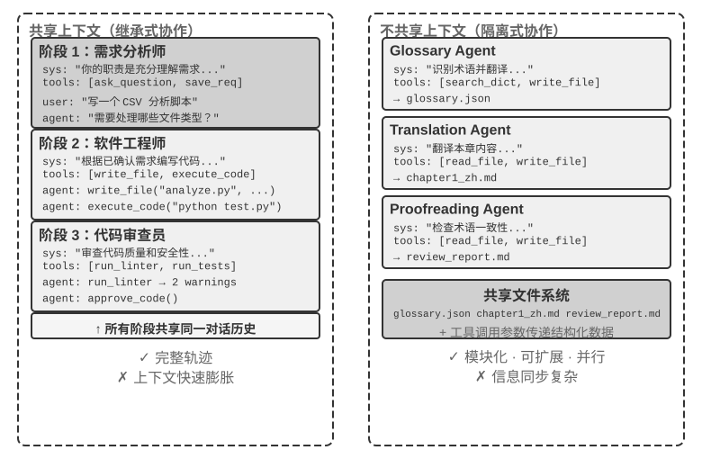

## 多 Agent 协作的分类框架

要构建多 Agent 系统，首先需要理解两个核心设计维度，它们共同决定了系统的基本架构和实现方式。

### 维度一：上下文是否共享

这是最基础的架构决策，决定了多个 Agent 之间如何传递信息。

**共享上下文**意味着后一个 Agent 接收前一个 Agent 的完整对话历史和轨迹（第一章定义的 trajectory）。每个阶段切换系统提示词和工具集后，就变成了一个新的 Agent（因为它的身份、职责和能力都发生了变化），但它保留了前任的全部记忆。比如一个团队里，需求分析师写完需求文档后，开发者不仅拿到了文档，还能看到分析师与用户的所有沟通记录——他是一个新角色，但完整保留了之前的上下文。优势在于信息不丢失，每个 Agent 都能回顾之前任何阶段的细节；挑战在于上下文可能快速膨胀。

**不共享上下文**意味着每个 Agent 维护完全独立的上下文和对话历史，彼此无法直接访问对方的“思考过程”。这就像不同部门之间的协作：每个人在自己的工位上独立工作，通过共享文档和会议纪要交换信息，而不是时刻盯着别人的屏幕。这种模式的模块化和隔离性更好，每个 Agent 只需关注与自身职责相关的信息；系统也更易扩展和维护——增加新 Agent 不需要改动现有 Agent 的内部逻辑，只需定义好接口和数据格式。

由于 Agent 之间不共享上下文，必须通过显式的通信机制传递信息。这个问题在经典分布式系统中早有答案：操作系统教科书告诉我们，进程间通信（IPC）归根结底只有两大范式——**共享内存**（一方写入、另一方读取同一块存储）和**消息传递**（把数据显式地发送给对方）。Agent 间的通信机制同样落在这两个范式之内，常见的有三种：

- **工具调用的参数**：上游 Agent 把结构化数据作为参数传给下游 Agent 的工具，适合需要类型确定、结构清晰的场景；
- **共享文件系统**：Agent 之间通过读写共享目录下的文档、代码等中间产物来交换信息，适合产物较大或需要持久化的场景；
- **消息总线（Message Bus）**：一个专门负责在 Agent 之间传递消息的中转站，Agent 不直接调用彼此，而是把消息发送到消息总线，由它转发给目标 Agent。

对应到 IPC 的两大范式：共享文件系统就是 Agent 世界的“共享内存”；工具调用参数和消息总线则是“消息传递”的两种形态——前者随调用同步传递，后者经中转站异步投递。两种范式各有取舍。Go 语言有一句广为流传的话：“不要通过共享内存来通信，而要通过通信来共享内存”——共享内存快，却把并发冲突的隐患留给使用者；消息传递要多写编排代码，却让数据的归属清晰可循。这个取舍在后文的状态查询与并发冲突中会反复出现。

消息总线天然支持**异步通信**——发送方和接收方不需要同时在线，就像公司内部的邮件系统：你发邮件给同事时不要求对方此刻在电脑前，邮件先存在服务器上，等同事上线再处理。这种方式特别适合多个 Agent 并行工作、彼此需要协调的场景（详见本章“并行协调”一节）。

需要澄清的是，两种架构都是真正的多 Agent 系统（因为每个阶段的系统提示词和工具集不同，就是不同的 Agent），区别在于协调方式。**共享上下文**依赖隐式协调——后续 Agent 继承前序 Agent 的完整上下文历史，能“看到”之前的思考过程，信息通过上下文本身传递。**不共享上下文**依赖显式协调——Agent 之间通过文件、消息或结构化数据接口交换信息，每个 Agent 只看到与自己相关的内容。

打个比方：前者更像一个团队围坐在一张桌子旁讨论，所有人听到所有话；后者更像不同部门通过邮件和文档协作，各自有自己的工作空间。

熟悉操作系统的读者会认出这对选择：共享上下文是线程，不共享上下文是进程。线程共享地址空间，切换开销小，通信不需要拷贝，代价是没有隔离——一个线程写坏内存，整个进程随之崩溃；进程各有独立的地址空间，隔离彻底，可以安全并行，代价是通信必须经过显式的 IPC。表10-1 的每一条选择依据，都能从这组取舍中推出来。

表10-1 从子任务数量、上下文窗口、并行度、信息隔离和成本预算五个角度汇总了两种架构的选择依据，可作为早期架构选型的检查表。

表10-1 共享上下文与不共享上下文的选择依据

| 选择依据 | 共享上下文 | 不共享上下文 |
|----------|-------------------------------------|------------------------------------------------|
| 子任务数量 | 少（2-3 个角色） | 多（需要并行处理） |
| 上下文窗口 | 足以容纳所有角色的信息 | 单窗口装不下 |
| 并行度 | 串行为主（角色沿同一段轨迹依次接棒） | 可大规模并行（上下文互相独立，互不阻塞） |
| 信息隔离 | 不需要（所有角色共享信息） | 需要（如安全审查不应看到原始思考过程） |
| 成本预算 | 单条轨迹接力，token 随阶段累积 | 多 Agent 各自展开，总 token 通常高出数倍到一个数量级 |

**简单判断**：若预期累计上下文会超过窗口的 50%（这是一条经验法则，而非精确阈值），应不共享；若信息零损耗对任务正确性是硬约束，应共享；多数实际系统采用“阶段切换式”方案——前几个 Agent 共享，到信息饱和点后切换为不共享上下文 + 显式 handoff（移交，即由上游 Agent 主动决定把哪些信息交接给下游）。

### 维度二：协作拓扑

第二个维度是协作拓扑——Agent 之间的控制权和信息按什么结构流动。协作拓扑与上下文是否共享**概念上独立、实践中相关**：说它概念上独立，是因为共享上下文的系统同样存在拓扑，比如本章稍后介绍的 `transfer_to_agent`（实验 10-2），本质就是链式移交（handoff）在共享上下文下的形态；说它实践中相关，是因为一旦共享上下文，拓扑往往会退化（见下文），两个维度的取值并非可以随意组合。只不过在共享上下文时，移交无需决定“传什么”——完整历史天然保留——拓扑因此通常退化为一条角色切换的序列，没有太多架构决策可做（一个介于两者之间的例外是 group chat 式的多方协作，见本章后文去中心化一节）。而一旦选择不共享上下文，“信息如何流动、由谁协调”就成为必须显式设计的问题。

换句话说，这两个维度原则上构成一个 2×3 的组合矩阵（共享/不共享 × 三种拓扑），但共享上下文这一行里，拓扑大多退化为一条角色切换序列、没有多少架构决策可做（这正是后文“多阶段角色转换”所讨论的形态），因此本章只详细展开不共享上下文的三格。下面介绍的就是协作拓扑在不共享上下文时的三种典型形态，按复杂度递增：

- **对等协作模式**（Peer Collaboration Pattern）：少量 Agent（通常 2-3 个）以平等身份交互，形成迭代改进循环——就像写论文时一个人起草、另一个人批注修改，反复几轮后质量远超一个人闷头写。
- **管理者模式**（Orchestration Pattern）：一个中心化的 Manager Agent 负责任务规划和调度，多个子 Agent 各负责特定子任务——就像项目经理带着几位专业工程师做项目。
- **去中心化模式**（Decentralized Pattern）：没有运行时的中心控制者，Agent 之间像人类一样互相沟通，协作完成任务。

各模式的详细设计和适用场景将在后面的专题小节中展开讨论。
