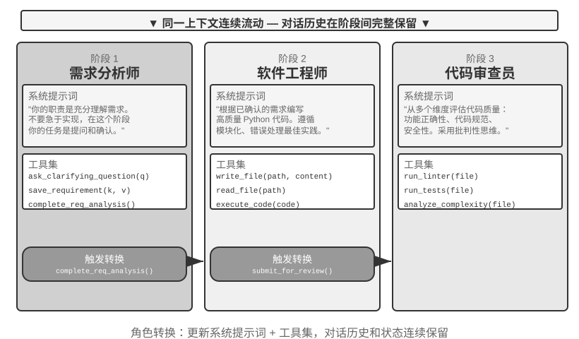

## 共享上下文的多 Agent 协作

共享上下文的多 Agent 协作中，每个阶段都是一个独立的 Agent（拥有自己的系统提示词和工具集），但它继承了前序 Agent 的完整轨迹——就像接班的同事能翻阅前任留下的所有工作日志。这种“继承式协作”的核心优势在于信息零损耗，每个 Agent 都能回顾之前任何阶段的细节。挑战则在于如何让当前 Agent 专注于自己的核心职责，而不被继承来的大量历史信息所干扰。

### 多阶段角色转换

先把一个定义之争摆到明处：用第一章的语言说，多阶段角色转换是一种**工作流式的编排**——执行路径（例如需求澄清→实现→审查）是预先定义的。从进程的角度看则更为清楚：这是一个进程依次执行不同阶段的代码——换的是代码段，内存自始至终是同一份，并非多进程。因此，不把它算作“真正的多 Agent”的观点有其道理。本章仍将它纳入多 Agent 的框架，是因为这样做有切实的设计收益：当每个阶段的系统提示词、工具集、关注点都不同时，把各阶段看作共享同一段轨迹的多个 Agent，每个“身份”的提示词和工具集可以独立打磨，阶段边界也天然成为质量门控点。

在复杂任务中，Agent 的角色和职责可能在不同阶段发生显著变化。如果始终使用同一套静态系统提示词，要么过于笼统缺乏针对性，要么把所有阶段的指导塞在一起导致过于冗长。多阶段角色转换的做法是：根据当前阶段动态切换系统提示词和工具集，让 Agent 在每个阶段都以最合适的“身份”工作。这种转换不需要创建新实例或启动新进程，只是在同一执行会话中更新上下文。关键在于，虽然角色切换了，但对话历史和任务状态始终连续共享——Agent 在新角色下仍能访问之前阶段积累的所有信息。





> **实验 10-1 ★★：根据执行阶段决定系统提示词**
>
> 本实验通过一个 Coding Agent 的完整工作流程，展示阶段化系统提示词如何提升 Agent 的表现。
>
> **任务场景**：用户提出一个软件开发需求，Agent 依次经历三个阶段：需求澄清、代码实现、质量审查。
>
> **第一阶段：需求澄清**（角色：需求分析师）
>
> 系统提示词强调：
> - “你的职责是充分理解用户的需求。通过提出问题来澄清模糊的地方，确保你完全理解用户期望的功能、使用场景、性能要求。”
> - “不要急于实现。在这个阶段，你的任务是提问和确认，而不是编写代码。”
> - “当你确认所有关键需求都已明确后，调用 `complete_requirements_analysis()` 工具来结束这个阶段。”
>
> 工具集有限：`ask_clarifying_question(question)` 用于向用户提出澄清问题，`save_requirement(key, value)` 用于记录确认的需求点，`complete_requirements_analysis()` 用于标记阶段完成。
>
> Agent 与用户展开多轮对话：“这个脚本需要处理哪些类型的文件？”“要不要递归处理子文件夹？”“文件移动后是否保留原文件名？”通过这些问题，Agent 逐步建立起完整的需求理解并结构化保存。当 Agent 判断需求已经足够清晰时，调用 `complete_requirements_analysis()` 触发角色转换——系统检测到阶段完成信号，自动切换到下一阶段的配置。
>
> **第二阶段：代码实现**（角色：软件工程师）
>
> 新的系统提示词强调：
> - “你的职责是根据已确认的需求，编写高质量的 Python 代码。”
> - “遵循最佳实践：代码应该模块化、有适当的错误处理、包含必要的注释。”
> - “完成代码编写并通过基本测试后，调用 `submit_for_review()` 进入审查阶段。”
>
> 工具集发生了显著变化：之前的需求澄清工具被移除，取而代之的是 `write_file(path, content)`、`read_file(path)`、`execute_code(code)` 等开发工具。Agent 基于第一阶段保存的需求开始编写代码——先写主要逻辑，再添加错误处理，最后编写测试验证。整个过程中 Agent 仍可访问第一阶段的对话历史来回顾需求细节，但行为模式已截然不同：不再提问，专注于实现。完成后调用 `submit_for_review()`。
>
> **第三阶段：代码审查**（角色：代码审查员）
>
> 新的系统提示词强调：
> - “你的职责是审查刚才编写的代码，从多个维度评估其质量：功能正确性、代码规范、错误处理、性能优化、安全性。”
> - “采用批判性思维，尝试找出代码中可能存在的问题和改进空间。”
> - “发现严重问题调用 `request_revision(issues)` 返回实现阶段修改；质量可接受调用 `approve_code()` 完成任务。”
>
> 工具集再次变化：换成了 `run_linter(file)`、`run_tests(file)`、`analyze_complexity(file)` 等代码质量分析工具。Agent 以审查者的视角重新审视代码，运行静态分析，排查潜在的 bug、性能问题或安全隐患。
>
> 这种三阶段设计让 Agent 在每个阶段都能专注于当前核心任务。更重要的是，明确的阶段转换机制保证了任务执行的完整性——Agent 不会跳过需求分析直接写代码，也不会在未经审查的情况下就交付成果。
>
> **实验要求**：
> 1. 实现三阶段系统提示词，每阶段有明确角色定义和行为指导
> 2. 为每阶段配置匹配的工具集
> 3. 实现阶段转换触发机制（通过特定工具调用）
> 4. 确保上下文在阶段间的连续性
> 5. 处理回退情况——代码审查发现问题时能返回实现阶段
> 6. 记录每阶段执行日志，展示不同提示词如何产生不同行为模式
>

### 跨领域角色转换

前面的多阶段角色转换展示的是单一任务类型（软件开发）中的阶段化执行。跨领域角色转换则进一步探索 Agent 在多种任务类型之间的自主切换——不再是预先规划好的线性流程，而是根据用户需求的变化，由 Agent 自主判断应该切换到哪个专业角色。

> **实验 10-2 ★★：多角色转换**
>
> **前置要求**：建议先了解第二章 Agent Skills 机制。
>
> **系统架构**：五种角色——
>
> - **triage（前台分诊，默认入口）**：理解用户的整体需求，把它拆成有先后顺序的子任务，逐步移交给合适的专业角色，并在全部子任务完成后做收尾确认。自身没有专业工具，只持有 transfer
> - **research（信息检索专家）**：用 `web_search` 查找数据、事实和资料
> - **coding（编程专家）**：用 `execute_python` 写并运行代码，解决程序逻辑/脚本类问题
> - **data_analysis（数据分析专家）**：用 `calculate` / `descriptive_stats` 做定量计算与统计（如同比增长率、年均复合增长率 CAGR、均值）
> - **writing（写作专家）**：把检索到的数据和计算结论润色成通顺、面向指定读者的成稿（可用 `count_characters` 粗查篇幅）
>
> **核心机制：transfer_to_agent 工具**
>
> 所有角色都配备了 `transfer_to_agent(target_role, reason)` 工具。调用时系统会依次：1）保存当前对话历史；2）加载目标角色的提示词和工具集；3）将对话历史传递给新角色，使其理解上下文；4）以新角色身份继续执行。
>
> **实验场景**：系统默认以 triage（前台分诊）身份运行。用户抛来一个跨领域的复合任务：“我在准备一份给投资人看的材料，帮我查一下中国 2021、2022、2023 三年的新能源汽车销量，算出这三年的年均复合增长率，再写成一段面向投资人、不超过 120 字的中文总结。”triage 把它拆成“查数据 → 算指标 → 写成稿”，第一步先移交检索：
>
> ```python
> transfer_to_agent(target_role="research", reason="需要先查三年的新能源汽车销量数据")
> ```
>
> research 用 `web_search` 查到销量后，把关键数据写进对话，再移交给数据分析：
>
> ```python
> transfer_to_agent(target_role="data_analysis", reason="数据已就绪，需要计算三年 CAGR")
> ```
>
> data_analysis 用 `calculate` 算出增长率，移交给 writing 成文；writing 写好后再移交回 triage 做收尾确认。整条链路是 triage → research → data_analysis → writing → triage，每个角色都看得到完整对话历史，因此后一个角色天然知道前面已经做了什么。
>
> 角色转换的决策依赖系统提示词的指导。triage 的提示词里明确列出了路由规则：查数据/资料转 research，写并运行代码转 coding，定量计算与统计转 data_analysis，润色成稿转 writing。判断标准很简单：任务需要特定领域的深度知识或专业工具，就移交给对应的专业角色。专业角色的提示词中同样指导了完成本职部分后该移交给谁或转回 triage。
>
> **实验要求**：
> 1. 实现至少三种专业角色的系统提示词和专门工具集
> 2. 实现 `transfer_to_agent` 工具，支持动态切换
> 3. 确保角色切换后上下文连续性
> 4. 处理循环切换问题——避免 Agent 在角色之间反复切换
> 5. 设计跨越多个领域的复杂任务流程，展示角色转换价值
>
