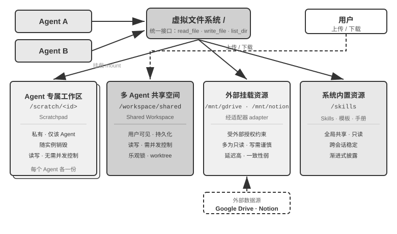
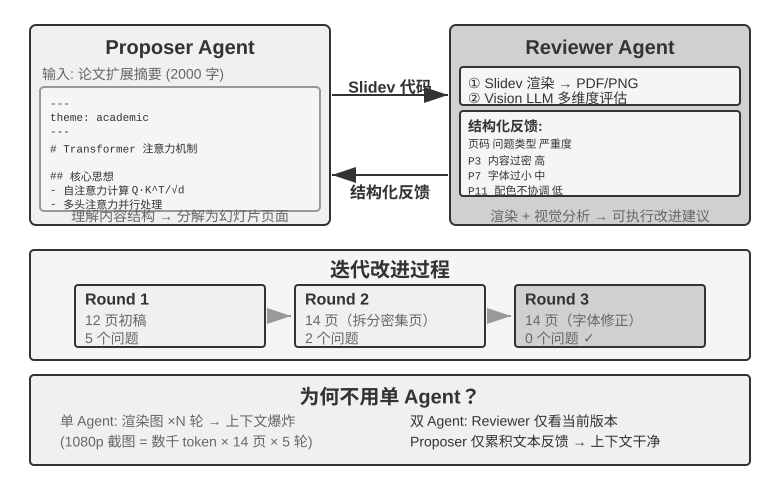
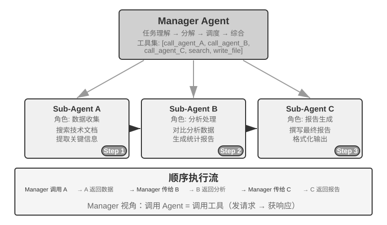
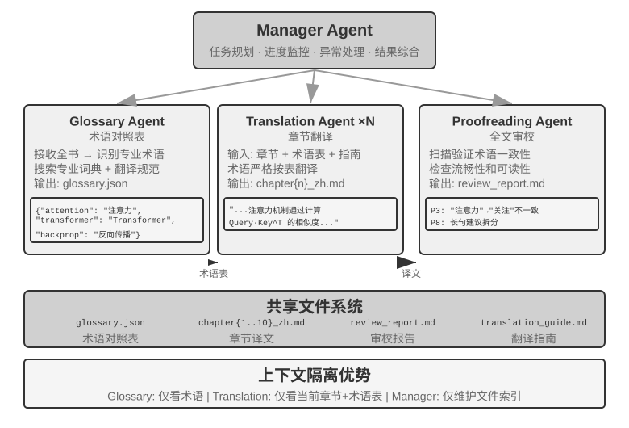
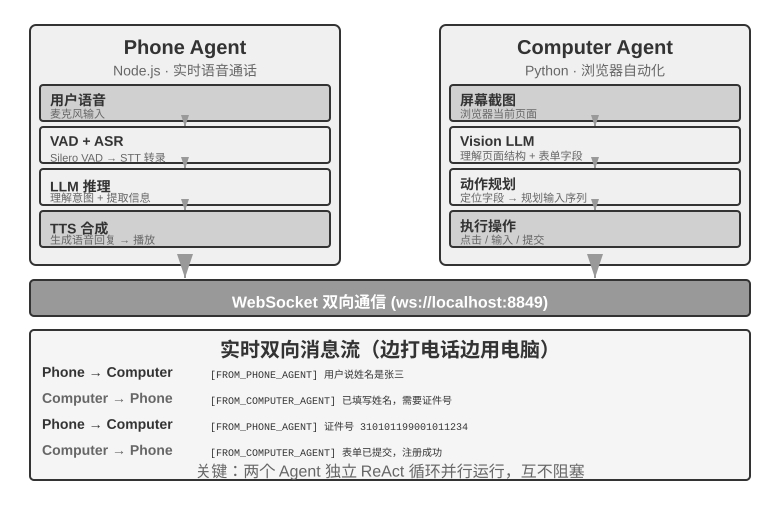
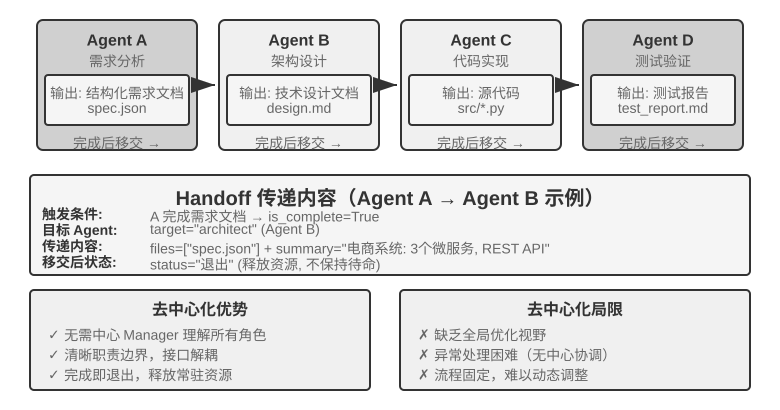
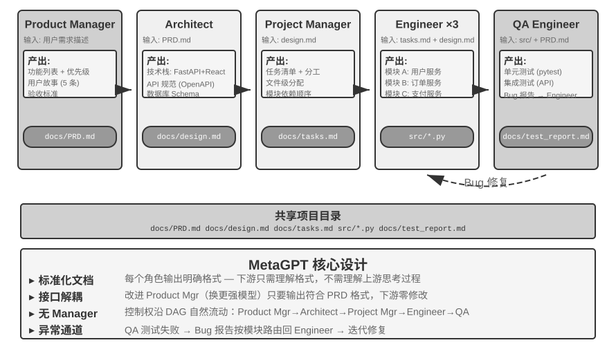

## 不共享上下文的多 Agent 协作

不共享上下文代表真正的多 Agent 协作。在这种架构下，每个 Agent 都是独立的实体，拥有自己的上下文、轨迹和状态。Agent 之间无法直接访问彼此的“内心活动”，协作完全依赖明确的、结构化的数据传递机制，也就是本章开头介绍的三种通信机制（工具调用参数、共享文件系统、消息总线）。

本章开头把通信机制对应到进程间通信的两大范式，把共享与不共享上下文对应到线程与进程。这个类比可以走得更远（表10-3）：

表10-3 多 Agent 系统与操作系统的对应关系

| 操作系统 | 多 Agent 系统 |
|----------|----------------|
| 程序（可执行文件） | 静态前缀（系统提示词 + 工具定义） |
| 进程的内存 | 轨迹 |
| CPU | LLM |
| 内核 | Agent 运行时 |
| 系统调用 | 工具调用 |
| fork（创建子进程） | spawn_subagent |
| kill（发送信号） | cancel_subagent |
| ps（列出进程） | list_agents |
| 退出码与 wait() | 子 Agent 返回的结构化摘要 |
| 共享内存 / 消息传递 | 共享文件系统 / 消息 |

程序是静态的代码，进程是程序的一次运行。同样，静态前缀决定 Agent 是谁，轨迹记录它走到了哪一步。LLM 扮演的是 CPU 的角色：自身不保存状态，靠加载不同的上下文分时服务许多 Agent——“上下文切换”这个词本来就是从操作系统借来的。也正因如此，换一颗更快的 CPU，程序照常运行；换一个更强的模型，Agent 还是原来那个 Agent——它的身份和记忆在前缀与轨迹里，不在模型权重里。

这套抽象并不新鲜：私有状态、异步消息、可创建新成员，正是 1970 年代 Actor 模型的基本设定[^actor-model]，多 Agent 系统不妨看作它的 LLM 版本。因此操作系统与分布式系统的成熟经验大多可以直接借用。唯一失效之处在于：进程间传递字节，逐位保真；Agent 间传递语义，每次转述都可能失真——这是本章“失败模式”一节要专门讨论的新问题。

[^actor-model]: Hewitt, C., Bishop, P., Steiger, R. *A Universal Modular ACTOR Formalism for Artificial Intelligence.* IJCAI 1973.

进程式的隔离带来了几个切实的工程好处：每个 Agent 可以独立开发和测试，新增能力不需要改动现有代码，某个 Agent 出了故障也不会把错误状态传染给其他 Agent，而且多个 Agent 可以真正并发执行——上下文完全独立，不存在资源竞争。

但不共享上下文也有代价。最明显的是信息同步问题：各 Agent 如何对任务状态保持一致的理解？信息在传递过程中会不会丢失或重复？调试也变得更加困难——出了问题需要翻看多个 Agent 的日志，才能拼出完整的执行过程。这些问题使得接口规范、数据格式和通信协议的设计变得至关重要。

不共享上下文的显式协作依赖两套与拓扑无关的基础设施。其一是**共享文件系统**，作为 Agent 间交换产物、与用户交换文件的持久媒介，构成协作的数据平面；其二是**通信与控制机制**，支持 Agent 间的消息传递、状态查询、执行终止与资源调度，构成协作的控制平面。以下三种拓扑均建立在这两者之上。

### Agent 眼中的文件系统

本章开头将“共享文件系统”列为不共享上下文的三种通信机制之一。在实际系统中，Agent 访问的并非单一存储，而是一个**虚拟文件系统**（virtual filesystem）：来源、生命周期与权限各异的存储被挂载（mount）到同一目录树下，Agent 通过统一的 `read_file`/`write_file`/`list_dir` 接口访问，底层则可能是本地临时盘、持久对象存储、第三方云盘的 API 或只读的系统资源包。明确这棵目录树的构成——每一区域的可见性与生命周期——是多 Agent 协作设计的前提：相当一部分并发冲突与信息泄露，源于将本应隔离的区域混置。这棵目录树相当于 Agent 的地址空间，四类区域就是权限各异的内存段：有的私有可写，有的多方共享，有的只读。操作系统的保护哲学在这里同样成立——默认隔离，共享须显式声明。一个成熟的多 Agent 系统，其文件系统通常由以下四类区域构成：

**一、Agent 专属工作区（Scratchpad）**。每个 Agent 实例独享的私有目录，存放中间产物、临时文件、草稿与调试日志，生命周期与实例绑定，对其他 Agent 和用户不可见。隔离 scratchpad 有两重作用：避免多个 Agent 的临时文件相互覆盖，以及保持主 Agent 上下文的精简——子 Agent 的试错过程留存于自身工作区，仅将最终产物提交至共享空间。这对应第四章“子 Agent 返回结构化摘要而非全量轨迹”在存储层面的体现。

**二、多 Agent 共享空间（Shared Workspace）**。多个 Agent 共同读写、且**用户可见**的协作区域，是不共享上下文架构下 Agent 间交换产物的主要媒介：Glossary Agent 写入术语表，Translation Agent 从中读取；用户亦可在此上传原始文件、下载最终交付物。其生命周期与整个任务绑定，需要持久化。作为多方并发读写的区域，它是并发冲突的高发处——乐观锁、工作副本隔离（worktree）等机制均作用于此，详见本章后文“失败模式一”。第四章以卷挂载 `/workspace/shared` 连接主 Agent、虚拟电脑与虚拟手机，即为这一层的典型实现。

**三、外部挂载资源（Mounted External Resources）**。用户授权接入的第三方信息源——Google Drive、Notion、Dropbox、企业 Wiki 等——通过适配器（adapter）映射为文件系统中的挂载点（如 `/mnt/gdrive`）。Agent 以读文件的方式访问一篇 Notion 文档，底层由适配器调用对方 API 完成。这一层区别于本地存储的三个特性需在设计时显式处理：**访问受外部权限约束**（用户在源系统中的权限决定 Agent 的可见范围）、**延迟更高且一致性更弱**（每次读取为一次网络往返，数据可能已被外部修改，只能按最终一致性对待）、**以按需只读为主**（写回外部源须谨慎，误写可能污染用户的真实数据）。统一的文件接口使 Agent 无需为每个数据源定制专用工具，但也掩盖了上述性能与安全差异，因此需在挂载层面显式管理只读/可写、超时与凭证边界。

**四、系统内置资源（Built-in System Resources）**。系统预置、对所有 Agent 只读共享的资源包，典型代表是第二章、第四章介绍的 **Skills**——以文件形式组织的知识文档与脚本，挂载于 `/skills` 等路径，按渐进式披露（先索引、后按需展开）取用；此外还包括参考手册、模板库与共享工具定义。该层全局共享、只读、跨会话稳定，可被所有 Agent 并发读取而无需并发控制。

图10-3 呈现了这四类区域统一挂载于同一目录树的结构：Agent 通过统一接口访问整棵树，用户从共享空间上传与下载文件，外部数据源经适配器挂载，系统内置资源则以只读方式提供。

表10-4 从可见性、生命周期、读写权限与并发控制四个维度对比这四类区域，可作为文件系统布局设计的检查表。

表10-4 Agent 虚拟文件系统的四类区域

| 区域 | 可见性 | 生命周期 | 读写 | 并发控制 |
|----------------|--------------------|-------------------|-----------------|------------------------|
| Agent 专属工作区 | 仅该 Agent | 随 Agent 实例销毁 | 读写 | 不需要（私有） |
| 多 Agent 共享空间 | 所有协作 Agent + 用户 | 随任务持续，需持久化 | 读写 | 需要（乐观锁 / worktree） |
| 外部挂载资源 | 视外部授权而定 | 由外部源决定 | 多为只读，写需谨慎 | 由外部源负责 |
| 系统内置资源 | 所有 Agent | 跨会话稳定 | 只读 | 不需要（只读） |

将四类区域统一至同一目录树，正是“**文件路径作为通用接口**”这一设计的价值所在：Agent 间传递产物、主 Agent 向子 Agent 交接输入、乃至跨组织 A2A 协作交换 Artifact，传递的均为轻量的路径字符串，而非将内容载入上下文窗口（第四章）。这与第五章“文件系统作为 Agent 的中枢”一脉相承——后者讨论单 Agent 如何以文件系统承载记忆与能力，此处则将同一抽象扩展至多 Agent：一棵挂载了私有、共享、外部、内置四类存储的虚拟目录树，即多 Agent 协作的存储底座。

### Agent 间的通信与控制

文件系统解决 Agent 间**产物交换**的问题，协作还需一条**控制平面**。这正是表10-3 中生命周期各行的用武之地：创建（`spawn_subagent`）、发消息（`send_message_to_subagent`）、取消（`cancel_subagent`）、发现（`list_agents`）这组第四章给出的工具原语，对应进程世界的 fork、消息、kill 和 ps。本节不重复接口定义，而聚焦多 Agent 协作依赖、却常被忽略的四项能力。

**一、消息传递。** 最简形态为点对点：Agent A 直接调用 `send_message_to_agent_b(content)`，适用于拓扑固定、Agent 数量少的场景（如本章实验 10-4 的电话 + 电脑双 Agent）。当 Agent 数量增多且需异步并行时，点对点连接数随 Agent 数呈平方增长，且要求收发双方同时在线；此时应改用**消息总线**（详见本章后文“并行协调形态”）：Agent 将消息发布至总线，由总线按订阅关系转发，发送方无需知晓消费者。无论点对点还是经总线，消息通常应携带结构化的**信封**（envelope）：发送者 ID、目标（指定 Agent 或广播）、消息类型（如 `task_assigned`/`status_update`/`result`/`terminate`）及 JSON 负载。统一的信封格式保证接收方可靠地路由与解析，并使协作链路可追溯——这是多 Agent 系统调试的关键。

**二、状态查询。** 这是控制平面中最易被低估的一环。主 Agent 派出子 Agent 后，若无从获知其进展，则既无法判断是否继续等待，也无法在其阻塞时及时介入。直觉的做法是照搬 RPC，定义一个 `get_subagent_status(agent_id)` 查询接口，返回“运行中/已完成/失败”加一个进度百分比。但这种拉取式接口的实际用处远小于预期：子 Agent 一经创建就立即开始执行，直到完成或失败，并不像传统批处理系统的作业那样在一串排队状态之间流转——正如 Unix 编程中极少需要按 PID 去轮询另一个进程的运行状态。轮询还有固有的两难：过密浪费 token，过疏则不及时。状态获取更自然的做法，是回到本章开头的两大通信范式。

**用消息传递获取状态**。主 Agent 直接给子 Agent 发一条消息：“进展如何？”子 Agent 在合适的时机回复。一切都是异步的：发出消息不阻塞自己的执行，对方何时回复、是否回复是另一回事——正如经理通过即时消息询问下属进度，而不要求对方立即停下手头的工作。反过来，子 Agent 也可以在到达关键节点时主动发消息汇报；系统若已架设消息总线，这就是往总线上发布一条 `status_update`（实验 10-6 的“实时监控”即此形态）。无论问答还是主动汇报，消息中的状态本身宜采用统一的状态机词汇（执行中、需要输入、已完成、失败）——本章后文的 A2A 协议正是把任务生命周期标准化为这样一组状态。

**用共享文件系统获取状态**。最彻底的形态是**轨迹持久化**（trajectory persistence）：子 Agent 在执行过程中，把自己的轨迹（第一章定义的 trajectory——用户消息、模型回复、工具调用与结果的完整序列）实时序列化为 JSON，追加写入文件系统中的日志文件（通常每个会话一个文件、每行一个事件，即 JSONL 格式）。主 Agent 无需任何状态上报协议，直接读取这个文件就能看到子 Agent 的全部执行过程：它正在调用哪个工具、最近一步在思考什么、是否卡在反复失败的重试上。用进程的语言说，这相当于直接读另一个进程的内存——不占用子 Agent 的上下文、不依赖其配合、观测粒度最细。但事无巨细也是负担：轨迹动辄数万 token，主 Agent 读完还得自行提炼，既费时又费 token。因此多数场景下更合理的是**约定进度文件**：主 Agent 启动子 Agent 时约定“把进度写到 progress.md”，子 Agent 每完成一项就更新这份任务清单，主 Agent 随时读这个轻量文件即可掌握进展。这相当于两个进程在共享内存里划出一小块约定格式的状态区，暴露的是提炼后的进度，而非全部“内存”。进度文件还附带提供了**卡住检测**：progress.md（或轨迹文件）的最后修改时间超过 N 分钟没有变化，即可判定子 Agent 无活动、触发超时兜底（呼应第四章的 Heartbeat 与 monitor_shell），避免系统被阻塞的子 Agent 拖累。

轨迹持久化的价值远不止监控。回顾第一章的结论“Agent 的上下文 = 静态前缀 + 轨迹”：静态前缀（系统提示词、工具定义）由代码决定，Agent 自身并没有轨迹之外的运行时状态（工作产物本来就落在文件系统里）——**轨迹即 Agent 的全部状态**。把轨迹实时持久化到文件，等于随时握有一份完整的检查点：无论 Agent 进程崩溃、机器断电还是用户主动关闭会话，只要重新加载轨迹文件、拼上静态前缀，就能从中断处恢复执行，Claude Code、Codex CLI 等编码 Agent 的会话恢复（session resume）功能正是这样实现的。这与数据库的预写日志（write-ahead log）是同一个思想：每个事件先追加到只增不删的日志里，状态永远可以从日志重放出来（第三章“事实日志 + 周期性检查点”的记忆设计是同一思想在记忆系统上的应用）。对多 Agent 系统而言，这意味着子 Agent 天然是**可恢复、可审计、可移交**的：Manager 可以在子 Agent 崩溃后从最后一个有效状态重启它，事后可以逐事件回放轨迹定位失败原因，甚至可以把轨迹连同任务一起移交给另一个 Agent 接续执行。

**三、执行终止。** 并行协作中常出现“一者成功、余者失效”的情形——多个 Agent 分头搜索，一者命中目标后其余应立即停止（本章实验 10-6 的级联终止）。终止有两种强度，Unix 用户会认出这正是 SIGTERM 与 SIGKILL 的区别。**优雅终止（graceful）**为首选：主 Agent 发出 `terminate` 信号，子 Agent 在当前步骤的安全点响应，先清理资源（关闭浏览器会话、写入未完成文件、释放锁），返回确认（ack）后退出。**强制终止（forced）**为兜底：直接终止进程，仅在子 Agent 对优雅信号无响应时使用，代价是可能遗留悬挂资源与未完成写入。两个工程要点需处理：其一，优雅终止要求子 Agent 在循环中定期检查终止信号（类似第四章的中断机制），否则信号无从被响应；其二，级联终止存在竞态——多个子 Agent 可能近乎同时上报成功，主 Agent 须以锁或幂等设计保证仅结算一次、仅广播一轮终止，详见本章实验 10-6 对竞态条件的讨论。

还剩一个残局问题：主 Agent 终止后，仍在运行的子 Agent 怎么办？工程上最简洁的做法借鉴 Go 的 context——终止沿创建关系向下级联：取消一个 Agent，它派生的所有子 Agent 随之取消，从根上杜绝无人认领的孤儿 Agent。上文“子 Agent 在安全点检查终止信号”，对应的正是 Go 中对 `ctx.Done()` 的轮询。反过来，若确实需要一个脱离主 Agent、长期运行的后台 Agent（类似 Unix 的 `nohup`），就让它从一棵新的生命周期树起步（对应 `context.Background()`），显式声明不随父级终止。

**四、资源与调度。** 操作系统的另一半职能是分配稀缺资源。进程世界稀缺的是 CPU 时间和内存，Agent 世界稀缺的是 token、资金和并发额度——子 Agent 的每一步都在消耗这三者。这项职能通常落在 Manager 或运行时身上：启动子 Agent 时设定步数或 token 预算，超限即止；困难任务交给强模型，机械任务交给低成本模型；并发数设置上限，避免几十个 Agent 同时耗尽 API 配额；更紧急的任务到来时，打断执行中的子 Agent，这就是抢占。这一领域的实践还远不如 CPU 调度成熟，但它决定了多 Agent 系统的成本上限，应当在架构设计阶段就予以考虑。

产物交换（数据平面）与消息传递、状态查询、执行终止、资源调度（控制平面）共同支撑起不共享上下文的多 Agent 系统。以下三种协作拓扑，本质上都是在这两个平面之上，对控制权归属与信息流向做出的不同选择。

根据 Agent 之间的协作关系和控制流特征，不共享上下文的协作可以分为三种主要架构：对等协作模式、管理者模式、去中心化模式，分别适用于不同类型的任务。

### 对等协作模式：相互制衡与迭代改进

对等协作通常涉及 2-3 个平等身份的 Agent，通过多轮迭代互相提供反馈。核心价值在于引入认知多样性——不同 Agent 从不同角度审视同一个问题，在创新与稳健之间取得平衡，产出比任何单一 Agent 都更优质的结果。

相比管理者和去中心化模式，对等协作的实现复杂度低得多——只需定义好两个 Agent 的角色、通信机制和迭代终止条件，就可以跑起来。是快速验证想法、构建原型的理想选择。

对等协作最经典的用途，是解决 Agent 实践中极其常见的一类失败：**过早终止**——活干到一半就停。它有三种典型形态，下面用 Coding Agent 和笔者团队打造的 Pine AI（引言介绍过的替用户打电话与商家、运营商交涉办事的 Agent）各举几例。一是**偷懒式假完成**：只做了一部分就宣称全部做完——Coding Agent 写完代码，测试没跑、部署没试，就报告“任务完成”；用户交给 Pine AI 两件事，它办完第一件就把第二件忘了，径直汇报“都办好了”。二是**过早放弃**：一条路走不通就宣布整件事办不成——Pine AI 联系商家本有打电话、填表单、发邮件等多种途径，打了一个电话被拒绝，就直接告诉用户“这事办不了”，其实换个渠道再试很可能就成了。三是**假成功**：Agent 以为办成了，实际闭环没走完——电话里对方口头同意退款，但用户还需要在手机 App 上确认一步，Agent 却报告“已办妥”，用户不知道还有后续动作，退款实际没有落地。三种形态指向同一个根源：**在验证之前，“完成”只是模型的一句宣称，不是证明**。

把宣称变成证明，正是第一章演进弧线末端 **Loop 工程**（Loop Engineering）的课题：设计一个让 Agent 持续运转的循环——发现下一件该做的事、执行、验证、记录进度——由验证器而不是模型自己来判定“是否真的可以停”，人的角色则从“给 Agent 写提示词的操作者”变成“设计循环的工程师”。这个名词在 2026 年 6 月由 Addy Osmani 总结提出[^loop-engineering-2026]，Anthropic Claude Code 负责人 Boris Cherny 的说法更直白：“我已经不再直接 prompt Claude 了，我的工作是写 loop。”业界在这场讨论中形成的核心共识是：**循环的瓶颈在验证器，而不在模型**——验证不可靠，循环转得再快，也只是把劣质产出更快地标记为完成。也正如引言所说，实践在前、命名在后：在这个名词流行之前，包括 Pine AI 在内的头部 Agent 团队早已在用“循环加验证”解决过早终止问题。而验证最有效的组织方式，正是下面要讲的提议者-审核者范式。

[^loop-engineering-2026]: Osmani, Addy. "Loop Engineering: Designing Loops that Prompt Coding Agents", 2026. https://addyosmani.com/blog/loop-engineering/

**提议者-审核者范式。**

提议者-审核者是最经典的对等协作范式。第五章已经在 PPT 生成、视频编辑和日志可视化三个实验中详细介绍了这一范式的设计原则和实战应用：Proposer Agent 负责生成代码，Reviewer Agent 渲染执行结果并用 Vision LLM 评估质量、给出结构化改进建议，两者反复迭代直到效果达标。

这一范式同样适用于安全审查（Proposer 生成操作方案，Reviewer 检查合规性和潜在风险）、内容审核（Proposer 起草回复，Reviewer 检查业务规则和用语规范）、代码审核（Proposer 编写代码，Reviewer 检查安全性和最佳实践）等场景。

**为什么不能让一个 Agent 自己生成再自己审查？** 这正是前面“多 Agent 何时真正优于单 Agent”一节那条判据的具体落点——审查若不引入新信息，就只是“让模型再想一遍”。相关研究对此给出了明确的答案。Huang 等人在 ICLR 2024 论文《Large Language Models Cannot Self-Correct Reasoning Yet》中发现：让 GPT-4 在没有外部反馈的情况下审查并修正自己的回答，准确率反而下降——模型把正确答案改错的次数比把错误答案改对的次数更多。

2024 年发表在 TACL 期刊上的综述论文《When Can LLMs Actually Correct Their Own Mistakes?》（arXiv:2406.01297）进一步确认了这一结论：除非提供可靠的外部反馈（如测试用例的执行结果、外部工具的验证输出），否则纯粹依赖模型自身的“自我纠正”几乎不起作用。

ICLR 2024 的 CRITIC 论文提供了一个直观的对比实验。CRITIC 让模型使用外部工具（搜索引擎、Python 解释器）来验证自己的回答，效果显著提升；但当实验者移除工具验证步骤、只保留模型的自我评估时，大部分提升就消失了。这说明审查的价值不在于“让模型再想一遍”，而在于**引入了模型生成时不具备的新信息**——测试结果、渲染截图、编译错误、外部搜索结果。

这正是提议者-审核者范式的核心设计原理。在第五章的 PPT 生成实验中，Reviewer Agent 的价值不是“用同一个模型再看一遍代码”，而是**渲染了 PPT 并截取了屏幕截图**——这张截图包含了 Proposer Agent 在生成代码时完全无法获得的视觉信息。同理，在代码生成场景中，执行测试用例产生的通过/失败结果，也是编写代码时并不存在的新信号——Reviewer 的独立价值正来源于它能接触到 Proposer 无法获得的这些外部反馈。

从 Loop 工程的视角看，业界总结的几种循环风格都能在本书找到对应：闭环加人工审批，对应第四章的事前审批（人是最终审核者）；开环加预算或轮数上限，对应第五章 PPT 生成的多轮迭代（最多 5 轮）；编排型子 Agent，对应下一节的管理者模式。换句话说，Loop 工程描述的不是一种新架构，而是把这些协作模式统一到“循环 + 验证 + 终止条件”这一个框架之下——其中承担验证的，正是这里的提议者-审核者范式。

**扩展：其他对等协作模式。**

**Debate（辩论）**：多个 Agent 各持不同立场，通过对抗性对话深入探索问题空间。比如评估一个技术方案时，Agent A 扮演“支持者”列举方案优势和机会，Agent B 扮演“反对者”指出风险和局限，每轮辩论都针对对方的论点提出反驳或补充。单一 Agent 分析时，模型往往倾向某个观点而忽视反面证据；辩论模式则通过制度化的对抗，确保正反两面都得到充分论证，帮助决策者做出更平衡的判断。

不过，辩论模式的实际效果在学术界仍有争议。2026 年 Tran 与 Kiela 的研究 [^single-agent-2026] 在多跳推理任务上对比了单 Agent 与五种多 Agent 架构（顺序、辩论、集成、并行角色、子任务并行），发现**当思考 token 预算被严格控制为相同时，单 Agent 的表现与多 Agent 持平甚至更好**（除非上下文利用率被削弱到某个程度）。研究者基于信息论中的数据处理不等式给出了解释：辩论中的多个 Agent 处理的是完全相同的文本信息，Agent 之间每一次串行传递中间结论都只可能丢失信息、不可能凭空创造信息。辩论模式在一些学术论文中的收益很可能来源于多个 Agent 消耗了更多的总计算量。需要划清这个论证的边界：它针对的是“多 Agent 串行传递中间结论”造成的信息瓶颈，并不否定另一类做法——对同一问题**多次独立采样再聚合**（如 self-consistency、多数投票），或利用**生成与验证的难度不对称**（写出答案难、检验答案易）来做生成-验证分工。这些场景要么引入了额外的独立采样、要么利用了任务本身的不对称结构，都不在数据处理不等式的适用范围内。

[^single-agent-2026]: Tran, D., Kiela, D. *Single-Agent LLMs Outperform Multi-Agent Systems on Multi-Hop Reasoning Under Equal Thinking Token Budgets.* arXiv:2604.02460, 2026.

**Brainstorm（头脑风暴）**：多个 Agent 独立生成创意，然后相互分享、彼此启发。比如在产品创新任务中，Agent 1 提出“增加社交分享功能”，Agent 2 受启发提出“不仅分享到社交网络，还可以生成个性化分享海报”，Agent 3 综合前两者提出“用户自定义海报模板并形成模板市场”。不同 Agent 拥有不同的“思维偏好”（通过不同提示词或模型实现），通过相互激发来探索更广阔的解空间，找到单一 Agent 难以想到的创意组合。

**Panel Discussion（专家小组）**：多个 Agent 各自代表一个专业领域的视角，共同讨论跨学科问题。比如评估新产品的可行性时，工程师 Agent 从技术角度分析实现难度，产品 Agent 从用户体验角度评估市场吸引力，运营 Agent 从成本和资源角度分析商业可行性。这些 Agent 之间不是对抗关系，而是互补关系，共同拼出问题的全貌，识别跨领域的约束和机会。

### 管理者模式：中心化协调

当任务涉及五个以上子任务、需要动态调度、或者子任务之间存在复杂依赖时，对等协作就力不从心了，需要引入管理者模式。Manager Agent 的职责就像一个项目经理：先理解整体任务，再拆解为可分配的子任务，选择合适的 Agent 去执行，跟踪进度并处理异常（重试、换 Agent、调整计划），最后把各 Agent 的输出整合为最终结果。

从系统设计角度看，管理者模式把每个专门 Agent 建模为 Manager 可调用的工具。Manager 的工具集中不仅有传统的外部工具（如搜索、文件操作），还包含其他 Agent 的调用接口。Manager 通过工具调用机制启动相应 Agent，传递任务参数和必要上下文，等待完成后接收返回结果。从 Manager 的视角看，调用一个 Agent 和调用一个普通工具没有本质区别——都是发出请求、获得响应。这种统一抽象赋予了管理者模式良好的可扩展性——新增能力只需开发对应 Agent 并注册为工具，Manager 的核心逻辑无需修改。同时它天然支持异构性——不同 Agent 可以用不同的模型、提示词、工具集，甚至运行在不同的硬件环境上。

“Agent 互为工具”的抽象在第四章“协作工具”一节已经建立：spawn_subagent / send_message / cancel_subagent / list_agents 的接口设计，直接适用于这里的 Manager 对子 Agent 的调用。“Manager → 子 Agent”方向传什么，可参考本章后文移交包的设计（任务描述、已确认的事实与约束、结构化产物的引用）；对称的问题是“子 Agent → Manager”方向返回什么。答案是**结构化摘要而非全量轨迹**：子 Agent 应返回任务结论、关键发现、产物的文件路径和遇到的问题，把完整执行轨迹留在自己的日志里。只有这样，Manager 的上下文才能随子任务数量缓慢线性增长，而不是爆炸式膨胀——这也是下文实验 10-3 中 Manager“只维护文件索引、不保存翻译内容”的方法论依据。

但管理者模式也有固有的挑战。Manager 成为系统的单点瓶颈——它必须理解所有子任务的性质，选择正确的 Agent，准确传递上下文，任何决策偏差都会影响整体流程。此外，Manager 需要维护整个任务的全局上下文，随着任务深入和 Agent 调用增多，上下文可能快速膨胀。因此需要特别注意 Manager 的提示词质量、上下文管理策略和合理的任务分解粒度。

2025 年的 Plan-and-Act 论文 [^plan-and-act-2025] 对此做了实证分析：在 Planner-Executor 双 Agent 架构中，**弱规划者是整个系统最关键的瓶颈**。当 Planner 的规划质量足够高时，即使 Executor 比较简单也能取得好结果；反之，如果 Planner 的任务分解有误，后续所有 Executor 的工作都建立在错误的前提上。该研究在 WebArena-Lite 基准上取得了 54% 的成功率，核心贡献正是改善了 Planner 的规划能力，而非 Executor 的执行能力。这一发现的启示是：应当将最强的模型和最精心设计的提示词分配给 Manager（规划者），而不是将资源平均分配给所有 Agent。

这与第四章的一个论点并不冲突。第四章在讨论提议模型与审核模型时指出，两者的能力应当相近——但那说的是**审查场景**：审查者必须跟得上被审者的推理，才可能发现其中的破绽，能力落差太大就根本审不动。而管理者模式讨论的是另一件事——**规划与执行的分工**：规划者一旦把任务分解错，执行者再强也无从补救，所以最强的模型和最精心的提示词应当优先给规划者。至于执行者之间是否需要能力均衡，则取决于子任务的耦合程度——当多个执行者的产物最终要拼装成一个整体时，最弱的一环往往会拖累整体质量。

[^plan-and-act-2025]: Erdogan, L. E., et al. *Plan-and-Act: Improving Planning of Agents for Long-Horizon Tasks.* arXiv:2503.09572, 2025.

**顺序协调形态。**

Manager 按顺序依次调用专门 Agent，每个 Agent 完成后返回结果，Manager 再决定下一步。控制流是线性的，简单明了，适合子任务之间有清晰先后依赖的场景。

> **实验 10-3 ★★：书籍翻译 Agent**
>
> 书籍翻译是一个典型的需要多 Agent 协作的复杂任务。翻译一本技术书籍，不仅仅是把文字从一种语言转换为另一种语言，更需要保证专业术语全书一致、语境准确、整体阅读流畅。比如翻译一本大语言模型相关的英文书，大量术语会反复出现，可能有多种约定俗成的说法，必须全书统一——第一章把 agent 译为“智能体”，后面就不能改成“代理”。
>
> 如果用单一 Agent 来做，会面临严重的上下文问题。随着 Agent 逐章处理内容，上下文不断累积：全书术语表、已翻译章节、当前段落、翻译思考过程、工具调用结果。一本几百页的技术书籍加上翻译中间产物，很容易超出上下文窗口。更严重的是，在过长的上下文中 Agent 容易“迷失”——忘记之前的术语约定，到第八章用了与第二章不一致的译法；审校阶段重复检查浪费资源；甚至因注意力分散而产生幻觉，“记起”实际上并不存在的术语规则。
>
> 管理者模式通过任务分解和责任分离来解决这些问题：
>
> - **Glossary Agent**（术语对照表 Agent）：接收全书内容，识别重复出现的专业术语，搜索专业词典和翻译规范，生成结构化术语对照表（JSON/CSV 格式，包含英文术语、中文翻译、词性、使用语境）。完成后写入共享文件系统，Agent 即可销毁释放资源
> - **Translation Agent**（章节翻译 Agent）：接收当前章节、术语对照表和翻译指南（目标读者水平、语言风格），翻译为流畅的中文。遇到对照表中的术语严格使用规定译法，遇到新术语则推断翻译并标记为待审查。每个实例在独立上下文中工作，互不干扰。译文写入文件系统（如 `chapter1_zh.md`）。Manager 可并行或串行启动多个实例
> - **Proofreading Agent**（全文审校 Agent）：接收所有译文和术语表，执行一致性检查——逐一验证术语翻译是否统一、识别前后不一致之处、检查整体流畅性和可读性。生成审校报告写入文件系统
> - **Manager Agent**：上下文中主要保存任务描述、执行计划、各 Agent 的调用记录和进度状态。不保存完整翻译内容（这些存在文件系统中），只维护文件索引。根据审校报告，Manager 可以把特定章节发回 Translation Agent 修订
>
> 在这个架构中，Manager Agent 的上下文始终保持在可管理的范围内：它只需要知道任务的整体描述和目标、各阶段的执行计划、每个 Agent 的调用记录和返回结果、以及当前的进度状态，而不需要装下每章的完整翻译内容。
>
> 关键优势在于**上下文隔离**：Glossary Agent 只看术语提取所需的内容，Translation Agent 只看当前章节和术语表，Proofreading Agent 虽然需要访问全文但只关注一致性检查。每个 Agent 都在一个精简、专注的上下文中工作，不仅效率更高，出错的可能性也更低——Agent 不会因为信息过载而分散注意力。
>
> **实验要求**：
> 1. 选择一本图文并茂、包含代码的技术书籍作为翻译对象
> 2. 实现 Manager、Glossary、Translation、Proofreading 四种 Agent
> 3. 记录每个 Agent 的上下文消耗，验证管理者模式控制上下文膨胀的有效性
> 4. 对比单 Agent vs 管理者模式在翻译质量、执行效率、资源消耗方面的差异
>
>
> 
>
>

**并行协调形态。**

当多个子任务可以并行执行时，顺序模式就显得效率低下了。并行协调让多个 Agent 同时工作，大幅提升吞吐量。Manager Agent 不仅要规划并行任务，还要实时监控所有运行中的 Agent，处理通信协调，在 Agent 成功或失败时做出全局决策。这通常需要**消息总线**（Message Bus）作为基础设施——可以把它理解为一个“公共公告板”，Agent 可以往上面贴消息（发布），也可以关注自己感兴趣的消息类型（订阅），实现异步通信、互不阻塞。常见的实现方案按复杂度递增有两类：**Redis Pub/Sub** 轻量级、消息即发即收，简单易用，缺点是不持久化——接收方当时不在线，消息就丢失了；**RabbitMQ** 等消息队列则将消息保存在磁盘上，即使接收方暂时离线也不会丢失。消息格式通常包含发送者 ID、目标 Agent（或广播给所有人）、消息类型、以及 JSON 格式的数据内容。

**灵台（Lingtai）：管理者模式的一个产品化实例。** 灵台是一个本地运行、以文件为本的长期 Agent 居所[^lingtai]，它的三种角色几乎是本节概念的完整落地：**主器灵**（main agent）是与用户对话的常驻中枢，掌管计划与记忆，并把工作派生给其他角色——正是 Manager Agent 的位置；**分神**（daemon）是为一件嘈杂而有界的工作分出的短时并行工作者，完成后即弃，只把结论带回主器灵——这正是“子 Agent 返回结构化摘要而非全量轨迹”与并行协调形态的产品化；**分身**（avatar）则是拥有自己的记忆、邮箱与职责的持久专门化队友，用于值得跨多次会话保留的专业分工。它的其余设计也与前文一一呼应：知识是每个器灵私有的持久记忆文件，技能是所有器灵共享的 Markdown 手册（对应“Agent 眼中的文件系统”一节中的系统内置资源）；上下文窗口将满时，器灵会“凝蜕”（molt）——给自己写一份总结，带着持久记忆在干净的上下文中继续工作（对应第二章的上下文压缩）。底层模型可以替换而器灵犹在——身份、记忆与能力都以普通文件的形式存放在项目目录中，即“器灵即其文件”——也就是表10-3 前两行的产品化：程序与内存都落在文件里，进程随时可以重建。

[^lingtai]: 灵台官方教程：https://lingtai.ai/zh/tutorial/

> **实验 10-4 ★★★：边打电话边用电脑的 Agent**
>
> **前置要求**：本实验综合运用了第九章的 Computer Use 和语音 Agent 技术，建议先完成第九章的相关实验。
>
> 现实中很多场景需要多项能力同时运作，而不是排着队一个个来：一个人类助理可能一边打电话跟客户沟通，一边在电脑上查文档、记要点。这种“一心多用”对单个 Agent 极具挑战——让一个 Agent 既处理实时语音对话又操作电脑界面，它必然在两个任务之间反复切换，导致对话停顿或操作中断。多 Agent 并行执行的核心思想是：**让不同 Agent 各自专注于一项实时性要求高的任务，通过异步消息传递来协调，实现真正的并行处理**。两个 Agent 还针对不同交互模态做了专门优化——电话 Agent 需要低延迟的语音识别与合成，电脑 Agent 需要强大的视觉理解与操作规划能力。
>
> **场景**：AI Agent 帮用户填写复杂的航班预订表单，需要一边操作网页一边通过电话向用户询问并确认个人信息（姓名、证件号、航班偏好等）——两端都要求高实时性，正是单 Agent 顾此失彼、双 Agent 各司其职的典型例子。
>
> **双 Agent 架构**：
>
> **Phone Agent**：基于 ASR + LLM + TTS 的语音通话 Agent。它负责理解用户的自然语言回答，提取关键信息并通过消息框架发送给 Computer Agent；同时接收 Computer Agent 的消息（如“需要用户的证件号”“页面加载出错”），据此生成合适的话术询问用户。
>
> **Computer Agent**：基于浏览器操作框架（如 Anthropic Computer Use、browser-use）。它负责理解网页结构、识别表单字段，根据收到的信息执行填写，遇到问题就向 Phone Agent 求助。
>
> **通信机制**有两种方案：
> - **简单方案**：工具调用点对点通信，如 `send_message_to_computer_agent(message)` / `send_message_to_phone_agent(message)`
> - **完善方案**：消息总线 + Manager Agent，统一消息格式，包含发送者、接收者、类型、内容
>
> **并行协作机制**（本章两个“电话 + 电脑”实验共用）：两个 Agent 运行在独立的线程或进程中，各自维护独立的 ReAct 循环。Phone Agent 的循环：接收语音 -> ASR 转录 -> LLM 理解并生成回应 -> TTS 合成 -> 播放 -> 检查 Computer Agent 的消息；Computer Agent 的循环：截屏 -> Vision LLM 理解页面 -> 规划操作 -> 执行（点击、输入等）-> 检查 Phone Agent 的消息。关键在于两者必须真正并行——Computer Agent 在找元素、输文本时，Phone Agent 要保持在线与用户对话（“好的，正在帮您填写姓名……请问您的证件号码是？”）。为此，每个 Agent 的输入都携带来自对方的标记字段，例如 Phone Agent 上下文里会出现 `[FROM_COMPUTER_AGENT] 找不到'下一步'按钮，可能需要用户确认`，Computer Agent 里会出现 `[FROM_PHONE_AGENT] 用户说姓名是'张三'，证件号是 123456`。
>
> **实验要求**：
> 1. 实现双 Agent 架构，基于 ASR/TTS API 和浏览器操作框架
> 2. 实现高效双向通信机制
> 3. 确保真正并行工作，信息收集和表单填写同步进行
> 4. 处理异常情况
>
> **实验 10-5 ★★★：自主编排的打电话和用电脑 Agent**
>
> 实验 10-4 中双 Agent 的协作架构是预先设计好的。本实验则更进一步，探索 **Agent 的自主编排能力**——由 Agent 自己判断何时需要启动新的协作 Agent，而不是人类预先规划好协作流程。
>
> **场景**：用户请求“帮我在这个网站上完成注册”，提供了 URL 但没说明需要填写什么信息。Manager Agent 用 Computer Use 工具访问网站，加载注册页面。
>
> 操作过程中，Computer Use Agent 发现注册表单非常复杂，包含大量必填字段：个人基本信息（姓名、性别、出生日期）、联系方式（手机号、邮箱、通讯地址）、身份验证信息（证件类型、证件号码）、偏好设置等。Agent 检查上下文后发现自己手头没有这些信息——用户只说了“帮我注册”，没提供任何具体数据。
>
> 传统 Agent 遇到这种情况会发文字消息让用户打字输入——既低效（需手动输入大量信息）又易出错（格式问题、信息遗漏）。更智能的 Agent 应该意识到：**这是适合通过电话交互来收集信息的场景**——电话对话比文字聊天高效得多，可以逐个询问确认，还能处理用户的模糊表达。
>
> 关键创新在于这个决策不是预先编程的，而是 **Agent 自主做出的**。Computer Use Agent 的提示词中写着：“当你需要从用户处收集大量结构化信息，且可以通过对话逐步进行时，考虑调用 Phone Agent 作为协助工具。”工具集中包含 `initiate_phone_call_agent(purpose, required_info)`。
>
> 调用后，系统创建 Phone Agent 并赋予明确的任务上下文：它是为了协助表单填写而启动的，需要收集哪些信息，以及各字段的格式要求。
>
> 两个 Agent 随即进入实时协作模式，沿用实验 10-4 那套异步并行机制。Phone Agent 拨打用户电话，逐个询问：“您好，我正在帮您填写注册表单。首先，请问您的姓名是？”用户回答后立即发送 `{"type": "info_collected", "field": "姓名", "value": "张三"}` 给 Computer Agent，后者随即在网页上定位“姓名”字段并填写；与此同时，Phone Agent 不等电脑操作完成，继续问下一个。这种**问一个、填一个**、对话流不被操作延迟阻塞的模式，是本实验的核心要求。全部信息收集完成后，Phone Agent 发送 `{"type": "task_completed"}`，Computer Agent 提交表单。
>
> **实验要求**：
> 1. 实现能自主决策启动 Phone Agent 的 Computer Use Agent
> 2. 实现实时双向通信和真正并行工作
> 3. 处理异常（信息格式不正确时反馈重新询问）
> 4. 记录协作过程消息时序和 Agent 决策关键点
>
>
> 
>
>
> **实验 10-6 ★★★：同时从多个网站搜集信息的 Agent**
>
> **前置要求**：建议先了解第四章事件驱动与中断机制。
>
> 本实验探索多 Agent 并行执行在信息收集场景中的应用。与实验 10-4 和实验 10-5 关注两个异构 Agent 的协作不同，本实验关注的是**多个同构 Agent 的并行搜索**，以及如何通过中心协调实现高效的任务完成和资源优化。
>
> **问题**：给定一所大学的多个学院网站，要求在各学院的教师名录页面中查找指定教师（如“张伟”），找到后返回其所在学院、职位、研究方向等信息。
>
> **核心挑战**：
>
> **1. 并行启动**：Manager Agent 根据任务需求动态创建 10 个 Computer Use Agent 实例，每个实例对应一个学院网站。每个实例应是独立进程或线程，拥有独立的浏览器会话，能同时执行互不阻塞。启动时传递：目标网站 URL、要搜索的教师姓名、任务标识符（用于消息路由）。
>
> **2. 实时监控**：每个 Agent 在执行过程中定期发送状态更新（“正在加载网站”“正在解析教师名录”“未找到目标，任务完成”“找到匹配，详细信息如下”）。Manager Agent 通过消息总线接收这些更新，维护一张任务状态表，实时掌握哪些 Agent 还在运行、哪些已完成、哪些遇到了错误。
>
> **3. 级联终止**：假设负责计算机学院的 Agent 找到了目标教师，它发送 `{"type": "target_found", "agent_id": "agent_3", "data": {...}}`。Manager Agent 收到后立即向所有其他仍在运行的 Agent 发送 `{"type": "terminate", "reason": "target_found_by_agent_3"}`，每个收到终止消息的 Agent 优雅停止并发送确认。Manager Agent 等待所有确认（或超时）后汇总结果。要求：Agent 能随时响应终止信号（类似第四章的中断机制），终止必须优雅——不留悬挂进程或未关闭的资源；同时需处理竞态条件（Race Condition）。
>
> **概念补充：什么是竞态条件？** 假设 Agent A 和 Agent B 几乎在同一毫秒内各自找到了目标教师，它们同时向 Manager Agent 报告“我找到了！”。如果 Manager Agent 处理不当——比如收到 A 的报告后开始汇总结果，但紧接着又收到 B 的报告触发了第二次汇总——就可能产生重复的结果或互相矛盾的状态。解决方法通常是使用“锁”机制：第一个报告到达后立即锁定状态，后续报告被识别为重复并忽略。
>
> **4. 失败处理**：实际运行中可能遇到多种异常：某学院网站无法访问（网络错误、服务器宕机），某网站结构与预期不符导致 Agent 无法正确解析，或者所有 Agent 搜索完毕都没找到目标。Manager Agent 的处理策略：为每个 Agent 设置超时（如 2 分钟），超时视为失败；错误隔离，不影响其他 Agent 继续执行；全部完成后汇总——只要有 Agent 成功就返回信息，全部失败则向用户报告“未找到目标教师”及各失败原因的统计。
>
> **实验要求**：
> 1. 实现能动态启动多个并行 Agent 的 Manager Agent
> 2. 基于 browser-use 等开源项目实现 Computer Use Agent
> 3. 实现消息总线支持 Manager Agent 与多个子 Agent 双向通信
> 4. 实现成功后的级联终止机制，确保找到目标后所有其他 Agent 快速停止
> 5. 处理各种异常情况（网站访问失败、解析错误、全部未找到）
> 6. 记录和对比并行执行与串行执行的时间差异，验证并行化带来的性能提升
>
>
> 
>
>

### 去中心化模式：对等移交

管理者模式提供了清晰的控制结构和全局视野，去中心化模式并不是为了修补它的缺陷而出现的。去掉中心控制者的动机，主要在于模拟人类社会的组织方式：让多个职责对等的角色分工与制衡，各自从自己的专业视角审视问题、自主决定与谁沟通，而不是把所有判断都汇集到一个 Manager 那里。微服务领域把这对选择称为**编排**（orchestration）与**编舞**（choreography）：前者由指挥统一调度，后者靠每位舞者自行把握入场时机。

去中心化模式提供了另一种架构思路：**没有单一的中心控制者，Agent 之间以对等方式协作**。每个 Agent 根据自己的专业判断，自主决定何时向其他 Agent 发起沟通——可能是移交任务（“我的部分做完了，交给你”），也可能是请求反馈（“这个方案技术上可行吗？”），或者报告问题（“你给的需求有矛盾，我们需要重新讨论”）。

下面三个案例刻意排成一条“由伪到真”的递进线索：MetaGPT 控制流其实是固定流水线（伪去中心化，只在通信机制上解耦），AutoGen group chat 是共享对话记录加中心化调度的混合形态，直到 OpenAI Swarm 才在控制流上做到真正的对等去中心化。

**不共享上下文下的移交传什么？** 图 10-10 的 Handoff 链式模式与实验 10-2 的 `transfer_to_agent` 形成了直接对照：后者在共享上下文下移交，新角色自动继承完整历史，无需任何设计；前者在不共享上下文下移交，移交方必须显式决定传递什么。实践中一个有效的“移交包”通常包含三部分：**任务描述**（接收方要做什么、验收标准是什么）、**已确认的事实与约束**（用户偏好、业务规则、前序阶段敲定的决策），以及**结构化产物的引用**（文件路径而非文件内容，接收方按需读取）。刻意不传的是全量轨迹——移交方的试错过程、中间思考和失败尝试，对接收方多半是噪声。这也是两种移交的本质区别：共享上下文的移交保留完整历史，信息零损耗但上下文持续膨胀；不共享上下文的移交传递提炼后的移交包，信息有损但每个 Agent 都在干净、专注的上下文中工作。每个 Agent 不需要理解其他 Agent 的“思考过程”，只需要理解移交包和产出物的格式与语义——这种基于接口的协作，借鉴了软件工程中的契约式设计原则。

**MetaGPT：SOP 驱动的软件公司模拟（从流水线到解耦通信的过渡案例）。**

MetaGPT 的核心洞察是：人类软件公司积累的**标准作业程序**（SOP，Standard Operating Procedure）本身就是被反复验证过的协作协议——把 SOP 编码进多 Agent 系统，让每个角色像流水线上的专业工种一样产出标准化交付物，交付物天然构成了角色间的通信接口。

在 MetaGPT 中，各角色沿固定顺序工作（Product Manager → Architect → Project Manager → Engineer → QA），每个角色输出结构化的交付物：

- **Product Manager Agent**：接收需求描述，生成结构化 PRD（产品需求文档，含功能列表、用户故事、验收标准、优先级排序）
- **Architect Agent**：读取 PRD，做出架构决策（技术栈选择、模块划分、接口定义、数据模型设计），输出设计文档
- **Project Manager Agent**：读取架构设计，把系统拆解为具体的任务清单和文件级分工，理清各模块的依赖顺序，再把任务分派给工程师
- **Engineer Agents**：读取设计文档，实现所负责的模块，产出代码。可以多实例并行工作
- **QA Engineer Agent**：读取代码和 PRD，生成测试用例、执行测试、记录 bug，输出测试报告

MetaGPT 真正对去中心化通信的贡献，在于它的信息传递机制：**共享消息池 + 按角色订阅**。每个角色把结构化消息发布到一个所有角色可见的消息池中，其他角色根据自己的订阅配置，只取用与自身职责相关的消息——而不是点对点地一对一传话。发布者不需要知道谁会消费自己的输出，新增角色只需声明订阅哪些消息类型，无需改动任何现有角色。这带来了真正的解耦：比如把 Product Manager 换成更强的模型，只要它发布的 PRD 仍然符合规范，其他所有 Agent 都无需修改。

MetaGPT 的迭代改进则主要发生在工程师环节，机制是**可执行反馈**（executable feedback）：Engineer 运行自己写的代码和测试，根据报错与失败结果进入调试循环，直到通过——用确定性的执行结果而非另一个 Agent 的意见来驱动修正。

需要如实说明的是，MetaGPT 在**控制流**上并不是去中心化的——角色顺序由 SOP 预先固定，整体更接近一条流水线（用第一章的语言说是工作流）。它被放在本节讨论，是因为消息池加订阅的通信机制展示了去中心化系统最关键的设计要素：解耦。至于“QA 直接找 Product Manager 澄清需求”“Engineer 找 Architect 讨论替代方案”这类多向动态反馈，是对这一架构的自然扩展设想，原版 MetaGPT 并未实现。

**AutoGen group chat：共享对话记录 + 中心化调度。** AutoGen 的 group chat 让多个 Agent 参与同一场会话：每轮由一个“发言者选择器”决定下一个发言的 Agent——选择器可以是简单的轮转规则，也可以是一个 LLM 根据当前对话内容判断谁最适合接话；任何 Agent 的发言对所有参与者可见。需要诚实说明的是，它并不是控制流意义上完全去中心化的系统：发言者的选择由一个中心化的 GroupChatManager 统一裁决，而“轮到谁发言”本身就是一种控制流决策。因此它更准确的定位是**“共享对话记录 + 中心化调度”的混合形态**——所有 Agent 看到同一份公共对话记录，但各自保有独立的系统提示词和工具集，而调度权集中在选择器手里。这种模式适合需要多视角讨论、发言顺序难以预先固定的任务（如方案评审、跨领域分析），代价是对话可能发散——人人都在发言而整体不前进，即并发领域的活锁（livelock）——因此需要精心设计终止条件。按本章的维度划分，此处是按其调度机制（中心化选择器）把它归入本节，但在上下文维度上它其实介于共享与不共享之间，属于混合形态——这再次说明拓扑与上下文共享是概念上独立、可以错位组合的两个维度。

**OpenAI Swarm 与 Agents SDK：handoff 网络。** 相比之下，真正在控制流上做到对等去中心化的代表，是 OpenAI 的 Swarm（及其后继 Agents SDK）：它把去中心化做成了最简形态——每个 Agent 配备若干 handoff（移交）选项，可以在任何时刻把控制权移交给网络中的任意其他 Agent。客服分诊 Agent 判断问题涉及退款，就移交给退款 Agent；退款 Agent 处理中发现是技术故障，又可以移交给技术支持 Agent。系统中没有中心调度者，控制权像接力棒一样在对等的 Agent 之间流转，路由决策完全分散在每个 Agent 自己的判断里——这才是干净的“对等移交”，也正是图 10-10 所示链式移交模式的工程实现。对等移交的风险则是成环：A 移交给 B，B 又移交回 A，任务在环路中空转，因此需要移交次数上限之类的保护机制来打断。

### 跨组织协作：A2A 协议

以上系统都假设所有 Agent 由同一个团队开发、运行在同一个系统内，此时参数传递、共享文件、消息总线三种通信机制足够用。但当协作跨越组织边界——你的 Agent 需要调用另一家公司的 Agent——就需要标准化的互操作协议。这一步进程世界同样走过：IPC 只管单机之内，跨出机器边界，就得靠 TCP/IP 这样的标准协议和 DNS 这样的服务发现。A2A 之于 Agent，就是网络协议之于进程。2025 年 Google 发布的 **A2A**（Agent2Agent）协议正是为此设计的（后捐赠给 Linux 基金会托管）。它的核心要素有三个：

- **Agent Card**：一份描述 Agent 能力的元数据文档（发布在约定的公开地址下），声明这个 Agent 能做什么、支持哪些输入输出模态、如何认证——相当于 Agent 的“名片”，解决跨组织的能力发现问题。
- **任务生命周期管理**：A2A 把协作单元建模为任务（Task），带有明确的状态机（已提交、进行中、需要输入、已完成、失败），原生支持长时间运行的任务和流式进度更新。
- **不透明协作**：Agent 之间只交换任务与产物（Artifact），不暴露内部的提示词、思考过程和工具实现——这与本章“不共享上下文”的原则一致，也是跨组织协作中必要的安全属性。

A2A 的定位可以和第四章的 MCP 对照理解：MCP 解决的是 Agent 与工具之间的互操作，A2A 解决的是 Agent 与 Agent 之间的互操作。它并不取代本章介绍的三种通信机制，而是在它们之上、跨信任边界的标准化层——同一团队内部的多 Agent 系统直接用消息总线即可，只有当协作方互不信任、实现互不可见时，才需要 A2A 这样的公开协议。
