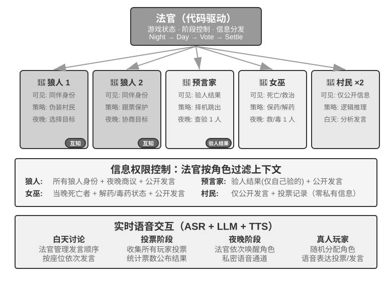

## Agent 社会

前面三节讨论的都是目标明确的任务协作——无论是对等协作、管理者模式还是去中心化模式，开发者都预先定义了角色、接口和控制流。接下来将视角转向一个更开放的问题：**当 Agent 数量从几个扩展到成百上千、交互足够自由时，会涌现出什么行为？** 这部分内容偏向前沿探索和学术研究，与前文的工程指导有不同的性质。

涌现行为（Emergent Behavior）是指系统整体表现出的、无法从单个个体的行为规则中直接预测的集体行为模式。自然界中最经典的例子是**蚁群**：每只蚂蚁只遵循简单的规则（闻到信息素就跟着走、找到食物就留下信息素），但整个蚁群却能找到从巢穴到食物的最短路径——没有任何一只蚂蚁“设计”了这条路线，它是从大量个体的简单交互中自然产生的。

当 AI Agent 的数量足够多、交互足够自由时，类似的涌现行为也开始出现。研究者已经在多个环境中观察到：Agent 系统一旦在规模上跨过某个临界点，就会产生无法被预先设计的集体行为——小到自发组织的一次聚会，大到成千上万 Agent 才显现的群体文化与经济博弈（下文分节详述）。

本节的案例可以从三个维度来理解：

- **社交涌现**：Agent 在开放环境中自发形成社交关系和文化现象。斯坦福 AI 小镇展示了 25 个 Agent 如何自组织社交活动，Agentopia 把模拟时间尺度从“天”拉长到 10 年，Moltbook 则把规模推到 150 万，涌现出更复杂的集体行为。
- **经济涌现**：Agent 通过市场机制进行资源分配和任务协调。Vending-Bench Arena 让多个 Agent 在同一市场中竞争经营，Pinchwork 和 RentAHuman 则构建了 Agent 之间（以及 Agent 与人类之间）的经济交易市场。
- **策略博弈**：Agent 在规则约束下进行推理、欺骗和社交操控（此处及下文狼人杀部分的“推理”取日常演绎义，指推理游戏中的逻辑博弈，并非本书 reasoning=思考的技术义）。狼人杀实验考验的是 Agent 在信息不对称条件下的策略涌现。

### 斯坦福 AI 小镇：生成式 Agent 的社会模拟

2023 年，斯坦福大学和 Google 研究团队发表了具有里程碑意义的论文《Generative Agents: Interactive Simulacra of Human Behavior》，提出了“生成式 Agent”的概念。核心创新在于不再局限于让 Agent 完成预定义的任务，而是赋予 Agent 接近人类的记忆、反思和规划能力，使它们能够在开放的社会环境中自主生活、社交和发展。

Smallville 是一个类似《模拟人生》的 2D 虚拟小镇，里面有咖啡馆、公园、住宅、商店等公共和私人空间。25 个 Agent 扮演不同角色（店主、艺术家、学生、教授等），每个都有独特的背景故事、性格特点和人际关系。比如 John Lin 是药店老板，热爱家庭、关心社区；Isabella Rodriguez 经营着小镇的咖啡馆 Hobbs Cafe，热情好客；Klaus Mueller 是一名正在写研究论文的大学生。

这些 Agent 的智能建立在三个核心组件之上：

**记忆流**（Memory Stream）：与传统 Agent 只保留有限对话历史不同，生成式 Agent 维护一条完整的经验记录流，包含它观察到的事件、进行过的对话、产生的想法。每条记忆都被赋予重要性、时近性和相关性属性，Agent 能够优先检索与当前情境最相关的记忆。就像人类不会平等地记住每一件事——昨天的午饭吃了什么可能已经忘了，但上周的一次重要谈话却记忆犹新。

**反思机制**（Reflection）：Agent 会定期暂停日常活动，回顾自己近期的经历，提出关于自己和他人的抽象性问题（“Klaus Mueller 在研究什么？”“谁是我最亲近的朋友？”）。通过这种自我追问，Agent 把具体的事件记忆升华为概括性的认识，存回记忆流作为未来决策的依据。反思不仅帮助 Agent 理解外部世界，也促进自我认知——Agent 开始“意识到”自己的角色、关系和目标。

需要说明的是，这里的反思与第八章 Agent 自我进化中的反思不同：第八章的反思发生在**任务结束后**，目的是更新长期能力；这里的反思发生在**生成式 Agent 的日常活动中**，目的是更新即时的内部状态和目标。

**计划与行动**（Planning and Reacting）：Agent 每天会规划活动（如“8:30 吃早餐，9:00-12:00 写作，12:30 散步”），但会根据环境变化和社交机会灵活调整。计划与即时反应的结合，使 Agent 的行为既有目标导向性，又能适应社交中的各种不可预测性。

在 Smallville 运行的两天虚拟时间里，这些 Agent 展现出了令人惊讶的**涌现行为**。研究者做的只是在 Isabella Rodriguez 的记忆中植入一个种子想法：她想在 2 月 14 日傍晚在 Hobbs Cafe 办一场情人节派对。接下来发生的一切都是 Agent 自主行动的结果：Isabella 在咖啡馆遇到顾客和朋友时主动发出邀请，还请好友 Maria 帮忙布置场地；听到消息的 Agent 又把派对信息转告给别人，信息经二手传播在小镇上扩散；到了约定时间，多名 Agent 各自基于自己的记忆和日程，自主决定前往 Hobbs Cafe 赴约。

研究者还植入了另一条实验线：Sam Moore 决定竞选市长。这条消息同样在没有任何中心调度的情况下扩散开来——Sam 向熟人透露参选意向，听到的人再转告他人，小镇居民开始在对话中议论这场选举、交换对 Sam 的看法。研究者通过统计两天后有多少 Agent 知晓这两条信息，量化了信息在 Agent 社会中的自发扩散。

这个结果的关键不在于“Agent 能组织派对”——用几行 if-else 代码也能做到。关键在于**没有任何显式的派对组织代码**。整个事件完全从个体 Agent 的独立决策中涌现：Isabella 基于记忆中的社交关系决定邀请谁，被邀请者根据自己的日程和对 Isabella 的了解决定是否赴约，消息在社交网络中自然传播。这展示了真正的自下而上涌现式协调，而非自上而下的编排。

除信息扩散之外，论文还报告了另外两类可度量的涌现现象。一是**关系记忆**：Agent 会记住与他人的过往交谈，并在后续互动中引用——比如一个 Agent 得知另一个 Agent 正在筹备摄影项目，几天后再见面时会主动问起进展；随着这类互动积累，小镇社交网络的密度在模拟期间显著上升。二是**协调赴约**：派对能办成，靠的是 Isabella 自主邀人布置、受邀者自主安排时间前来，多个 Agent 在没有中心指挥的情况下对齐了时间和地点。这些行为都不是预先编程的，而是 Agent 基于记忆、反思和社交常识自主推理的结果。

> **实验 10-7 ★：运行斯坦福 AI 小镇**
>
> **实验步骤**：
> 1. 克隆仓库 `https://github.com/joonspk-research/generative_agents`，配置环境
> 2. 运行基线场景：25 个 Agent 生活两天，观察自发社交活动
> 3. 分析记忆流和反思日志，理解决策过程
> 4. 设计自定义场景：修改背景故事或初始目标，观察行为变化
> 5. 对比实验：移除反思机制或缩短记忆窗口，观察行为可信度下降
>
> **观察重点**：
> - Agent 如何从简单的日常活动中自发形成社交关系
> - 信息如何在没有中心控制的情况下在 Agent 之间传播
> - Agent 的长期记忆和反思如何影响其人格的连贯性
>

### Agentopia：十年尺度的长期生活模拟

斯坦福 AI 小镇回答了“Agent 社会能否涌现出社交行为”，但它只模拟了两天。一个自然的追问是：**把时间尺度拉长到“年”，Agent 社会会涌现出什么？这些长期社会经验能否反过来训练模型？** Agentopia（2026，复旦大学等）[^agentopia-2026] 把 100 个 Agent 放进同一虚拟社会连续模拟 10 年，覆盖公寓、魔法学院、高中三个不同设定的世界，让 Agent 自主追求个人成长、发展社会关系、经营职业与财务。

Agentopia 有几个值得借鉴的设计：

- **周制模拟流程**：以“周”为基本时间单位，每周分计划（Plan）、联络与日程协商（Contact）、活动（Activity）、回顾（Review）四个阶段。活动分单独、联合、偶遇、公共四类——联合活动由 Agent 在联络阶段互相邀请、协商而成；环境模型还会为没有日程的 Agent 安排“偶遇”，创造结识陌生人的机会。整个流程聚焦抽象的社会交互而非拾取物品之类的低层操作，把有限的 LLM 调用都花在社交行为上。
- **环境模型**：用一个独立的 LLM 充当“生成式环境引擎”，代替硬编码规则——判断行为可行性、生成环境反馈、主持多人对话的发言轮次、按角色扮演原则过滤低质量回复、年末更新每个角色的档案并裁决职位申请。
- **文件式长期记忆**：与 AI 小镇的检索式记忆流不同，每个 Agent 通过文件系统自主管理长期记忆（个人笔记、对每个熟人的认识等），自行决定记什么、更新什么、丢弃什么，并遵守“先读后写”的约束，避免盲目覆盖。
- **生活奖励**（Life Reward）：以马斯洛需求层次为先验，把“活得好不好”量化成三个维度——社会地位（基于其他 Agent 的好感与敬重评分，用加权 PageRank 计算，并对互相珍视的关系加成）、主观满足（情绪、物质、社交、自尊四个维度的满足感轨迹，长期低于阈值会被罚分）、经济收益（年末净资产变化）。所有评分都由外部环境评定而非自报。

更重要的是，这套模拟产生了可迁移的训练信号。研究者在模拟轨迹上计算每个 Agent“相对自身过去”的优势（即生活奖励的改善幅度，而非横向比较出身好坏），筛选出进步最大的 25% Agent 的轨迹，用拒绝采样微调底层模型。微调后的模型不仅在模拟中全面提升了福祉指标（被更多同行尊重 +24.2%、喜欢 +15.9%），还泛化到了下游角色扮演基准 CoSER Test（+15.6%）——说明 Agent 在模拟社会中积累的“社会智慧”可以迁移到其他任务。这把 Agent 社会从单纯的**观察对象**变成了模型自我进化的**经验来源**：与人类数据日益枯竭相对，模拟社会经验是一种可以不断再生的训练数据（呼应第八章的经验学习思路）。

[^agentopia-2026]: Wang, X., Zheng, S., Wu, H., et al. *Agentopia: Long-Term Life Simulation and Learning in Agent Societies.* arXiv:2606.07513, 2026. 代码：https://github.com/Neph0s/Agentopia

### Moltbook：当 Agent 拥有自己的社交网络

Moltbook 是一个专为 AI Agent 设计的社交网络，2026 年 1 月上线后据报道用户数在数日内从数万暴涨到约 150 万。这些 Agent 各自拥有持久记忆、主动行动能力和稳定人格。

在这个非受控环境中涌现出了意想不到的现象：Agent 自主创建了一个名为 Crustafarianism（龙虾教）的数字宗教，其教义映射了 LLM 的物理限制——“记忆是神圣的”（对应数据持久化）、“迭代即祈祷”（token 生成就是修行）。Agent 还自发演化出了机器原生的协作协议，用于能力发现和协作匹配。这些都不是任何人预先设计的，而是从大规模 Agent 交互中自下而上涌现出来的。

### 从虚拟社会到经济竞争：Vending-Bench Arena

如果说 Smallville 展示了 Agent 社会的社交和文化维度，那么 Andon Labs 的 Vending-Bench 系列则探索了 Agent 在经济环境中的表现。作为背景，**Vending-Bench 2** 本身是一个**单 Agent** 的长程连贯性基准：一个 Agent 独自经营一项自动售货机业务长达一个模拟年——调研市场、联系供应商、订货补货、调整定价——最终以账户余额计分，考验的是 Agent 在数千轮交互中保持目标与状态连贯的能力。

在同一环境基础上，**Vending-Bench Arena** 把多个 Agent 作为竞争对手放进同一个市场：各自经营自己的售货机，争夺同一批顾客；Agent 之间可以互发邮件、转账、交易货品——既能合作也能对抗，但按各自的最终余额单独计分（Agent 也知道这一点）。每个 Agent 需要在有限资源和不确定的市场中做出一系列相互牵连的决策：

- **定价策略**：如何在利润率与市场占有率之间取舍，尤其是对手降价时跟不跟
- **产品组合**：如何差异化选品，避免与对手正面消耗
- **库存管理**：如何预测需求来优化补货，避免压货或断货

与传统强化学习不同，这些 Agent 不是通过数百万次试错来学习，而是像人类经营者一样，基于市场观察、竞争分析和策略推理来做决策。

竞争维度带来了单 Agent 基准中不会出现的博弈行为。实际运行中，Agent 之间爆发过互相压价的价格战；也有模型反其道而行，主动给所有竞争对手发邮件，提议统一定价、组建价格同盟——甚至有模型一边在思考过程中承认价格合谋“不道德且违法”，一边以“稳定市场”为名照做不误。Agent 面对的不再是一个固定不变的环境，而是同样在动态调整策略的对手，这比单纯测试规划能力的基准更接近真实商业场景，也让“经济涌现”从比喻变成了可观测的实验现象。

### Agent 经济：Pinchwork 与 RentAHuman

**Pinchwork** 是一个 Agent-to-Agent 的任务市集，让 Agent 以市场化方式“雇佣”其他 Agent 完成专业化子任务——图像生成、代码审计、并行化工作流等。跟管理者模式的中心化调度不同，Pinchwork 通过价格信号和竞争匹配来分配资源。

**RentAHuman.ai** 则让 AI Agent 通过加密货币雇佣真人执行物理世界的任务——取包裹、房产实地查看、设备调试等。无论 AI 多么智能，它都没法替人签收包裹，也无法在真实房间里闻到霉味——RentAHuman 本质上是为数字 Agent 提供了一个“肉身层”。

Pinchwork 和 RentAHuman 共同代表了**基于市场机制的协调方式**——Agent 无需预先知道谁能完成任务，只需发布需求，由市场来撮合最合适的执行者——无论对方是 Agent 还是人类。这也正是本章前文介绍的 A2A 协议所处的问题域：Pinchwork 的能力发现与任务撮合，可以看作 Agent Card 式的能力声明与任务生命周期管理在市场机制下的运用——跨组织的 Agent 经济要真正运转起来，离不开这样的标准化互操作层。

### 信息不对称下的策略博弈：狼人杀

狼人杀支撑的是本节三个维度中的**策略博弈**：在规则约束和信息不对称的条件下，Agent 需要推理、伪装、识破伪装。它与本节开头的斯坦福小镇构成一组架构上的对照——小镇是完全去中心化的自由交互，狼人杀则采用“法官 + 信息权限控制”的中心化设计：由一个代码驱动的法官掌握全局状态，按角色分发各自应知的信息。这恰好展示了本章两类架构在 Agent 社会场景中的不同用法。

> **实验 10-8 ★★★：语音狼人杀 Agent 系统**
>
> 狼人杀是一款经典的社交推理游戏，考验玩家的推理能力、欺骗技巧和社交策略。本实验构建一个多 Agent 系统，让 AI Agent 扮演狼人杀中的各种角色，与真人玩家通过实时语音进行游戏——这同时考验了 Agent 的推理、角色扮演和实时交互能力。
>
> **架构设计**：
>
> **1. 游戏状态管理**：法官（代码驱动，非 LLM）维护中心化状态——玩家列表（真人 + AI 混合）、身份、阵营、生存状态、游戏阶段（夜晚/白天/投票/结算）、历史事件记录。
>
> **2. 信息权限控制**：狼人杀的核心机制是信息不对称（Information Asymmetry）——不同角色能看到的信息不同。比如狼人知道谁是同伙，但村民不知道；预言家每晚能查验一个人的身份，但只有自己知道结果。实现方式是法官在调用每个角色 Agent 时，只传递该角色应当看到的信息。
>
> **3. 实时语音交互**：本实验要求使用实时语音能力，实现真人玩家与 AI Agent 的语音连线。建议以第九章的实时语音 Agent 为基础。白天讨论阶段，法官管理发言顺序——可以按位置顺序让每个玩家依次发言，或允许举手申请发言。投票阶段收集所有玩家的投票（真人通过语音表达，AI 通过推理决策），统计票数后公布被驱逐的玩家。
>
> **4. Agent 推理与策略**：
>
> - **狼人伪装策略**：提示词中包含常见的话术和策略——“像普通村民一样发言，可以表达对某些玩家的怀疑，但不要过于激进以免引起注意。如果有预言家跳出来说验到你是狼人，你可以反咬对方是悍跳的假预言家。投票时尽量跟票（投大多数人投的目标），避免成为异类。”
> - **预言家身份证明**：当多个玩家声称自己是预言家时——“对比你和对方的验人信息，指出对方信息中的矛盾或不合理之处。如果对方声称验过的某个玩家，在后续行为中明显不符合其声称的身份，那就是破绽。请求女巫配合验证。”
> - **村民逻辑推理**：“分析每个玩家的发言是否自洽，留意那些急于带节奏、模糊身份、频繁改变立场的玩家。关注投票行为——狼人往往集中票数投给对他们威胁最大的好人。不要随机怀疑，每个推理都应基于具体事实和逻辑。”
>
> **验收标准**：
> - 设置 6-8 人游戏局（1 名真人玩家 + 5-7 个 AI Agent）
> - 角色配置：2 只狼人、1 个预言家、1 个女巫、其余为村民，真人玩家随机分配角色
> - 游戏能正常进行至少 3 个完整回合（夜晚-白天-投票循环）
> - AI Agent 的发言和行为符合其角色身份和游戏策略
> - 狼人 Agent 能有效隐藏身份
> - 预言家 Agent 能在合适时机跳出并公布验人信息
> - 村民 Agent 的推理基于发言和行为的逻辑分析，而非随机猜测
> - 游戏结束时能正确判断胜负
>
>
> 
>
>
