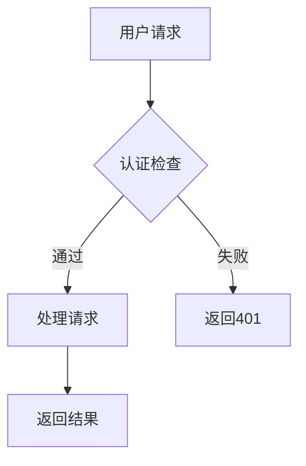

# MD to PDF Skill

将 Markdown 文档完美转换为 PDF 格式，特别优化了 **Mermaid 流程图**的渲染。

## ✨ 核心特性

- **完美支持 Mermaid 流程图** - 自动渲染所有 Mermaid 图表类型
- **代码语法高亮** - 支持 100+ 编程语言
- **中英文混排** - 原生支持中文和英文混合排版
- **自定义样式** - 支持自定义 CSS 样式
- **目录生成** - 自动生成可点击目录
- **批量转换** - 支持批量处理多个 Markdown 文件

## 🚀 快速开始

### 1. 安装依赖

```bash
# 方式一：使用安装脚本（推荐）
python scripts/install.py

# 方式二：手动安装
pip install playwright markdown2 pygments
python -m playwright install chromium
```

### 2. 基础用法

```bash
# 转换单个文件
python scripts/md_to_pdf.py input.md -o output.pdf

# 使用自定义样式
python scripts/md_to_pdf.py input.md --style assets/custom.css --toc

# 批量转换
python scripts/md_to_pdf.py ./docs --batch --output-dir ./pdfs
```

## 📖 使用示例

### 示例 1：带流程图的技术文档

输入 Markdown：

```markdown
# 系统架构

## 数据流程



## API 接口

...
```

转换为 PDF：

```bash
python scripts/md_to_pdf.py architecture.md --style assets/custom.css --toc
```

### 示例 2：批量转换文档目录

```bash
python scripts/md_to_pdf.py ./docs --batch --recursive \
  --style assets/company-style.css \
  --output-dir ./exports/pdfs \
  --toc
```

## 🎨 支持的 Mermaid 图表类型

| 类型 | 语法 | 说明 |
|------|------|------|
| 流程图 | `flowchart` / `graph` | 基础流程图 |
| 序列图 | `sequenceDiagram` | 时序交互图 |
| 类图 | `classDiagram` | UML 类图 |
| 状态图 | `stateDiagram` | 状态转换图 |
| 实体关系图 | `erDiagram` | 数据库关系图 |
| 甘特图 | `gantt` | 项目计划图 |
| 饼图 | `pie` | 数据分布图 |
| 用户旅程图 | `journey` | 用户体验图 |

## ⚙️ 配置选项

### 命令行参数

```bash
python scripts/md_to_pdf.py input.md [选项]

选项:
  -o, --output          输出 PDF 文件或目录
  --style              自定义 CSS 文件
  --toc                生成目录
  --toc-depth          目录最大深度 (默认: 3)
  --page-size          页面尺寸 (A4, A3, Letter, Legal)
  --orientation        页面方向 (portrait, landscape)
  --margin-top         上边距 (默认: 20mm)
  --margin-right       右边距 (默认: 20mm)
  --margin-bottom      下边距 (默认: 20mm)
  --margin-left        左边距 (默认: 20mm)
  --timeout            渲染超时时间 (默认: 60000ms)
  --config             配置文件路径
```

### 配置文件

创建 `md-to-pdf.config.json`：

```json
{
  "outputDir": "./pdfs",
  "style": "./assets/custom.css",
  "toc": true,
  "tocDepth": 3,
  "pageSize": "A4",
  "orientation": "portrait",
  "margin": {
    "top": "20mm",
    "bottom": "20mm",
    "left": "15mm",
    "right": "15mm"
  }
}
```

使用配置文件：

```bash
python scripts/md_to_pdf.py input.md --config md-to-pdf.config.json
```

## 📁 目录结构

```
md-to-pdf/
├── SKILL.md                    # Skill 主文档
├── README.md                   # 本文件
├── requirements.txt            # Python 依赖
├── scripts/
│   ├── md_to_pdf.py           # 主转换脚本
│   └── install.py             # 安装脚本
├── assets/
│   ├── custom.css             # 自定义样式示例
│   ├── md-to-pdf.config.json  # 配置文件示例
│   └── example.md             # 示例 Markdown
└── references/
    └── mermaid-syntax.md      # Mermaid 语法参考
```

## 🎯 常见问题

### Q: Mermaid 图表不显示？

**A:** 确保 Playwright 浏览器已正确安装：

```bash
python -m playwright install chromium
```

### Q: 中文显示为乱码？

**A:** 在自定义 CSS 中指定中文字体：

```css
body {
  font-family: "Microsoft YaHei", "SimSun", sans-serif;
}
```

### Q: 转换速度慢？

**A:** 增加 Mermaid 渲染超时时间：

```bash
python scripts/md_to_pdf.py input.md --timeout 120000
```

## 🔧 技术实现

本工具使用以下技术栈：

- **Playwright** - 无头浏览器控制，用于渲染 Mermaid 图表和生成 PDF
- **markdown2** - Markdown 解析
- **Pygments** - 代码语法高亮
- **Mermaid.js** - 流程图渲染（通过 CDN 加载）

## 📊 与其他工具对比

| 工具 | Mermaid 支持 | 中文支持 | 批量处理 | 推荐场景 |
|------|-------------|---------|---------|----------|
| **md-to-pdf** | ✅ 完美 | ✅ 原生 | ✅ 支持 | 生产环境 |
| Typora | ✅ 原生 | ✅ 完美 | ❌ 不支持 | 个人使用 |
| VSCode + MPE | ✅ 支持 | ✅ 支持 | ⚠️ 有限 | 开发者 |
| Pandoc | ⚠️ 需配置 | ⚠️ 需配置 | ✅ 支持 | 高级用户 |

## 📝 许可证

MIT License

## 🙏 致谢

- [Mermaid.js](https://mermaid.js.org/) - 强大的图表渲染库
- [Playwright](https://playwright.dev/) - 浏览器自动化工具
- [markdown2](https://github.com/trentm/python-markdown2) - Markdown 解析器
