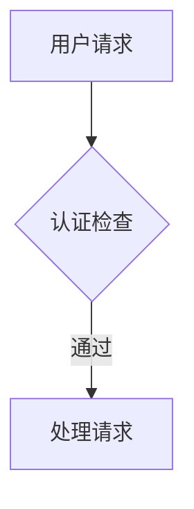
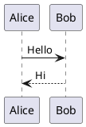

# MD to PDF

将 Markdown 文档转换为 PDF，支持多种图表类型的预渲染。

## 图表预渲染（核心能力）

**默认行为**：自动检测 MD 中的图表代码，预渲染为 PNG 后嵌入 PDF。

### 支持的图表类型

| 类型 | 代码块标识 | 渲染方式 | 输出文件 |
|------|-----------|---------|---------|
| **Mermaid** | ` ```mermaid ` | Playwright + Mermaid.js | `.mmd` → `.png` |
| **PlantUML** | ` ```plantuml ` / ` ```puml ` | PlantUML 在线 API（无需 Java） | `.puml` → `.png` |
| **HTML 图表** | ` ```html `（含 SVG/Canvas） | Playwright 截图 | `.html` → `.png` |
| **内联 SVG** | `<svg>...</svg>` | Playwright 截图 | `.svg` → `.png` |

### 预渲染流程

```
1. 检测 MD 中的图表代码块
    ↓
2. 保存源码文件到 diagrams/source/
    ↓
3. 使用对应引擎渲染为 PNG
    ↓
4. 将 PNG 以 data URI 嵌入 HTML
    ↓
5. 生成 PDF
```

### 输出目录结构

```
output/
  document.pdf
  diagrams/
    source/
      diagram_000.mmd
      diagram_001.puml
      diagram_002.html
      diagram_003.svg
    diagram_000.png
    diagram_001.png
    diagram_002.png
    diagram_003.png
```

### 禁用预渲染

```bash
python scripts/md_to_pdf.py input.md --no-pre-render
```

## 快速开始

```bash
# 转换单个文件（默认启用预渲染）
python scripts/md_to_pdf.py input.md -o output.pdf

# 禁用预渲染，使用 CDN 渲染 Mermaid
python scripts/md_to_pdf.py input.md --no-pre-render

# 指定输出目录
python scripts/md_to_pdf.py input.md --output-dir ./pdfs

# 使用自定义样式
python scripts/md_to_pdf.py input.md --style ./assets/custom.css
```

### 批量转换

```bash
python scripts/md_to_pdf.py ./docs --batch --output-dir ./pdfs
python scripts/md_to_pdf.py ./docs --batch --recursive
```

### 高级选项

```bash
# 带目录
python scripts/md_to_pdf.py input.md --toc --toc-depth 3

# 页眉页脚和页码
python scripts/md_to_pdf.py input.md --header --footer --page-numbers

# 页面设置
python scripts/md_to_pdf.py input.md --page-size A4 --orientation portrait
python scripts/md_to_pdf.py input.md --margin-top 20mm --margin-bottom 20mm --margin-left 15mm --margin-right 15mm
```

## 内部链接与锚链

转换后的 PDF 保留所有超链接（Playwright 默认行为）：

- **外部链接** `[文字](https://...)`：点击跳转原文
- **内部锚链** `[文字](#ref-1)`：点击跳转到文档内对应位置，需配合锚点 `<a id="ref-1">` 使用

适合研究报告、学术文档的引用追溯——正文引用可点击跳转到文末参考来源，来源条目再点跳原文。

### 锚链示例（正文引用 → 文末来源）

````markdown
正文中：Fora 以 $6000 万 D 轮跻身独角兽 [[1]](#ref-1)。

文末参考来源：
1. <a id="ref-1"></a>**[TechCrunch — Fora hits unicorn](https://...)**
````

> 注：锚链跳转在 PDF 阅读器、本地 HTML 预览下正常；部分 md 渲染器（如飞书）对锚点跳转支持有限，降级为不可点但不影响阅读。

## 安装依赖

```bash
pip install playwright markdown2 pygments
playwright install chromium
```

## 代码块标记规范

### Mermaid

````markdown

````

### PlantUML

````markdown

````

### HTML 图表（含 SVG/Canvas）

````markdown
```html
<svg width="200" height="100">
  <rect x="10" y="10" width="180" height="80" fill="#007acc"/>
</svg>
```
````

### 内联 SVG

直接在 Markdown 中使用 `<svg>` 标签即可自动检测和渲染。

## 配置文件

`md-to-pdf.config.json` 新增配置项：

```json
{
  "preRender": true,
  "diagramOutputDir": "diagrams",
  "timeout": 60000,
  "pageSize": "A4",
  "orientation": "portrait",
  "margin": {
    "top": "20mm",
    "bottom": "20mm",
    "left": "15mm",
    "right": "15mm"
  },
  "toc": false,
  "tocDepth": 3
}
```

## 故障排除

### 图表不显示

1. 确认安装了 Playwright 浏览器：`playwright install chromium`
2. 检查图表语法是否正确
3. 尝试增加超时：`--timeout 120000`
4. 查看控制台 `[WARN]` 日志定位失败原因

### PlantUML 渲染失败

需要网络连接访问 PlantUML 在线服务。离线环境需使用 `--no-pre-render` 或部署本地 PlantUML 服务。

### 中文显示问题

在 CSS 中指定中文字体：
```css
body { font-family: "Microsoft YaHei", "SimSun", sans-serif; }
```

## 技术实现

- `scripts/md_to_pdf.py` - 主转换脚本（Markdown → HTML → PDF）
- `scripts/diagram_renderer.py` - 图表预渲染模块（检测 → 保存 → 渲染 → 替换）
- `assets/custom.css` - 自定义样式
- `assets/md-to-pdf.config.json` - 配置文件
