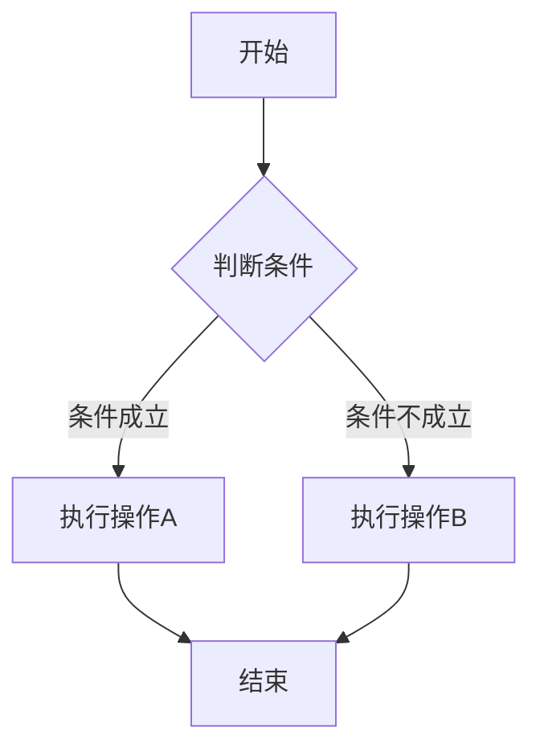
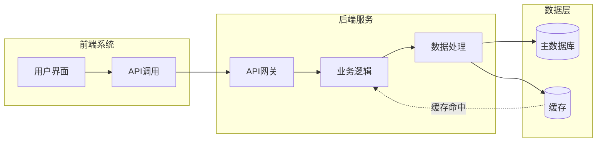
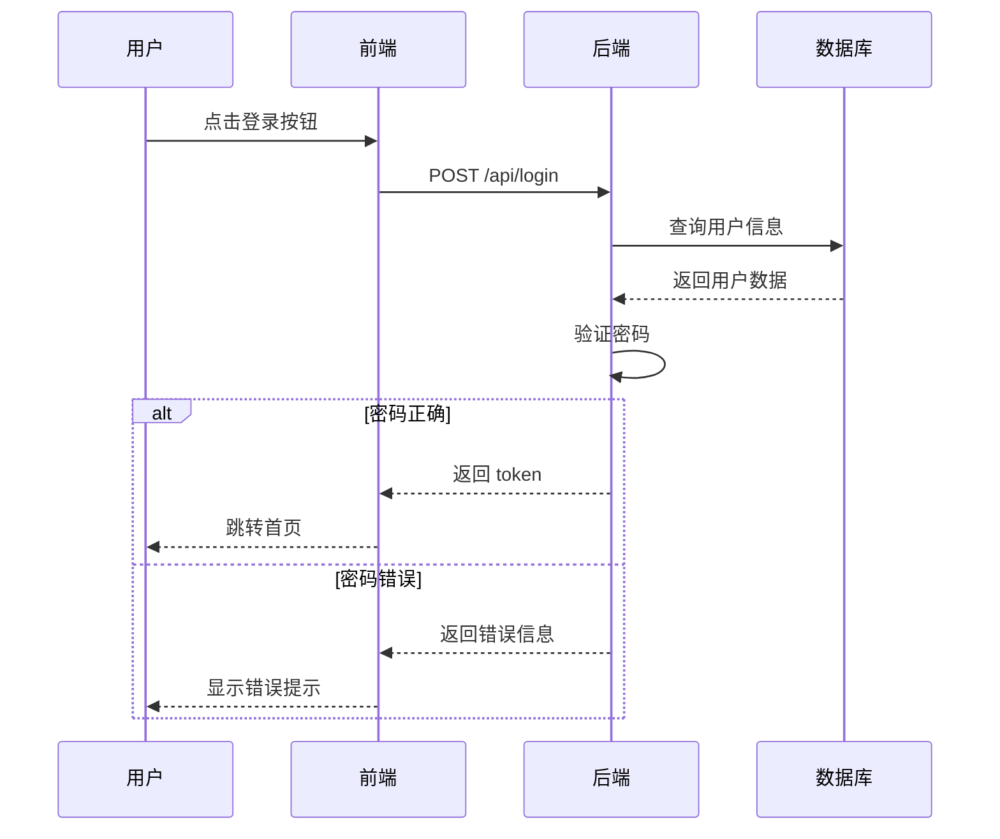
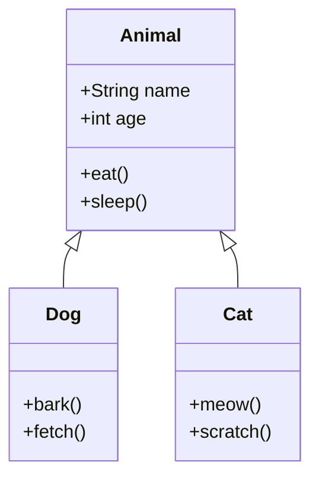
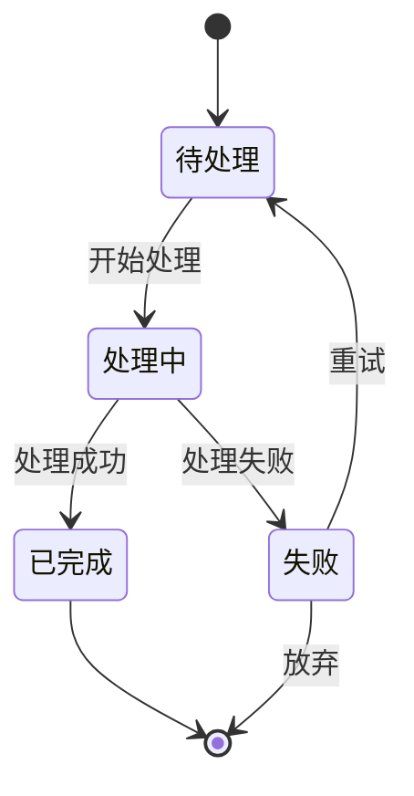

# 示例文档

这是一个包含各种元素的示例 Markdown 文档，用于测试 PDF 转换功能。

## 目录

本文档包含以下内容：

- 文本排版示例
- 代码块演示
- Mermaid 流程图
- 表格展示
- 引用块
- 列表

## 流程图示例

### 基础流程图



### 复杂流程图



### 序列图



## 代码示例

### Python 代码

```python
def fibonacci(n):
    """计算斐波那契数列"""
    if n <= 1:
        return n
    return fibonacci(n - 1) + fibonacci(n - 2)

# 打印前 10 个斐波那契数
for i in range(10):
    print(f"F({i}) = {fibonacci(i)}")
```

### JavaScript 代码

```javascript
// 异步函数示例
async function fetchUserData(userId) {
    try {
        const response = await fetch(`/api/users/${userId}`);
        const data = await response.json();
        return data;
    } catch (error) {
        console.error('获取用户数据失败:', error);
        throw error;
    }
}
```

## 表格示例

| 功能 | 支持情况 | 说明 |
|------|---------|------|
| Mermaid 图表 | ✅ 完美支持 | 支持所有 Mermaid 图表类型 |
| 代码高亮 | ✅ 支持 | 超过 100 种编程语言 |
| 中文排版 | ✅ 原生支持 | 完美处理中英文混排 |
| 自定义样式 | ✅ 支持 | 支持自定义 CSS |
| 批量转换 | ✅ 支持 | 支持递归处理目录 |

## 引用示例

> 这是一个引用块的示例。引用块常用于引用重要信息、名言警句或者其他文档的内容。

> **注意**：引用块可以包含**格式化文本**和`代码片段`。

## 列表示例

### 无序列表

- 第一项
- 第二项
  - 嵌套项 A
  - 嵌套项 B
- 第三项

### 有序列表

1. 第一步：准备工作
2. 第二步：执行操作
3. 第三步：验证结果
   - 检查输出
   - 确认结果
4. 第四步：完成

## 类图示例



## 状态图示例



## 数学公式

行内公式：E = mc²

## 总结

本文档展示了 Markdown 转 PDF 工具的主要功能，包括：

1. ✅ 完美的 Mermaid 图表支持
2. ✅ 代码语法高亮
3. ✅ 丰富的排版样式
4. ✅ 中英文混排支持
5. ✅ 自定义 CSS 样式

---

*生成时间：2024年*
