# Mermaid 语法参考

完整的 Mermaid 图表语法参考，用于在 Markdown 中创建各种类型的图表。

## 流程图 (Flowchart)

### 基础语法

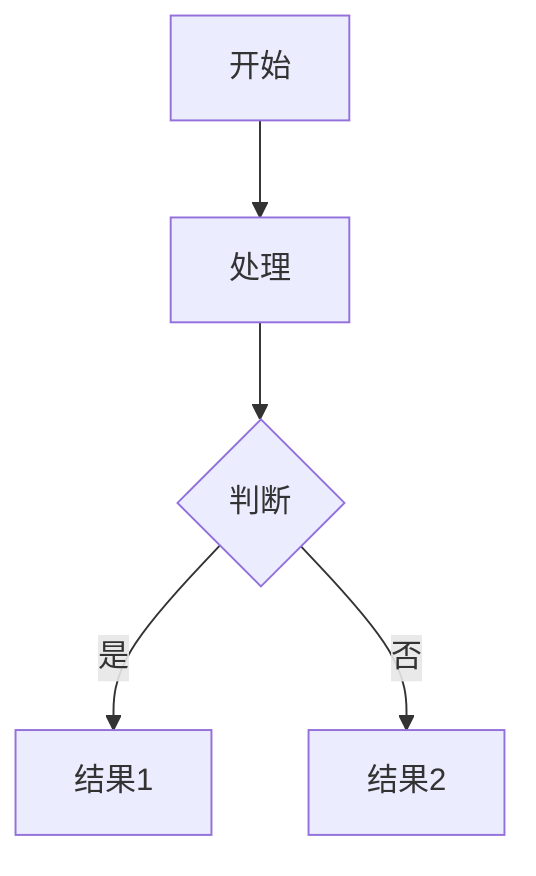

### 方向

- `TD` - 从上到下 (Top to Down)
- `DT` - 从下到上 (Down to Top)
- `LR` - 从左到右 (Left to Right)
- `RL` - 从右到左 (Right to Left)

### 节点形状

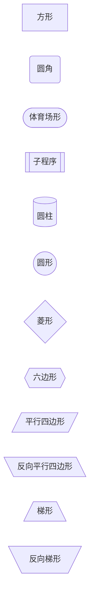

### 连接线样式

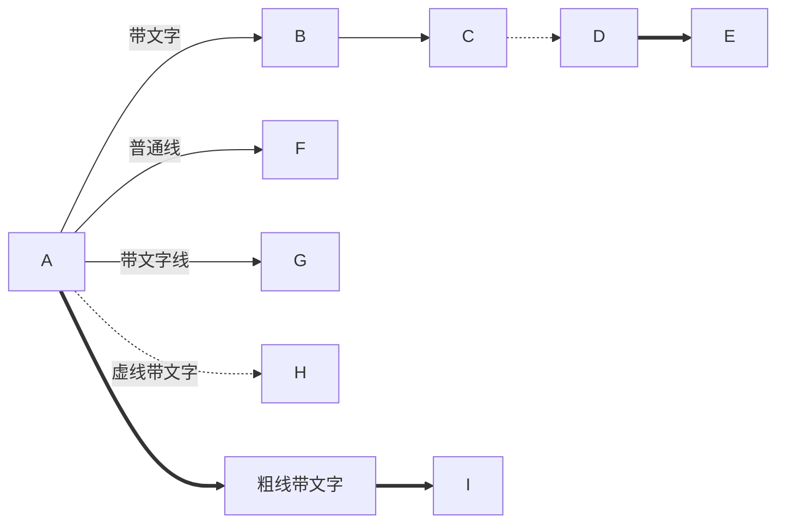

## 序列图 (Sequence Diagram)

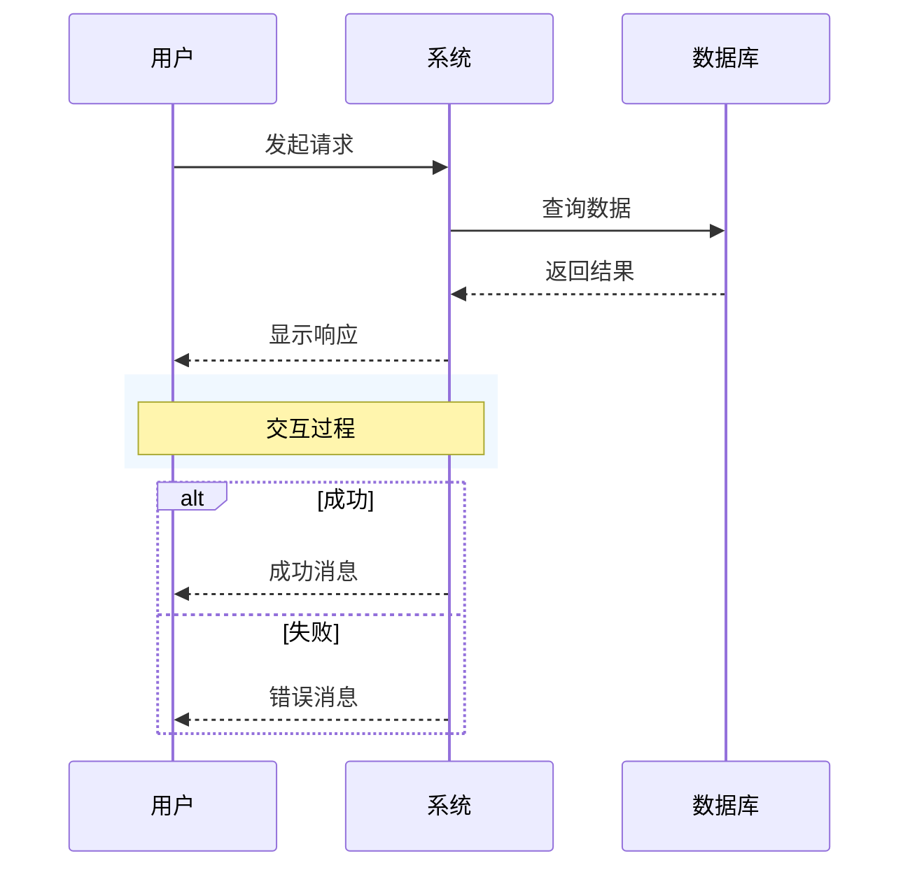

## 类图 (Class Diagram)

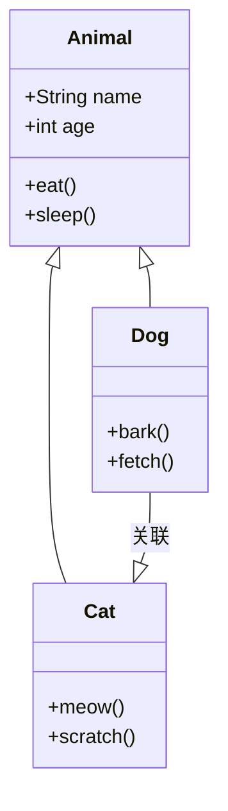

## 状态图 (State Diagram)

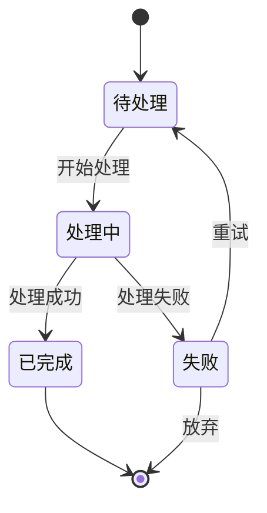

## 实体关系图 (ER Diagram)

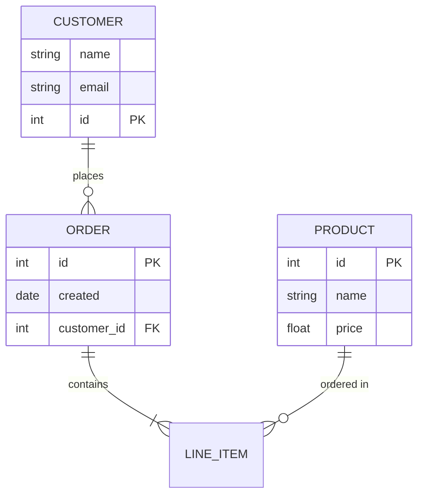

## 甘特图 (Gantt Chart)

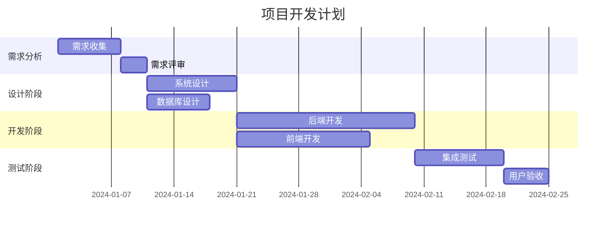

## 饼图 (Pie Chart)

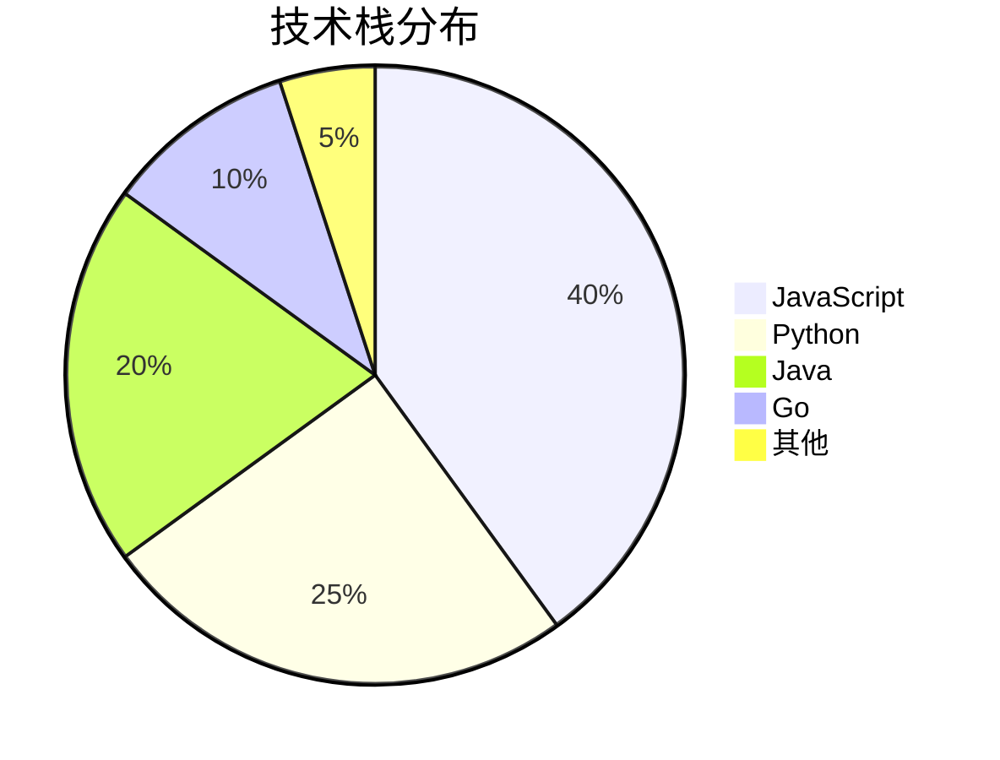

## 用户旅程图 (User Journey)

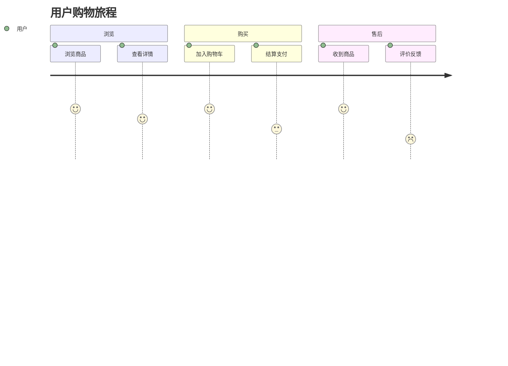

## 关系图 (Relationship Diagram)

```mermaid
relationshipDiagram
    acme --> creates --> product
    acme --> employs --> person
    person --> buys --> product
```

## 需求图 (Requirement Diagram)

```mermaid
requirementDiagram
    requirement test_req {
        id: 1
        text: 测试需求
        risk: high
        verifyMethod: test
    }

    element test_entity {
        type: system
    }

    test_entity - satisfies -> test_req
```

## 样式定制

### 主题

在图表代码块前添加主题声明：

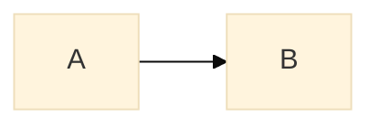

可用主题：
- `default` - 默认主题
- `forest` - 森林主题
- `dark` - 暗色主题
- `neutral` - 中性主题
- `base` - 基础主题（可完全自定义）

### 自定义样式

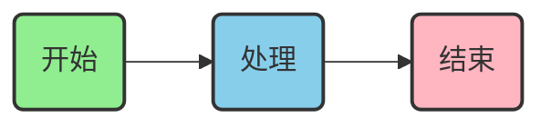

### 子图

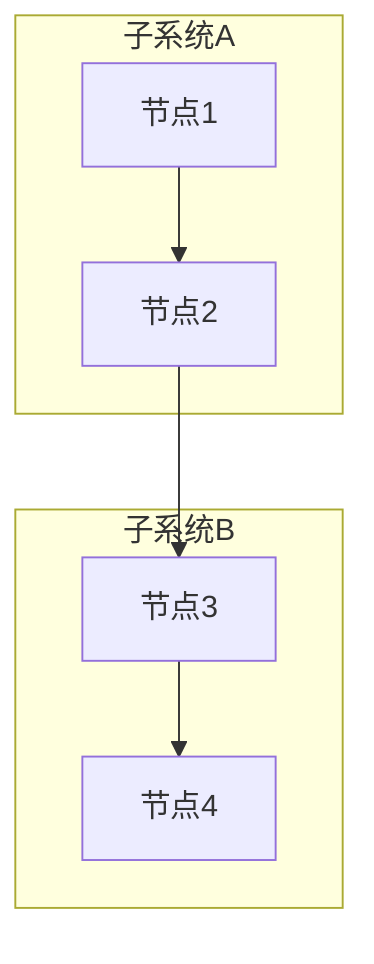

## 常见问题

### 中文支持

Mermaid 原生支持中文，只需确保在 PDF 渲染时使用正确的字体：

```css
body {
    font-family: "Microsoft YaHei", "SimSun", sans-serif;
}
```

### 图表过大

使用 `fit` 参数调整图表尺寸，或在 HTML 模板中设置最大宽度：

```css
.mermaid {
    max-width: 100%;
    overflow-x: auto;
}
```

### 复杂图表渲染慢

增加渲染超时时间：

```bash
python scripts/md_to_pdf.py input.md --timeout 120000
```

## 参考资源

- [Mermaid 官方文档](https://mermaid.js.org/intro/)
- [Mermaid 在线编辑器](https://mermaid.live/)
- [Mermaid GitHub](https://github.com/mermaid-js/mermaid)
